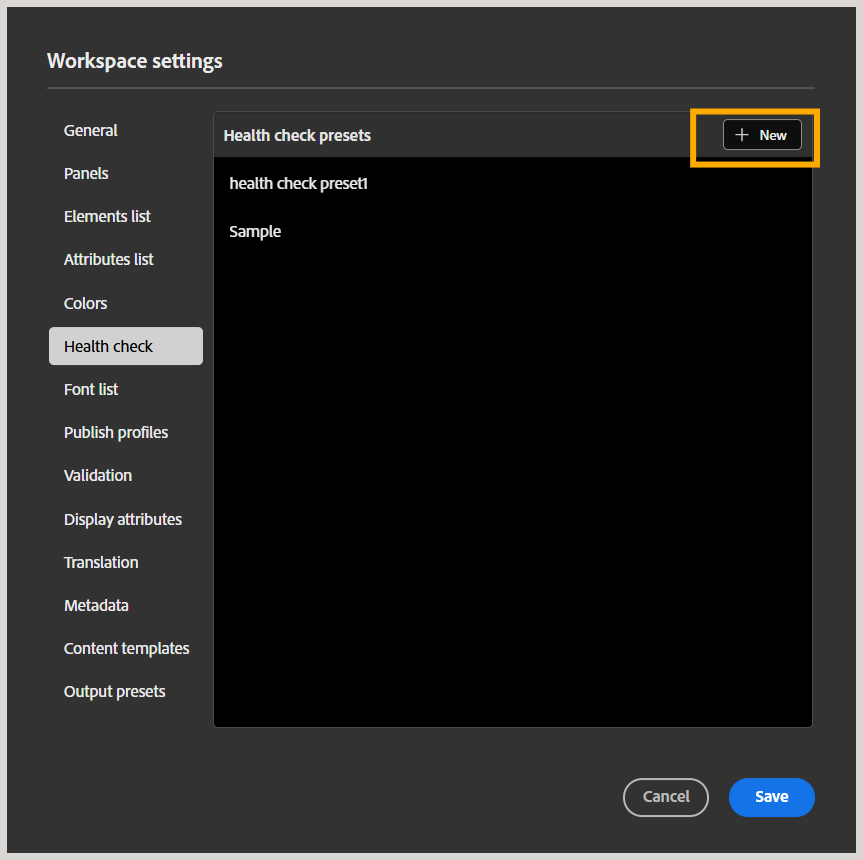
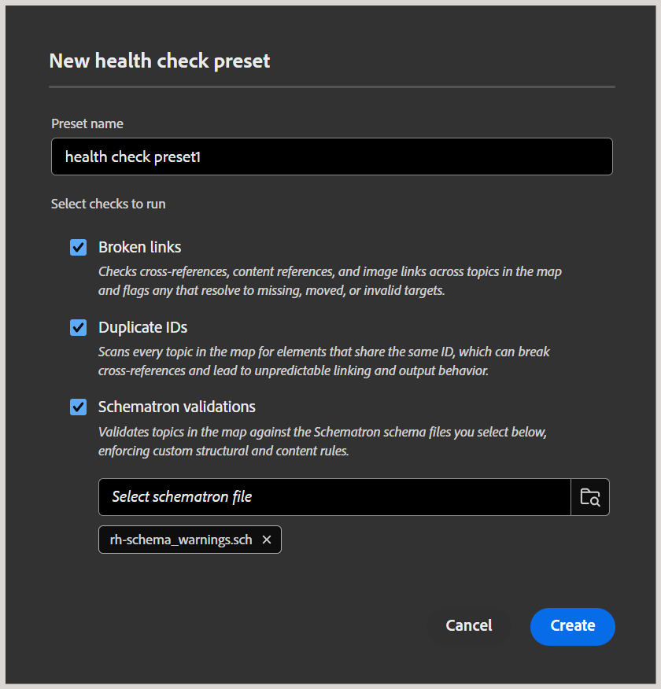
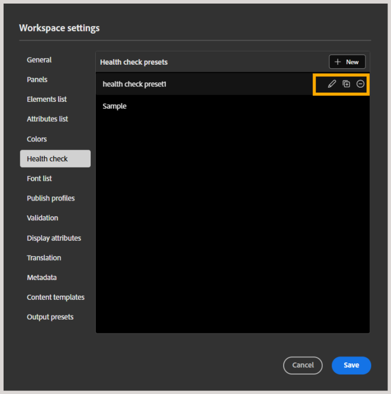

# Erstellen und Verwalten von Vorgaben für Konsistenzprüfungen

>[!NOTE]
>
> Diese Funktion ist standardmäßig aktiviert. Wenn Sie diese Funktion lieber nicht in Ihrer Umgebung verwenden möchten, wenden Sie sich an Ihr Customer Success-Team.

Als Admin können Sie die Konsistenzprüfungsfunktion auf Ordnerprofilebene in Experience Manager konfigurieren, sodass Autoren und Herausgeber Konsistenzprüfungen auf einer DITA-Zuordnung ausführen können. Dazu gehört die Früherkennung von Problemen wie fehlerhaften Links, doppelten IDs und Schematron-Validierungsfehlern in einer Zuordnung vor der Veröffentlichung, anstatt jede Datei einzeln zu überprüfen. Welche Prüfungen ausgeführt werden, wird durch eine Konsistenzprüfungsvorgabe definiert, einen Regelsatz, den Autoren und Herausgeber auswählen und ausführen können.

Dieser Artikel enthält Informationen zum Erstellen und Verwalten von Vorgaben für Konsistenzprüfungen.

## Erstellen einer Vorgabe für die Konsistenzprüfung

Führen Sie die folgenden Schritte aus, um eine Konsistenzprüfungs-Voreinstellung auf Ordnerprofilebene zu erstellen:

1. Wechseln Sie zu [Workspace](./workspace-settings.md)Einstellungen und wählen Sie **Konsistenzprüfung** aus der Liste aus.
1. Wählen Sie im Bedienfeld **Vorgaben für Konsistenzprüfungen** die Option **Neu**.

   
1. Das **Neue Konsistenzprüfungsvorgabe** wird angezeigt. Fügen Sie einen Voreinstellungsnamen hinzu und wählen Sie die Regeln oder Prüfungen aus, die Sie einbeziehen möchten. Verfügbare Optionen sind fehlerhafte Links, doppelte IDs und Schematron-Validierungen.

   
1. Wählen Sie **Erstellen** aus.
1. Klicken Sie **Speichern**, um die Einstellung zu speichern.

Diese Vorgabe ist jetzt für Autoren und Herausgeber verfügbar. Für Autorinnen und Autoren ist die Funktion im Menü Optionen einer Zuordnung in der Kartenansicht und im Bereich Konsistenzprüfungsbericht neben dem Suchbereich verfügbar, sodass sie mithilfe einer der für ihr Profil konfigurierten Konsistenzprüfungs-Vorgaben eine Konsistenzprüfung für die ausgewählte Zuordnung durchführen können. Weitere Informationen finden Sie unter [Zusätzliche Funktionen im Karteneditor](../user-guide/map-editor-other-features.md#run-health-check-on-a-map).

Für Herausgeber wird **Umschalter „Konsistenzprüfung vor der Ausgabegenerierung ausführen** im Bedienfeld „Voreinstellung“ angezeigt, das sie je nach Anforderung aktivieren oder deaktivieren können. Wenn dieser aktiviert ist, wird der Konsistenzprüfungsbericht zu Beginn des Veröffentlichungsprozesses an die Protokolle angehängt, blockiert jedoch nicht die Ausgabegenerierung.

## Verwalten von Konsistenzprüfungsvorgaben

Nach der Erstellung wird die Vorgabe dem Bedienfeld Vorgaben für Konsistenzprüfungen hinzugefügt, von wo aus Sie die Vorgänge Bearbeiten, Duplizieren oder Entfernen für die Vorgabe durchführen können.

- **Bearbeiten**: Ermöglicht die Bearbeitung der Voreinstellungsfelder, z. B. des Namens der Voreinstellung, der Prüfungen (Auswahl oder Aufhebung der Auswahl von Prüfungen) und das Hinzufügen oder Entfernen von an die Voreinstellung angehängten Schematron-Dateien.
- **Duplizieren**: Erstellt ein Duplikat der Voreinstellung in derselben Liste.
- **Entfernen**: Entfernt die Vorgabe aus dem Bedienfeld.

Klicken Sie **Speichern**, um Ihre Änderungen zu speichern.
