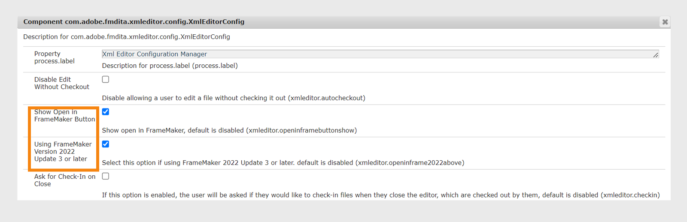

# Integrieren von Desktop-basierten XML-Editoren

Auf dem Markt sind viele XML-Editoren verfügbar, und Sie könnten bereits einen verwenden. Adobe FrameMaker ist einer der leistungsfähigsten XML-Editoren, der mit dem AEM-Connector geliefert wird. Mit dem AEM-Connector in FrameMaker können Sie einfach eine Verbindung zum AEM-Repository herstellen, Dateien ein- und auschecken und Dateien direkt in FrameMaker bearbeiten. Sie können Experience Manager Guides auch so konfigurieren, dass FrameMaker über den Editor gestartet wird. Sobald die Datei in FrameMaker geöffnet ist, können Sie sie bearbeiten und wieder in das AEM-Repository einchecken.

## Aktivieren der Dateibearbeitung in FrameMaker über den Editor

Sie können FrameMaker oder einen anderen DITA-Editor verwenden, um DITA-Inhalte zu erstellen und zu aktualisieren. Wenn Ihr Unternehmen jedoch FrameMaker als DITA-Editor verwendet, können Sie Ihren Benutzenden die Möglichkeit geben, DITA-Dokumente direkt in FrameMaker von AEM aus zu öffnen.


Standardmäßig wird den Benutzenden die Schaltfläche **In FrameMaker öffnen** in der AEM-Symbolleiste nicht angezeigt.

Die folgenden Registerkarten enthalten Anweisungen zum Hinzufügen dieser Schaltfläche in der AEM-Symbolleiste basierend auf Ihrer Experience Manager Guides-Einrichtung: Cloud Service oder On-Premise.

>[!BEGINTABS]

>[!TAB Cloud Service]

Verwenden Sie die Anweisungen unter [Konfigurationsüberschreibungen](download-install-config-override.md#), um die Konfigurationsdatei zu erstellen. Geben Sie in der Konfigurationsdatei die folgenden \(Eigenschaft\)-Details an, um diese Schaltfläche auf der AEM-Symbolleiste hinzuzufügen:


| PID | Eigenschaftsschlüssel | Eigenschaftswert |
|---|------------|--------------|
| `com.adobe.fmdita.xmleditor.config.XmlEditorConfig` | `xmleditor.openinframebuttonshow` | Boolescher Wert \(true/false\). Wenn Sie die Schaltfläche **In FrameMaker öffnen** anzeigen möchten, legen Sie diese Eigenschaft auf „true“ fest. <br> **Standardwert**: false |


Wenn Sie Version 2409 und FrameMaker Version September 2022 - Update 3 verwenden, müssen Sie die Konfiguration **FrameMaker Version 2022 Update 3 oder höher**, damit Ihre Benutzerinnen und Benutzer die Experience Manager Guides-Serverdetails an FrameMaker weitergeben können.  Standardmäßig ist sie deaktiviert.


| PID | Eigenschaftsschlüssel | Eigenschaftswert |
|---|------------|--------------|
| `com.adobe.fmdita.xmleditor.config.XmlEditorConfig` | `xmleditor.openinframe2022above` | Boolescher Wert \(true/false\). Wenn Sie FrameMaker Version September 2022 - Update 3 verwenden, setzen Sie diese Eigenschaft auf „true“. <br> **Standardwert**: false |


Wenn Sie die Eigenschaft *openinframebuttonshow* auf „true“ setzen, wird **Schaltfläche „In FrameMaker öffnen** angezeigt, wenn Sie eine DITA-Datei im AEM-Repository auswählen. Wenn diese Eigenschaft nicht auf &quot;*&quot; festgelegt ist* wird die Schaltfläche **In FrameMaker öffnen** nur angezeigt, wenn Sie eine .fm- oder eine .book-Datei im Repository auswählen

>[!TAB On-Premise]

1. Öffnen Sie die Seite Konfiguration der Adobe Experience Manager-Web-Konsole .

   Die Standard-URL für den Zugriff auf die Konfigurationsseite lautet:

   ```http
   http://<server name>:<port>/system/console/configMgr
   ```

1. Suchen Sie nach dem Bundle **com.adobe.fmdita.xmeditor.config.XmlEditorConfig** und klicken Sie darauf.
   

1. Wählen Sie die **Schaltfläche „In FrameMaker öffnen“**.

1. Wenn Sie Version 4.6 und FrameMaker Version September 2022 - Update 3 verwenden, müssen Sie die Konfiguration **FrameMaker Version 2022 Update 3 oder höher**, damit Ihre Benutzerinnen und Benutzer die Experience Manager Guides-Serverdetails an FrameMaker weitergeben können. Diese Option ist standardmäßig deaktiviert.


1. Klicken Sie auf **Speichern**.


Wenn Sie die Option **In FrameMaker öffnen** aktivieren, wird die Schaltfläche **In FrameMaker öffnen** angezeigt, wenn Sie eine beliebige DITA-Datei im AEM-Repository auswählen. Wenn diese Option *nicht aktiviert* wird die Schaltfläche **In FrameMaker öffnen** nur angezeigt, wenn Sie eine .fm- oder eine .book-Datei im Repository auswählen.

>[!ENDTABS]
