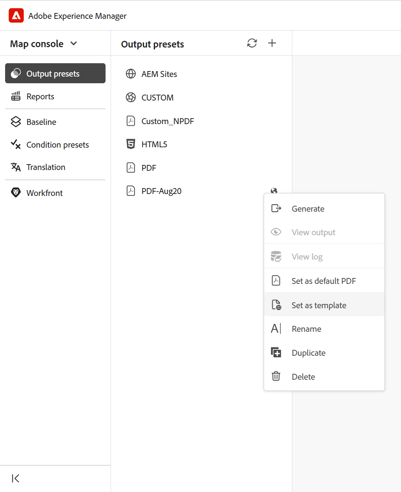

# Konfigurieren von Vorlagenvoreinstellungen für die Ausgabegenerierung

>[!NOTE]
>
> Vorlagenvoreinstellung ist in Experience Manager Guides as a Cloud Service ab Version 2026.08.0 verfügbar. Wenden Sie sich an Ihr Customer Success-Team , um diese Funktion zu aktivieren.

Mit Vorlagenvoreinstellungen können Admins die Konfigurationen von Ausgabevoreinstellungen für mehrere DITA-Zuordnungen standardisieren. Anstatt dieselbe Ausgabevorgabe für jede Zuordnung einzeln zu konfigurieren, können Sie eine Vorgabe als Vorlage definieren und sie auf alle Zuordnungen anwenden, die mit einem Ordnerprofil verknüpft sind.

Mit dieser Funktion können Sie konsistente Veröffentlichungskonfigurationen über Projekte hinweg beibehalten und den manuellen Konfigurationsaufwand reduzieren.

## Vorteile

Die Verwendung von Vorlagenvoreinstellungen bietet die folgenden Vorteile:

- Stellt konsistente Veröffentlichungskonfigurationen über mehrere Zuordnungen hinweg sicher.
- Reduziert den manuellen Aufwand durch Eliminieren der sich wiederholenden Voreinstellungskonfiguration.
- Ermöglicht die zentralisierte Verwaltung der Ausgabevoreinstellungen.

## Unterstützte Ausgabetypen

Vorlagenvorgaben werden für alle Ausgabevorgabentypen mit Ausnahme der folgenden unterstützt:

- Edge Delivery Services
- Knowledge Base
- SCORM

## Erstellen und Verwalten von Vorlagenvoreinstellungen

>[!NOTE]
>
> - Vorlagenvorgaben können nur von **Administratoren“ und** Ordnerprofiladministratoren **erstellt und** werden.
> - Vorlagenvoreinstellungen sind für die Konfigurationsverwaltung vorgesehen und werden nicht direkt für die Ausgabegenerierung verwendet.

1. Konfigurieren Sie das Ordnerprofil, das Sie für die Ordner verwenden möchten.
2. Öffnen Sie **Ausgabevorgaben** über die Zuordnungskonsole für den zugehörigen Ordner.
3. Erstellen Sie die Ausgabevorgabe, die Sie als Vorlage verwenden möchten, oder wählen Sie sie aus.

   >[!NOTE]
   >
   > Wenn Sie die Ausgabevorgabe erstellen oder auswählen, die Sie als Vorlage verwenden möchten, stellen Sie sicher, dass sie zum aktuellen Ordnerprofil hinzugefügt wird.

4. Wählen Sie **Als Vorlage festlegen** aus dem Menü **Optionen** für die Vorgabe aus.

   {width="650"}

   Die ausgewählte Ausgabevorgabe wird in eine Vorlagenvorgabe konvertiert. Vorlagenvorgaben werden durch ein Vorlagensymbol identifiziert, das sie von regulären Vorgaben unterscheidet. Um den Vorlagenstatus zu entfernen, wählen Sie **Als Vorlage deaktivieren** jederzeit aus dem Menü **Optionen** der Vorlagenvoreinstellung aus.

   {width="650"}

5. Wählen Sie **Vorgabenänderungen anwenden** aus dem Menü **Optionen** der Vorlagenvorgabe aus, um die aktualisierten Vorgabeneinstellungen auf alle vorhandenen Zuordnungen im ausgewählten Ordnerprofil anzuwenden.

   **Vorgabenänderungen anwenden** wird das Dialogfeld geöffnet.

   {width="350"}

6. Um die vorhandene Vorgabe zu überschreiben, aktivieren Sie das Kontrollkästchen **Vorhandene Vorgabe überschreiben** und klicken Sie auf **OK**. Durch Überschreiben wird die Vorgabe aktualisiert, aber die Einstellungen für Baseline, Bedingungsvorgabe, DITAVAL, Themenliste oder Veröffentlichungskontext in der Zielvorgabe werden nicht geändert. Diese Einstellungen bleiben unverändert.

   Ein Dialogfeld **Aktion bestätigen** wird geöffnet, in dem angegeben wird, für wie viele Zuordnungen die Vorgabenänderungen gelten.

   {width="350"}

7. Klicken Sie auf **OK**.

Die Änderungen werden auf alle Vorgaben in allen Zuordnungen innerhalb der zugehörigen Ordner angewendet.

>[!NOTE]
>
> Beim Erstellen einer neuen Zuordnung im zugehörigen Ordner ist die lokale Kopie der Vorlagenvorgabe auch für diese neu erstellte Zuordnung verfügbar.

## Erzeugungsverhalten der Ausgabe

Vorlagenvoreinstellungen sind Konfigurationsvorlagen und nicht für die direkte Veröffentlichung vorgesehen. Wenn eine Vorgabe als Vorlage markiert wird:

- Generate Output ist nicht verfügbar.
- Die Vorlagenvoreinstellung kann nicht für die Veröffentlichung verwendet werden.
- Vorhandene generierte Ausgaben für die Vorlagenvorgabe bleiben verfügbar, wenn sie erstellt wurden, bevor die Vorgabe in eine Vorlage konvertiert wurde.

