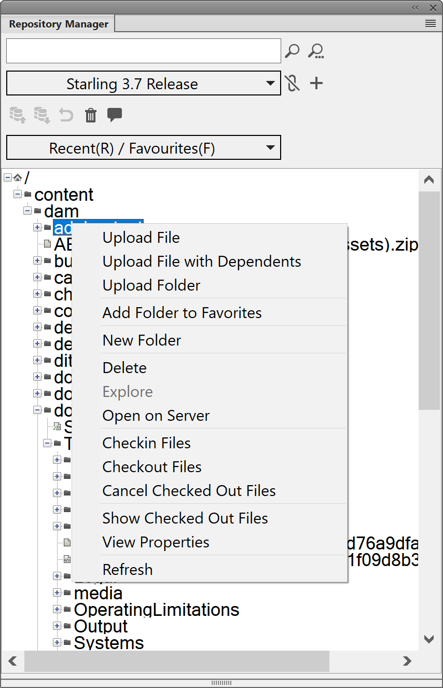

# Hochladen von vorhandenem DITA-Inhalt mit dem WebDAV-Tool und FrameMaker for On-Premise

Wahrscheinlich hätten Sie ein Repository mit vorhandenen DITA-Inhalten, die Sie mit AEM Guides verwenden möchten. Für solche vorhandenen Inhalte können Sie einen der folgenden Ansätze verwenden, um Ihren Inhalt stapelweise in das AEM-Repository hochzuladen.

- [Verwenden eines WebDAV-Tools](#use-a-webdav-tool)
- [Verwenden von FrameMaker](#use-framemaker)

## Verwenden eines WebDAV-Tools

Wenn Sie Ihre Themen und Karten in einem anderen DITA-Editor erstellen, können Sie Ihre Dateien mit einem beliebigen WebDAV-Tool hochladen. Das in diesem Abschnitt beschriebene Verfahren verwendet WinSCP als WebDAV-Tool zum Hochladen von Inhalten.

Führen Sie die folgenden Schritte aus, um WinSCP zum Hochladen von Dateien zu verwenden:

1. Laden Sie WinSCP herunter und installieren Sie es auf Ihrem Computer.

1. Starten Sie die WinSCP-App.

   Das Dialogfeld „Anmelden“ wird angezeigt.

1. Geben Sie im Dialogfeld „Anmelden“ eine Einstellung für „Neue Site“ an, indem Sie WebDAV als **Dateiprotokoll** auswählen und weitere Verbindungsdetails angeben, z. B.:

   - die URL, unter der Ihr AEM-Server gehostet wird,

   - die Port-Nummer `\(default is 4502\)` und

   - Benutzername und Kennwort für den Zugriff auf den AEM-Server.

1. Wählen Sie **Anmelden** aus.

   Bei erfolgreicher Verbindung wird der Inhalt von AEM Assets in der WinSCP-Benutzeroberfläche angezeigt. Mit dem WinSCP-Datei-Explorer können Sie mühelos Inhalte durchsuchen, erstellen, aktualisieren oder löschen.

## Hochladen von Inhalten mit UUID mithilfe eines WebDAV-Tools {#id201MI0I04Y4}

Sie können eine der folgenden Methoden verwenden, um Ihren Inhalt mit UUID hochzuladen:

- Ziehen Sie Inhalte per Drag-and-Drop aus Ihrem lokalen System.
- Verwenden Sie den **Erstellen** \> **Dateien** Workflow in der Assets-Benutzeroberfläche von AEM.
- Verwenden Sie ein Tool wie WinSCP.

Wenn Sie ein Tool wie WinSCP verwenden, können Sie die Aktion definieren, die mit einer doppelten Datei ausgeführt werden soll, indem Sie die Option **Alte Datei mit derselben UUID in neuen Ordner verschieben** im configMgr festlegen. Diese Option definiert, welche Aktion für eine Datei ausgeführt wird, die an einem anderen Speicherort im AEM-Repository verfügbar ist. Diese Einstellung ist im Paket `*com.adobe.fmdita.config.ConfigManager*` im configMgr verfügbar.

Standardmäßig ist die Option **Alte Datei mit derselben UUID in neuen Ordner verschieben** aktiviert. Wenn sich die hochgeladene Datei in einem anderen Ordner im Repository befindet, wird die vorhandene Datei an den aktuellen Speicherort verschoben und mit der hochgeladenen Datei überschrieben. Wenn Sie diese Option nicht auswählen, wird die Datei an ihrem vorhandenen Speicherort überschrieben.

**Zusätzliche Hinweise zum Arbeiten mit UUID-basierten Dateien**:

Beim Verschieben oder Kopieren von Inhalten innerhalb des AEM-Repositorys müssen die folgenden Punkte berücksichtigt werden:

- Beim Kopieren einer oder mehrerer Dateien von einem Speicherort an einen anderen Speicherort wird für Dateien ohne UUID eine neue UUID generiert. Diese UUID wird den Metadaten der Datei hinzugefügt.

- Wenn eine Datei einen Konflikt aufweist oder ein Duplikat aufweist, wird ein eindeutiger Dateiname für die neue Datei generiert, die kopiert oder verschoben wird.

- Keine zwei Dateien können dieselbe UUID haben. Allen neuen Dateien wird eine eindeutige UUID zugewiesen.

Beachten Sie beim Verschieben oder Kopieren von Inhalten von Ihrem lokalen System in das AEM-Repository die folgenden Punkte:

- Wenn eine Datei von zwei verschiedenen Benutzern gleichzeitig hochgeladen wird, überschreibt die später verarbeitete Datei die vorherige Datei. Eine solche Praxis ist jedoch selten und sollte vermieden werden.

- Wenn Sie Inhalte aus dem AEM-Repository auschecken und Änderungen auf Ihrem lokalen System vornehmen, stellen Sie sicher, dass der Dateiname zum Zeitpunkt des Uploads nicht geändert wird.

## Verwenden von FrameMaker

Adobe FrameMaker verfügt über einen leistungsstarken AEM-Connector, mit dem Sie vorhandene DITA- und andere FrameMaker-Dokumente einfach `\(.book and .fm\)` AEM hochladen können. Sie können verschiedene Datei-Upload-Funktionen verwenden, z. B. das Hochladen einer einzelnen Datei, das Hochladen eines vollständigen Ordners mit oder ohne Abhängigkeiten \(z. B. Inhaltsreferenzen, Querverweise und Grafiken\).

Führen Sie die folgenden Schritte aus, um den AEM-Connector von FrameMaker zum Hochladen von Inhalten zu verwenden:

1. Starten Sie FrameMaker.

1. Öffnen Sie das **Verbindungs-Manager**-Dialogfeld.

   {width="550" align="left"}

1. Geben Sie die folgenden Details ein, um eine Verbindung zum AEM-Repository herzustellen:

   - **Name**: Geben Sie einen beschreibenden Namen ein, um die Verbindung zu Ihrem AEM-Server zu identifizieren.
   - **Server**: Geben Sie die URL und Port-Nummer Ihres AEM-Servers ein.

   - **Benutzername**/**Kennwort**: Geben Sie den Benutzernamen und das Kennwort für den Zugriff auf den AEM-Server ein.

1. Wählen Sie **Verbinden** aus.

   Sobald die Verbindung erfolgreich hergestellt wurde, werden Assets aus dem AEM-Repository im Fenster „Repository Manager“ angezeigt.

   {width="550" align="left"}

   Wenn Sie mit der rechten Maustaste auf eine Datei oder einen Ordner klicken, können Sie verwandte Vorgänge ausführen. Wenn Sie beispielsweise mit der rechten Maustaste auf einen Ordner klicken, erhalten Sie Optionen zum Hochladen einer Datei, zum Hochladen einer Datei mit Abhängigkeiten, zum Hochladen eines gesamten Ordners usw.

**Übergeordnetes Thema:**&#x200B;[&#x200B; Migrieren vorhandener Inhalte](migrate-content.md)
