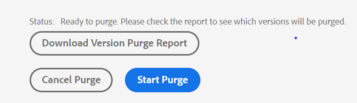

# Versionsverwaltung {#id181GB000XY4}

Die Versionierung ist ein wichtiger Aspekt jedes Content-Management-Systems. Damit können Sie einen Schnappschuss Ihres digitalen Assets zu einem bestimmten Zeitpunkt erstellen. Wenn eine Version eines digitalen Assets vorhanden ist, können Sie die erforderliche Version des Assets wiederherstellen und aktualisieren. Beim Erstellen einer Version eines Assets checken Sie normalerweise das gewünschte Asset aus und ein.

Als Administrator können Sie Regeln durchsetzen, die Benutzer daran hindern, eine Datei zu bearbeiten, ohne sie auszuchecken. Auf ähnliche Weise können Sie sicherstellen, dass alle ausgecheckten Dateien wieder eingecheckt werden, um Datenverlust zu vermeiden.

In einer Umgebung mit mehreren Verwendungszwecken muss außerdem sichergestellt werden, dass Benutzerinnen und Benutzer keine Dateien aus dem System löschen. Diese Anforderung ist wichtiger für Dateien, die von anderen Benutzern ausgecheckt werden. Um zu verhindern, dass Benutzer versehentlich ausgecheckte Dateien aus dem System löschen, stellt AEM Guides eine Konfiguration bereit, die Sie verwenden können. Zusätzlich zu ausgecheckten Dateien können Sie auch das Löschen von Dateien steuern, die Verweise enthalten oder von anderen Dateien referenziert werden.

## Neue Version für hochgeladene Datei erstellen

>[!NOTE]
>
> Diese Konfiguration gilt nur beim Hochladen von Dateien.

Die folgenden Registerkarten enthalten Anweisungen zum Aktivieren der Option **Neue Version für hochgeladene Datei erstellen** basierend auf Ihrer Experience Manager Guides-Einrichtung: Cloud Service oder On-Premise.

>[!BEGINTABS]

>[!TAB Cloud Service]

1. Verwenden Sie die Anweisungen unter [Konfigurationsüberschreibungen](download-install-config-override.md#), um die Konfigurationsdatei zu erstellen.
1. Geben Sie in der Konfigurationsdatei die folgenden \(property\)-Details an, um die Option **Neue Version für hochgeladene Datei erstellen** zu konfigurieren:


   | PID | Eigenschaftsschlüssel | Eigenschaftswert |
   |---|------------|--------------|
   | `com.adobe.fmdita.confi g.ConfigManager` | `create.ver.new.content` | Boolescher Wert \(true/false\).<br> **Standardwert**: `true` |

>[!NOTE]
>
> Wenn die Option ausgewählt ist, wird ein neuer Versionsverwaltungsmechanismus ausgeführt, der das standardmäßige Upload-Verhalten überschreibt, das bei jedem nachfolgenden Upload gilt. Der Inhalt der hochgeladenen Datei wird als neue Version gespeichert. Wenn die Option deaktiviert ist, verwendet AEM Guides den standardmäßigen Versionsverwaltungsmechanismus von AEM.

>[!TAB On-Premise]

1. Öffnen Sie die Seite Konfiguration der Adobe Experience Manager-Web-Konsole .

   Die Standard-URL für den Zugriff auf die Konfigurationsseite lautet:

   ```http
   http://<server name>:<port>/system/console/configMgr
   ```

1. Suchen Sie nach dem Bundle **com.adobe.fmdita.config.ConfigManager** und klicken Sie darauf.

1. Wählen Sie die **Neue Version für hochgeladene Datei erstellen** aus.

   Standardmäßig ist diese Option deaktiviert.

   Wenn die Option ausgewählt ist, wird ein neuer Versionsverwaltungsmechanismus ausgeführt, der das standardmäßige Upload-Verhalten überschreibt, das bei jedem nachfolgenden Upload gilt. Der Inhalt der hochgeladenen Datei wird als neue Version gespeichert. Wenn die Option deaktiviert ist, verwendet AEM Guides den standardmäßigen Versionsverwaltungsmechanismus von AEM.

1. Klicken Sie auf **Speichern**.


>[!NOTE]
>
> Sie können Dateien in Stapeln von 70 oder weniger hochladen, wenn Sie die Eigenschaft **Neue Version für hochgeladene Datei erstellen** \(create.ver.new.content\) aktivieren und die **Assets-Benutzeroberfläche** verwenden, um Assets stapelweise hochzuladen.

>[!ENDTABS]


## Einstellungen konfigurieren, um die Bearbeitung von ausgecheckten Dateien zu ermöglichen

Mit dem AEM Guides-Web-Editor können Sie DITA-Themen erstellen und aktualisieren. Sie können den Web-Editor so konfigurieren, dass nur die Dokumente bearbeitet werden können, die aus dem Repository ausgecheckt wurden. Dadurch wird sichergestellt, dass kein anderer Autor versehentlich ein Thema überschreibt, das von einem anderen Autor zur Bearbeitung geöffnet wird. Sobald ein Thema zur Bearbeitung geöffnet wurde, kann ein Autor die Datei zum Zeitpunkt des Schließens der Datei einchecken.

Eine weitere wichtige Regel besteht darin, sicherzustellen, dass Dateien, die ausgecheckt wurden, wieder in das System eingecheckt werden. Dadurch wird verhindert, dass Benutzer die Dateien versehentlich schließen, ohne sie wieder einzuchecken.

Die folgenden Registerkarten enthalten Anweisungen zum Konfigurieren der Einstellungen, um die Bearbeitung ausgecheckter Dateien basierend auf Ihrer Experience Manager Guides-Einrichtung zu ermöglichen: Cloud Service oder On-Premise.

>[!BEGINTABS]

>[!TAB Cloud Service]

Verwenden Sie die Anweisungen unter [Konfigurationsüberschreibungen](download-install-config-override.md#), um die Konfigurationsdatei zu erstellen. Geben Sie in der Konfigurationsdatei die folgenden \(property\)-Details an, um die Bearbeitung von ausgecheckten Dateien zu konfigurieren:

| PID | Eigenschaftsschlüssel | Eigenschaftswert |
|---|------------|--------------|
| `com.adobe.fmdita.xmleditor.config.XmlEditorConfig` | `xmleditor.autocheckout` | Boolescher Wert \(true/false\).<br> **Standardwert**: `false` |

Darüber hinaus können Sie auch so konfigurieren, dass eine Warnmeldung angezeigt wird, wenn eine ausgecheckte Datei geschlossen wird, ohne sie im Repository zu speichern oder wieder einzuchecken.

| PID | Eigenschaftsschlüssel | Eigenschaftswert |
|---|------------|--------------|
| `com.adobe.fmdita.xmleditor.config.XmlEditorConfig` | `xmleditor.checkin` | Boolescher Wert \(true/false\).<br> **Standardwert**: `false` |

>[!NOTE]
>
> Unabhängig davon, ob Sie diese Funktion aktivieren oder deaktivieren, sind die Optionen zum Auschecken und Einchecken von Dateien immer in einer Themenvorschau verfügbar.

>[!TAB On-Premise]

1. Öffnen Sie die Seite Konfiguration der Adobe Experience Manager-Web-Konsole .

   Die Standard-URL für den Zugriff auf die Konfigurationsseite lautet:

   ```http
   http://<server name>:<port>/system/console/configMgr
   ```

1. Suchen Sie nach dem Bundle **com.adobe.fmdita.xmeditor.config.XmlEditorConfig** und klicken Sie darauf.

1. Wählen Sie die Option **Bearbeitung ohne Auschecken deaktivieren** aus.

   {width="650" align="left"}

   Bei dieser Option wird die Option Bearbeiten in der Symbolleiste erst angezeigt, wenn eine Datei ausgecheckt wurde.

1. Wählen Sie die Option **Beim Schließen zum Einchecken auffordern**, um eine Warnmeldung anzuzeigen, wenn eine ausgecheckte Datei geschlossen wird, ohne sie zu speichern oder wieder in das Repository einzuchecken.

1. Klicken Sie auf **Speichern**.

>[!NOTE]
>
> Unabhängig davon, ob Sie diese Funktion aktivieren oder deaktivieren, sind die Optionen zum Auschecken und Einchecken von Dateien immer in einer Themenvorschau verfügbar.

>[!ENDTABS]

## Ausgecheckte Datei beim Hochladen überschreiben

>[!NOTE]
>
> *Diese Konfiguration gilt nur, wenn Sie Dateien über die Assets-Benutzeroberfläche erstellen, und nicht, wenn Sie Dateien mit dem WebDAV-Tool hochladen.*

Die folgenden Registerkarten enthalten Anweisungen, mit denen Benutzende die Datei beim Hochladen überschreiben können, die von ihnen oder einem anderen Benutzenden basierend auf Ihrer Experience Manager Guides-Einrichtung ausgecheckt wurde: Cloud Service oder On-Premise.

>[!BEGINTABS]

>[!TAB Cloud Service]

1. Verwenden Sie die Anweisungen unter [Konfigurationsüberschreibungen](download-install-config-override.md#), um die Konfigurationsdatei zu erstellen.
1. Geben Sie in der Konfigurationsdatei die folgenden \(property\)-Details an, um die Option **Ausgecheckte Datei beim Hochladen überschreiben** zu konfigurieren:


| PID | Eigenschaftsschlüssel | Eigenschaftswert |
|---|------------|--------------|
| `com.adobe.fmdita.config.ConfigManager` | `overwrite.checkout.onupload` | Boolescher Wert \(true/false\).<br> **Standardwert**: `false` |

>[!NOTE]
>
> Standardmäßig ist diese Option deaktiviert. Wenn diese Option aktiviert ist, können Benutzer ausgecheckte Dateien überschreiben. Wenn die Option nicht ausgewählt ist, kann die Datei nicht überschrieben werden, wenn sie von ihnen oder einem anderen Benutzer ausgecheckt wurde.

>[!TAB On-Premise]

1. Öffnen Sie die Seite Konfiguration der Adobe Experience Manager-Web-Konsole .

   Die Standard-URL für den Zugriff auf die Konfigurationsseite lautet:

   ```http
   http://<server name>:<port>/system/console/configMgr
   ```

1. Suchen Sie nach dem Bundle **com.adobe.fmdita.config.ConfigManager** und klicken Sie darauf.

1. Wählen Sie die **Ausgecheckte Datei beim Hochladen überschreiben** aus.

   Standardmäßig ist diese Option aktiviert. Wenn diese Option aktiviert ist, können Benutzer ausgecheckte Dateien überschreiben. Wenn die Option nicht ausgewählt ist, kann die Datei nicht überschrieben werden, wenn sie von ihnen oder einem anderen Benutzer ausgecheckt wurde.

1. Klicken Sie auf **Speichern**.

>[!ENDTABS]


## Verhindern des Löschens ausgecheckter Dateien

Die folgenden Registerkarten enthalten Anweisungen, um zu verhindern, dass Benutzer versehentlich Dateien löschen, die von ihnen oder einem anderen Benutzer basierend auf Ihrer Experience Manager Guides-Einrichtung ausgecheckt wurden: Cloud Service oder On-Premise.

>[!BEGINTABS]

>[!TAB Cloud Service]

Verwenden Sie die Anweisungen unter [Konfigurationsüberschreibungen](download-install-config-override.md#), um die Konfigurationsdatei zu erstellen. Geben Sie in der Konfigurationsdatei die folgenden \(property\)-Details an, um zu verhindern, dass Benutzer versehentlich ausgecheckte Dateien löschen:

| PID | Eigenschaftsschlüssel | Eigenschaftswert |
|---|------------|--------------|
| `com.adobe.fmdita.xmleditor.config.XmlEditorConfig` | `xmleditor.preventcheckedoutcontentdeletion` | Boolescher Wert \(true/false\). <br> **Standardwert**: `true` |

>[!TAB On-Premise]

1. Öffnen Sie die Seite Konfiguration der Adobe Experience Manager-Web-Konsole .

   Die Standard-URL für den Zugriff auf die Konfigurationsseite lautet:

   ```http
   http://<server name>:<port>/system/console/configMgr
   ```

1. Suchen Sie nach dem Bundle **com.adobe.fmdita.xmeditor.config.XmlEditorConfig** und klicken Sie darauf.

1. Wählen Sie die **Löschen von ausgechecktem Inhalt verhindern** aus.

   Standardmäßig ist diese Option aktiviert. Wenn diese Option aktiviert ist, können Benutzer ausgecheckte Dateien nicht löschen.

1. Klicken Sie auf **Speichern**.


Um diese Funktion zu unterstützen, wird in `drivelock` eine neue `oak:index` für die Indexeigenschaft hinzugefügt:

`/oak:index/damAssetLucene/indexRules/dam:Asset/properties/drivelock`

{width="800" align="left"}

Stellen Sie zusätzlich zur neuen Indexeigenschaft sicher, dass die folgenden Eigenschaften für `/oak:index/damAssetLucene` festgelegt sind:

- `jcr:primaryType`=`"oak:QueryIndexDefinition"`
- `async`=`"async"`
- `compatVersion`=`"{Long}2"`
- `evaluatePathRestrictions`=`"{Boolean}true"`
- `reindex`=`"{Boolean}false"`
- `reindexCount`=`"{Long}3"` *\(Anzahl der Neuindizierungen; wird durch die Installation des Pakets ersetzt\)*
- `type`=`"lucene"`

>[!NOTE]
>
> Sie können den Wert von `reindex` auf `"{Boolean}true"` ändern. Dies ermöglicht schnellere Suchergebnisse für die ausgecheckten Dateien innerhalb einer Ordnerhierarchie.

>[!ENDTABS]

## Verhindern des Löschens referenzierter Dateien

Als Administrator können Sie steuern, wer Dateien aus dem AEM-Repository löschen kann. Insbesondere wenn eine Datei Verweise enthält oder von einer anderen Datei referenziert wird, können Sie definieren, wer diese Dateien löschen kann.

Mit dieser Konfiguration können Sie zulassen oder verbieten, dass alle Benutzer Dateien löschen, oder nur einer bestimmten Benutzergruppe erlauben, Dateien zu löschen. Wenn das Löschen von Dateien zulässig ist, wird der folgende Prozess ausgeführt:

- Wenn Sie einen Ordner löschen, der alle referenzierten und referenzierenden Dateien enthält, werden alle Dateien gelöscht. Der Prozess löscht zunächst alle Dateien, die keine Verweise enthalten, gefolgt von den Dateien, die Verweise enthalten oder auf die verwiesen wird.

- Wenn Sie einen Ordner löschen und eine Datei innerhalb des Ordners von einer Datei außerhalb dieses Ordners referenziert wird, werden Sie vor dem Löschen der Datei aufgefordert, den Verweis zu entfernen.

Die folgenden Registerkarten enthalten Anweisungen zum Definieren, wer eine Datei löschen kann, die Verweise enthält oder von anderen Dateien referenziert wird, je nach Ihrer Experience Manager Guides-Einrichtung: Cloud Service oder On-Premise.

>[!BEGINTABS]

>[!TAB Cloud Service]

Verwenden Sie die Anweisungen unter [Konfigurationsüberschreibungen](download-install-config-override.md#), um die Konfigurationsdatei zu erstellen. Geben Sie in der Konfigurationsdatei die folgenden \(property\)-Details an, um zu definieren, wer eine Datei löschen kann, die Verweise enthält oder auf die andere Dateien verweisen:

| PID | Eigenschaftsschlüssel | Eigenschaftswert |
|---|------------|--------------|
| `com.adobe.fmdita.config.ConfigManager` | `block.unsafe.delete` | Mögliche Werte sind: <br> - allow\_unsafe\_delete\_for\_all <br> -   allow\_unsafe\_delete\_for\_delete\_assets\_group <br> - block\_unsafe\_delete\_for\_all <br> **Standardwert**: `allow_unsafe_delete_for_delete_assets_group` <br> Die Details dieser Konstanten werden unten angezeigt. |

Geben Sie je nachdem, wem Sie Zugriff zum Löschen gewähren möchten, eine der folgenden Konstanten an:

- allow\_unsafe\_delete\_for\_all: Erteilen Sie allen Benutzern die Berechtigung zum Löschen von Dateien. Wenn die Datei(en) Verweise enthält (enthalten) oder von anderen Dateien auf sie verwiesen wird, kann das Löschen der Datei(en) erzwungen werden. Vor dem Löschen der Datei wird eine Eingabeaufforderung mit den Verweisen angezeigt. Sie können den Löschvorgang abbrechen, die Verweise entfernen und schließlich die Datei(en) löschen. Alternativ können Sie die Datei(en) erzwingen löschen, ohne die Verweise zu entfernen.

  

- allow\_unsafe\_delete\_for\_delete\_assets\_group: Ein Administrator oder ein Benutzer, der zur Gruppe *delete-assets* gehört, darf Dateien löschen. Wenn andere Benutzer versuchen, Dateien mit Verweisen zu löschen, dürfen sie diese Dateien erst löschen, nachdem alle Verweise entfernt wurden. Der folgende Screenshot wird angezeigt, wenn ein Benutzer ohne Berechtigungen versucht, Dateien zu löschen.

  

- block\_unsafe\_delete\_for\_all: Verhindern Sie, dass alle Benutzer \(einschließlich Administratoren\) Dateien löschen, bis die Verweise auf und von den Datei(en) entfernt wurden.

>[!TAB On-Premise]

1. Öffnen Sie die Seite Konfiguration der Adobe Experience Manager-Web-Konsole .

   Die Standard-URL für den Zugriff auf die Konfigurationsseite lautet:

   ```http
   http://<server name>:<port>/system/console/configMgr
   ```

1. Suchen Sie nach dem Bundle **com.adobe.fmdita.config.ConfigManager** und klicken Sie darauf.

1. Suchen Sie die Option **Blocklöschung für referenzierte Assets**.

1. Geben Sie je nachdem, wem Sie Zugriff zum Löschen gewähren möchten, eine der folgenden Konstanten an:

   - allow\_unsafe\_delete\_for\_all: Erteilen Sie allen Benutzern die Berechtigung zum Löschen von Dateien. Wenn die Datei(en) Verweise enthält (enthalten) oder von anderen Dateien auf sie verwiesen wird, kann das Löschen der Datei(en) erzwungen werden. Vor dem Löschen der Datei wird eine Eingabeaufforderung mit den Verweisen angezeigt. Sie können den Löschvorgang abbrechen, die Verweise entfernen und schließlich die Datei(en) löschen. Alternativ können Sie die Datei(en) erzwingen löschen, ohne die Verweise zu entfernen.

     {width="550" align="left"}

   - allow\_unsafe\_delete\_for\_delete\_assets\_group: Ein Administrator oder ein Benutzer, der zur Gruppe *delete-assets* gehört, darf Dateien löschen. Wenn andere Benutzer versuchen, Dateien mit Verweisen zu löschen, dürfen sie diese Dateien erst löschen, nachdem alle Verweise entfernt wurden. Der folgende Screenshot wird angezeigt, wenn ein Benutzer ohne Berechtigungen versucht, Dateien zu löschen.

     {width="550" align="left"}

   - block\_unsafe\_delete\_for\_all: Verhindern Sie, dass alle Benutzer \(einschließlich Administratoren\) Dateien löschen, bis die Verweise auf und von den Datei(en) entfernt wurden.

1. Klicken Sie auf **Speichern**.

>[!ENDTABS]

## Bereinigen älterer Versionen von DITA-Dateien

Wenn Sie Inhalte aktualisieren und neue Versionen erstellen, werden die vorherigen Versionen der DITA-Dateien im Repository gepflegt. Es kann vorkommen, dass über einen bestimmten Zeitraum viele Versionen für Ihre DITA-Dateien erstellt werden, die zusammen viel Speicherplatz in Ihrem Repository belegen. Mit AEM Guides können Sie die älteren Versionen konfigurieren, die aus dem Repository gelöscht werden sollen.

Wenn Sie über Administratorrechte verfügen, können Sie über die angegebene URL auf dieses Dienstprogramm zugreifen:

`<server folder path> /libs/fmdita/clientlibs/xmleditor_version_purge/page.html`

Die Version einer DITA-Datei, die eines der angegebenen Kriterien erfüllt, wird beibehalten und nicht bereinigt:

- Ist die erste Version einer Datei
- Ist in einer Baseline enthalten
- Ist in jedem Übersetzungs- oder Review-Workflow enthalten
- wurde eine Kennzeichnung zugewiesen
- Erfüllt die definierten Kriterien für Alter oder Anzahl der Versionen

Führen Sie die folgenden Schritte aus, um die älteren Versionen zu bereinigen:

1. Geben Sie die folgenden Details zu den Dateien ein, die Sie bereinigen möchten:

   

1. 
   - **Anzahl der Versionen, die von der neuesten Version beibehalten werden sollen**: Geben Sie die Anzahl der Versionen ein, die beibehalten und nicht gelöscht werden sollen. Wenn Sie beispielsweise „5“ eingeben, werden die letzten 5 Versionen beibehalten und die Versionen davor werden gelöscht, wenn andere Bereinigungsbedingungen erfüllt sind.
   - **Innerhalb der Zeitspanne erstellte Versionen beibehalten \(in Tagen\)**: Geben Sie das maximale Alter einer Version in Tagen ein. Die Versionen, die älter als die angegebene Anzahl von Tagen sind, werden bereinigt, wenn andere Bereinigungsbedingungen erfüllt sind. Wenn wir beispielsweise „100“ eingeben, werden alle Versionen, die vor 100 Tagen erstellt wurden, gelöscht, falls andere Bereinigungsbedingungen erfüllt sind.
   - **Path**: Wählen Sie den Pfad der Datei oder des Ordners aus, deren Dateien Sie bereinigen möchten.

     >[!NOTE]
     >
     > Sie können nur DITA-Dateien bereinigen.

1. Klicken Sie auf **Vorschau des Bereinigungsberichts**.

   >[!NOTE]
   >
   > Es kann jeweils nur eine Bereinigungsaufgabe geben. Sie können keinen weiteren Versionsbereinigungsvorgang starten, wenn gerade ein Vorgang ausgeführt wird.

   Der Bericht zur Versionsbereinigung wird generiert.

1. Laden Sie den Bericht zur Versionsbereinigung herunter und überprüfen Sie die Dateien und Versionen, die bereinigt werden sollen.
1. Sie können **Bereinigung abbrechen** oder **Bereinigung starten**.

   

   Der Löschstatus wird angezeigt.

   Klicken Sie **Versionsbereinigungsbericht herunterladen**, um die bereinigten Versionen anzuzeigen. Dieser Bericht enthält den Bereinigungsstatus für alle Versionen sowie die Gründe, warum eine bestimmte Version beibehalten wurde oder warum sie gelöscht wurde.


>[!NOTE]
>
> Der Bericht wird unter folgendem Speicherort heruntergeladen: `/var/dxml/versionpurge`
