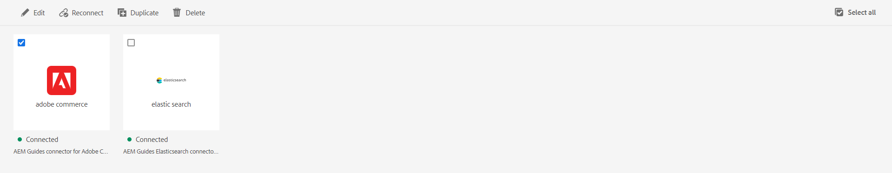

# Konfigurieren eines Datenquellen-Connectors über die Benutzeroberfläche

Experience Manager Guides enthält das Tool **Datenquellen** mit dem Sie vordefinierte Connectoren für Datenquellen konfigurieren können. Sie können Connectoren für JIRA-, SQL- (MySQL, PostgreSQL, Microsoft SQL Server, SQLite, MariaDB, H2DB), AdobeCommerce- und Elasticsearch-Datenbanken einrichten.

Um einen Connector zu konfigurieren, führen Sie die folgenden Schritte aus:

1. Wählen Sie oben den Link **Adobe Experience Manager** und dann „Tools“ aus.
1. Wählen Sie **Guides** aus der Liste der Tools aus.
1. Wählen Sie die **Datenquellen** aus. Die **Datenquellen** wird angezeigt. Sie können die verbundenen Datenquellen anzeigen.

   Sie können zwischen der **Listenansicht** oder **Kachelansicht** wechseln, um die verschiedenen verbundenen Datenquellen als Liste oder als Kacheln anzuzeigen.

   

   *Anzeigen oder Erstellen eines Datenquellen-Connectors.*
1. Klicken Sie auf **Erstellen**.
1. Wählen Sie die Datenbank aus, für die Sie den Connector erstellen möchten. Beispiel: der Elasticsearch-Connector.
   >[!NOTE]
   >
   >Alle verfügbaren vordefinierten Datenbanken werden aufgelistet.

1. Klicken Sie auf **Weiter**.
1. Geben Sie die Konfigurations- und Verbindungsdetails gemäß der Datenbank ein.

   >[!TIP]
   >* Bewegen Sie den Mauszeiger über  in der Nähe des Felds, um weitere Details dazu anzuzeigen.
   > * Felder mit * sind Pflichtfelder. Sie können beispielsweise die folgenden Details für den Elasticsearch-Connector eingeben.

   * **Name**: Geben Sie den Namen der Datenquelle ein.
   * Authentifizierungstyp: Wählen Sie in der Dropdown-Liste den Authentifizierungstyp aus. Beispiel: Einfache Benutzername-Kennwort-Authentifizierung
   * **Benutzername**: Geben Sie Ihren Benutzernamen ein.
   * **Kennwort**: Geben Sie Ihren Benutzernamen und Ihr Kennwort ein.
   * **URL**: API-URL hinzufügen.

1. Wählen Sie **Verbindung testen** aus. Sie können die Schaltfläche **Verbindung testen** erst anzeigen, nachdem Sie die erforderlichen Details hinzugefügt haben. Zeigt eine Erfolgsmeldung an, wenn die Verbindungsdetails korrekt sind. Andernfalls wird möglicherweise eine Fehlermeldung angezeigt.

1. Wählen **oben** Speichern“ aus, um den Connector zu speichern.     Die Schaltfläche **Speichern** wird aktiviert, nachdem Sie alle Details ausgefüllt haben und die Verbindung erfolgreich hergestellt wurde.

   Wenn der Connector erfolgreich gespeichert wurde, können Sie die verbundene Datenquelle auf der Seite anzeigen.

## Für einen Connector verfügbare Funktionen

* Schalten Sie zwischen **Listenansicht** oder **Kachelansicht** um, um die verschiedenen verbundenen Datenquellen als Liste oder als Kacheln anzuzeigen.
* Aktivieren Sie das Kontrollkästchen für einen einzelnen Connector. Klicken Sie **Alle auswählen**, um alle Anschlüsse auszuwählen. Sie können auf **Auswahl aufheben** klicken, wenn alle Connectoren ausgewählt sind.

*Bearbeiten, Erneutes Verbinden, Duplizieren oder Löschen eines Datenquellen-Connectors.*

Sie können die folgenden Funktionen für den Connector auf der Seite **Datenquellen** verwenden:

* **Bearbeiten**: Bearbeiten Sie die Konfigurationsdetails für den ausgewählten Connector.

* **Erneut verbinden**: Erneut mit einem getrennten Connector verbinden.

* **Duplizieren**: Erstellen Sie einen neuen doppelten Connector, indem Sie den aktuellen Connector als Basis verwenden. Der doppelte Connector wird standardmäßig mit einem Suffix (wie connectorName_1) erstellt. Beispiel: sample-elastische-search_1.
Wenn der Connector mit demselben Namen vorhanden ist, wird ein Fehler angezeigt.

* **Löschen**: Löscht den ausgewählten Connector.

Nachdem Sie die Datenquelle konfiguriert haben, wird der Connector unter dem **Datenquellenbedienfeld** im Web-Editor aufgeführt. Anschließend können Sie eine Verbindung zur Datenquelle herstellen und ein Inhaltsfragment in Ihre Themen einfügen. Weitere Informationen finden Sie unter [Verwenden von Daten aus Ihrer Datenquelle](../user-guide/web-editor-content-snippet.md).

>[!NOTE]
>
>Sie können auch benutzerdefinierte Connectoren erstellen und mit den verschiedenen Datenquellen verwenden. Erfahren Sie, wie [benutzerdefinierte Connectoren konfigurieren](../knowledge-base/kb-articles/data-source/conf-custom-data-source-connector.md).