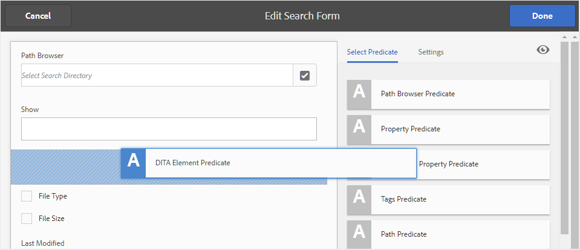

# Konfigurieren der Suche für die AEM Assets-Benutzeroberfläche {#id192SC800MY4}

Standardmäßig erkennt AEM DITA-Inhalte nicht und bietet daher keinen Mechanismus zum Durchsuchen von DITA-Inhalten in seinem Repository. Mit AEM Guides können Sie die DITA-Inhaltssuchfunktion im AEM-Repository hinzufügen.

Standardmäßig erkennt AEM DITA-Inhalte nicht und bietet daher keinen Mechanismus zum Durchsuchen von DITA-Inhalten in seinem Repository. Außerdem gibt es keine OOTB-Funktion, um Inhalte basierend auf ihrer UUID zu durchsuchen. Mit AEM Guides können Sie die Funktionen für die DITA-Inhaltssuche und die UUID-basierte Suche im AEM-Repository hinzufügen.

Die Konfiguration der DITA-Inhaltssuche umfasst die folgenden Aufgaben:

1. [Hinzufügen der DITA-Element-Suchkomponente in der Assets-Benutzeroberfläche](#id192SF0F50HS)
1. [Hinzufügen einer UUID-basierten Suchkomponente in der Assets-Benutzeroberfläche](#id2034F04K05Z)
1. [Berechtigungen für Benutzer bereitstellen](#id192SF0G0RUI)
1. [Hinzufügen benutzerdefinierter Elemente oder Attribute bei der Suche](#id192SF0G10YK)
1. [Extrahieren von Metadaten aus vorhandenen Inhalten](#id192SF0GA0HT)

Zusätzlich zur Suchfunktion können Sie auch die Ordner konfigurieren, die nicht in die Suche einbezogen werden sollen. Weitere Informationen finden Sie unter [Ausschließen temporärer Dateien aus Suchergebnissen](#id197AHI0035Z).

## Hinzufügen der DITA-Element-Suchkomponente in der Assets-Benutzeroberfläche {#id192SF0F50HS}

Führen Sie die folgenden Schritte aus, um die DITA-Inhaltssuchkomponente in der AEM Assets-Benutzeroberfläche hinzuzufügen:

1. Melden Sie sich bei Adobe Experience Manager als Administrator an.

1. Klicken Sie oben auf den Link **Adobe Experience Manager** und wählen Sie &quot;**&quot;**.

1. Wählen Sie **Allgemein** aus der Liste der Tools aus und klicken Sie auf die Kachel **Forms durchsuchen**.

1. Wählen Sie in der **Forms durchsuchen** die **Assets Admin-Suchleiste aus**.

1. Klicken Sie auf **Bearbeiten**.
1. Scrollen Sie auf **Registerkarte** Eigenschaft auswählen“ zum Ende der Liste.

1. Ziehen Sie **DITA Element Predicate** an die gewünschte Position im Suchformular.

   {width="650" align="left"}

1. Klicken Sie **Fertig**, um Ihre Änderungen zu speichern.

   Beim Zugriff auf die Option „Filter“ in der Assets-Benutzeroberfläche wird die Filteroption „DITA-Element-Suche“ angezeigt.

   {width="350" align="left"}


## Hinzufügen einer UUID-basierten Suchkomponente in der Assets-Benutzeroberfläche {#id2034F04K05Z}

Führen Sie folgende Schritte aus, um die UUID-basierte Suchkomponente in der AEM Assets-Benutzeroberfläche hinzuzufügen:

1. Melden Sie sich bei Adobe Experience Manager als Administrator an.

1. Klicken Sie oben auf den Link **Adobe Experience Manager** und wählen Sie &quot;**&quot;**.

1. Wählen Sie **Allgemein** aus der Liste der Tools aus und klicken Sie auf die Kachel **Forms durchsuchen**.

1. Wählen Sie in der **Forms durchsuchen** die **Assets Admin-Suchleiste aus**.

1. Klicken Sie auf **Bearbeiten**.
1. Wählen Sie auf **Registerkarte** Eigenschaft auswählen **die Option** Eigenschaft“ aus und ziehen Sie sie per Drag-and-Drop an die gewünschte Position im Suchformular.

1. Geben Sie auf **Registerkarte** die folgenden Details für die neu hinzugefügte Komponente **Eigenschaftsprädikat** ein:

   - **Feldbezeichnung**: UUID
   - **Eigenschaftsname**: jcr:content/fmUuid
1. Klicken Sie **Fertig**, um Ihre Änderungen zu speichern.

   Wenn Sie in der Assets-Benutzeroberfläche auf die Option „Filter“ zugreifen, erhalten Sie die Option Benutzeroberflächenbasierte Suchfilterung .


## Berechtigungen für Benutzer bereitstellen {#id192SF0G0RUI}

Die Autoren und Herausgeber benötigen explizite Berechtigungen, um über die Assets-Benutzeroberfläche auf die Suchfunktionen zugreifen zu können. Wenn Sie diese Berechtigungen nicht gewähren, können Ihre Benutzerinnen und Benutzer keine DITA-Inhalte basierend auf ihren Element-/Attributwerten oder ihrer UUID suchen.

Führen Sie die folgenden Schritte aus, um Zugriff auf die DITA-Suchfunktion zu gewähren:

1. Rufen Sie die Seite mit den Berechtigungen für Benutzer und Gruppen auf. Die Standard-URL für den Zugriff auf die Seite lautet:

   `http://<server name>:<port>/useradmin.html`

1. Suchen Sie nach der Benutzergruppe oder einem einzelnen Benutzer, dem Sie Zugriff gewähren möchten. Um beispielsweise allen Benutzern in der Autorengruppe Zugriff zu gewähren, geben Sie Autoren in das Feld **Filterabfrage** ein und drücken Sie die **Eingabetaste**.

   {width="350" align="left"}

1. Wählen Sie die Gruppe **Autoren** aus.

1. Wählen Sie im rechten Bereich die Registerkarte **Berechtigungen** aus.

1. Navigieren Sie zum folgenden Ordnerspeicherort:

   /conf/global/settings/dam/search

1. Erteilen Sie **Berechtigung** Lesen für den Suchordner.

   {width="650" align="left"}

1. Klicken Sie auf **Speichern**.


Der/die ausgewählte Benutzende oder die ausgewählte Benutzergruppe hat jetzt Zugriff auf die Funktion DITA-Inhalt durchsuchen in der Assets-Benutzeroberfläche.

## Hinzufügen benutzerdefinierter Elemente oder Attribute bei der Suche {#id192SF0G10YK}

Damit die DITA-Suche funktioniert, ist eine Vorverarbeitung des DITA-Inhalts erforderlich. Dieser Vorverarbeitungsschritt extrahiert selektive Inhalte aus einzelnen DITA-Karten und -Themen, damit sie für eine schnellere Suche indiziert werden können. Intern wird dieser Prozess als &quot;*&quot;*. Die Serialisierung von DITA-Dateien erfolgt während des Inhalts-Uploads oder kann auch bei Bedarf ausgeführt werden. Sie verwendet eine Konfigurationsdatei, um zu bestimmen, wie viel Inhalt aus jeder DITA-Datei indiziert werden soll. Der Standardspeicherort der Serialisierungsdatei lautet:

/libs/fmdita/config/serializationconfig.xml

Mit der Standardsuchkonfiguration können Sie nach allen Elementen und Attributen im DITA-`prolog` suchen. Wenn Sie anhand anderer Elemente oder Attribute suchen möchten, müssen Sie die Serialisierungsdatei für die Suche konfigurieren.

>[!NOTE]
>
> Wenn Sie die Standardsuchkonfiguration im `prolog`-Element verwenden möchten, können Sie diesen Prozess überspringen.

Diese Datei enthält zwei Hauptabschnitte: Attributsatz und Regelsatz. Ein Ausschnitt des Abschnitts „Regelsatz“ wird unten angezeigt:

```XML
<ruleset filetypes="xml dita"><!-- Element rules --><rule xpath="//[contains(@class, 'topic/topic')]/[contains(@class, 'topic/prolog')]//*[not(*)]" text="yes" attributeset="all-attrs" /><!-- Attribute rules --><rule xpath="//[contains(@class, 'topic/topic')]/[contains(@class, 'topic/prolog')]///@[local-name() != 'class']" /></ruleset>
```

Im Abschnitt Regelsatz können Sie Folgendes angeben:

- Regeln zum Extrahieren der Elemente

- Regeln zum Extrahieren von Attributen


Eine Regel besteht aus Folgendem:

XPath
:   Dies ist die XPath-Abfrage, die die Elemente oder Attribute aus DITA-Dateien abruft. Die Standardkonfiguration für die Elementregel ruft alle `prolog` Elemente ab. Außerdem ruft die Standardkonfiguration für die Attributregel alle Attribute `prolog` Elemente ab. Sie können eine XPath-Abfrage angeben, um die zu suchenden Elemente oder Attribute zu serialisieren.

Die XPath-Abfrage enthält den Klassennamen des Dokumenttyps. Die `topic/topic`-Klasse wird für DITA-Dokumente vom Typ Thema verwendet. Wenn Sie eine Regel für andere DITA-Dokumente erstellen möchten, müssen Sie die folgenden Klassennamen verwenden:

| Dokumenttyp | Klassenname |
|-------------|----------|
| Thema | - Thema/Thema |
| Aufgabe | - Thema/Themenaufgabe/Aufgabe |
| Konzept | - Thema/Thema Konzept/Konzept |
| Referenz | - Thema/Themenreferenz/Referenz |
| Map | - Karte/Karte |

Text
:   Wenn Sie im angegebenen Element nach dem Text suchen möchten, geben Sie den Wert Ja an. Wenn Sie keinen als Wert angeben, werden nur die Attribute innerhalb des Elements serialisiert. Die Attribute, nach denen Sie suchen möchten, müssen im Abschnitt Attributsatz angegeben werden.

attributeSet
:   Geben Sie die ID des Attributsatzes an, den Sie mit dieser Regel verknüpfen möchten. Der Wert all-attrs ist ein Sonderfall, um anzugeben, dass alle Attribute für diese Regel serialisiert werden müssen.

Ein Attributsatz enthält eine Liste von Attributen, nach denen Sie im DITA-Inhalt suchen möchten. Der Attributsatz enthält Folgendes:

ID
:   Eine eindeutige Kennung für den Attributsatz. Diese ID wird im attributeSet-Parameter eines Regelsatzes angegeben.

Attribut
:   Eine Liste mit Attributen, die Sie durchsuchen möchten. Für jedes Attribut muss ein einzelner Eintrag im `attribute` erstellt werden.

Führen Sie die folgenden Schritte aus, um benutzerdefinierte DITA-Elemente oder -Attribute in die Serialisierungsdatei für die Suche einzufügen:

1. Melden Sie sich bei AEM an und öffnen Sie den CRXDE Lite-Modus.

1. Navigieren Sie zur Serialisierungskonfigurationsdatei, die am folgenden Speicherort verfügbar ist:

   /libs/fmdita/config/serializationconfig.xml

1. Erstellen Sie einen Überlagerungsknoten des `config` Ordners im `apps`.

1. Navigieren Sie zu der Konfigurationsdatei, die im Knoten `apps` verfügbar ist:

   `/apps/fmdita/config/serializationconfig.xml`

1. Fügen Sie die erforderlichen Element- oder Attributregelsätze hinzu.

1. Speichern Sie die Datei.

1. Öffnen Sie die Seite Konfiguration der Adobe Experience Manager-Web-Konsole . Die Standard-URL für den Zugriff auf die Konfigurationsseite lautet:

   http://&lt;Server-Name\>:&lt;Port\>/system/console/configMgr

1. Suchen Sie nach dem Bundle *com.adobe.fmdita.config.ConfigManager* und klicken Sie darauf.

1. Klicken Sie auf **Speichern**.


Die neuen Serialisierungsinformationen werden gespeichert und für die Suche aktiviert. Sie müssen jedoch die Metadaten aus Ihrem vorhandenen DITA-Inhalt extrahieren, damit sie für die Suche verfügbar werden.

## Extrahieren von Metadaten aus vorhandenen Inhalten {#id192SF0GA0HT}

Nachdem Sie Änderungen an der Standard-Suchserialisierungsdatei vorgenommen haben, müssen Sie die Option DITA-Metadatenextraktion im Bundle *com.adobe.fmdita.config.ConfigManager* aktivieren und dann den Workflow zum Extrahieren von Metadaten ausführen. Dadurch werden die erforderlichen Metadaten aus den vorhandenen DITA-Dateien extrahiert, und dieselben werden dann für die Suche verfügbar gemacht.

Wenn Sie nach dem Aktualisieren der Serialisierungsdatei neue Dateien erstellen oder eine Datei bearbeiten, werden die Metadaten automatisch aus diesen Dateien extrahiert. Das Extrahieren von Metadaten ist nur für Dateien erforderlich, die bereits im AEM-Repository vorhanden sind.

Das Extrahieren von Metadaten aus vorhandenen DITA-Dateien umfasst zwei Aufgaben:

1. Aktivieren der Metadatenextraktionsoption im configMgr
1. Ausführen des Workflows zur Metadatenextraktion

Führen Sie die folgenden Schritte aus, um die Option „Metadatenextraktion“ im configMgr zu aktivieren:

1. Öffnen Sie die Seite Konfiguration der Adobe Experience Manager-Web-Konsole . Die Standard-URL für den Zugriff auf die Konfigurationsseite lautet:

   http://&lt;Server-Name\>:&lt;Port\>/system/console/configMgr

1. Suchen Sie nach dem Bundle *com.adobe.fmdita.config.ConfigManager* und klicken Sie darauf.

1. Wählen Sie die **Aktivieren der DITA-Metadatenextraktion** aus.

1. Klicken Sie auf **Speichern**.


Führen Sie die folgenden Schritte aus, um den Workflow für die Metadatenextraktion auszuführen:

1. Melden Sie sich bei Adobe Experience Manager als Administrator an.

1. Klicken Sie oben auf den Link **Adobe Experience Manager** und wählen Sie &quot;**&quot;**.

1. Wählen Sie **Guides** aus der Liste der Tools aus und klicken Sie auf die Kachel **DITA-Metadatenextraktion**.

1. Wenn Sie Metadaten aus einer einzelnen Datei und deren Abhängigkeiten extrahieren möchten, klicken Sie auf den Link **Datei auswählen** und suchen Sie nach einer Datei.

1. Wenn Sie Metadaten aus mehreren Dateien in einem Ordner extrahieren möchten, klicken Sie auf den Link **Ordner auswählen**, suchen Sie den gewünschten Ordner aus. Klicken Sie auf **Hinzufügen**, um den Ordner zur Serialisierungsaufgabenliste hinzuzufügen.

   >[!NOTE]
   >
   > Sie können mehrere Ordner auswählen und zu einer Serialisierungsaufgabe hinzufügen.

1. Klicken Sie auf **Starten**.

1. Klicken Sie im Dialogfeld Metadatenextraktion bestätigen auf **OK**.


## Ausschließen temporärer Dateien aus Suchergebnissen {#id197AHI0035Z}

Standardmäßig wird die Suche für das gesamte Repository von AEM durchgeführt. Es könnte einige Orte geben, die Sie von der Suche ausschließen möchten. Wenn Sie beispielsweise den Workflow für die Inhaltsübersetzung starten, bleiben die nicht genehmigten Dateien an einem temporären Speicherort. Wenn Sie die Suche durchführen, werden auch Dateien von diesem temporären Speicherort in den Suchergebnissen zurückgegeben.

Um zu verhindern, dass AEM Guides den Speicherort des temporären Übersetzungsordners durchsucht, müssen Sie den temporären Ordnerspeicherort zur Ausschlussliste hinzufügen.

Führen Sie die folgenden Schritte aus, um den temporären Übersetzungsordner von der Suche auszuschließen:

>[!NOTE]
>
> Mit diesem Verfahren können Sie der Ausschlussliste einen beliebigen anderen Ordnerspeicherort hinzufügen.

1. Melden Sie sich bei AEM an und öffnen Sie den CRXDE Lite-Modus.

1. Navigieren Sie zum Knoten damAssetLucene, der am folgenden Speicherort verfügbar ist:

   /oak:index/damAssetLucene

1. Fügen Sie im Knoten damAssetLucene die folgende Eigenschaft hinzu:

   | Eigenschaftsname | Typ | Wert |
   |-------------|----|-----|
   | excludedPaths | Zeichenfolge\[\] | Fügen Sie dieser Eigenschaft den folgenden Wert hinzu: <br>/content/dam/projects/translation\_output |

1. Navigieren Sie zum Lucene-Knoten, der am folgenden Speicherort verfügbar ist:

   /oak:index/lucene

1. Fügen Sie im Lucene-Knoten die folgende Eigenschaft hinzu:

   | Eigenschaftsname | Typ | Wert |
   |-------------|----|-----|
   | excludedPaths | Zeichenfolge\[\] | Fügen Sie dieser Eigenschaft die folgenden Werte hinzu: <br><ul><li>/var/dxml</li><li>/content/dam/projects/translation\_output</li></ul> |
