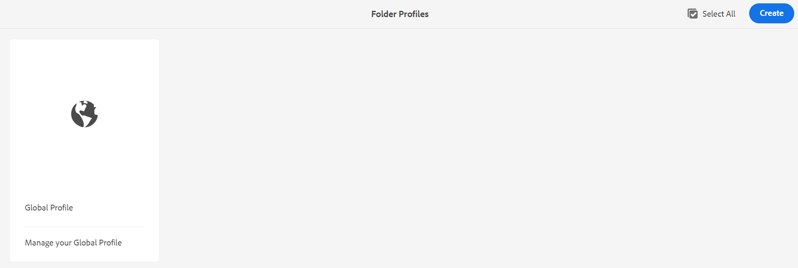
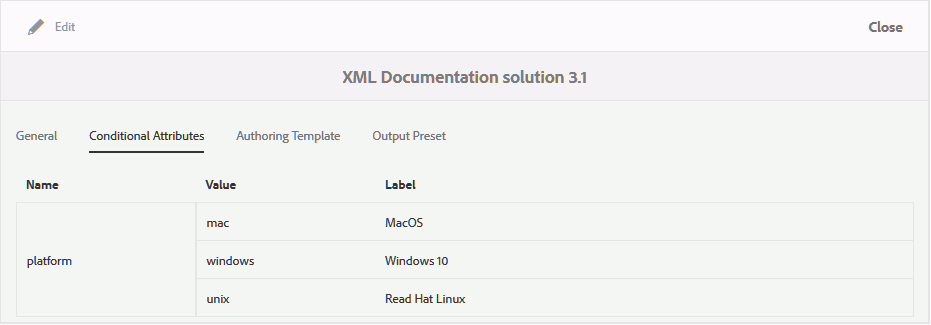
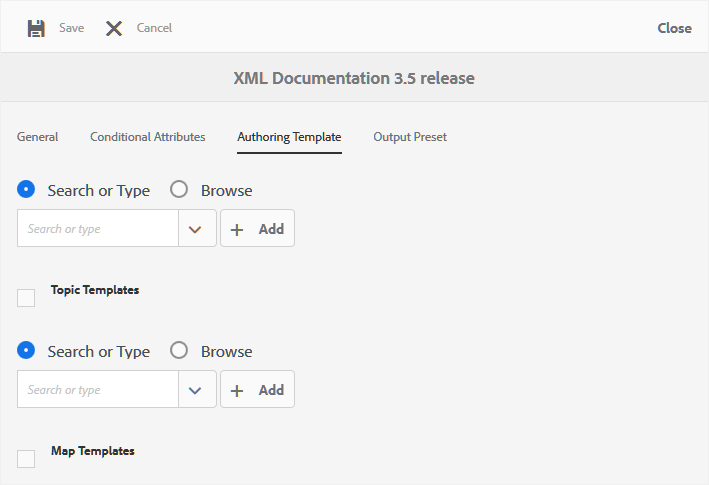
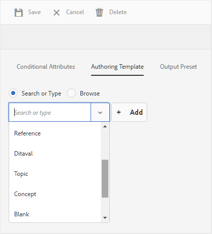
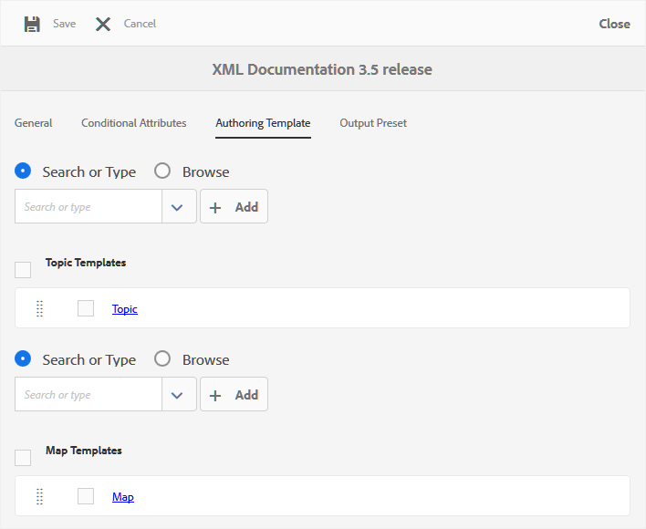

# Konfigurieren von globalen Profilen oder Profilen auf Ordnerebene {#id181AH2003PF}

In einem Unternehmen können verschiedene Gruppen oder Produkte unterschiedliche Authoring-Vorlagen, Ausgabevorlagen, bedingte Attributprofile \(oder Betreffschemata\) und Web-Editor-Konfigurationen verwenden. Wenn Sie diese nur auf Enterprise-\(oder globaler\) Ebene konfigurieren, kann dies Autorinnen und Autoren Schwierigkeiten bereiten, da sie Vorlagen oder Profile sehen, die für sie nicht relevant sind.

Mit AEM Guides können Sie die Erstellung von \(topic oder map\) Vorlagen, Ausgabevorlagen, bedingten Attributen und Web-Editor-Konfigurationen auf Enterprise \(global\)-Ebene sowie auf Ordnerebene konfigurieren. Auf diese Weise können Sie die Konfigurationen für verschiedene Abteilungen oder Produkte in Ihrem Unternehmen trennen.

Außerdem können Sie die ordnerspezifischen Konfigurationen an eine Abteilung oder Produktadministratoren delegieren, um die Administration zu dezentralisieren.

Über die Kachel Ordnerprofile in den Einstellungen für Handbücher können Sie Einstellungen auf den folgenden Registerkarten konfigurieren:

{width="800" align="left"}

- **Allgemein**: Die Registerkarte Allgemein ist nur bei der Konfiguration von Einstellungen auf Ordnerebene \(oder Projekt/Produkt\) verfügbar. Sie können Einstellungen konfigurieren, z. B. die Ordnerpfade, für die die Einstellungen gelten sollen, und Benutzer, die über Administratorrechte verfügen, um Konfigurationen zu erstellen oder zu aktualisieren.

- **Bedingte Attribute**: Verwenden Sie diese Registerkarte, um bedingte Attribute auf globaler oder Ordnerebene zu konfigurieren. Ein bedingtes Attribut ist eine Kombination aus dem Attributnamen und dem Attributwert, für die Sie auch eine Kennzeichnung definieren können. Sie können die standardmäßigen DITA-Attribute oder Ihre eigenen benutzerdefinierten Attribute verwenden. Die auf globaler Ebene definierten bedingten Attribute werden allen Benutzern in allen Projekten zur Verfügung gestellt. Wenn Sie bedingte Attribute auf Ordnerebene definiert haben, werden diese mit den global definierten bedingten Attributen zusammengeführt.

- **Autorenvorlage**: Verwenden Sie diese Registerkarte, um die Vorlagen zu konfigurieren, die Ihre Autoren zum Erstellen von DITA-Inhalten verwenden werden. Die folgenden Themenvorlagen sind standardmäßig verfügbar:

   - Glossar

   - Referenz

   - Thema

   - Konzept

   - Aufgabe

   - Fehlerbehebung

   - Leer

   - DITAVAL

  >[!NOTE]
  >
  > Sie können jede der vorhandenen Vorlagen als Basis verwenden, um neue Vorlagen zu erstellen. Die Vorlage Leere DITA enthält keine Struktur oder Elemente wie die anderen Vorlagen. Sie können jede der vordefinierten DITA-Vorlagen als Basis verwenden, Änderungen daran vornehmen und sie unter einem anderen Namen speichern. Nachdem Sie die erforderlichen Änderungen vorgenommen haben, fügen Sie die aktualisierte Vorlage zur Konfiguration globaler oder Authoring-Vorlagen auf Ordnerebene hinzu, damit sie für das Authoring verfügbar wird.

  Neben Themenvorlagen können Sie auch die Zuordnungsvorlagen definieren, die Autoren zur Verfügung gestellt werden. Die folgenden Zuordnungsvorlagen sind standardmäßig verfügbar:

   - Map

   - Bookmap

- **Ausgabevorgabe**: Ähnlich wie bei Authoring-Vorlagen gibt es fünf vorkonfigurierte Ausgabevorgaben:

   - AEM-Site

   - PDF

   - HTML5

   - EPUB

   - Benutzerdefiniert

  Publisher können diese vordefinierten Ausgabevorgaben verwenden, um Inhalte zu veröffentlichen. Diese Vorgaben können von einem Administrator des globalen Profils oder des Profils auf Ordnerebene konfiguriert werden. Nach der Konfiguration werden die Veröffentlichungsvoreinstellungen den Publishern für neu erstellte DITA-Zuordnungen zur Verfügung gestellt. Sie können auch Veröffentlichungsvorgaben auf vorhandene DITA-Zuordnungen anwenden. Weitere Informationen finden Sie unter [Anwenden ](#id18AGD0K0OHS) Vorgabenänderungen“.

- **XML-Editor-**: Auf dieser Registerkarte können Sie das Erscheinungsbild und verschiedene Funktionen des Web-Editors anpassen. Die folgenden konfigurierbaren Einstellungen sind für den Web-Editor verfügbar:

   - Konfiguration der Benutzeroberfläche des XML-Editors
   - CSS-Vorlagenlayout
   - XML-Editor-Snippets
   - Titel der XML-Inhaltsversion
   - Rootmap \(nur auf Ordnerebene\)

Sie können sowohl ein globales Profil als auch ein Profil auf Ordnerebene konfigurieren. In einem Profil auf Ordnerebene können Sie die Ordner definieren, für die die Einstellungen gelten sollen. Zu diesen Einstellungen gehören die bedingten Attribute, Authoring-Vorlagen, Ausgabevorgaben und Einstellungen des XML-Editors. Die bedingten Vorgaben, Autorenvorlagen und XML-Editor-Konfigurationen werden dann den Autoren zur Verfügung gestellt, die in den konfigurierten Ordnern arbeiten. Ebenso haben Herausgeber Zugriff auf die konfigurierten Ausgabevorgaben, die in den konfigurierten Ordnern definiert sind.

Ein Profil auf Ordnerebene überschreibt die im globalen Profil konfigurierten Einstellungen. Anders ausgedrückt: Wenn ein Ordner über ein Profil auf Ordnerebene verfügt, werden die Autorenvorlagen, Ausgabevorlagen und XML-Editor-Einstellungen angezeigt, die in seinem entsprechenden Ordnerprofil konfiguriert sind. Die im globalen Profil konfigurierten Einstellungen werden nicht angezeigt. Dies gilt jedoch nicht für die bedingten Attribute. Bei bedingten Attributen werden die bedingten Attribute auf globaler Ebene und Ordnerebene zusammengeführt.

Die folgenden Abschnitte beschreiben den Prozess der Konfiguration globaler Profile und Profile auf Ordnerebene.

## Konfigurieren eines globalen Profils

Führen Sie die folgenden Schritte aus, um das globale Profil zu konfigurieren:

1. Melden Sie sich bei Adobe Experience Manager als Administrator an.

1. Klicken Sie oben auf den Adobe Experience Manager-Link und wählen Sie **Tools** aus.

1. Wählen Sie **Guides** aus der Liste der Tools aus und klicken Sie auf **Ordnerprofile**.

   Die Seite „Ordnerprofile“ wird zum ersten Mal nur mit der Kachel „Globales Profil“ angezeigt.

   {width="800" align="left"}

1. Klicken Sie auf die **Globales Profil**-Kachel.

1. Informationen zum Konfigurieren **Bedingten Attributen** finden Sie unter [Konfigurieren von bedingten Attributen für globale Profile oder Profile auf Ordnerebene](#id1889D0I305Z).

1. Informationen zum Konfigurieren **Autorenvorlage** finden Sie unter [Konfigurieren von Autorenvorlagen](#id1889D0IL0Y4).

1. Informationen zum Konfigurieren **Ausgabevorgaben** finden Sie unter [Konfigurieren von Ausgabevorgaben](#id18AGD0IH0Y4).

1. Informationen zum Konfigurieren der XML-Editor-Konfiguration finden [ unter „Konfigurieren und Anpassen des XML-Web-Editors](#id2065G300O5Z).

1. Nachdem Sie alle erforderlichen Aktualisierungen vorgenommen haben, speichern und schließen Sie **Globales Profil**.


## Erstellen und Konfigurieren eines Profils auf Ordnerebene

Führen Sie die folgenden Schritte aus, um ein Profil auf Ordnerebene zu konfigurieren:

1. Melden Sie sich bei Adobe Experience Manager als Administrator an.

1. Klicken Sie oben auf den Adobe Experience Manager-Link und wählen Sie **Tools** aus.

1. Wählen Sie **Guides** aus der Liste der Tools aus und klicken Sie auf die Kachel **Ordnerprofile**.

   Zum ersten Mal wird die Seite „Ordnerprofile“ nur mit der standardmäßigen Kachel „Globales Profil“ angezeigt.

1. Klicken Sie auf **Erstellen**.

   {width="300" align="left"}

1. Geben Sie die folgenden Details in das Dialogfeld **Ordnerprofil erstellen** ein:
   - Name des Profilordners.
   - Pfad des Ordners, für den das Profil gelten soll.

     >[!NOTE]
     >
     > Sie können nicht mehrere Ordnerprofile auf einen Ordner anwenden. Stellen Sie sicher, dass auf den Ordner, den Sie hier auswählen, kein anderes Profil angewendet wurde. Wenn ein übergeordneter Ordner über eigene spezifische Profile verfügt, verwendet der untergeordnete Ordner die Konfigurationen aus seinem eigenen Profil. Die Konfigurationen aus dem übergeordneten Ordner überschreiben nicht die Konfigurationen eines untergeordneten Ordners.

1. Klicken Sie auf **Erstellen**.

   Auf der Seite Ordnerprofile wird eine neue Kachel mit dem Namen des Ordnerprofils erstellt

1. Klicken Sie auf die Kachel des Ordnerprofils, um es zu bearbeiten.

   Eine Registerkarte Allgemein mit dem Namen des Ordnerprofils und den konfigurierten Ordnerinformationen wird angezeigt.

1. Klicken Sie **Bearbeiten**, um mehrere Ordner und Benutzer hinzuzufügen, die administrativen Zugriff haben, um das Ordnerprofil zu ändern.

   >[!NOTE]
   >
   > Benutzende, die Sie hier hinzufügen, verfügen über Administratorrechte, um die für dieses Ordnerprofil konfigurierten bedingten Attribute, Autorenvorlagen und Ausgabevorgaben zu aktualisieren.

1. Um einen Ordner hinzuzufügen, klicken Sie auf das Symbol Durchsuchen im Ordnerpfad, navigieren Sie zu einem Ordner, wählen Sie ihn aus und klicken Sie auf Hinzufügen , um den Ordner zu diesem Profil hinzuzufügen.

   >[!NOTE]
   >
   > Stellen Sie sicher, dass dem Ordner, den Sie hier auswählen, kein anderes Profil auf Ordnerebene zugeordnet ist.

1. Um einen Benutzer hinzuzufügen, wählen Sie einen Benutzer aus der Dropdown **Liste „Admin-Benutzer** und klicken Sie auf **Hinzufügen**.

   >[!NOTE]
   >
   > Sie können dem Profilordner mehrere Benutzer aus der Dropdown-Liste hinzufügen. Sie können auch einen vorhandenen Admin-Benutzer aus der Liste entfernen, indem Sie auf das Löschsymbol neben der Benutzer-ID klicken.

1. Nachdem Sie alle erforderlichen Ordner und Benutzer zum Ordnerprofil hinzugefügt haben, klicken Sie auf **Speichern**.


Jetzt können Sie die bedingten Attribute, Authoring-Vorlagen, Ausgabevorgaben und den XML-Editor konfigurieren.

>[!IMPORTANT]
>
> Wenn Sie ein Ordnerprofil erstellen, enthält es standardmäßig keine Authoring-Vorlagen. Sie müssen die erforderlichen Authoring-Vorlagen dem Profilordner hinzufügen, um sie den Autoren verfügbar zu machen.

## Konfigurieren von bedingten Attributen für globale Profile oder Profile auf Ordnerebene {#id1889D0I305Z}

Führen Sie die folgenden Schritte aus, um standardmäßige DITA-unterstützte bedingte Attribute auf globaler oder Ordnerebene zu konfigurieren:

1. Melden Sie sich bei Adobe Experience Manager als Administrator an oder als Benutzer mit Administratorrechten für ein Profil auf Ordnerebene.

1. Klicken Sie oben auf den Adobe Experience Manager-Link und wählen Sie **Tools** aus.

1. Wählen Sie **Guides** aus der Liste der Tools aus und klicken Sie auf die Kachel **Ordnerprofile**.

1. Klicken Sie auf die Profilkachel, die Sie konfigurieren möchten.

   >[!NOTE]
   >
   > Sie können bedingte Attribute im globalen Profil oder einem Profil auf Ordnerebene konfigurieren.

1. Klicken Sie auf der Profilseite auf die Registerkarte **Bedingte Attribute** .

1. Klicken Sie auf **Bearbeiten**.

1. Klicken Sie auf **Hinzufügen**.

1. Geben Sie **Name**, **Value** und ein **Label** für das bedingte Attribut ein.

   Sie können ein Profil nur mit dem Attributnamen speichern. Ein Attribut kann jedoch nur verwendet werden, wenn für es ein Wert angegeben wurde. Wenn Sie sowohl - Wert als auch Beschriftung für ein Attribut angeben, zeigt der Web-Editor die Beschriftung des bedingten Attributs an. Außerdem wird der Titel dem Veröffentlichungs-Admin zum Zeitpunkt der Erstellung einer bedingten Vorgabe angezeigt.

   Der folgende Screenshot zeigt die Definition für das Attribut `platform` mit möglichen Werten und Beschriftungen.

   {width="650" align="left"}

1. Wenn Sie weitere Werte für dasselbe Attribut hinzufügen möchten, klicken Sie auf das Symbol **+** und geben Sie den zusätzlichen Wert und die Kennzeichnung ein.

1. Wenn Sie weitere Attribute hinzufügen möchten, klicken Sie auf **Hinzufügen**.

1. Klicken Sie auf **Speichern**.


**Benutzerdefinierte Attribute verwenden**

Wenn Sie ein benutzerdefiniertes Attribut verwenden, muss es sich um ein gültiges DITA-Attribut handeln, das von der DTD unterstützt wird. Wenn Sie ein -Attribut verwenden möchten, bei dem es sich nicht um ein Standard-DITA-Attribut handelt, führen Sie die folgenden zusätzlichen Schritte aus:

1. Fügen Sie der DTD-Datei das benutzerdefinierte Attribut hinzu. Wenn Ihre DTD-Datei beispielsweise commonElements.mod lautet, müssen Sie diese Datei im DTD-Verzeichnis suchen. Der Standardpfad der System-DTD-Datei lautet:

   /libs/fmdita/dita\_resources/DITA-1.3/dtd/base/dtd/commonElements.mod

   >[!IMPORTANT]
   >
   > Die spezialisierte DTD-Datei sollte Teil der Bereitstellung von benutzerdefiniertem Code sein. DTDs unter /etc sind Teil der Produktbereitstellung und werden daher mit der Installation jeder neuen Version überschrieben. Es wird empfohlen, im Projektordner unter /apps eine spezielle DTD hinzuzufügen und den DTD/Katalogpfad in das DITA-Profil aufzunehmen. Weitere Informationen finden Sie unter [Integrieren der DITA-Spezialisierung](dita-ot-specialization.md#id211MB0E00XA).

1. Öffnen Sie die Seite Konfiguration der Adobe Experience Manager-Web-Konsole .

1. Suchen Sie nach dem Bundle *com.adobe.fmdita.config.ConfigManager* und klicken Sie darauf.

1. Speichern Sie die Konfiguration.

   Dadurch wird der Systemcache gelöscht.

1. Navigieren Sie zur Datei „condAttrList.xml“, die am folgenden Speicherort verfügbar ist:

   /libs/fmdita/config/condAttrList.xml

1. Erstellen Sie einen Überlagerungsknoten des `config` Ordners im `apps`.

1. Navigieren Sie zu und fügen Sie die benutzerdefinierten Attribute zur Datei „condAttrList.xml“ im `apps` hinzu:

   `/apps/fmdita/config/condAttrList.xml`

1. Speichern Sie die Datei.

1. Hinzufügen benutzerdefinierter Attribute zum globalen Profil oder Profil auf Ordnerebene.


## Konfigurieren von Authoring-Vorlagen {#id1889D0IL0Y4}

AEM Guides verfügt über sieben vordefinierte Authoring-Vorlagen und zwei DITA-Zuordnungsvorlagen. Sie können festlegen, dass nur wenige Vorlagen für Ihre Autoren verfügbar sind. Wenn Sie eine benutzerdefinierte Vorlage verwenden, kann diese konfiguriert und für das Authoring verfügbar gemacht werden. In der Konfiguration von Ordnerprofilen können Sie auf der Registerkarte Authoring-Vorlage Themen- oder Zuordnungsvorlagen zu globalen Profilen oder Profilen auf Ordnerebene hinzufügen oder entfernen.

Selbst vor dem Konfigurieren der Themen- oder Zuordnungsvorlagen auf globaler oder Ordnerebene können Sie auch einen Speicherort für Ihre benutzerdefinierten Authoring-Vorlagen definieren. Informationen zum Konfigurieren eines benutzerdefinierten Speicherorts für Authoring-Vorlagen finden Sie unter [Konfigurieren des benutzerdefinierten DITA-Vorlagenordnerpfads](conf-template-tags-custom-dita-topic-template.md#id191LCF0095Z).

Führen Sie die folgenden Schritte aus, um das Thema oder die Zuordnungsvorlagen zu einem Profilordner hinzuzufügen:

1. Melden Sie sich bei Adobe Experience Manager als Administrator an oder als Benutzer mit Administratorrechten für ein Profil auf Ordnerebene.

1. Klicken Sie oben auf den Adobe Experience Manager-Link und wählen Sie **Tools** aus.

1. Wählen Sie **Guides** aus der Liste der Tools aus und klicken Sie auf die Kachel **Ordnerprofile**.

1. Klicken Sie auf die Profilkachel, die Sie konfigurieren möchten.

   >[!NOTE]
   >
   > Sie können die Autorenvorlage im globalen Profil oder einem Profil auf Ordnerebene konfigurieren.

1. Klicken Sie auf der Profilseite auf die Registerkarte **Autorenvorlage**.
1. Klicken Sie auf **Bearbeiten**.

   Sie erhalten die Optionen zum Hinzufügen von Themen- und Zuordnungsvorlagen, indem Sie vom Standardspeicherort aus suchen oder danach suchen.

   >[!NOTE]
   >
   > Standardmäßig werden alle Authoring-Vorlagen im Ordner /content/dam/dita-templates gespeichert. Der Ordner `dita-templates` enthält `topics` und `maps` Unterordner zum Speichern des Themas und der Zuordnungsvorlagen. Sie können Ihre benutzerdefinierten Vorlagen (\.dita, .xml oder .ditamapfiles\) in den Standardvorlagenordnern hinzufügen. Nachdem Sie Ihre Vorlage zum Standardordner hinzugefügt haben, können Sie sie zum globalen Ordner oder zum Profilordner hinzufügen. Weitere Informationen zum Erstellen benutzerdefinierter Vorlagen mit dem Web-Editor finden Sie unter [Erstellen einer benutzerdefinierten Authoring-Vorlage](#id1917D0EG0HJ).

   {width="550" align="left"}

1. Fügen Sie das erforderliche Thema hinzu und ordnen Sie Vorlagen Ihrem Profil zu.

   Um eine Vorlage hinzuzufügen, führen Sie einen der folgenden Schritte aus:

   - Wählen Sie **Suchen oder**) und geben Sie den Namen einer Vorlage in der Dropdown-Liste ein, oder wählen Sie ihn aus. Die Dropdown-Liste besteht aus allen Standardvorlagen und allen neuen Vorlagen, die Sie erstellt haben.

     {width="350" align="left"}

   - Klicken Sie **Durchsuchen** und wählen Sie eine Vorlage aus DAM aus.

1. Klicken Sie auf **Hinzufügen**.

   Die ausgewählten Vorlagen werden der Vorlagenliste hinzugefügt.

   {width="550" align="left"}

   >[!NOTE]
   >
   > Sie können die Reihenfolge der Vorlagen ändern, indem Sie sie an die gewünschte Position in der Liste ziehen und dort ablegen. Die Position von Vorlagen steuert die Reihenfolge, in der sie auf der Blueprint-Seite im Arbeitsablauf zur Erstellung von Themen oder Karten angezeigt werden.

1. Klicken Sie auf **Speichern**.


Falls Sie die Vorlagen in einem Profil auf Ordnerebene konfiguriert haben, werden die konfigurierten Vorlagen mit dem konfigurierten Ordner verknüpft. Alle Projekte, die im konfigurierten Ordner erstellt wurden, haben nur Zugriff auf die Vorlagen, die im Profil auf Ordnerebene konfiguriert sind.

## Erstellen einer benutzerdefinierten Authoring-Vorlage {#id1917D0EG0HJ}

AEM Guides bietet eine einfache Möglichkeit zum Erstellen von Authoring-Vorlagen. Als Systemadministrator können Sie den Web-Editor verwenden, um neue Authoring-Vorlagen zu erstellen. Anschließend können Sie die neue Vorlage im globalen Profil hinzufügen oder sie mithilfe des ordnerspezifischen Profils einem bestimmten Ordner zuweisen.

Führen Sie die folgenden Schritte aus, um eine benutzerdefinierte Authoring-Vorlage zu erstellen:

1. Melden Sie sich bei Adobe Experience Manager als Administrator an.

1. Navigieren Sie in der Assets-Benutzeroberfläche zu dem Ordner, der zum Speichern der Vorlagendateien konfiguriert wurde. Standardmäßig werden alle Themenvorlagen im Ordner /content/dam/dita-templates/topics gespeichert.

   >[!NOTE]
   >
   > Informationen zum Konfigurieren eines benutzerdefinierten Speicherorts für Themen- oder Zuordnungsvorlagen finden Sie unter [Konfigurieren eines benutzerdefinierten DITA-Vorlagenordnerpfads](conf-template-tags-custom-dita-topic-template.md#id191LCF0095Z)

1. Klicken Sie **Erstellen** \> **DITA-Vorlage**.

1. Wählen Sie auf der Blueprint-Seite den Typ der zu erstellenden DITA-Themenvorlage aus.

   >[!NOTE]
   >
   > Sie können die leere Vorlage verwenden, um von Grund auf neu zu beginnen. Die leere Vorlage enthält keine Struktur oder Elemente.

1. Klicken Sie auf **Weiter**.

1. Geben Sie auf der Seite „Eigenschaften“ der neuen Vorlage **Titel**, **Name** und **Beschreibung** für die Vorlage ein.

   >[!NOTE]
   >
   > Der Name wird automatisch auf Grundlage des Titels der Vorlage vorgeschlagen. Wenn Sie den Namen manuell angeben möchten, stellen Sie sicher, dass der Name keine Leerzeichen, Apostrophe oder geschweifte Klammern enthält und mit &quot;.dita“ endet.

1. *\(Optional\)* Klicken Sie auf die Schaltfläche **Miniatur hinzufügen**, um eine Miniatur zu suchen und auszuwählen, die mit Ihrer Vorlage verknüpft werden soll.

1. Klicken Sie auf **Erstellen**.

   Die Meldung Thema erstellt wird angezeigt.

   Sie können die Vorlage zur Bearbeitung im Web-Editor öffnen oder die Vorlagendatei im Vorlagenspeicher speichern. Nachdem die Vorlage erstellt wurde, können Sie den Web-Editor verwenden, um die Vorlage gemäß Ihren Authoring-Anforderungen anzupassen. Nachdem Sie eine Vorlage eingerichtet haben, stellen Sie sicher, dass Sie sie entweder mit einem globalen Profil oder einem Profil auf Ordnerebene verknüpfen.


## Konfigurieren von Ausgabevorgaben {#id18AGD0IH0Y4}

In einem typischen Unternehmens-Setup können für verschiedene Produkte oder Benutzerhandbücher verschiedene Ausgabedarstellungen verwendet werden. Darüber hinaus könnte es einige gemeinsame Output-Generierungsprozesse geben, die von allen Herausgebern verwendet werden sollten, sowie eine Reihe spezifischer Output-Generierungsprozesse für eine bestimmte Gruppe von Herausgebern oder Projekten.

AEM Guides ermöglicht es dem Administrator, Ausgabevorgaben mit bestimmten Einstellungen zu erstellen, die dann von allen oder einer bestimmten Gruppe von Herausgebern verwendet werden können, um Ausgaben zu generieren. Beispielsweise kann der Administrator eine Ausgabevorgabe erstellen, um ein Benutzerhandbuch zu generieren, das für alle Herausgeber gilt. Und eine weitere Möglichkeit, die Programmierung von Benutzerhandbüchern zu erstellen, die für eine Reihe von Herausgebern spezifisch sind. Beide Vorgaben können so konfiguriert werden, dass verschiedene Ausgabevorlagen verwendet werden. In diesem Beispiel kann die allgemeine Veröffentlichungsvorgabe zum Generieren des Benutzerhandbuchs auf globaler Ebene konfiguriert werden. Außerdem kann die Ausgabevorgabe zum Generieren der Programmierhandbücher auf Ordnerebene konfiguriert werden.

Nachdem die standardmäßigen Ausgabevorgaben im System erstellt wurden, verwenden alle danach erstellten DITA-Zuordnungen die Standardvorgaben, um eine Ausgabe zu generieren. Alle vorhandenen DITA-Zuordnungen würden jedoch weiterhin die zuvor mit ihnen konfigurierten Ausgabevorgaben verwenden. Wenn Sie die neue Ausgabevorgabe auf alle vorhandenen DITA-Zuordnungen anwenden möchten, müssen Sie den Workflow „Vorgabenänderungen anwenden“ ausführen.

Zusätzlich zu den auf globaler oder Unternehmensebene konfigurierten Vorgaben hätte ein Herausgeber weiterhin die Berechtigung, weitere Ausgabevorgaben zu erstellen. Diese Vorgaben sind jedoch an die DITA-Zuordnung gebunden, für die sie erstellt werden. Weitere Informationen zum Erstellen regulärer Ausgabevorgaben für eine DITA-Zuordnung finden Sie unter *Erstellen, Bearbeiten, Duplizieren oder Entfernen einer Ausgabevorgabe* im Abschnitt *Verwenden von Adobe Experience Manager Guides*.

Führen Sie die folgenden Schritte aus, um globale oder ordnerspezifische Ausgabevorgaben zu konfigurieren:

1. Melden Sie sich bei Adobe Experience Manager als Administrator an oder als Benutzer mit Administratorrechten für ein ordnerspezifisches Profil.

1. Klicken Sie oben auf den Adobe Experience Manager-Link und wählen Sie **Tools** aus.

1. Wählen Sie **Guides** aus der Liste der Tools aus und klicken Sie auf die Kachel **Ordnerprofile**.

1. Klicken Sie auf die Profilkachel, die Sie konfigurieren möchten.

   >[!NOTE]
   >
   > Sie können Ausgabevorgaben im globalen Profil oder in einem ordnerspezifischen Profil konfigurieren.

1. Auf der Profilseite. Klicken Sie auf die Registerkarte **Ausgabevorgaben**.

   Es wird eine Liste mit vordefinierten Ausgabevorgaben angezeigt, darunter AEM-Site, PDF, HTML5, EPUB und BENUTZERDEFINIERT.

1. Führen Sie einen der folgenden Schritte aus, um eine Ausgabevorgabe zu erstellen oder zu bearbeiten:

   - Klicken Sie **Erstellen**, um eine neue Ausgabevorgabe von Grund auf zu erstellen.
   - Klicken Sie auf Duplizieren , um eine Kopie der ausgewählten Ausgabevorgabe zu erstellen. Sie können Änderungen an der doppelten Vorgabe vornehmen und sie speichern.

   - Klicken Sie **Bearbeiten**, um die Konfiguration der ausgewählten Vorgabe zur Bearbeitung zu öffnen.

     Weitere Informationen zu Ausgabevorgabeneinstellungen finden Sie unter *Grundlagen zu Ausgabevorgaben* im Abschnitt Verwenden von Adobe Experience Manager Guides.

1. Klicken Sie **Speichern**, um die Voreinstellungen zu speichern.


Alle DITA-Zuordnungen, die nach diesem Schritt erstellt oder hochgeladen werden, haben die neue oder aktualisierte Ausgabevorgabe.

## Vorgabenänderungen anwenden {#id18AGD0K0OHS}

Eine neue, auf globaler Ebene erstellte Ausgabevorgabe steht allen neuen DITA-Zuordnungen zur Verfügung, die Sie in Zukunft erstellen. Wenn eine neue Ausgabevorgabe auf Ordnerebene erstellt wird, wird diese Vorgabe auch für alle Zuordnungen verfügbar gemacht, die im konfigurierten Ordner erstellt werden. Standardmäßig ist keine neue Ausgabevorgabe für eine vorhandene DITA-Zuordnung verfügbar.

Wenn Sie eine vorhandene Ausgabevorgabe aktualisiert haben oder eine neue Ausgabevorgabe für vorhandene DITA-Zuordnungen verfügbar machen möchten, führen Sie die folgenden Schritte aus:

1. Melden Sie sich bei Adobe Experience Manager als Administrator an oder als Benutzer mit Administratorrechten für ein ordnerspezifisches Profil.

1. Klicken Sie oben auf den Adobe Experience Manager-Link und wählen Sie **Tools** aus.

1. Wählen Sie **Guides** aus der Liste der Tools aus und klicken Sie auf die Kachel **Ordnerprofile**.

1. Klicken Sie auf die Profilkachel, die Sie konfigurieren möchten.

   >[!NOTE]
   >
   > Sie können Ausgabevorgaben im globalen Profil oder in einem ordnerspezifischen Profil konfigurieren.

1. Auf der Profilseite. Klicken Sie auf die Registerkarte **Ausgabevorgaben**.

   Es wird eine Liste mit vordefinierten Ausgabevorgaben angezeigt, darunter AEM-Site, PDF, HTML5, EPUB und BENUTZERDEFINIERT.

1. Wählen Sie die Ausgabevorgabe aus, die Sie auf vorhandene DITA-Zuordnungen anwenden möchten.

1. Klicken Sie **der Hauptsymbolleiste auf** Vorgabenänderungen übernehmen“.

1. Im Dialogfeld Vorgabenänderungen anwenden stehen folgende Optionen zur Verfügung:

   - **Auswahl der Option „Vorhandene Vorgabe überschreiben**: Wenn Sie diese Option auswählen, werden alle Aktualisierungen, die Sie in den vorhandenen Ausgabevorgaben vorgenommen haben, die Einstellungen in allen vorhandenen DITA-Zuordnungen überschreiben, in denen diese Vorgabe verwendet wird. Dies führt jedoch zum Verlust aller vorhandenen bedingten Voreinstellungs- und Baseline-Informationen, die mit der Zuordnung verknüpft sind.

   - **Auswahl der Option „Vorhandene Vorgabe überschreiben**: Wenn Sie diese Option nicht auswählen, wirken sich Aktualisierungen, die Sie in den vorhandenen Ausgabevorgaben vorgenommen haben, nicht auf die vorhandenen DITA-Zuordnungen aus. Nur die neu hinzugefügten Vorgaben werden zu den vorhandenen DITA-Zuordnungen hinzugefügt. Beachten Sie, dass die neu erstellte DITA-Zuordnung sowohl die aktualisierten Ausgabevorgaben als auch die neu hinzugefügten Vorgaben erhält.

1. Klicken Sie **OK**, um Änderungen aus den ausgewählten Ausgabevorgaben auf alle vorhandenen DITA-Zuordnungen anzuwenden.


## Konfigurieren und Anpassen des XML-Web-Editors {#id2065G300O5Z}

Standardmäßig verfügt der XML-Web-Editor über viele Funktionen, die Ihre Autoren beim Erstellen von DITA-Dokumenten unterstützen. Wenn Sie in einer eingeschränkten Umgebung arbeiten, können Sie auswählen, welche Funktionen für Ihre Autoren verfügbar sein sollen. Auf der Registerkarte Konfiguration des XML-Editors können Sie die Funktionen einfach steuern und das Erscheinungsbild Ihres Web-Editors ändern. Als Admin können Sie die folgenden Komponenten des Web-Editors anpassen:

**Konfiguration der Benutzeroberfläche des XML-Editors**

Diese Einstellung steuert die Symbolleiste und die anderen Elemente der Benutzeroberfläche des Web-Editors. Klicken Sie auf **Herunterladen**, um die neueste ui\_config.json-Datei auf Ihr lokales System herunterzuladen. Sie können dann Änderungen an der Datei vornehmen und die Datei auf die gleiche Weise hochladen. Klicken Sie auf **Standard herunterladen**, um die Standarddatei ui\_config.json auf Ihr lokales System herunterzuladen. Sie können die Standarddatei jederzeit herunterladen, ändern und hochladen. Je nachdem, wo Sie die Datei hochladen, ob global oder auf Ordnerebene, werden die Änderungen entsprechend angewendet. Weitere Informationen zum Anpassen des XML-Editors mithilfe der Datei ui\_config.json finden Sie unter [Symbolleiste anpassen](conf-web-editor-customize-toolbar.md#).

**CSS-Vorlagenlayout**

Laden Sie die in diesem Abschnitt verfügbare Datei herunter, um das Erscheinungsbild des Dokuments anzupassen, wenn es in der Vorschau angezeigt oder im Web-Editor zur Bearbeitung geöffnet wird. Die standardmäßig zum Herunterladen verfügbare CSS-Datei ist nur eine Testdatei, die nicht für die Anpassung verwendet werden sollte. Sie können eine CSS-Datei mit Anpassungen für den Web-Editor erstellen und diese hochladen. Sie können beispielsweise eine CSS-Datei mit folgendem Code erstellen:

```css
.title {    font-size: 9em;}
```

Speichern Sie diese Datei und laden Sie sie in den Abschnitt CSS-Vorlagenlayout hoch. Wenn Sie die Datei das nächste Mal herunterladen, erhalten Sie die neueste CSS-Datei, die im Web-Editor verwendet wird.

**XML-Editor-Snippets**

Mithilfe der Konfigurationsdatei in diesem Abschnitt können Sie einige Standard-Snippets erstellen und sie für Ihre Autoren und Autorinnen freigeben. Die Standardstruktur der Datei ist unten angegeben:

```css
{
   "snippetID": {
      "name": "snippet Name",
      "description": "snippet Description",
      "value": "<i>this is snippet value</i>"
  }
}
```

Die folgenden Details sind erforderlich, um einen Ausschnitt zu erstellen:

- **snippetID:**   Eine eindeutige ID für den Ausschnitt. Sie kann einen alphanumerischen Wert annehmen.

- **name:**   Ein beschreibender Name zur Identifizierung des Snippets. Dieser Name wird im Bedienfeld „Snippets“ angezeigt.

- **Beschreibung:**   Fügen Sie eine Beschreibung des Ausschnitts hinzu.

- **Wert:**   Geben Sie den XML-Code des Ausschnitts an.

>[!NOTE]
>
> Sie können weitere Snippets hinzufügen, indem Sie ein Komma \(,\) am Ende Ihrer Snippet-Definition hinzufügen und dieselbe Struktur für den nächsten Snippet wiederholen.

**Beschriftungen für XML-Inhaltsversionen**

Standardmäßig können Autoren Beschriftungen ihrer Wahl erstellen und sie mit ihren Themendateien verknüpfen. Dies kann jedoch zu vielen Varianten derselben Bezeichnung führen. Beispielsweise könnte es Beschriftungen für „Version 1.0“, „Version 1.0“ oder „Version 1“ geben, um denselben Themenabschnitt zu identifizieren. Um eine solche inkonsistente Beschriftung im System zu vermeiden, können Sie eine vordefinierte Liste von Beschriftungen erstellen, aus denen Autorinnen und Autoren dann auswählen können. Eine konsistente Beschriftung hilft bei der besseren Verwaltung von Dateien in Ihrem System.

Mit der Konfiguration der Versionskennzeichnung können Sie eine Liste gültiger Kennzeichnungen für Ihre Organisation hochladen. Laden Sie die Standarddatei label.json herunter und ändern Sie sie wie unten dargestellt:

```css
{
"label1":"Draft",
"label2":"PM-Review",
"label3":"Engg-Review",
"label4":"QE-Review",
"label5":"Ready for Loc",
"label6":"Ready for Publish"
}
```

Im obigen Beispiel ist „label1“ der Bezeichner für die Titelsequenz und wird an die Beschriftung angehängt, die den Autoren überall dort angezeigt wird, wo eine Beschriftung erforderlich ist. Speichern Sie diese Datei und laden Sie sie in den Abschnitt Titel der XML-Inhaltsversion hoch.

>[!IMPORTANT]
>
> Damit Konfigurationen auf Ordnerebene wirksam werden, müssen Benutzerinnen und Benutzer das Profil unter ihren Benutzereinstellungen im Web-Editor auswählen.

**Rootmap**

Wenn Ihre Autoren mit einer bestimmten Stammzuordnung arbeiten, können Sie zu navigieren und diese Stammzuordnung hier auswählen. Beachten Sie, dass Sie die Rootmap nur für ein Profil auf Ordnerebene definieren können.
