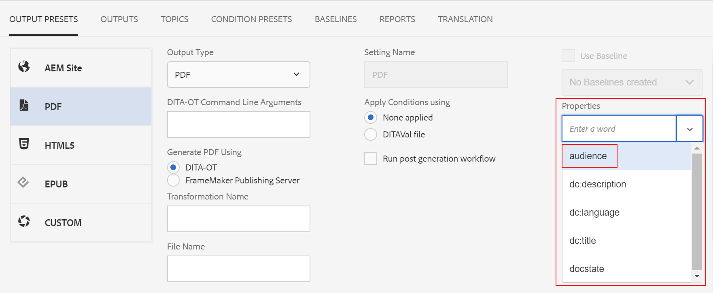

# Einstellungen für die Ausgabegenerierung konfigurieren {#id181AI0B0E30}

AEM Guides bietet viele Konfigurationsoptionen, mit denen Sie den Prozess der Ausgabenerstellung anpassen können. In diesem Abschnitt werden alle Konfigurationen und Anpassungen behandelt, die Ihnen beim Einrichten des Prozesses der Ausgabenerstellung helfen.

## Konfigurieren der Registerkarte „Baseline“ im Dashboard „DITA-Zuordnung“ {#id223MD0D0YRM}

Sie können die Registerkarte Baseline , die im Karten-Dashboard verfügbar ist, konfigurieren und ausblenden.

Die **Registerkarte Baseline ausblenden** ist nicht standardmäßig aktiviert. Sie müssen diese Option daher im configMgr aktivieren. Führen Sie die folgenden Schritte aus, um die Option im Web-Editor standardmäßig zu aktivieren:

1. Öffnen Sie die Seite Konfiguration der Adobe Experience Manager-Web-Konsole .

   Die Standard-URL für den Zugriff auf die Konfigurationsseite lautet:

   ```http
   http://<server name>:<port>/system/console/configMgr
   ```

1. Suchen Sie nach dem Bundle **com.adobe.fmdita.config.ConfigManager** und klicken Sie darauf.

1. Wählen Sie die Option **Registerkarte „Grundlinie ausblenden** aus.

1. Klicken Sie auf **Speichern**.

   >[!NOTE]
   >
   > Diese Konfiguration ist standardmäßig deaktiviert und die Registerkarte Baseline ist im Zuordnungs-Dashboard verfügbar.


## FrameMaker Publishing Server konfigurieren {#id1678G0Z0TN6}

Sie können FrameMaker Publishing Server \(FMPS\) verwenden, um eine Ausgabe für Ihren DITA-Inhalt zu generieren. Durch die Konfiguration von FMPS können Sie Ausgaben in mehreren Formaten generieren, die von FMPS unterstützt werden.

>[!NOTE]
>
> Um eine Ausgabe mithilfe von FMPS zu generieren, müssen Sie den FMPS-Server einrichten. Informationen zur Installation und Konfiguration finden Sie im FrameMaker Publishing Server-Benutzerhandbuch.

Um AEM Guides für die Verwendung von FMPS zu konfigurieren, aktualisieren Sie die folgenden Eigenschaften des `com.adobe.fmdita.config.ConfigManager`-Bundles in der Web-Konsole.

>[!NOTE]
>
> Greifen Sie auf die URL http://&lt;Server-Name>:&lt;Port>/system/console/configMgr zu, um die Web-Konsole zu öffnen.

| Eigenschaft | Beschreibung |
|--------|-----------|
| FrameMaker Publishing Server-Anmeldedomäne | Geben Sie den Domain-Namen oder den Arbeitsgruppennamen an, auf dem die FrameMaker Publishing Server gehostet wird. Geben Sie basierend auf der FMPS-Version den Domain-Namen wie folgt an:-   **FMPS 2020**: IP-Adresse als 192.168.1.101 <br>- **FMPS 2019 und früher**: IP-Adresse oder der Domain-Name |
| FrameMaker Publishing Server-URL | Geben Sie die URL der FrameMaker Publishing Server an. Geben Sie basierend auf der FMPS-Version die FMPS-URL als: <br>- **FMPS 2020**: `http://<fmps_ip>:<port>` \(http://192.168.1.101:7000\) <br> - **FMPS 2019 und früher**: `http://<fmps_ip>:<port>/fmserver/v1/` |
| FMPS-Version | Geben Sie die Versionsnummer der FrameMaker Publishing Server an. Geben Sie basierend auf der FMPS-Version die Versionsinformationen wie folgt an: <br>- **FMPS 2020**: 2020 <br> - **FMPS 2019 und früher**: 2019 oder 2017 |
| FrameMaker Publishing Server Benutzername und Kennwort | Geben Sie den Benutzernamen und das Kennwort für den Zugriff auf die FrameMaker Publishing Server an. |
| FMPS-Zeitüberschreitung | \(*Optional*\) Geben Sie die Zeit \(in Sekunden\) an, für die AEM Guides auf eine Antwort von der FrameMaker Publishing Server wartet. Wenn in der angegebenen Zeit keine Antwort eingeht, beendet AEM Guides die Veröffentlichungsaufgabe und die Aufgabe wird als fehlgeschlagen markiert. <br> Standardwert: 300 Sekunden \(5 Minuten\) |
| External AEM URL | *\(Optional\)* Die AEM-URL, an der die generierten Ausgabedateien auf der FrameMaker Publishing Server abgelegt werden. Zum Beispiel: `http://<server-name>:<port>/`. |
| AEM-Admin-Benutzername und -Kennwort | *\(Optional\)* Benutzername und Kennwort eines Administrators Ihres AEM-Setups. Dies wird von FrameMaker Publishing Server zur Kommunikation mit AEM verwendet. |
| Wartezeit bei FMPS-Aufgabenausführung | Diese Einstellung gilt nur für FMPS 2020. Geben Sie die Zeit \(in Sekunden\) an, nach der FMPS nicht mehr auf die Ausführung dieses Prozesses wartet. |

## Konfigurieren von gemischten Veröffentlichungen innerhalb einer bestehenden AEM-Site {#id1691I0V0MGR}

Wenn Sie über eine AEM-Site verfügen, die DITA-Inhalte enthält, können Sie die Ausgabe Ihrer AEM-Site so konfigurieren, dass DITA-Inhalte an einem vordefinierten Speicherort innerhalb Ihrer Site veröffentlicht werden. Im folgenden Screenshot einer AEM Site-Seite ist beispielsweise der Knoten `ditacontent` für das Speichern von DITA-Inhalten reserviert:

{width="300" align="left"}

Die verbleibenden Knoten auf der Seite werden direkt aus dem AEM-Site-Editor erstellt. Das Konfigurieren der Veröffentlichungseinstellung zum Veröffentlichen von DITA-Inhalten an einem vordefinierten Speicherort stellt sicher, dass keiner Ihrer vorhandenen Nicht-DITA-Inhalte durch den AEM Guides-Veröffentlichungsprozess geändert wird.

Sie müssen die folgenden Konfigurationen auf Ihrer vorhandenen Site durchführen, um die Veröffentlichung von DITA-Inhalten in einem vordefinierten Knoten zu ermöglichen:

- Konfigurieren der Vorlageneigenschaften Ihrer Site

- Hinzufügen von Knoten zur Site, um DITA-Inhalte zu veröffentlichen


Führen Sie die folgenden Schritte aus, um die Vorlageneigenschaften Ihrer vorhandenen Site zu konfigurieren:

1. Melden Sie sich bei AEM an und öffnen Sie den CRXDE Lite-Modus.

1. Navigieren Sie zum Vorlagenkonfigurationsknoten Ihrer Site. Beispielsweise speichert AEM Guides die standardmäßigen Vorlagenkonfigurationen im folgenden Knoten:

   `/libs/fmdita/config/templates/default`

   >[!NOTE]
   >
   > Nehmen Sie keine Anpassungen in den Standardkonfigurationsdateien im Knoten `libs` vor. Sie müssen eine Überlagerung des Knotens `libs` im Knoten `apps` erstellen und die erforderlichen Dateien nur im Knoten `apps` aktualisieren.

1. Fügen Sie die folgenden Eigenschaften hinzu:

   | Eigenschaftsname | Typ | Wert |
   |-------------|----|-----|
   | `topicContentNode` | Zeichenfolge | Geben Sie den Knotennamen an, in dem der DITA-Inhalt veröffentlicht werden soll. Der Standardknoten, auf dem AEM Guides DITA-Inhalte veröffentlicht, lautet beispielsweise: <br>`jcr:content/contentnode` |
   | `topicHeadNode` | Zeichenfolge | Geben Sie den Knotennamen an, in dem die Metadateninformationen Ihres DITA-Inhalts gespeichert werden sollen. Der Standardknoten, in dem AEM Guides Metadateninformationen speichert, lautet beispielsweise: <br>`jcr:content/headnode` |


Der folgende Screenshot zeigt die Eigenschaften, die im Standardvorlagenknoten von AEM Guides hinzugefügt wurden:

{width="800" align="left"}

Wenn Sie das nächste Mal DITA-Inhalte mithilfe der Vorlagenkonfigurationen Ihrer Site veröffentlichen, werden die Inhalte in den Knoten veröffentlicht, die in den `topicContentNode`- und `topicHeadNode` angegeben sind.

Bei vorhandenen Sites müssen Sie jedoch die Knoten `topicContentNode` und `topicHeadNode` manuell hinzufügen.

Führen Sie die folgenden Schritte aus, um die erforderlichen Knoten zu Ihrer vorhandenen Site hinzuzufügen:

1. Melden Sie sich bei AEM an und öffnen Sie den CRXDE Lite-Modus.

1. Suchen Sie `jcr:content` in Ihrem Site-Knoten.

1. Fügen Sie `topicContentNode`- und `topicHeadNode`-Knoten mit demselben Namen hinzu, den Sie in den Vorlagenkonfigurationen der Site angegeben haben.


## AEM-Site-Ausgabe anpassen {#id166TG0B30WR}

AEM Guides unterstützt das Erstellen von Ausgaben in folgenden Formaten:

- AEM-Site

- PDF

- HTML5
- EPUB
- Benutzerdefinierte Ausgabe über DITA-OT

Für die Ausgabe der AEM-Site können Sie verschiedene Design-Vorlagen mit verschiedenen Ausgabeaufgaben zuweisen. Diese Design-Vorlagen können den DITA-Inhalt in verschiedenen Layouts rendern. Sie können beispielsweise verschiedene Design-Vorlagen für interne und externe Zielgruppen angeben.

Sie können auch benutzerdefinierte DITA Open Toolkit \(DITA-OT\)-Plug-ins mit AEM Guides verwenden. Sie können diese benutzerdefinierten DITA-OT-Plug-ins hochladen, um eine bestimmte PDF-Ausgabe zu generieren.

>[!TIP]
>
> Best Practices für die Erstellung von AEM *Site-Ausgaben finden Sie im Abschnitt [0&rbrace;AEM-Site-Veröffentlichung](appendix.md#) im Handbuch zu Best Practices..md\#.*

### Anpassen der Design-Vorlage für die Generierung von Ausgaben {#customize_xml-add-on}

AEM Guides verwendet eine Reihe vordefinierter Design-Vorlagen, um die Ausgabe der AEM-Site zu generieren. Sie können die Design-Vorlagen von AEM Guides anpassen, um die Ausgabe zu generieren, die Ihrem Unternehmens-Branding entspricht. Eine Design-Vorlage ist eine Sammlung verschiedener Stile \(CSS\), Skripte \(Server- und Client-seitig\), Ressourcen \(Bilder, Logos und andere Assets\) und JCR-Knoten, die alle diese Ressourcen miteinander verbinden. Eine Design-Vorlage kann so einfach sein wie ein einzelnes Server-seitiges Skript mit nur einigen JCR-Knoten oder eine komplexe Kombination aus Stilen, Ressourcen und JCR-Knoten. Design-Vorlagen werden vom AEM Guides-Veröffentlichungs-Subsystem beim Generieren der AEM-Site-Ausgabe verwendet und steuern die Struktur, das Erscheinungsbild der generierten Ausgabe.

Es gibt keine Einschränkung bezüglich des Speicherorts der Ressourcen der Design-Vorlage auf dem Server, sie sind jedoch in der Regel gemäß ihrer Funktion logisch organisiert. Beispielsweise werden bei der Standardvorlage alle JavaScript- und CSS-Dateien im Ordner `/etc/designs/fmdita/clientlibs/siteoutput/default` gespeichert. Wo auch immer sich diese Dateien befinden, sie sind durch eine Sammlung von JCR-Knoten miteinander verknüpft. Zusammen bilden diese JCR-Knoten und die Dateien die gesamte Design-Vorlage.

Mit der im Lieferumfang von AEM Guides enthaltenen standardmäßigen Design-Vorlage können Sie die Komponenten für Landingpages, Themen und Suchseiten anpassen. Sie können eine Kopie des Standarddesigns und der entsprechenden Referenzvorlagen erstellen und verschiedene Komponenten angeben, um die gewünschte Ausgabe zu generieren.

Führen Sie die folgenden Schritte aus, um Ihre eigene Design-Vorlage anzugeben, die für die Generierung der AEM-Site-Ausgabe verwendet werden soll:

1. Melden Sie sich bei AEM an und öffnen Sie den CRXDE Lite-Modus.

1. Navigieren Sie zum Knoten für die Standardentwurfsvorlage. Der standardmäßige Design-Vorlagenknoten befindet sich hier:

   `/libs/fmdita/config/templates/`

   {width="300" align="left"}

   >[!NOTE]
   >
   > Erstellen Sie eine Kopie der standardmäßigen Design-Vorlagen aus dem Ordner `libs` in den Ordner `apps` und nehmen Sie Änderungen im Ordner `apps` vor. Sie müssen auch Änderungen an den Vorlagen vornehmen, auf die vom Standardvorlagenknoten verwiesen wird. Die referenzierten Vorlagen werden unter `/libs/fmdita/templates/default/cqtemplates` Knoten platziert. Erstellen Sie eine Kopie der referenzierten Vorlagen im `apps` Ordner, bevor Sie Änderungen vornehmen.

1. Klicken Sie auf die *Standard*-Komponente im *Vorlagen*-Knoten, um auf ihre Eigenschaften zuzugreifen.

   Die Eigenschaften der Design-Vorlage von AEM Guides werden in der folgenden Tabelle beschrieben.

   | Eigenschaft | Beschreibung |
   |--------|-----------|
   | `landingPageTemplate`, `searchPageTemplate`, `topicPageTemplate`, `shadowPageTemplate` | Geben Sie den `cq:Template` Knoten für die entsprechenden Seiten an \(Landing, Search und Topic\). Standardmäßig befindet sich der `cq:Template` Knoten für diese Seiten `/libs/fmdita/templates/default/cqtemplates` Knoten . Dieser Knoten definiert die Struktur und Eigenschaften der Landingpage, Suche und Themenseite. <br>Die `shadowPageTemplate` wird zur Optimierung des segmentierten Inhalts verwendet. Sie müssen den Wert dieser Eigenschaft auf Folgendes setzen: <br> `fmdita/templates/default/cqtemplates/shadowpage` <br> **Hinweis** Sie müssen einen Wert für die `topicPageTemplate` angeben. `landingPageTemplate` und `searchPageTemplate` sind optionale Eigenschaften. Wenn Sie nicht möchten, dass die Such- und Landingpages generiert werden, geben Sie diese Eigenschaften nicht an. |
   | `title` | Ein beschreibender Name Ihrer Design-Vorlage. |
   | `topicContentNode` | Der Speicherort des Knotens, der den DITA-Inhalt auf einer Themenseite enthalten wird. Der Pfad ist relativ zur Themenseite. |
   | `topicHeadNode` | Der Speicherort des Knotens, der die vom DITA-Inhalt abgeleiteten Kopfwerte \(oder Metadaten\) enthalten wird. Der Pfad ist relativ zur Themenseite. |
   | `tocNode` | Der Speicherort des Knotens, der das Inhaltsverzeichnis enthalten wird. Der Pfad ist relativ zur Landingpage oder zum Zielpfad. |
   | `basePathProp` | Der Eigenschaftsname zum Speichern des Pfads des Stamms der veröffentlichten Site. |
   | `indexPathProp` | Der Eigenschaftsname zum Speichern des Pfads der Landingpage/Indexseite der veröffentlichten Site. |
   | `pdfPathProp` | Der Eigenschaftsname zum Speichern des PDF-Pfads des Themas, wenn die Erstellung des Thema-PDF aktiviert ist. |
   | `pdfTypeProp` | Der Eigenschaftsname zum Speichern des Typs der PDF-Generierung. Derzeit enthält diese Eigenschaft immer „Thema“. |
   | `searchPathProp` | Der Eigenschaftsname zum Speichern des Pfads der Suchseite, wenn die Vorlage eine Suchseite enthält. |
   | `siteTitleProp` | Der Eigenschaftsname zum Speichern des Titels der veröffentlichten Site. Dieser Titel ist in der Regel identisch mit dem Titel der Karte, die veröffentlicht wird. |
   | `sourcePathProp` | Der Eigenschaftsname zum Speichern des Pfads des DITA-Quellthemas für die aktuelle Seite. |
   | `tocPathProp` | Der Eigenschaftsname zum Speichern des Pfads des Inhaltsverzeichnisstamms für die veröffentlichte Site. |


>[!NOTE]
>
> Nachdem Sie einen benutzerdefinierten Design-Vorlagenknoten erstellt haben, müssen Sie die Option Design in den AEM-Site-Ausgabevorgaben aktualisieren, um den benutzerdefinierten Design-Vorlagenknoten zu verwenden.

Weitere Informationen finden Sie unter [Erstellen der ersten Adobe Experience Manager 6.3](https://helpx.adobe.com/experience-manager/using/first_aem63_website.html)Website und [Grundlagen](https://helpx.adobe.com/de/experience-manager/6-3/sites/developing/using/the-basics.html) Entwicklung einer eigenen Website auf AEM.

### Verwenden des Dokumenttitels zum Generieren der AEM-Site-Ausgabe

Beim Generieren der AEM-Site-Ausgabe spielt die Art und Weise, wie URLs generiert werden, eine wichtige Rolle für die Auffindbarkeit Ihrer Inhalte. Wenn Sie UUID-basierte Dateinamen verwenden, ist das Generieren von URLs, die auf der UUID Ihrer Dateien basieren, nicht suchfreundlich. Als Administrator oder Publisher haben Sie die Kontrolle darüber, wie Sie die URLs für die Ausgabe Ihrer AEM-Site generieren möchten. AEM Guides bietet eine Konfiguration, mit der Sie die URLs der AEM-Site-Ausgabe über den Dateinamen anstatt über die UUID-basierten Dateinamen generieren können. Standardmäßig ist diese Option für UUID-basierte Dateisysteme aktiviert. Dies bedeutet, dass beim Generieren der AEM-Site-Ausgabe für UUID-basierte Dateisysteme die Dateititel zum Generieren der URLs und nicht die UUIDs der Dateien verwendet werden.

Beim Generieren der AEM-Site-Ausgabe spielt die Art und Weise, wie URLs generiert werden, eine wichtige Rolle für die Auffindbarkeit Ihrer Inhalte. Bei nicht-UUID-basierten Dateisystemen wird die Ausgabe der AEM-Site anhand der Dateinamen und nicht anhand der Dateititel generiert. Als Administrator oder Publisher haben Sie die Kontrolle darüber, wie Sie die URLs für die Ausgabe Ihrer AEM-Site generieren möchten. AEM Guides bietet eine Konfiguration, mit der Sie die URLs der AEM-Site-Ausgabe anhand des Dateititels und nicht anhand der Dateinamen generieren können. Standardmäßig ist diese Option deaktiviert. Dies bedeutet, dass beim Generieren der AEM-Site-Ausgabe die Dateinamen zum Generieren der URLs und nicht zum Generieren des Dateititels verwendet werden. Sie können die URLs anhand der Titel der Datei generieren, indem Sie diese Option aktivieren.

>[!NOTE]
>
> Außerdem können Sie Regeln so konfigurieren, dass in den URLs der AEM-Site-Ausgabe nur ein Zeichensatz zulässig ist. Weitere Informationen finden Sie unter [Konfigurieren von Regeln zur Bereinigung von Dateinamen zum Erstellen von Themen und Veröffentlichen der AEM-Site-Ausgabe](#id2164D0KD0XA).

Um die URL-Generierung in der AEM-Site-Ausgabe zu konfigurieren, führen Sie die folgenden Schritte aus:

1. Öffnen Sie die Seite Konfiguration der Adobe Experience Manager-Web-Konsole .

   Die Standard-URL für den Zugriff auf die Konfigurationsseite lautet:

   ```http
   http://<server name>:<port>/system/console/configMgr
   ```

1. Suchen Sie nach dem Bundle **com.adobe.fmdita.config.ConfigManager** und klicken Sie darauf.

1. Wählen Sie die Option **Titel für AEM-Site-Seitennamen verwenden** aus.

   >[!NOTE]
   >
   > Falls Sie eine Ausgabe mit den Dateinamen erzeugen möchten, deaktivieren Sie diese Option.

1. Klicken Sie auf **Speichern**.


### Regeln zur Bereinigung von Dateinamen zum Erstellen von Themen und Veröffentlichen der AEM-Site-Ausgabe konfigurieren {#id2164D0KD0XA}

Als Admin können Sie eine Liste gültiger Sonderzeichen definieren, die in Dateinamen zulässig sind, welche schließlich die URL einer AEM-Site-Ausgabe bilden. In früheren Versionen durften Benutzende Dateinamen definieren, die Sonderzeichen wie `@`, `$`, `>` und mehr enthalten. Diese Sonderzeichen führten zu einer kodierten URL bei der Erstellung von AEM Site-Seiten.

Ab Version 3.8 wurden Konfigurationen hinzugefügt, um eine Liste von Sonderzeichen zu definieren, die in den Dateinamen zulässig sind. Standardmäßig enthält die gültige Dateinamenkonfiguration &quot;`a-z A-Z 0-9 - _`&quot;. Dies bedeutet, dass Sie beim Erstellen einer Datei jedes Sonderzeichen im Titel der Datei haben können, aber intern wird es durch einen Bindestrich \(`-`\) im Dateinamen ersetzt. Beispielsweise können Sie den Titel der Datei als Einführung 1 oder Introduction@1 haben. Der entsprechende Dateiname, der für diese beiden Fälle generiert wird, wäre Einführung-1.

Beachten Sie beim Definieren einer Liste gültiger Zeichen, dass diese Zeichen &quot;`*/:[\]|#%{}?&<>"/+`&quot; und `a space` immer durch einen Bindestrich \(`-`\) ersetzt werden.

>[!NOTE]
>
> Wenn Sie die Liste der gültigen Sonderzeichen nicht konfigurieren, kann der Prozess der Dateierstellung zu unerwarteten Ergebnissen führen.

Um die gültigen Sonderzeichen in Dateinamen und AEM-Site-Ausgaben zu konfigurieren, führen Sie die folgenden Schritte aus:

1. Öffnen Sie die Seite Konfiguration der Adobe Experience Manager-Web-Konsole .

   Die Standard-URL für den Zugriff auf die Konfigurationsseite lautet:

   ```http
   http://<server name>:<port>/system/console/configMgr
   ```

1. Suchen Sie nach dem Bundle *com.adobe.fmdita.common.SanitizeNodeNameImpl* und klicken Sie darauf.

1. Stellen Sie in der **Nicht zulässiger Zeichensatz für die Veröffentlichung in AEM Sites** sicher, dass die Eigenschaft auf ```'<>`@$``` festgelegt ist. Sie können dieser Liste weitere Sonderzeichen hinzufügen. Sie muss jedoch diese erforderlichen Sonderzeichen enthalten.

   >[!NOTE]
   >
   > Sie können auch die anderen Eigenschaften wie **Kleinbuchstaben verwenden** in Dateinamen, **Trennzeichen** zur Verarbeitung ungültiger Zeichen und **Maximale Zeichenanzahl** in den Dateinamen zulassen.

1. Klicken Sie auf **Speichern**.

1. Suchen Sie nach dem Bundle **com.adobe.fmdita.config.ConfigManager** und klicken Sie darauf.

1. Stellen Sie in **Eigenschaft „Regex für gültige**&quot; sicher, dass die Eigenschaft auf &quot;`[-a-zA-Z0-9_]`&quot; festgelegt ist. Sie können dieser Liste weitere Zeichen hinzufügen. Sie muss jedoch diese grundlegenden Zeichen enthalten und die Liste muss mit einem Bindestrich \(`-`\) beginnen.

   >[!NOTE]
   >
   > Diese Eigenschaft definiert die Liste der gültigen Zeichen, die zum Erstellen einer neuen Datei verwendet werden.

1. Klicken Sie auf **Speichern**.


### Konfigurieren des Reduzierens der Knotenstruktur der AEM-Site

Wenn Sie die AEM-Site-Ausgabe generieren, wird intern ein Knoten für jedes Element in den Themen erstellt. Bei einer DITA-Zuordnung mit Tausenden von Themen kann diese Knotenstruktur zu tief werden. Dieser Typ einer tief verschachtelten Knotenstruktur kann bei größeren Sites zu Leistungsproblemen führen. Der folgende Schnappschuss zeigt eine tief verschachtelte Knotenstruktur für eine AEM-Site-Ausgabe:

{width="300" align="left"}

Beachten Sie, dass im obigen Schnappschuss für jedes `p` Element und seine nachfolgenden Unterelemente ein Knoten erstellt wird und für jedes andere Element, das im Thema verwendet wird, eine ähnliche Struktur erstellt wird.

Mit AEM Guides können Sie konfigurieren, wie die Knotenstruktur der AEM-Site-Ausgabe intern erstellt wird. Sie können die Knotenstruktur an bestimmten Elementen reduzieren, was bedeutet, dass Sie ein Element definieren können, das als Hauptelement betrachtet wird, und alle darin enthaltenen Unterelemente mit dem Hauptelement zusammengeführt werden. Wenn Sie sich beispielsweise entscheiden, das `p` zu reduzieren, werden alle Elemente, die im `p` Element erscheinen, mit dem `p` zusammengeführt. Für kein Unterelement im `p` wird eine separate Anmerkung erstellt. Die folgende Momentaufnahme zeigt die an `p` Element reduzierte Knotenstruktur:

{width="300" align="left"}

Führen Sie die folgenden Schritte aus, um die Knotenstruktur der AEM-Site zu reduzieren:

1. Geben Sie das Element an, bei dem Sie die Knotenstruktur reduzieren möchten.

   1. Überlagern Sie den Knoten `libs` im Knoten `apps` und öffnen Sie die Datei elementmapping.xml.

   1. Fügen Sie die `<flatten>true</flatten>` -Eigenschaft in der Definition des Elements hinzu, bei dem Sie die Knotenstruktur reduzieren möchten. Wenn Sie beispielsweise die Knotenstruktur am `p` reduzieren möchten, fügen Sie in der Definition `p` Elements das Attribut „flat“ hinzu, wie unten dargestellt:

      ```XML
      <ditaelement>
          <name>p</name>
          <class>- topic/p</class>
          <componentpath>fmdita/components/dita/wrapper</componentpath>
          <type>COMPOSITE</type>
          <target>para</target>
          <flatten>true</flatten>
          <wrapelement>div</wrapelement>
      </ditaelement>
      ```

      >[!NOTE]
      >
      > Standardmäßig wurde die Knoteneigenschaft „Reduzieren“ im `p` konfiguriert.

1. Aktivieren Sie im configMgr die Konfiguration zum Reduzieren von Siteknoten .

   1. Öffnen Sie die Seite Konfiguration der Adobe Experience Manager-Web-Konsole .

      Die Standard-URL für den Zugriff auf die Konfigurationsseite lautet:

      ```http
      http://<server name>:<port>/system/console/configMgr
      ```

   1. Suchen Sie nach dem Bundle *com.adobe.dxml.flatting.FlattlingConfigurationService* und klicken Sie darauf.

   1. Wählen Sie die Option **Eigenschaft reduzieren.aktiviert** aus.

   1. Klicken Sie auf **Speichern**.


>[!IMPORTANT]
>
> Wenn Sie Änderungen an der Datei „elementmapping.xml“ vorgenommen haben, stellen Sie sicher, dass Sie den configMgr öffnen und alle Bundles speichern, damit Änderungen wirksam werden.

Wenn Sie jetzt die AEM-Site-Ausgabe generieren, werden die Knoten im `p` reduziert und im `p` selbst gespeichert. Sie finden die neuen Reduzierungseigenschaften für das `p` in CRXDE.

{width="650" align="left"}

**Reduzieren der AEM-Site-Note-Struktur verhindern**

Ähnlich wie bei Angabe des Knotens, der in der AEM-Site-Ausgabe reduziert werden soll, können Sie auch ein Element angeben, das Sie aus dieser Konfiguration ausschließen möchten. Wenn Sie beispielsweise Knoten an `body` Element reduzieren möchten, aber kein `table` Element in `body` reduzieren möchten, können Sie die Eigenschaft „exclude“ zur Definition des `table` hinzufügen.

Um das `table`-Element von der Reduzierung auszuschließen, fügen Sie die folgende Eigenschaft zur Definition des `table`-Elements hinzu:

`<preventancestorflattening>true|false</preventancestorflattening>`

### Konfigurieren der Versionierung für gelöschte Seiten in der AEM-Site-Ausgabe

Beim Generieren der AEM-Site **Ausgabe mit der Option** Löschen und **&#x200B;**&#x200B;Erstellen) für die Einstellung Vorhandene Ausgabeseiten wird eine Version für die zu löschenden Seiten erstellt. Sie können das System so konfigurieren, dass die Erstellung einer Version vor dem Löschen gestoppt wird.

Führen Sie die folgenden Schritte aus, um die Erstellung einer Version für die zu löschenden Seiten zu stoppen:

1. Öffnen Sie die Seite Konfiguration der Adobe Experience Manager-Web-Konsole .

   Die Standard-URL für den Zugriff auf die Konfigurationsseite lautet:

   ```http
   http://<server name>:<port>/system/console/configMgr
   ```

1. Suchen Sie nach dem Bundle *com.adobe.fmdita.config.ConfigManager* und klicken Sie darauf.

1. Wählen Sie **Option Keine Version für gelöschte Seiten erstellen**.

   >[!NOTE]
   >
   > Wenn diese Option aktiviert ist, können Benutzer alle Seiten direkt löschen, ohne eine Version für sie zu erstellen. Wenn die Option nicht ausgewählt ist, wird eine Version erstellt, bevor die Seite(n) gelöscht werden.

1. Klicken Sie auf **Speichern**.

## Verwenden von Metadaten in der Veröffentlichungsausgabe über DITA-OT {#id191LF0U0TY4}

AEM Guides bietet die Möglichkeit, benutzerdefinierte Metadaten beim Veröffentlichen von Ausgaben mit DITA-OT zu übergeben. Als Administrator und Publisher müssen Sie die folgenden Aufgaben ausführen, um benutzerdefinierte Metadaten in der veröffentlichten Ausgabe zu konfigurieren und zu verwenden:

- Fügen Sie als Administrator die erforderlichen Metadaten im System hinzu, damit sie auf der Seite Eigenschaften der DITA-Zuordnung verfügbar gemacht werden.

- Fügen Sie als Administrator die benutzerdefinierten Metadaten zur Metadatenliste hinzu, sodass sie in der DITA-Zuordnungskonsole angezeigt werden.

- Konfigurieren und fügen Sie als Publisher die benutzerdefinierten Metadaten mit der DITA-Zuordnung hinzu und generieren Sie die erforderliche Ausgabe.


Um die erforderlichen Metadaten im System hinzuzufügen, führen Sie die folgenden Schritte aus:

1. Melden Sie sich bei Adobe Experience Manager als Administrator an.

1. Klicken Sie oben auf den Adobe Experience Manager-Link und wählen Sie **Tools** aus.

1. Wählen Sie **Assets** aus der Liste der Tools aus.

1. Klicken Sie auf die **Metadatenschemata**.

   Die Seite Metadatenschema-Forms wird angezeigt.

1. Wählen Sie das **Standard**-Formular aus der Liste aus.

   >[!NOTE]
   >
   > Die Eigenschaften, die auf der Seite Eigenschaften für eine DITA-Zuordnung angezeigt werden, stammen aus diesem Formular.

1. Klicken Sie auf **Bearbeiten**.

1. Fügen Sie die benutzerdefinierten Metadaten hinzu, die Sie in Ihren veröffentlichten Ausgaben verwenden möchten. Wir fügen beispielsweise Zielgruppen-Metadaten mithilfe der folgenden Schritte hinzu:

   1. Ziehen Sie aus **Komponentenliste** Formular erstellen“ die Komponente **Einzeiliger Text** per Drag-and-Drop auf das Formular.

   1. Wählen Sie das neue Feld aus, um die **Einstellungen** des Felds zu öffnen.

   1. Geben **unter „Feldbezeichnung** den Metadatennamen - Zielgruppe ein.

   1. Geben Sie in **Einstellung „Zu Eigenschaft**&quot; an./jcr:content/metadata/&lt;Name der Metadaten\>. Für unser Beispiel setzen wir es auf ./jcr:content/metadata/audience.

   Fügen Sie mithilfe dieser Schritte alle erforderlichen Metadatenparameter hinzu.

1. Klicken Sie auf **Speichern**.


Der neue Parameter wird jetzt auf der Seite Eigenschaften für alle DITA-Zuordnungen angezeigt.

{width="650" align="left"}

Als Nächstes müssen Sie die benutzerdefinierten Metadaten in der DITA-Zuordnungskonsole verfügbar machen. Führen Sie die folgenden Schritte aus, um die benutzerdefinierten Metadaten auf dem DITA Map-Dashboard verfügbar zu machen:

1. Melden Sie sich bei AEM an und öffnen Sie den CRXDE Lite-Modus.

1. Greifen Sie auf die Datei „metadataList“ zu, die unter dem folgenden Speicherort verfügbar ist:

   /libs/fmdita/config/metadataList

   >[!NOTE]
   >
   > Die Datei „metadataList“ enthält eine Liste mit Eigenschaften, die in der Dropdown-Liste **Eigenschaften** einer DITA-Zuordnung im Zuordnungs-Dashboard angezeigt werden. Standardmäßig werden in dieser Datei vier Eigenschaften aufgelistet: docState, dc:language, dc:description und dc:title.

1. Fügen Sie die benutzerdefinierten Metadaten hinzu, die Sie auf der Seite Metadatenschema-Forms hinzugefügt haben. Für unser Beispiel fügen Sie den Zielgruppenparameter am Ende der Standardliste hinzu.

1. Klicken Sie auf **Alle speichern**.


Jetzt werden die benutzerdefinierten Metadaten in der Dropdown-Liste **Eigenschaften“ der DITA-** angezeigt.

Als Publisher müssen Sie schließlich die benutzerdefinierten Metadaten in die veröffentlichte Ausgabe einbeziehen. Um die benutzerdefinierten Metadaten beim Generieren der Ausgabe zu verarbeiten, führen Sie die folgenden Schritte aus:

1. Navigieren Sie in der Assets-Benutzeroberfläche zu der DITA-Karte, die Sie veröffentlichen möchten.

1. Wählen Sie die DITA-Zuordnungsdatei aus und öffnen Sie die zugehörige Eigenschaftsseite.

1. Geben Sie auf der Seite Eigenschaften den Wert für die benutzerdefinierten Metadaten an. In unserem Beispiel haben wir für den Zielgruppen-Parameter den Wert Extern angegeben.

   {width="650" align="left"}

1. Klicken Sie auf **Speichern und schließen**.

1. Klicken Sie auf die DITA-Zuordnungsdatei, um die DITA-Zuordnungskonsole zu öffnen.

1. Wählen **auf der Registerkarte** Ausgabevorgaben“ die Ausgabevorgabe aus, die Sie zum Generieren der Ausgabe verwenden möchten.

1. Klicken Sie auf **Bearbeiten**.

1. Wählen Sie aus **Dropdown** Liste „Eigenschaften“ die Eigenschaften aus, die Sie an den Veröffentlichungsprozess übergeben möchten.

   {width="650" align="left"}


Die ausgewählten Eigenschaften/Metadaten werden an den Veröffentlichungsprozess übergeben und in der endgültigen Ausgabe verfügbar gemacht.

## Anpassen der DITA-Elementzuordnung mit AEM-Komponenten {#id1679J600HEL}

DITA-Elemente in AEM Guides werden den entsprechenden AEM-Komponenten zugeordnet. AEM Guides verwendet diese Zuordnung in Workflows wie Veröffentlichung und Überprüfung, um ein DITA-Element in eine entsprechende AEM-Komponente zu konvertieren. Die Zuordnung wird in der `elementmapping.xml` definiert, auf die über den CRXDE Lite-Modus zugegriffen werden kann. Rufen Sie die folgende URL im CRXDE Lite-Modus auf:

`/libs/fmdita/config/elementmapping.xml`

>[!NOTE]
>
> Nehmen Sie keine Anpassungen in den Standardkonfigurationsdateien im Knoten ``libs`` vor. Sie müssen eine Überlagerung des Knotens ``libs`` im Knoten ``apps`` erstellen und die erforderlichen Dateien nur im Knoten ``apps`` aktualisieren.

Sie können die vordefinierten DITA-Elementzuordnungen verwenden oder DITA-Elemente Ihren benutzerdefinierten AEM-Komponenten zuordnen. Um Ihre benutzerdefinierten AEM-Komponenten verwenden zu können, müssen Sie die Struktur der `elementmapping.xml` verstehen.

### Struktur ElementMapping.xml

Im Folgenden wird ein allgemeiner Überblick über die `elementmapping.xml`-Struktur gegeben:

1. Jedes DITA-Element wird zunächst anhand des Elementnamens nach einer entsprechenden Komponentenzuordnung durchsucht. Zum Beispiel:

   ```XML
   <ditaelement>     
      <name>**substeps**</name>  
      <class>- topic/ol task/substeps</class>  
      <componentpath>dita/components/ditaolist</componentpath>  
      <type>COMPOSITE</type>  
      <target>para</target>
   </ditaelement>
   ```

   Im obigen Beispiel werden alle `substeps` DITA-Elemente mithilfe der `dita/components/ditaolist`-Komponente gerendert.

1. Wenn ein DITA-Element keine Übereinstimmung basierend auf dem Namen findet, wird eine Übereinstimmung auf Grundlage der `class` durchgeführt. Zum Beispiel:

   ```XML
   <ditaelement>  
      <name>topic</name>  
      <class>**- topic/topic**</class>  
      <componentpath>fmdita/components/dita/topic</componentpath>  
      <type>COMPOSITE</type>  
      <target>para</target>  
      <attributemap> 
         <attribute from="id" to="id" />  
      </attributemap>
   </ditaelement>
   ```

   Wenn im obigen Beispiel keine Zuordnung für das `task` Element definiert ist, wird das `task` Element der obigen Komponente zugeordnet, da `task` von der `topic` übernommen wird.

1. Wenn ein Element über eine entsprechende Komponentenzuordnung verfügt, wird die weitere Verarbeitung seiner untergeordneten Elemente durch `type` bestimmt. Zum Beispiel:

   ```XML
   <ditaelement>  
      <name>title</name>  
      <class>- topic/title</class>  
      <componentpath>foundation/components/title</componentpath>  
      <type>**STANDALONE**</type>  
      <target>para</target>  
      <textprop>jcr:title</textprop>
   </ditaelement>
   ```

   `type` nimmt die folgenden Werte an:

   - COMPOSITE: Element zu Komponente *die Zuordnung wird auch für* Elemente fortgesetzt.

   - EIGENSTÄNDIG: Untergeordnete Elemente des aktuellen Elements werden *nicht weiter zugeordnet*.

   Wenn im obigen Beispiel das `<title>` untergeordnete Elemente enthält, werden diese keiner anderen Komponente zugeordnet. Die -Komponente für `<title>` -Element ist für das Rendern aller untergeordneten -Elemente innerhalb des `<title>`-Elements verantwortlich.

1. Wenn einem einzelnen DITA-Element mehrere Komponenten zugeordnet sind, wird die beste Übereinstimmung für das Element ausgewählt. Um die Komponente mit der besten Übereinstimmung auszuwählen, wird eine Domain- und strukturelle Spezialisierung von DITA-Elementen berücksichtigt.

   Wenn es DITA-Elemente mit Domain-Spezialisierung gibt und eine Komponente für Domain-Spezialisierung zugeordnet ist, erhält diese Komponente hohe Priorität.

   Wenn es DITA-Elemente mit struktureller Spezialisierung gibt und eine Komponente für strukturelle Spezialisierung zugeordnet ist, wird dieser Komponente ebenfalls hohe Priorität eingeräumt.

1. Sie können `<attributemap>` in der Elementzuordnung verwenden, um Attributwerte den entsprechenden Knoteneigenschaften zuzuordnen.

1. `textprop` kann zum Serialisieren des Textinhalts eines DITA-Elements in eine Knoteneigenschaft verwendet werden. Darüber hinaus kann es mehrmals in einem -Element-Tag verwendet werden, um den Textinhalt an mehreren Stellen in der veröffentlichten Hierarchie zu serialisieren. Sie können auch den Speicherort und den Namen der Zieleigenschaft anpassen. Zum Beispiel:

   ```XML
   <ditaelement> 
       <name>title</name> 
       <class>- topic/title</class> 
       <componentpath>foundation/components/title</componentpath> 
       <type>STANDALONE</type> 
       <target>para</target> 
       <textprop>**jcr:title**</textprop>
   </ditaelement>
   ```

   Die obige Elementzuordnung gibt an, dass der Textinhalt `<title>` Elements als Wert einer Eigenschaft mit dem Namen &quot;`jcr:title`&quot; auf dem Ausgabeknoten gespeichert wird.

1. `xmlprop` kann zum Serialisieren der gesamten XML für ein bestimmtes Element in eine Knoteneigenschaft verwendet werden. Die Komponente kann dann diese Knoteneigenschaft lesen und benutzerdefinierte Darstellungen durchführen. Zum Beispiel:

   ```XML
   <ditaelement> 
       <name>svg-container</name> 
       <class>+ topic/foreign svg-d/svg-container</class> 
       <componentpath>fmdita/components/dita/svg</componentpath> 
       <type>STANDALONE</type> 
       <target>para</target> 
       <xmlprop>**data**</xmlprop>
   </ditaelement>
   ```

   Die obige Elementzuordnung gibt an, dass das gesamte XML-Markup für Element `<svg-container>` als Wert einer Eigenschaft mit dem Namen `data` im Ausgabeknoten gespeichert wird.

1. Es gibt eine spezielle Attributzuordnung , um die Pfadauflösung beim Prozess der Ausgabegenerierung zu handhaben. Zum Beispiel:

   ```XML
   <attributemap> 
       <attribute from="href" to="fileReference" ispath="true" rel="source" /> 
       <attribute from="height" to="height" /> 
       <attribute from="width" to="width" />
   </attributemap>
   ```

   Für die obige `attributemap` wird das `href`-Attribut in Ihrem DITA-Element einer Knoteneigenschaft mit dem Namen `fileReference` zugeordnet. Da `ispath` nun auf `true` gesetzt ist, löst der Prozess der Ausgabegenerierung diesen Pfad auf und legt ihn dann in `fileReference` Knoteneigenschaft fest.

   Wie diese Auflösung geschieht, wird anhand des Werts des `rel` Attributs in der Attributzuordnung bestimmt.

   - Wenn `rel=source`, wird der Wert von `href` in Bezug auf die DITA-Quelldatei aufgelöst, die derzeit verarbeitet wird. Der Wert von `href` wird aufgelöst und im Wert `fileReference` Eigenschaft platziert.

   - Wenn `rel=target`, wird der Wert von `href` in Bezug auf den Stamm-Veröffentlichungsspeicherort aufgelöst. Der Wert von `href` wird aufgelöst und im Wert `fileReference` Eigenschaft platziert.

   Wenn keine Vorverarbeitung oder Auflösung für Pfadattribute erfolgen soll, müssen Sie das Attribut `ispath` nicht angeben. Der Wert wird unverändert kopiert und die Komponente kann die erforderliche Auflösung vornehmen.


### DITA-Element-Schema

Im Folgenden finden Sie ein Beispiel für das DITA-Elementschema in `elementmapping.xml` Datei :

```XML
<ditaelement>         
    <name>element_name</name>     
    <class>element_class</class>     
    <componentpath>fmdita/components/dita/component_name</componentpath>     
    <type>COMPOSITE|STANDALONE</type>      
    <attributeprop>propname_a</attributeprop>       
    <textprop>propname_t</textprop>     
    <xmlprop>propname_x</xmlprop>      
    <xpath>xpath expression string</xpath>      
    <target>head|para</target>      
    <wrapelement>div</wrapelement>      
    <wrapclass>class_name</wrapclass>      
    <attributemap>           
    <attribute from="attrname" to="propname" ispath="true|false" rel="source|target" />     
    </attributemap>     
    <skip>true|false</skip> 
</ditaelement>
```

In der folgenden Tabelle werden die Elemente im DITA-Elementschema beschrieben:

| Element | Beschreibung |
|-------|-----------|
| `<ditaelement>` | Der Knoten der obersten Ebene für jedes Zuordnungselement. |
| `<class>` | Das Klassenattribut des Ziel-DITA-Elements, für das Sie die Komponente schreiben. <br>Das Klassenattribut für das DITA-Thema lautet beispielsweise: <br>`topic/topic` |
| `<componentpath>` | Der CRXDE-Pfad der zugeordneten AEM-Komponente. |
| `<type>` | Mögliche Werte: <br>- **COMPOSITE**: Untergeordnete Elemente auch <br>- **STANDALONE**: Überspringt die Verarbeitung von untergeordneten Elementen |
| `<attributeprop>` | Wird für die Zuordnung serialisierter DITA-Attribute und -Werte zu AEM-Knoten als Eigenschaft verwendet. Wenn Sie beispielsweise über `<note type="Caution">` Element verfügen und die Komponente, die für dieses Element zugeordnet ist, über `<attributeprop>attr_t</ attributeprop>` verfügt, werden das Attribut und der Wert des Knotens in `attr_t` Eigenschaft des entsprechenden AEM-Knotens \( `attr_t->type="caution"`\) serialisiert. |
| `<textprop>propname_t</textprop>` | Speichern Sie die `getTextContent()` Ausgabe in der Eigenschaft, die durch definiert `propname_t.` **Hinweis:** Dies ist eine optimierte Eigenschaft. |
| `<xmlprop>propname_x </xmlprop>` | Speichern Sie die serialisierte XML dieses Knotens in einer Eigenschaft, die durch `propname_x.` definiert ist **Hinweis:** Dies ist eine optimierte Eigenschaft. |
| `<xpath>` | Wenn in der Elementzuordnung ein XPath-Element angegeben ist, sollte neben dem Elementnamen und der Klasse auch die XPath-Bedingung erfüllt sein, damit die Komponentenzuordnung verwendet werden kann. |
| `<target>` | Platzieren Sie das DITA-Element im CRX-Repository an einem bestimmten Speicherort. <br>Mögliche Werte:<br>- **head**: Unter dem Kopfknoten <br>- **text**: Unter dem Absatzknoten |
| `<wrapelement>` | Das HTML-Element zum Umschließen des Inhalts. |
| `<wrapclass>` | Der Elementwert zur `wrapclass.` |
| `<attributemap>` | Container-Knoten, der einen oder mehrere `<attribute>`-Knoten enthält. |
| `<attribute from="attrname" to="propname" ispath="true|false" rel="source|target" />` | Ordnet die DITA-Attribute AEM-Eigenschaften zu:<br>- **`from`**: DITA-Attributname<br>- **`to`**: Name der AEM-Komponenteneigenschaft <br>- **`ispath`**: Wenn das Attribut ein Pfadwert ist \(z. B.: *image*\)<br>- **`rel`**: Wenn der Pfad die Quelle oder das Ziel ist <br>**Hinweis:** Wenn `attrname` mit `%` beginnt, dann ordnen Sie `attrname minus '%'` der Prop &#39; `propname` zu. |

**Zusätzliche Hinweise**

- Wenn Sie die standardmäßige Elementzuordnung überschreiben möchten, wird empfohlen, die Änderungen nicht in der `elementmapping.xml` vorzunehmen. Sie sollten eine neue XML-Zuordnungsdatei erstellen und die Datei an einem anderen Speicherort ablegen, vorzugsweise im Ordner für benutzerdefinierte Programme, den Sie erstellen.

- In der `elementmapping.xml`-Datei gibt es viele Zuordnungseinträge, die auf die fmdita/components/dita/wrapper-Komponente verweisen. Wrapper ist eine generische Komponente, die relativ einfache DITA-Konstrukte mithilfe von Eigenschaften auf ihrem Site-Knoten rendert, um relevantes HTML zu generieren. Sie verwendet die `wrapelement`-Eigenschaft zum Generieren umschließender Tags und delegiert das untergeordnete Rendering an die entsprechenden Komponenten. Dies ist nützlich, wenn Sie nur eine Container-Komponente benötigen. Anstatt eine neue Komponente zu erstellen, die ein bestimmtes Container-Tag wie `div` oder `p` rendert, können Sie die Wrapper-Komponente mit den Eigenschaften `wrapelement` und `wrapclass` verwenden, um denselben Effekt zu erzielen.

- Es wird nicht empfohlen, große Textmengen in den JCR-Eigenschaften von String zu speichern. Durch die Berechnung des optimierten Eigenschaftstyps bei der Ausgabegenerierung wird sichergestellt, dass kein großer Textinhalt als String-Typ gespeichert wird. Wenn stattdessen Inhalte gespeichert werden müssen, die größer als ein bestimmter Schwellenwert sind, wird der Typ der Eigenschaft in „binär“ geändert. Dieser Schwellenwert ist standardmäßig auf 512 Byte konfiguriert, kann jedoch im Konfigurations-Manager \(*com.adobe.fmdita.config.ConfigManager*\) geändert werden, indem die Einstellung **Als binärer Schwellenwert speichern** geändert wird.

- Wenn Sie planen, einige \(und nicht alle\) der Elementzuordnungen zu überschreiben, müssen Sie nicht die gesamte `elementmapping.xml` replizieren. Sie müssen eine neue XML-Zuordnungsdatei erstellen und nur die Elemente definieren, die Sie überschreiben.

- Nachdem Sie die XML-Datei am benutzerdefinierten Speicherort erstellt haben, aktualisieren Sie die `Override Element Mapping` im `com.adobe.fmdita.config.ConfigManager`.


## Anpassen der DITA-Zuordnungskonsole {#id188HC08M0CZ}

AEM Guides bietet Ihnen die Flexibilität, die Funktionen der DITA-Zuordnungskonsole zu erweitern. Wenn Sie beispielsweise über einen Berichtssatz verfügen, der sich von dem in AEM Guides verfügbaren unterscheidet, können Sie solche Berichte zur Zuordnungskonsole hinzufügen. Um die Zuordnungskonsole anzupassen, müssen Sie eine AEM-Client-Bibliothek \(oder clientLib\) erstellen, die den Code enthält, um die benötigten Funktionen auszuführen.

>[!NOTE]
>
> Eine direkte Änderung an den Seitenkomponenten wird nicht empfohlen, da sie durch neue Versionen des Produkts überschrieben wird.

AEM Guides stellt die `apps.fmdita.dashboard-extn` zum Anpassen der Zuordnungskonsole bereit. Wenn die Zuordnungskonsole geladen wird, wird die unter der Kategorie `apps.fmdita.dashboard-extn` erstellte Funktion ausgeführt und geladen.

>[!NOTE]
>
> Weitere Informationen zum Erstellen der AEM-Client-Bibliothek finden Sie unter [Verwenden Client-seitiger Bibliotheken](https://helpx.adobe.com/de/experience-manager/6-4/sites/developing/using/clientlibs.html).

## Verarbeiten der Bildausgabedarstellung während der Ausgabegenerierung {#id177BF0G0VY4}

AEM enthält einen Satz von standardmäßigen Workflows und Medien-Handles zur Verarbeitung von Assets. In AEM gibt es vordefinierte Workflows für die Asset-Verarbeitung für die gängigsten MIME-Typen. Normalerweise erstellt AEM für jedes Bild, das Sie hochladen, mehrere Ausgabedarstellungen desselben Bilds im Binärformat. Diese Ausgabedarstellungen können unterschiedlich groß sein, eine andere Auflösung, ein hinzugefügtes Wasserzeichen oder eine andere geänderte Eigenschaft aufweisen. Weitere Informationen zum Verarbeiten von Assets durch AEM finden Sie unter [Verarbeiten von Assets mithilfe von Medien-Handlern und Workflows](https://helpx.adobe.com/de/experience-manager/6-5/assets/using/media-handlers.html) in der AEM-Dokumentation.

Mit AEM Guides können Sie konfigurieren, welche Bildausgabe zum Zeitpunkt der Generierung der Ausgabe für Ihre Dokumente verwendet werden soll. Sie können beispielsweise aus einer der standardmäßigen Bildausgabedarstellungen auswählen oder eine erstellen und dieselbe zum Veröffentlichen Ihrer Dokumente verwenden. Die Bildausgabedarstellungszuordnung zum Veröffentlichen Ihrer Dokumente wird in der `/libs/fmdita/config/ **renditionmap.xml**`-Datei gespeichert. Ein Ausschnitt `renditionmap.xml` Datei lautet wie folgt:

>[!NOTE]
>
> Es wird empfohlen, für alle Anpassungen eine Kopie der `renditionmap.xml`-Datei im `apps`-Ordner zu erstellen.

```XML
<renditionmap>
   <mapelement>
      <mimetype>image/png</mimetype>
      <rendition output="AEMSITE">cq5dam.web.1280.1280.jpeg</rendition>
      <rendition output="PDF">original</rendition>
      <rendition output="HTML5">cq5dam.web.1280.1280.jpeg</rendition>
      <rendition output="EPUB">cq5dam.web.1280.1280.jpeg</rendition>
      <rendition output="CUSTOM">cq5dam.web.1280.1280.jpeg</rendition>
   </mapelement>
...
</renditionmap>
```

Das `mimetype` gibt den MIME-Typ des Dateiformats an. Das `rendition output`-Element gibt den Typ des Ausgabeformats und den Namen der Ausgabedarstellung \(z. B. `cq5dam.web.1280.1280.jpeg`\) an, die zum Veröffentlichen der angegebenen Ausgabe verwendet werden soll. Sie können die zu verwendenden Bildausgabedarstellungen für alle unterstützten Ausgabeformate angeben - AEMSITE, PDF, HTML5, EPUB und CUSTOM.

Wenn die angegebene Ausgabedarstellung nicht vorhanden ist, sucht der AEM Guides-Veröffentlichungsprozess zunächst nach der Web-Ausgabedarstellung des angegebenen Bildes. Wenn selbst die Web-Ausgabedarstellung nicht gefunden wird, wird die ursprüngliche Ausgabedarstellung des Bildes verwendet.

>[!NOTE]
>
> Diese Bildausgabedarstellungen steuern nur die Ausgabegenerierung. Die Web-Ausgabedarstellung eines Bildes wird verwendet, wenn Sie ein Dokument zur Vorschau oder Überprüfung öffnen.

## Automatische Bereinigungsperiode für den Ausgabegeschverlauf konfigurieren {#id19AAI070V8Q}

Wenn Sie eine Ausgabe generieren, wird die Ausgabe zusammen mit den Ausgabeprotokollen erstellt. Bei großen DITA-Zuordnungen können diese Protokolle eine große Menge an Speicherplatz in Ihrem Repository beanspruchen. Standardmäßig werden die Protokolle an folgendem Speicherort im Repository gespeichert:

/var/dxml/metadata/outputHistory/

Über einen bestimmten Zeitraum hinweg konnte die Gesamtgröße aller Protokolldateien GB erreichen. Mit AEM Guides können Sie einen Zeitraum konfigurieren, während dessen diese Protokolldateien im Repository gespeichert werden. Nach dem angegebenen Zeitraum werden die Protokolle zusammen mit dem Verlauf der Ausgabegenerierung aus dem Repository gelöscht.

>[!NOTE]
>
> Der Verlauf der Ausgabegenerierung ist der Protokolleintrag in der Liste Erzeugte Ausgaben auf der Registerkarte Ausgaben .

Die Konfiguration der Verlaufsbereinigung wirkt sich auf die Ausgabegenerierung für alle DITA-Zuordnungen im Repository aus. Auf der Registerkarte Ausgaben einer DITA-Zuordnung wird der Verlauf nach der angegebenen Anzahl von Tagen und zu dem in der Einstellung angegebenen Zeitpunkt gelöscht.

>[!NOTE]
>
> Das Entfernen der Protokolldateien und des Verlaufs der Ausgabegenerierung hat keine Auswirkungen auf die generierte Ausgabe.

Führen Sie die folgenden Schritte aus, um einen Tag und eine Uhrzeit festzulegen, zu der der Ausgabegeschichte und die Protokolle gelöscht werden sollen:

1. Öffnen Sie die Seite Konfiguration der Adobe Experience Manager-Web-Konsole .

   Die Standard-URL für den Zugriff auf die Konfigurationsseite lautet:

   ```http
   http://<server name>:<port>/system/console/configMgr
   ```

1. Suchen Sie nach dem Bundle **com.adobe.fmdita.config.ConfigManager** und klicken Sie darauf.

1. Geben **in der Eigenschaft &quot;** des Ausgabehistorie-Löschzeitraums“ die Anzahl der Tage an, nach denen der Ausgabehistorie zusammen mit den Ausgabeprotokollen bereinigt wird. Standardmäßig ist dieser Zeitraum auf 5 Tage festgelegt. Wenn Sie diese Funktion deaktivieren möchten, setzen Sie diese Eigenschaft auf 0.

1. Geben **in der Eigenschaft** Ausgabeverlauf: Bereinigungszeit“ den Zeitpunkt an, zu dem der Bereinigungsvorgang gestartet wird. Standardmäßig ist dies auf 0:00 \(oder 12:00 Uhr Mitternacht\) festgelegt. Zu dieser Zeit wird täglich der Bereinigungsvorgang für Ausgaben ausgeführt, die vor der in der Eigenschaft &quot;**des Ausgabeverlaufs: Bereinigungszeitraum“ angegebenen Anzahl** Tagen generiert wurden.

   >[!NOTE]
   >
   > Standardmäßig wird die Bereinigungsfunktion bei Ausgaben, die älter als 5 Tage sind, jeden Mitternacht ausgeführt.

1. Klicken Sie auf **Speichern**.


## Ändern des Listenlimits für zuletzt generierte Ausgaben {#id1679JH0H0O2}

Sie können die maximale Anzahl generierter Ausgaben ändern, die auf der Registerkarte Ausgaben für eine DITA-Zuordnung angezeigt werden. Standardmäßig wird eine Liste der zuletzt 25 generierten Ausgaben angezeigt. Um die Anzahl der in der Liste anzuzeigenden Ausgaben zu ändern, aktualisieren Sie die Einstellung **Ausgabelistenlimit** im `com.adobe.fmdita.config.ConfigManager`.

>[!TIP]
>
> Best Practices für die Verwendung *Ausgabegeschichte finden Sie* Abschnitt [Ausgabegeschichte“ im Best-Practice-Handbuch.md\#](appendix.md#).

## Leistungsoptimierung der Ausgabenerstellung {#id176LB050VUI}

Mit AEM Guides können Sie die Pool-Größe der Ausgabegenerierungsprozesse konfigurieren, die die Anzahl der gleichzeitig ausgeführten Ausgabegenerierungsprozesse steuert. Standardmäßig ist die Größe des Prozesspools auf die Anzahl der in Ihrem System verfügbaren Verarbeitungskerne plus einen festgelegt. Sie können diesen Wert in 1 ändern, falls Sie eine sequenzielle Veröffentlichung wünschen. In diesem Fall wird die erste Veröffentlichungsaufgabe ausgeführt und die nächste Veröffentlichungsaufgabe wird in der Veröffentlichungswarteschlange gespeichert.

Um die Größe des Verarbeitungspools für die Ausgabegenerierung zu ändern, aktualisieren Sie die Einstellung **Generierungspoolgröße** im `com.adobe.fmdita.publish.manager.PublishThreadManagerImpl`.
