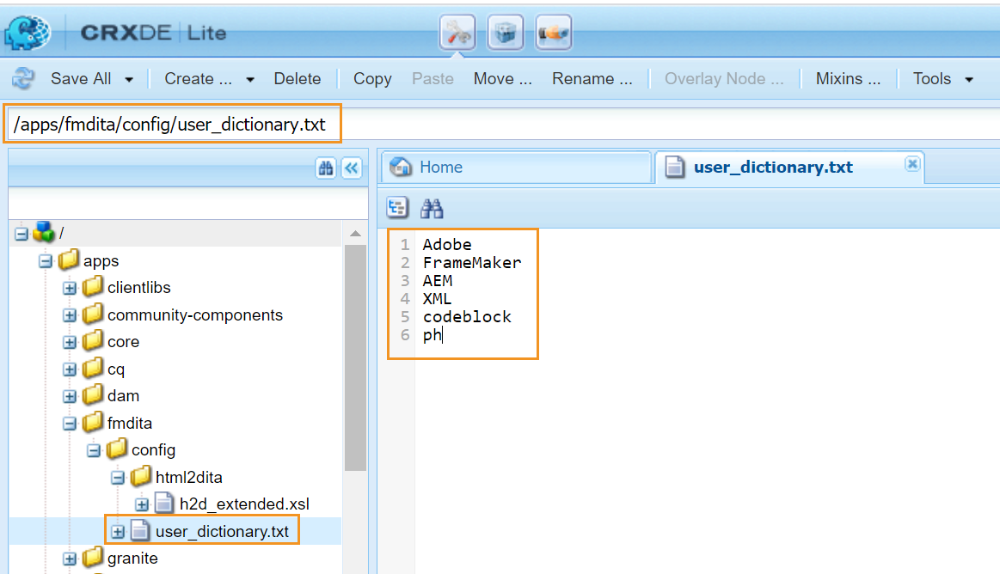

# Anpassen des Standardwörterbuchs von AEM {#id209SD8000WU}

Der Web-Editor kann so konfiguriert werden, dass er die Rechtschreibprüfung von AEM oder die Rechtschreibprüfung des Browsers verwendet. Wenn Sie die Rechtschreibprüfung von AEM verwenden, können Sie die Liste der benutzerdefinierten Wörter definieren. Diese benutzerdefinierten Wörter werden dann dem AEM-Wörterbuch hinzugefügt, und diese Wörter werden im Web-Editor nicht als \(falsch\) gekennzeichnet.

Führen Sie die folgenden Schritte aus, um Ihre benutzerdefinierte Wortliste zu erstellen, die im AEM-Wörterbuch hinzugefügt werden:

1. Melden Sie sich bei AEM an und öffnen Sie den CRXDE Lite-Modus.

1. Navigieren Sie zum folgenden Knoten:

   /apps/fmdita/config

1. Erstellen Sie eine neue Datei mit dem Namen user\_dictionary.txt.

1. Öffnen Sie die Datei und fügen Sie eine Liste von Wörtern hinzu, die Sie im benutzerdefinierten Wörterbuch definieren möchten.

   Der folgende Screenshot zeigt eine Liste mit benutzerdefinierten Wörtern, die der Datei user\_dictionary.txt hinzugefügt wurden:

   {width="650" align="left"}

1. Speichern und schließen Sie die Datei.

Autorinnen und Autoren müssen ihre Web-Editor-Sitzung neu starten, damit die Liste der benutzerdefinierten Wörter im AEM-Wörterbuch aktualisiert wird.

**Übergeordnetes Thema:**&#x200B;[&#x200B; Anpassen des Web-Editors](conf-web-editor.md)
