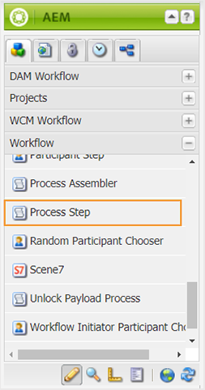

# Status von Dokumenten konfigurieren {#id181GB0400UI}

Mit AEM Guides können Sie die Dokumentstatus für Ihre DITA-Themen entsprechend den Anforderungen Ihres Unternehmens definieren. Sie können verschiedene Status des Dokuments vom Anfang bis zum Ende definieren. Der erste Status kann beispielsweise „Entwurf“ lauten, und er kann zu „Überprüfen“, „Genehmigt“, „Übersetzt“ und schließlich zu „Veröffentlicht“ wechseln.

Es gibt zwei Möglichkeiten, wie ein Thema von einem Zustand in einen anderen übergehen kann - manuell und automatisch. Die Dokumentstatus, die in einem Profil definiert sind, können zum manuellen Ändern des Dokumentstatus verwendet werden. Dies kann über die Seite Eigenschaften einer Themendatei erfolgen. Außerdem können Sie festlegen, wer das Dokument von einem Status in einen anderen verschieben kann. Ein Autor kann beispielsweise ein Dokument erstellen, und der Standardstatus des Dokuments kann Entwurf sein. Wenn die Autorin oder der Autor das Dokument zur Überprüfung sendet, kann sie bzw. er den Dokumentstatus in In Überprüfung ändern. Der Reviewer kann den Status des Dokuments je nach Überprüfungsprozess entweder in Genehmigt oder erneut in Entwurf ändern. Wenn das Dokument genehmigt ist, kann der Herausgeber den Dokumentstatus je nach Workflow in Übersetzt oder Veröffentlicht ändern.

>[!NOTE]
>
> Wenn ein Benutzer zur Gruppe *Administratoren* gehört, kann der Benutzer den Status eines Dokuments aus jedem beliebigen Status ändern, unabhängig von den im System definierten Dokumentstatusübergängen.

## Dokumentenstatus erstellen

Im Lieferumfang von AEM Guides sind eine Reihe von Standarddokumentstatus enthalten. Diese Status sind:

- Entwurf
- Bearbeiten
- In-Review
- Genehmigt
- Überprüft
- Fertig

Diese Standardstatus stehen allen unter DAM erstellten DITA-Themen zur Verfügung. Sie können eigene Dokumentstatus erstellen und diese einem bestimmten Ordner zuweisen. Alle unter diesem Ordner erstellten DITA-Dateien haben dann Zugriff auf die neu erstellten Dokumentstatus.

So erstellen Sie Dokumentstatus mithilfe des Ordnerprofils:

1. Klicken Sie oben auf den Adobe Experience Manager-Link und wählen Sie **Tools** aus.
1. Wählen Sie **Guides** aus der Liste der Tools aus.
1. Klicken Sie auf die Kachel Dokumentstatus .

   Die Seite Assets-Status wird angezeigt. Standardmäßig zeigt die Seite ein Standardprofil an.

1. Klicken Sie **Profil erstellen** und geben Sie die folgenden Details ein:
   - Geben Sie den Namen für das Profil im Feld Profil ein.
   - Geben Sie den Pfad an, auf den Sie das neue Profil anwenden möchten.
   - Geben Sie die Status des Dokuments in den **Zulässigen Status** unter **Zustände** an. Die Standardstatus des Dokuments sind „Entwurf“, „Bearbeiten“, „In Überprüfung“, „Genehmigt“ und „Fertig“.

     Klicken Sie auf **Hinzufügen**, um einen Dokumentstatus hinzuzufügen.

      - Klicken Sie auf das Symbol Löschen , um einen Dokumentstatus zu löschen.

     >[!NOTE]
     >
     > Löschen Sie keinen Dokumentstatus, wenn Dokumente sich noch in diesem Status befinden. Wenn Sie einen Dokumentstatus löschen, können Sie den Dokumentstatus dieser Dokumente nur ändern, wenn Sie der Benutzergruppe *Administrator* angehören.

   - Geben Sie im Feld „Startstatus“ den **des Dokuments**.
   - Geben Sie den Endstatus des Dokuments im **Endstatus** an.
   - Geben Sie den Statusübergang des Dokuments in **Von** und **Bis** unter **Statusübergang** an.

      - Geben Sie die Benutzer und Benutzergruppen an, die den Dokumentstatus in „Gruppen **ändern**.

      - Klicken Sie auf **Hinzufügen**, um eine Statusübergabe hinzuzufügen.

      - Klicken Sie auf das Symbol Löschen , um eine Statusübergabe zu löschen.

     >[!NOTE]
     >
     > Löschen Sie keine Statusübergänge, wenn sich die Dokumente noch im Status `From` befinden. Wenn Sie einen Statusübergang löschen, können Sie den Dokumentstatus dieser Dokumente nur ändern, wenn Sie der Benutzergruppe *Administrator* angehören.

1. Klicken Sie auf **Fertig**.

## Kopie eines Dokumentenstatusprofils erstellen

Je nach Ihren Anforderungen können Sie eine Kopie eines vorhandenen Dokumentenstatusprofils erstellen. Sie können die Kopie als Grundlage für die Erstellung eines weiteren Dokumentprofils verwenden.

Um eine Kopie eines Dokumentenstatusprofils zu erstellen, führen Sie die folgenden Schritte aus:

1. Klicken Sie oben auf den Adobe Experience Manager-Link und wählen Sie **Tools** aus.
1. Wählen Sie **Guides** aus der Liste der Tools aus.
1. Klicken Sie auf die Kachel Dokumentstatus .

   Die Seite Assets-Status wird angezeigt.

1. Wählen Sie das zu duplizierende Dokumentstatusprofil aus und klicken Sie auf **Profil duplizieren**.
1. Nehmen Sie die erforderlichen Änderungen vor und klicken Sie auf **Fertig**.

## Dokumentenstatus oder Statusübergang löschen

>[!NOTE]
>
> Löschen Sie keinen Dokumentenstatus oder Statusübergang, wenn Dokumente sich noch im Status oder im Statusübergang befinden. Wenn Sie einen Status oder eine Statusübergabe löschen, können Sie den Dokumentstatus dieser Dokumente nur ändern, wenn Sie der Benutzergruppe *Administrator* angehören.

Führen Sie die folgenden Schritte aus, um einen Dokumentstatus oder eine Statusübergabe aus einem Dokumentstatusprofil zu löschen:

1. Klicken Sie oben auf den Adobe Experience Manager-Link und wählen Sie **Tools** aus.
1. Wählen Sie **Guides** aus der Liste der Tools aus.
1. Klicken Sie auf die Kachel Dokumentstatus .

   Die Seite Assets-Status wird angezeigt.

1. Wählen Sie das Dokumentstatusprofil aus, aus dem Sie den Dokumentstatus löschen möchten, und klicken Sie auf **Profil bearbeiten**.
1. Löschen Sie den Dokumentstatus oder den Statusübergang und klicken Sie auf **Fertig**.

## Löschen eines Dokumentenstatusprofils

Um ein Dokumentstatusprofil zu löschen, führen Sie die folgenden Schritte aus:

1. Klicken Sie oben auf den Adobe Experience Manager-Link und wählen Sie **Tools** aus.
1. Wählen Sie **Guides** aus der Liste der Tools aus.
1. Klicken Sie auf die Kachel Dokumentstatus .

   Die Seite Assets-Status wird angezeigt.

1. Wählen Sie das zu löschende Dokumentenstatusprofil aus und klicken Sie auf **Profil löschen**.

## Statusänderung des Dokuments automatisieren

Wenn Sie die Dokumentstatus nicht manuell ändern möchten, können Sie einen Workflow erstellen und die Dokumentstatusänderung automatisieren.

>[!NOTE]
>
> Automatisierte Workflows sollten mit den in der Konfiguration definierten Dokumentstatus und Transitionen übereinstimmen. Das System führt keine Prüfungen auf Statusänderungen durch, die über automatisierte Workflows durchgeführt werden.

Führen Sie die folgenden Schritte aus, um die Änderung des Dokumentstatus zu automatisieren:

1. Öffnen Sie die Workflow-Seite über die AEM-Server-URL.

   `<AEM_Server_URL>:<port>/workflow`

1. Öffnen Sie einen Workflow über die Workflow-Seite. Zum Beispiel: Thema überprüfen.
1. Wählen Sie **Prozessschritt** aus dem Abschnitt **Workflow** des AEM-Dialogfelds aus und ziehen Sie es per Drag-and-Drop auf den Workflow.

   

1. Doppelklicken Sie auf den Prozess und öffnen Sie das Dialogfeld **Schritteigenschaften**.
1. Geben Sie die folgenden Details auf der Registerkarte **Prozess** des Dialogfelds ein und klicken Sie auf „OK“:
   - Wählen Sie **Dokumentstatus für ein beliebiges DAM-Asset festlegen** aus der Dropdown-Liste Prozess aus.
   - Aktivieren Sie das Kontrollkästchen Handler-Modus .
   - Geben Sie den Namen des Dokumentstatus in das Textfeld **Argumente** ein.

     >[!NOTE]
     >
     > Stellen Sie sicher, dass Sie im Textfeld Argument den richtigen Dokumentstatus eingeben. Wenn Sie einen falschen Namen eingeben, wird das Dokument in den falschen Dokumentstatus versetzt.

1. Klicken Sie auf **Speichern**, um den Workflow zu speichern.

## Validierungs-Workflow aktivieren

AEM Guides bietet einen Workflow für die Dokumentvalidierung, mit dem Sie den Lebenszyklus Ihres Dokumentenentwicklungsprozesses steuern können. Um den Validierungs-Workflow zu aktivieren, führen Sie die folgenden Schritte aus:

1. Melden Sie sich bei AEM an und öffnen Sie den CRXDE Lite-Modus.

1. Navigieren Sie zu der standardmäßigen Konfigurationsdatei, die am folgenden Speicherort verfügbar ist:

   `/libs/fmdita/clientlibs/clientlibs/xmleditor/ui_config.json`

1. Erstellen Sie eine Kopie der Standardkonfigurationsdatei am folgenden Speicherort:

   `/apps/fmdita/xmleditor/ui_config.json`

1. Navigieren Sie zur `ui_config.json` und öffnen Sie sie im Knoten `apps` zur Bearbeitung.

1. Aktivieren Sie in der `ui_config.json` die Funktion Validierungs-Workflow , indem Sie den Abschnitt *Funktionen* wie unten dargestellt ändern:

   ```json
   "features":  
   { 
      "approvalWorkflow":  true 
   }
   ```
