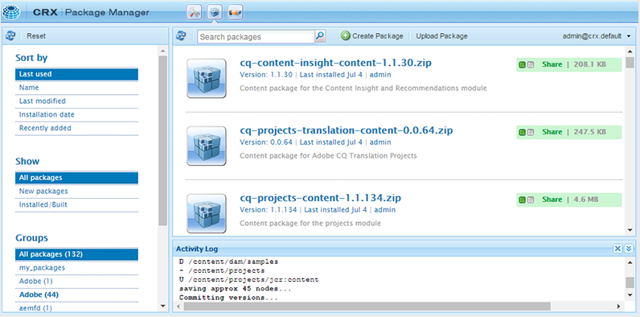

# AEM Guides zum ersten Mal herunterladen und installieren {#id213BCL00KEV}

Führen Sie die folgenden Schritte aus, um AEM Guides zum ersten Mal auf einen Computer herunterzuladen und zu installieren:

>[!IMPORTANT]
>
> Wenn Sie Livefyre zusammen mit AEM Guides verwenden möchten, stellen Sie sicher, dass Sie die Livefyre-Versionen vor 3.0 installieren, bevor Sie AEM Guides installieren. Wenn Sie Livefyre Version 3.0 oder höher verwenden, gibt es keine solche Einschränkung.

1. Laden Sie AEM Guides vom [Adobe Software Distribution-Portal](https://experience.adobe.com/#/downloads/content/software-distribution/de/aem.html) herunter.

   >[!NOTE]
   >
   >Stellen Sie vor der Installation von Experience Manager Guides sicher, dass Ihr System die [technischen Anforderungen](../install-guide/download-install-technical-requirements.md) erfüllt.

1. Melden Sie sich bei Ihrer AEM-Instanz an und navigieren Sie zum CRX Package Manager. Die Standard-URL für den Zugriff auf den Package Manager lautet:

   ```http
   http://<server name>:<port>/crx/packmgr/index.jsp
   ```

   Package Manager verwaltet die Pakete in Ihrer lokalen AEM-Installation. Weitere Informationen zum Arbeiten mit dem Package Manager finden Sie unter [So arbeiten Sie mit Paketen](https://helpx.adobe.com/de/experience-manager/6-5/sites/administering/using/package-manager.html) in der Dokumentation zu AEM.

   {width="650"}

1. Um das AEM Guides-Paket hochzuladen, klicken Sie auf **Paket hochladen**.

1. Navigieren Sie im Dialogfeld Paket hochladen zur AEM Guides-Datei, die Sie in Schritt 1 heruntergeladen haben, und klicken Sie auf **OK**.

   Das Paket wird in Ihre AEM-Instanz hochgeladen.

1. Klicken Sie auf „Installieren“, um **Paket** installieren.

   {width="650"}

1. Klicken Sie im Dialogfeld Paket installieren auf **Installieren**.

1. Um mit AEM Guides zu beginnen, klicken Sie auf die Schaltfläche Startseite  in der linken oberen Ecke von CRX Package Manager.


>[!NOTE]
>
> Führen Sie das Installationsverfahren auf allen Instanzen der AEM-Server in Ihrem Setup durch.

**Übergeordnetes Thema:**&#x200B;[&#x200B; Herunterladen und installieren](download-install.md)
