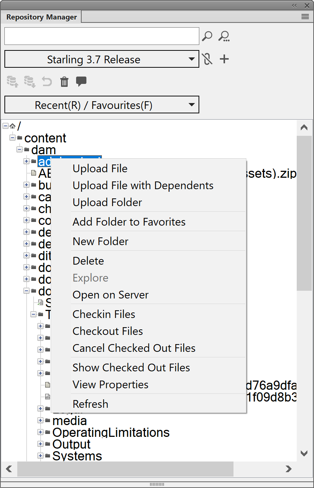

# Vorhandenen DITA-Inhalt hochladen {#id176FF000JUI}

Wahrscheinlich hätten Sie ein Repository mit vorhandenen DITA-Inhalten, die Sie mit AEM Guides verwenden möchten. Für solche vorhandenen Inhalte können Sie einen der folgenden Ansätze verwenden, um Ihren Inhalt stapelweise in das AEM-Repository hochzuladen.

## Verwenden eines WebDAV-Tools

Wenn Sie Ihre Themen und Karten in einem anderen DITA-Editor erstellen, können Sie Ihre Dateien mit einem beliebigen WebDAV-Tool hochladen. Das in diesem Abschnitt beschriebene Verfahren verwendet WinSCP als WebDAV-Tool zum Hochladen von Inhalten.

Führen Sie die folgenden Schritte aus, um WinSCP zum Hochladen von Dateien zu verwenden:

1. Laden Sie WinSCP herunter und installieren Sie es auf Ihrem Computer.

1. Starten Sie die WinSCP-App.

   Das Dialogfeld „Anmelden“ wird angezeigt.

1. Geben Sie im Dialogfeld „Anmelden“ eine Einstellung für „Neue Site“ an, indem Sie WebDAV als **Dateiprotokoll** auswählen und weitere Verbindungsdetails angeben, z. B.:

   - die URL, unter der Ihr AEM-Server gehostet wird,

   - die Port-Nummer \(Standard ist 4502\) und

   - Benutzername und Kennwort für den Zugriff auf den AEM-Server.

1. Klicken Sie auf **Anmelden**.

   Bei erfolgreicher Verbindung wird der Inhalt von AEM Assets in der WinSCP-Benutzeroberfläche angezeigt. Mit dem WinSCP-Datei-Explorer können Sie mühelos Inhalte durchsuchen, erstellen, aktualisieren oder löschen.


## FrameMaker verwenden

Adobe FrameMaker verfügt über einen leistungsstarken AEM-Connector, mit dem Sie Ihre bestehenden DITA- und anderen FrameMaker-Dokumente \(.book und .fm\) einfach in AEM hochladen können. Sie können verschiedene Datei-Upload-Funktionen verwenden, z. B. das Hochladen einer einzelnen Datei, das Hochladen eines vollständigen Ordners mit oder ohne Abhängigkeiten \(z. B. Inhaltsreferenzen, Querverweise und Grafiken\).

Führen Sie die folgenden Schritte aus, um den FrameMaker-AEM-Connector zum Hochladen von Inhalten zu verwenden:

1. FrameMaker starten.

1. Öffnen Sie das **Verbindungs-Manager**-Dialogfeld.

   {width="550" align="left"}

1. Geben Sie die folgenden Details ein, um eine Verbindung zum AEM-Repository herzustellen:

   - **Name**: Geben Sie einen beschreibenden Namen ein, um die Verbindung zu Ihrem AEM-Server zu identifizieren.
   - **Server**: Geben Sie die URL und Port-Nummer Ihres AEM-Servers ein.

   - **Benutzername**/**Kennwort**: Geben Sie den Benutzernamen und das Kennwort für den Zugriff auf den AEM-Server ein.

1. Klicken Sie auf **Verbinden**.

   Sobald die Verbindung erfolgreich hergestellt wurde, werden Assets aus dem AEM-Repository im Fenster „Repository Manager“ angezeigt.

   {width="550" align="left"}

   Wenn Sie mit der rechten Maustaste auf eine Datei oder einen Ordner klicken, können Sie verwandte Vorgänge ausführen. Wenn Sie beispielsweise mit der rechten Maustaste auf einen Ordner klicken, erhalten Sie Optionen zum Hochladen einer Datei, zum Hochladen einer Datei mit Abhängigkeiten, zum Hochladen eines gesamten Ordners usw.


## Konfigurieren des UUID-Dateinamenmusters

Beim Importieren von Inhalten ist es nicht erforderlich, dass Ihre Dateinamen auf der UUID basieren. In einem System, das UUID-basierte Dateinamen verwendet, ist es obligatorisch, dass alle Dateien mit ihren UUIDs und nicht mit ihren ursprünglichen Dateinamen referenziert werden. Wenn eine importierte Datei keine UUID-basierten Dateinamen hat, können Sie das System so konfigurieren, dass seiner Dateieigenschaft eine UUID hinzugefügt wird. Diese UUID wird dann verwendet, um auf solche Dateien zu verweisen, bei denen die UUID nicht für die Benennung der Dateien verwendet wird.

Führen Sie die folgenden Schritte aus, um Dateinamen mit einem UUID-Muster zu vergleichen und Dateien ohne zugewiesene UUID UUID zuzuweisen:

1. Öffnen Sie die Seite Konfiguration der Adobe Experience Manager-Web-Konsole .

   Die Standard-URL für den Zugriff auf die Konfigurationsseite lautet:

   ```http
   http://<server name>:<port>/system/console/configMgr
   ```

1. Suchen Sie nach dem Bundle *com.adobe.fmdita.config.ConfigManager* und klicken Sie darauf.

1. Geben **in der Eigenschaft** UUID-Dateinamenmuster“ ein Muster an, um die Namen der importierten Datei zu überprüfen.

   Wenn eine Datei nicht dem angegebenen Muster folgt, wird eine UUID zur -Eigenschaft der Datei hinzugefügt und alle Verweise auf die Datei werden mit der der Datei zugewiesenen UUID aktualisiert.

1. Klicken Sie auf **Speichern**.


## Hochladen von Inhalten mit UUID mithilfe eines WebDAV-Tools {#id201MI0I04Y4}

Sie können eine der folgenden Methoden verwenden, um Ihren Inhalt mit UUID hochzuladen:

- Ziehen Sie Inhalte per Drag-and-Drop aus Ihrem lokalen System.
- Verwenden Sie den **Erstellen** \> **Dateien** Workflow in der Assets-Benutzeroberfläche von AEM.
- Verwenden Sie ein Tool wie WinSCP.

Wenn Sie ein Tool wie WinSCP verwenden, können Sie die Aktion definieren, die mit einer doppelten Datei ausgeführt werden soll, indem Sie die Option **Alte Datei mit derselben UUID in neuen Ordner verschieben** im configMgr festlegen. Diese Option definiert, welche Aktion für eine Datei ausgeführt wird, die an einem anderen Speicherort im AEM-Repository verfügbar ist. Diese Einstellung ist im Paket *com.adobe.fmdita.config.ConfigManager* im configMgr verfügbar.

Standardmäßig ist die Option **Alte Datei mit derselben UUID in neuen Ordner verschieben** aktiviert. Wenn sich die hochgeladene Datei in einem anderen Ordner im Repository befindet, wird die vorhandene Datei an den aktuellen Speicherort verschoben und mit der hochgeladenen Datei überschrieben. Wenn Sie diese Option nicht auswählen, wird die Datei an ihrem vorhandenen Speicherort überschrieben.

**Zusätzliche Hinweise zum Arbeiten mit UUID-basierten Dateien**:

Beim Verschieben oder Kopieren von Inhalten im AEM-Repository müssen die folgenden Punkte berücksichtigt werden:

- Beim Kopieren einer oder mehrerer Dateien von einem Speicherort an einen anderen Speicherort wird für Dateien ohne UUID eine neue UUID generiert. Diese UUID wird den Metadaten der Datei hinzugefügt.

- Wenn eine Datei einen Konflikt aufweist oder ein Duplikat aufweist, wird ein eindeutiger Dateiname für die neue Datei generiert, die kopiert oder verschoben wird.

- Keine zwei Dateien können dieselbe UUID haben. Allen neuen Dateien wird eine eindeutige UUID zugewiesen.


Beachten Sie beim Verschieben oder Kopieren von Inhalten von Ihrem lokalen System in das AEM-Repository die folgenden Punkte:

- Wenn eine Datei von zwei verschiedenen Benutzern gleichzeitig hochgeladen wird, überschreibt die später verarbeitete Datei die vorherige Datei. Eine solche Praxis ist jedoch selten und sollte vermieden werden.

- Wenn Sie Inhalte aus dem AEM-Repository auschecken und Änderungen auf Ihrem lokalen System vornehmen, stellen Sie sicher, dass der Dateiname zum Zeitpunkt des Uploads nicht geändert wird.


## Verwenden von cURL-Befehlen

Sie können cURL-Befehle auch verwenden, um einen Ordner in DAM zu erstellen, Dateien hochzuladen und Metadaten zum hochgeladenen Inhalt hinzuzufügen.

**Erstellen eines Ordners**

Führen Sie den folgenden Befehl aus, um einen Ordner im AEM-Repository zu erstellen:

```curl
curl --user <username>:<password> --data jcr:primaryType=sling:Folder "<server folder path>"
```

Geben Sie die folgenden Parameter an, um einen Ordner zu erstellen:

- `<username>:<passowrd>`: Geben Sie den Benutzernamen und das Kennwort für den Zugriff auf das AEM-Repository an. Dieser Benutzer muss über die Berechtigungen zum Erstellen von Ordnern verfügen.

- `jcr:primaryType=sling:Folder`: Geben Sie diesen *an* um eine Ressource vom Typ Ordner zu erstellen.

- `<server folder path>`: Vollständiger Ordnerpfad mit dem Namen des neuen Ordners, den Sie im AEM-Repository erstellen möchten. Wenn Sie beispielsweise den Pfad als `http://192.168.1.1:4502/content/dam/projects/AEM-Guides` angeben, wird der `AEM-Guides` im `projects` Ordner in DAM erstellt.


**Datei hochladen**

Führen Sie den folgenden Befehl aus, um eine Datei in das AEM-Repository hochzuladen:

```curl
curl --user <username>:<password> -T "<local file path>" "<server folder path>"
```

Geben Sie die folgenden Parameter zum Hochladen einer Datei an:

- `<username>:<passowrd>`: Geben Sie den Benutzernamen und das Kennwort für den Zugriff auf das AEM-Repository an. Dieser Benutzer muss über Schreibrechte für den `server folder path` verfügen.

- ``local file path``: Vollständiger Dateipfad auf Ihrem lokalen System, den Sie hochladen möchten.

- `<server folder path>`: Vollständiger Ordnerpfad auf dem AEM-Server, auf den Sie die Datei hochladen möchten.


**Metadaten hinzufügen**

Führen Sie den folgenden Befehl aus, um Metadaten zu einer Datei hinzuzufügen:

```curl
curl --user <username>:<password> -F<attribute name>=<value> <metadata node path>
```

Geben Sie die folgenden Parameter an, um Metadateninformationen hinzuzufügen:

- `<username>:<passowrd>`: Geben Sie den Benutzernamen und das Kennwort für den Zugriff auf das AEM-Repository an. Dieser Benutzer muss über Schreibrechte für den ``metadata node path`` verfügen.

- ``-F<attribute name>=<value>``: Der `<attribute name>` ist der Name des Metadatenattributs, z. B. `audience` und der `<value>` könnte `internal` sein. Sie können mehrere Name-Wert-Paare für Attribute angeben, die durch Leerzeichen getrennt sind.

- `<metadata node path>`: Vollständiger Ordnerpfad, einschließlich Dateiname und Metadatenknoten. Wenn Sie beispielsweise den Pfad als `http://192.168.1.1:4502/content/dam/projects/AEM-Guides/intro.xml/jcr:content/metadata` angeben, werden die angegebenen Metadateninformationen in `intro.xml` Datei festgelegt.


**Übergeordnetes Thema:**&#x200B;[ Migrieren vorhandener Inhalte](migrate-content.md)
