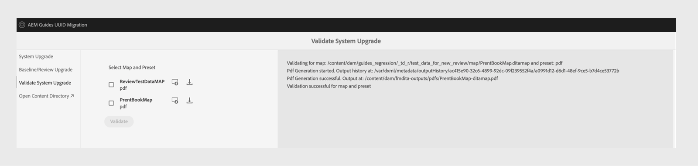

# 4.3.1 Migration von Nicht-UUID zu 4.3.2 UUID-Inhalten

Führen Sie diese Schritte aus, um Ihren Inhalt von der Nicht-UUID-Version 4.3.1 zur UUID-Version 4.3.2 zu migrieren.

>[!IMPORTANT]
>
> * Bevor Sie mit dem Migrationsprozess beginnen, stellen Sie Folgendes sicher:
>
>   1. Alle aktiven Rezensionen wurden geschlossen.
>   1. Alle Übersetzungsaufgaben geschlossen.
> * Stellen Sie vor der Migration von Inhalten zum UUID-Server sicher, dass Sie einen Nicht-UUID-Server haben, auf dem eine kompatible AEM Guides-Version installiert ist.
> * Wenn Sie eine Version vor 4.3.1 verwenden, aktualisieren Sie auf Version 4.3.1. Befolgen Sie die [Upgrade-](./upgrade-xml-documentation.md)), die für die lizenzierte Version Ihres Produkts gelten.
> * Derzeit werden neuere Versionen als 4.3.1 für die Migration nicht unterstützt.

## Package-Installation

Laden Sie basierend auf Ihrer Version die erforderlichen Pakete aus dem Adobe Software Distribution-Portal herunter:

1. **Vorab-Migration**: [com.adobe.guides.pre-uuid-migration-1.2.27.zip](https://experience.adobe.com/#/downloads/content/software-distribution/en/aem.html?package=%2Fcontent%2Fsoftware-distribution%2Fen%2Fdetails.html%2Fcontent%2Fdam%2Faem%2Fpublic%2Faemdox%2Fother-packages%2Fuuid-migration%2F3-0%2Fcom.adobe.guides.pre-uuid-migration-1.2.27.zip)
1. **UUID-Version 4.3.2 herunterladen**: [com.adobe.fmdita-6.5-uuid-4.3.2.1977.zip](https://experience.adobe.com/#/downloads/content/software-distribution/en/aem.html?package=%2Fcontent%2Fsoftware-distribution%2Fen%2Fdetails.html%2Fcontent%2Fdam%2Faem%2Fpublic%2Faemdox%2Fother-packages%2Fuuid-migration%2F3-0%2Fcom.adobe.fmdita-6.5-uuid-4.3.2.1977.zip)
1. **Migration**: [com.adobe.guides.uuid-upgrade-1.2.110.zip](https://experience.adobe.com/#/downloads/content/software-distribution/en/aem.html?package=%2Fcontent%2Fsoftware-distribution%2Fen%2Fdetails.html%2Fcontent%2Fdam%2Faem%2Fpublic%2Faemdox%2Fother-packages%2Fuuid-migration%2F3-0%2Fcom.adobe.guides.uuid-upgrade-1.2.110.zip)

## Prüfungen vor der Migration

Führen Sie die folgenden Prüfungen für Nicht-UUID-Version 4.3.1 durch:

1. Installieren Sie das Paket vor der Migration [com.adobe.guides.pre-uuid-migration-1.2.27.zip](https://experience.adobe.com/#/downloads/content/software-distribution/en/aem.html?package=%2Fcontent%2Fsoftware-distribution%2Fen%2Fdetails.html%2Fcontent%2Fdam%2Faem%2Fpublic%2Faemdox%2Fother-packages%2Fuuid-migration%2F3-0%2Fcom.adobe.guides.pre-uuid-migration-1.2.27.zip) über Version 4.3.1.

   >[!NOTE]
   >
   >* Sie benötigen Administratorrechte, um die Migration auszuführen.
   >* Es wird empfohlen, die Dateien mit Fehlern zu beheben, bevor Sie mit der Migration fortfahren.

1. Wenn das System mehr als 100.000 DITA-Dateien enthält, aktualisieren Sie die Konfigurationen der Abfragegrenze, damit das Skript funktioniert:

   * Navigieren Sie zu `/system/console/configMgr and increase both the configs to more than number of assets - queryLimitInMemory` und `queryLimitReads under org.apache.jackrabbit.oak.query.QueryEngineSettingsService`

1. `http://<server-name>/libs/fmdita/clientlibs/xmleditor_uuid_upgrade/page.html` starten.
1. Wählen Sie **Kompatibilitätsbewertung** aus dem linken Bedienfeld aus und durchsuchen Sie den `/content/dam` Ordnerpfad für alle Assets.
1. Überprüfen Sie die Kompatibilität , um die folgenden Informationen aufzulisten:
   * Gesamtzahl der Dateien
   * Geschätzte Migrationszeit
   * Anzahl fehlerhafter Dateien
   * Dateien mit GUID-Dateinamen

   

1. Wenn der Fehler auftritt, analysieren Sie die Protokolle und beheben Sie diese Fehler. Sie können die Kompatibilitätsmatrix erneut ausführen, nachdem Sie die Fehler behoben haben.

1. Wählen **im linken Bedienfeld** Validierungen konfigurieren“ aus. Wählen Sie dann **Zuordnung auswählen** und **Voreinstellung auswählen** der Zuordnung aus, um sie zu konfigurieren. In der Liste Aktuelle Ausgabe-Validierung werden die vor der Migration vorhandenen Ausgabedateien angezeigt. Sie können auch anhand der Ausgabedateien validiert werden, die nach der Migration generiert werden.

   Durch die Auswahl mehrerer und großer DITA-Zuordnungen können Sie überprüfen, ob der gesamte Inhalt erfolgreich und ohne Probleme migriert wurde. Durch die Auswahl von Vorgaben mit Baselines wird außerdem sichergestellt, dass Baselines und Versionen erfolgreich migriert werden.

   

1. (Optional) Führen Sie eine Versionsbereinigung für den Inhalt durch, um unnötige Versionen zu entfernen und den Migrationsprozess zu beschleunigen. Um eine Versionsbereinigung durchzuführen, wählen Sie im Migrationsbildschirm die Option **Versionsbereinigung** aus und navigieren Sie über die URL-`http://<server- name>/libs/fmdita/clientlibs/xmleditor_uuid_upgrade/page.html` zur -Benutzeroberfläche.
   >[!NOTE]
   >
   >Dieses Dienstprogramm entfernt keine Versionen, die in Baselines oder Reviews verwendet werden, und hat keine Kennzeichnungen.

Weitere Informationen finden Sie unter [Ältere Versionen ](../install-guide/version-management.md#purge-older-versions-of-dita-files).

## Voraussetzungen für die Migration

1. Führen Sie die UUID-Migration nur auf einer Autoreninstanz aus.
1. Stellen Sie sicher, dass die folgende Infrastruktur bereit ist:
   * Die Autoreninstanz wird in Bezug auf CPU und Speicher vergrößert, um eine schnellere Verarbeitung und zusätzlichen Speicher zu unterstützen, der für Massenaktivitäten benötigt wird. Wenn beispielsweise der aktuell zugewiesene CPU und Speicher 8 vCPU und 24 GB Heap sind, verdoppeln Sie die Größe für diese Aktivität.
   * Der gesamte Speicherplatz und der temporäre Speicherplatz `(crx-quickstart directory)` sollte einen Puffer haben, der 10-mal höher ist als der bereits belegte. Nach Abschluss der Migration können Sie den Großteil des Festplattenspeichers zurückgewinnen, indem Sie die Komprimierung ausführen.
   * Führen Sie **Offline-Tar-Komprimierung** aus, bevor Sie diese Aktivität starten.
   * Stellen Sie sicher, dass während des Zeitfensters dieser Migration keine Indizierung oder Systemwartung geplant ist.

1. Installieren Sie die UUID-Version der unterstützten Version gegenüber der Nicht-UUID-Version. Wenn Sie z. B. den Nicht-UUID-Build 4.3.1 verwenden, müssen Sie die UUID-Version 4.3.2 [com.adobe.fmdita-6.5-uuid-4.3.2.1977.zip](https://experience.adobe.com/#/downloads/content/software-distribution/en/aem.html?package=%2Fcontent%2Fsoftware-distribution%2Fen%2Fdetails.html%2Fcontent%2Fdam%2Faem%2Fpublic%2Faemdox%2Fother-packages%2Fuuid-migration%2F3-0%2Fcom.adobe.fmdita-6.5-uuid-4.3.2.1977.zip)) installieren und die Migration ausführen.

1. Installieren Sie das UUID-Migrations-Upgrade-Paket [com.adobe.guides.uuid-upgrade-1.2.110.zip](https://experience.adobe.com/#/downloads/content/software-distribution/en/aem.html?package=%2Fcontent%2Fsoftware-distribution%2Fen%2Fdetails.html%2Fcontent%2Fdam%2Faem%2Fpublic%2Faemdox%2Fother-packages%2Fuuid-migration%2F3-0%2Fcom.adobe.guides.uuid-upgrade-1.2.110.zip).
1. Deaktivieren Sie Starter für die folgenden Workflows mithilfe der URL: `http://<server-name>/libs/cq/workflow/content/console.html`.

   * Workflow „DAM-Update-Asset“
   * Workflow „DAM-Metadaten-Writeback“

   >[!NOTE]
   >
   >Idealerweise sollten alle Workflow-Starter deaktiviert werden, die unter einem beliebigen Pfad in `content/dam` ausgeführt werden.

1. Aktualisieren Sie die folgenden Konfigurationen gemäß den vorgeschlagenen Änderungen:

   | Konfiguration | Eigenschaft | Wert |
   |---|---|---|
   | `com.adobe.fmdita.config.ConfigManager` | Aktivieren von Workflow-Startern nach der Verarbeitung | Deaktivieren |
   | `com.adobe.fmdita.config.ConfigManager` | UUID. Regex | `^GUID-(?<id>.*)` |
   | `com.adobe.fmdita.postprocess.version.PostProcessVersionObservation` | Versionsnachbearbeitung aktivieren | Deaktivieren |
   | Day CQ Tagging Service | Validierung aktivieren (validation.enabled) | Deaktivieren |

1. Fügen Sie eine separate Protokollierung für hinzu:
   * `com.adobe.fmdita.uuid`
   * `com.adobe.guides.uuid`.

1. (Wenn dies nicht bereits früher geschehen ist) Wenn das System mehr als 100.000 DITA-Dateien enthält, aktualisieren Sie die `queryLimitReads` unter `org.apache.jackrabbit.oak.query.QueryEngineSettingsService` auf einen größeren Wert (einen beliebigen Wert, der größer ist als die Anzahl der vorhandenen Assets, z. B. 200.000).

   | PID | Eigenschaftsschlüssel | Eigenschaftswert |
   |---|---|---|
   | org.apache.jackrabbit.oak.query.QueryEngineSettingsService | queryLimitReads | Wert: 200000   Standardwert: 100000 |

## Migration

1. `http://<server-name>/libs/fmdita/clientlibs/xmleditor_uuid_upgrade/page.html` starten.

   
   >[!NOTE]
   >
   > Wenn Sie „DITA-Asset-Sicherung aktivieren“ wählen, werden die temporären Sicherungsdateien unter `/content/uuid-upgrade` gespeichert und die DITA-Dateisicherungen werden nach Abschluss der Migration einer Datei gelöscht.

1. Wählen Sie **linken Bedienfeld** System-Upgrade“ aus, um die Migration auszuführen. Es wird empfohlen, alle Daten gleichzeitig zu migrieren, da das System die Batch-Verarbeitung intern optimal handhabt. Nur Dateien, die keine DITA-Assets sind und nicht in DITA-Assets verwendet werden, können für die Migration übersprungen werden.

1. (Optional) Wählen Sie die Ordner aus, für die Sie die Migration überspringen möchten. Verwenden Sie diese Option, um diese Ordner später zu migrieren, oder überspringen Sie die Migration. Stellen Sie sicher, dass diese Ordner keine DITA-Assets haben und nicht von DITA-Assets referenziert werden (und in Zukunft auch nicht von DITA-Assets referenziert werden). Zum Beispiel: `content/dam/projects`.

1. Wählen Sie *DITA-Asset-Sicherung aktivieren* aus, um vor der Migration ein Asset-Backup zu erstellen. Diese Sicherung wird für das Rollback verwendet, falls beim Migrieren einer Datei ein Fehler auftritt. Die Sicherung wird gelöscht, wenn die Migration erfolgreich war. Dies verlangsamt jedoch den Migrationsprozess.

1. Starten Sie die Migration.
   >[!NOTE]
   >
   > Laden Sie die vollständigen Protokolle herunter und überprüfen Sie, ob Fehler aufgetreten sind. Wenn ein Fehler oder eine Ausnahme gefunden wird *nicht fortfahren* beheben Sie aber zuerst den Fehler. Häufige Fehler werden am Ende dieses Artikels aufgeführt.

1. Nach Abschluss der Migration kann der Bericht heruntergeladen werden, und es können auch ganze Protokolle heruntergeladen werden.

1. Wählen Sie **Bericht herunterladen** während der Migration aus, um zu überprüfen, ob alle Dateien im Ordner korrekt aktualisiert wurden und ob alle Funktionen nur für diesen Ordner funktionieren.

   >[!NOTE]
   >
   > Die Inhaltsmigration kann auf Ordnerebene, auf der vollständigen `/content/dam` oder auf demselben Ordner ausgeführt werden (Migration erneut ausführen).

   Außerdem müssen Sie sicherstellen, dass die Inhaltsmigration für alle Medien-Assets durchgeführt wird, z. B. für Bilder und Grafiken, die Sie im DITA-Inhalt verwendet haben.

1. Nachdem alle Dateien migriert wurden, wählen Sie **Baseline/Review-Upgrade** im linken Bereich aus, um die Baselines zu migrieren und auf Ordnerebene zu überprüfen.

>[!NOTE]
>
>Wenn Sie das System neu starten oder die Migration abgebrochen wird, wird das Skript fortgesetzt, wenn Sie es mit denselben Parametern wie zuvor erneut ausführen. Wenden Sie sich an Ihr Customer Success-Team, wenn beim Herunterfahren Probleme auftreten.

## Berichte in jedem Schritt analysieren

**Schritt: System-Upgrade**

| Zusammenfassung nach Abschluss des Prozesses | Wie zu interpretieren? | Aktion |
|---|---|---|
| Gesamtzahl der Dateien: 345997 | Gesamtzahl der Dateien, die unter dem angegebenen Ordnersatz verarbeitet wurden. | nicht vorhanden |
| Anzahl der erfolgreich aktualisierten Dateien: 344516 | Anzahl der erfolgreich zu UUID migrierten Dateien. | nicht vorhanden |
| Anzahl der fehlerhaften Dateien: 29 | In diesen Dateien sind Fehler aufgetreten, die mit den im Vormigrationsschritt gemeldeten Fehlern übereinstimmen sollten. | nicht vorhanden |
| Anzahl übersprungener Dateien: 1452 | Einige Dateien im DAM-Repository können Unter-Assets enthalten. Diese Unter-Assets werden übersprungen, da sie für die UUID-Migration nicht geeignet sind. | nicht vorhanden |
| Anzahl der Dateien mit fehlgeschlagenem Upgrade: 0 | Wenn die Anzahl nicht 0 ist, müssen die Protokolle auf mögliche Probleme analysiert werden. | Überprüfen Sie die Ausnahme. Möglicherweise müssen Sie den Fehler beheben und die Migration erneut ausführen. |
| Insgesamt benötigte Zeit: 2:40:06.157 |  |  |

**Schritt: Baselines-Upgrade**

| Zusammenfassung nach Abschluss des Prozesses | Wie zu interpretieren? | Aktion |
|---|---|---|
| Gesamtzahl der Dateien: 4833 | Anzahl der DITA-Zuordnungen mit mindestens 1 Baseline. |  |
| Anzahl der erfolgreich aktualisierten Dateien: 4705 | Anzahl der DITA-Karten, die mit allen Baselines erfolgreich aktualisiert wurden. |  |
| Anzahl der fehlerhaften Dateien: 0 | Anzahl der DITA-Zuordnungen, deren Baselines nicht aktualisiert wurden. |  |
| Anzahl übersprungener Dateien: 1647 | Anzahl der DITA-Zuordnungen ohne Baseline. |  |
| Anzahl der Dateien mit fehlgeschlagenem Upgrade: 128 | Die Anzahl der Baseline-Objekte, die nicht gültig waren (sie waren leer), wird im Bericht (Excel) aufgelistet. | Überprüfen, ob andere Fehler vorliegen als: `baselineObj not found on` |

## Nach der Migration

1. Wählen Sie nach Abschluss der Migration im linken Bereich die **Systemaktualisierung validieren** und validieren Sie die Ausgabedateien vor und nach der Migration, um sicherzustellen, dass die Migration erfolgreich war.

   

1. Aktivieren Sie nach der erfolgreichen Migration des Servers die folgenden Workflows und Konfigurationen (einschließlich aller anderen Workflows, die ursprünglich während der Migration deaktiviert wurden), um weiterhin auf dem Server zu arbeiten:

   * Workflow „DAM-Update-Asset“
   * Workflow „DAM-Metadaten“

   >[!NOTE]
   >
   >Idealerweise sollten alle Workflow-Starter aktiviert werden, die auf einem beliebigen Pfad innerhalb von `content/dam` vor der Migration ausgeführt wurden.

1. Aktivieren Sie die folgenden Konfigurationen:

   | Konfiguration | Eigenschaft | Wert |
   |---|---|---|
   | `com.adobe.fmdita.config.ConfigManager` | *Workflow-Starter für Nachbearbeitung aktivieren* | Aktivieren |
   | `com.adobe.fmdita.postprocess.version.PostProcessVersionObservation` | *Versionsnachbearbeitung aktivieren* | Aktivieren |
   | Day CQ Tagging Service | *Validierung aktivieren (validation.enabled)* | Aktivieren |

1. Assets-Eigenschaften zur Überprüfung nach der Migration:

   | Konfiguration | Eigenschaft | Wert vor der Migration auf Nicht-UUID | Wert nach der Migration auf UUID |
   |---|---|---|---|
   | `com.adobe.fmdita.config.ConfigManager` | **Titel für AEM Site-Seitennamen verwenden** | False (Standardwert) | True |

   >[!NOTE]
   >
   > Wenn vor der Migration die Eigenschaft **Titel für AEM-Website-Seitennamen verwenden** innerhalb von `com.adobe.fmdita.config.ConfigManager` auf *false* festgelegt wird, muss diese Eigenschaft nach der Migration aktualisiert werden.

1. Nach Abschluss der Validierung kann der größte Teil des Speicherplatzes durch Ausführen der Komprimierung zurückgewonnen werden (siehe `https://experienceleague.adobe.com/docs/experience-manager-65/deploying/deploying/revision-cleanup.html?lang=en`).

