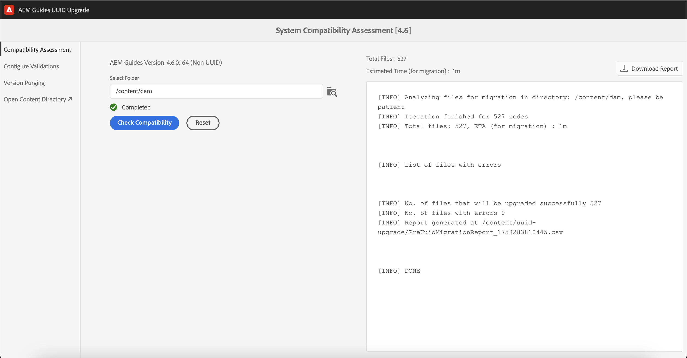

# Migrieren von Nicht-UUID-Inhalten mit Versionen aus der Benutzeroberfläche

Wenn Sie Version 4.3.x oder höher verwenden, führen Sie diese Schritte aus, um Ihren Nicht-UUID-Inhalt mit Versionen zu UUID-Inhalten zu migrieren.

## Kompatibilitätsmatrix

| Aktuelle AEM Guides-Version (Nicht-UUID) | Erforderliche Version für die Migration zu UUID | Unterstützter Aktualisierungspfad |
|---|---|---|
| 4.3.x oder höher | 4.3.0 Nicht-UUID | Installieren Sie 4.3.1 (UUID) |

## Erforderliche Pakete

1. **Versionsbereinigung**: `com.adobe.guides.version-purge-1.0.11.zip` (optional)
1. **Vormigration**: `com.adobe.guides.pre-uuid-migration-1.1.2 .zip`
1. **Migration**: `com.adobe.guides.uuid-upgrade-1.1.13.zip`

## Vormigration

1. (Optional) Führen Sie eine Versionsbereinigung für den Inhalt durch, um unnötige Versionen zu entfernen und den Migrationsprozess zu beschleunigen. Um die Versionsbereinigung für Version 4.1 durchzuführen (NICHT unterstützt für Version 4.0), installieren Sie das Paket `com.adobe.guides.version-purge-1.0.11.zip` und wechseln Sie mithilfe dieser URL `http://<server-name> /libs/fmdita/clientlibs/xmleditor_version_purge/page.html` zur Benutzeroberfläche.

   >[!NOTE]
   >
   >Dieses Dienstprogramm entfernt keine Versionen, die in Grundlinien- oder Rezensionen verwendet werden, oder hat Beschriftungen.
1. Installieren Sie das Vormigrationspaket (`ccom.adobe.guides.pre-uuid-migration-1.1.2 .zip`).

   >[!NOTE]
   >
   >* Sie benötigen Administratorrechte, um die Migration ausführen zu können.
   >* Es wird empfohlen, die Dateien mit Fehlern zu beheben, bevor Sie mit der Migration fortfahren.

1. Wählen Sie im linken Bereich die Option **Kompatibilitätsbewertung** aus und durchsuchen Sie einen Ordnerpfad.
1. Überprüfen Sie die Kompatibilität, um die folgenden Informationen aufzulisten:
   * Gesamtzahl der Dateien
   * Versionen insgesamt
   * Geschätzte Migrationszeit
   * Fehlerfreie Dateien

Registerkarte {width="800" align="left"}

1. Wählen Sie im linken Bereich **Überprüfungen konfigurieren** aus. Wählen Sie dann **map** und **preset** der Zuordnung aus, um sie zu konfigurieren. In der aktuellen Liste der Ausgabeprüfungen werden die vor der Migration vorhandenen Ausgabedateien angezeigt und sie können anhand der nach der Migration erzeugten Ausgabedateien validiert werden.

{width="800" align="left"}

## Migration

### Schritt 1: Konfiguration aktualisieren

1. Stellen Sie sicher, dass der verfügbare freie Speicherplatz mindestens dem 10-fachen des Speicherplatz entspricht, den AEM (crx-quickstart-Verzeichnis) während der Migration benötigt. Nachdem Sie die Migration abgeschlossen haben, können Sie den Großteil des Festplattenspeichers durch Ausführen der Komprimierung wiederherstellen (siehe [Revisionsbereinigung](https://experienceleague.adobe.com/docs/experience-manager-65/deploying/deploying/revision-cleanup.html?lang=de)).

1. Aktivieren Sie *Post-Workflow-Starter für die Verarbeitung aktivieren* in `com.adobe.fmdita.config.ConfigManager` und *Aktivieren Sie die Versionsnachbearbeitung aktivieren* in `com.adobe.fmdita.postprocess.version.PostProcessVersionObservation.`

1. Installieren Sie die UUID-Version der unterstützten Version über die Nicht-UUID-Version. Wenn Sie beispielsweise einen 4.0-Nicht-UUID-Build oder einen 4.1-Nicht-UUID-Build verwenden, müssen Sie UUID-Version 4.1 installieren.

1. Installieren Sie das neue Paket für die UUID-Migration (`com.adobe.guides.uuid-upgrade-1.1.13`).

1. Deaktivieren Sie die folgenden Workflows und alle anderen Workflows, die unter `/content/dam` ausgeführt werden, mithilfe von Startern in `http://localhost:4502/libs/cq/workflow/content/console.html`.

   * Workflow „DAM-Update-Asset“
   * DAM-Metadaten-Writeback-Workflow

1. Deaktivieren Sie *Aktivieren Sie die Post-Workflow-Starter für die Verarbeitung* in `com.adobe.fmdita.config.ConfigManager` und deaktivieren Sie *Aktivieren Sie die Versionsnachbearbeitung aktivieren* in `com.adobe.fmdita.postprocess.version.PostProcessVersionObservation`.

1. Deaktivieren Sie die Eigenschaft Validierung aktivieren (`validation.enabled`) in Day CQ Tagging Service .

1. Stellen Sie sicher, dass der Eigenschaftsordner `uuid.regex` in `com.adobe.fmdita.config.ConfigManager` korrekt festgelegt ist. Wenn es leer ist, setzen Sie es auf den Standardwert - `^GUID-(?<id>.*)`.
1. Fügen Sie eine separate Protokollfunktion für `com.adobe.fmdita.uuid.upgrade.UuidUpgrade` hinzu. Die Browserantwort ist auch unter `/content/uuid-upgrade/logs` verfügbar.

### Schritt 2: Ausführen der Migration und Validieren

#### Migrationspaket installieren

{width="800" align="left"}

* Wählen Sie im linken Bereich die Option **Systemaktualisierung** aus, um die Migration auszuführen. Beginnen Sie mit einem Ordner mit kleineren Daten, bevor Sie ihn auf `/content/dam` ausführen.

* Wählen Sie **Bericht herunterladen** , während die Migration ausgeführt wird, um zu überprüfen, ob alle Dateien im Ordner korrekt aktualisiert wurden und ob alle Funktionen nur für diesen Ordner funktionieren.

>[!NOTE]
>
> Die Inhaltsmigration kann auf Ordnerebene oder auf dem vollständigen Tag `/content/dam` oder im selben Ordner ausgeführt werden (Neuausführung der Migration).

Darüber hinaus ist es wichtig sicherzustellen, dass die Inhaltsmigration auch für alle Medien-Assets durchgeführt wird, z. B. für Bilder und Grafiken, die Sie im DITA-Inhalt verwendet haben.

#### Grundlegende und überprüfte Migration

Wählen Sie im linken Bereich die Option **Grundlinien-/Überprüfungsaktualisierung** aus, um die Grundlinien zu migrieren und auf Ordnerebene zu überprüfen.

{width="800" align="left"}

### Schritt 3: Konfiguration wiederherstellen

Nachdem der Server erfolgreich migriert wurde, aktivieren Sie die Nachbearbeitung, das Tagging und die folgenden Workflows (einschließlich aller anderen Workflows, die während der Migration ursprünglich deaktiviert wurden), um weiterhin auf dem Server zu arbeiten.

* Workflow „DAM-Update-Asset“
* DAM-Metadaten-Workflow

>[!NOTE]
>
>Wenn einige Dateien vor der Migration nicht verarbeitet werden oder beschädigt sind und sie vor der Migration beschädigt werden und auch nach der Migration beschädigt bleiben.

## Migrationsvalidierung

Nachdem die Migration abgeschlossen ist, wählen Sie im linken Bereich die Option **Systemaktualisierung überprüfen** aus und validieren Sie die Ausgabedateien vor und nach der Migration, um sicherzustellen, dass die Migration erfolgreich ist.

{width="800" align="left"}

1. Nach Abschluss der Migration kann der Großteil des Festplattenspeichers durch Ausführen der Komprimierung wiederhergestellt werden (siehe `https://experienceleague.adobe.com/docs/experience-manager-65/deploying/deploying/revision-cleanup.html?lang=en`).

