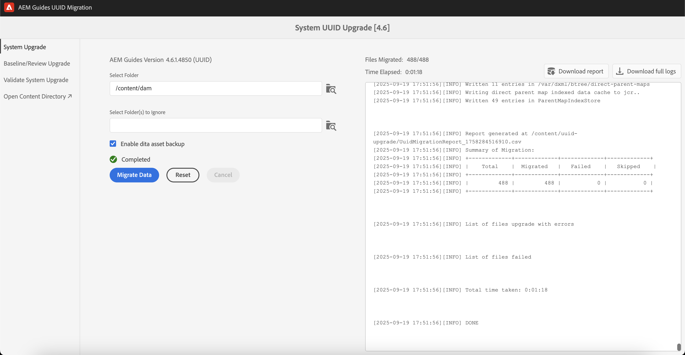

# Migrieren versionierter Inhalte

>[!NOTE]
>
> Sie können Nicht-UUID-Inhalte zu UUID-Inhalten in Experience Manager Guides migrieren. Dieser Artikel wird im November 2024 archiviert.
>Sehen Sie [**Migration von Nicht-UUID zu UUID-Inhalten**](./migrate-non-uuid-uuid.md) für die neueste und detaillierte Dokumentation.

Führen Sie diese Schritte aus, um Ihre versionierten Nicht-UUID-Inhalte zu UUID-Inhalten zu migrieren.

>[!NOTE]
>
>Befolgen Sie die [Upgrade-](./upgrade-xml-documentation.md)), die für die lizenzierte Version Ihres Produkts gelten.

## Kompatibilitätsmatrix

| Aktuelle Experience Manager Guides-Version (nicht UUID) | Erforderliche Version für die Migration zu UUID | Unterstützter Aktualisierungspfad |
|---|---|---|
| 3.8.5, 4.0.x oder 4.1.x | 4.1 Nicht-UUID | Installieren Sie 4.1 (UUID) und führen Sie die Migration aus |
| 4.2, 4.2.x oder 4.3 | 4.3.0 non-UUID | Installieren Sie 4.3.1 (UUID) und führen Sie die Migration aus |
| 4,3,1 | nicht vorhanden | nicht vorhanden |

## Package-Installation

Laden Sie basierend auf Ihrer Version die erforderlichen Pakete vom Adobe Software Distribution-Portal herunter:

  Pakete für den Aktualisierungspfad von Version 4.1

1. **Vorab-Migration**: [com.adobe.guides.pre-uuid-migration-1.0.9.zip](https://experience.adobe.com/#/downloads/content/software-distribution/en/aem.html?package=%2Fcontent%2Fsoftware-distribution%2Fen%2Fdetails.html%2Fcontent%2Fdam%2Faem%2Fpublic%2Faemdox%2Fother-packages%2Fuuid-migration%2F1-0%2Fcom.adobe.guides.pre-uuid-migration-1.0.9.zip)
1. **Migration**: [com.adobe.guides.uuid-upgrade-1.0.19.zip](https://experience.adobe.com/#/downloads/content/software-distribution/en/aem.html?package=%2Fcontent%2Fsoftware-distribution%2Fen%2Fdetails.html%2Fcontent%2Fdam%2Faem%2Fpublic%2Faemdox%2Fother-packages%2Fuuid-migration%2F1-0%2Fcom.adobe.guides.uuid-upgrade-1.0.19.zip)

 Pakete für den Aktualisierungspfad von Version 4.3.1

1. **Vorab-Migration**: [com.adobe.guides.pre-uuid-migration-1.1.3.zip](https://experience.adobe.com/#/downloads/content/software-distribution/en/aem.html?package=%2Fcontent%2Fsoftware-distribution%2Fen%2Fdetails.html%2Fcontent%2Fdam%2Faem%2Fpublic%2Faemdox%2Fother-packages%2Fuuid-migration%2Fcom.adobe.guides.pre-uuid-migration-1.1.3.zip)
1. **Migration**: [com.adobe.guides.uuid-upgrade-1.1.15.zip](https://experience.adobe.com/#/downloads/content/software-distribution/en/aem.html?package=%2Fcontent%2Fsoftware-distribution%2Fen%2Fdetails.html%2Fcontent%2Fdam%2Faem%2Fpublic%2Faemdox%2Fother-packages%2Fuuid-migration%2Fcom.adobe.guides.uuid-upgrade-1.1.15.zip)

## Vor der Migration

Führen Sie die folgenden Prüfungen für die Nicht-UUID-Version (4.1 non-UUID oder 4.3.0 non-UUID) durch:

1. Installieren Sie das Paket vor der Migration entsprechend Ihrer Version.

   >[!NOTE]
   >
   >* Sie benötigen Administratorrechte, um die Migration auszuführen.
   >* Es wird empfohlen, die Dateien mit Fehlern zu beheben, bevor Sie mit der Migration fortfahren.

1. (Optional) Führen Sie eine Versionsbereinigung für den Inhalt durch, um unnötige Versionen zu entfernen und den Migrationsprozess zu beschleunigen. Um eine Versionsbereinigung durchzuführen, wählen Sie im Migrationsbildschirm die Option **Versionsbereinigung** aus und navigieren Sie über die URL-`http://<server- name>/libs/fmdita/clientlibs/xmleditor_uuid_upgrade/page.html` zur -Benutzeroberfläche.
   >[!NOTE]
   >
   >Dieses Dienstprogramm entfernt keine Versionen, die in Baselines oder Reviews verwendet werden, und hat keine Kennzeichnungen.

1. `http://<server-name>/libs/fmdita/clientlibs/xmleditor_uuid_upgrade/page.html` starten.
1. Wählen Sie **Kompatibilitätsbewertung** im linken Bedienfeld aus und durchsuchen Sie einen Ordnerpfad.
1. Überprüfen Sie die Kompatibilität , um die folgenden Informationen aufzulisten:
   * Gesamtzahl der Dateien
   * Versionen insgesamt
   * Geschätzte Migrationszeit
   * Anzahl fehlerhafter Dateien

   {width="800" align="left"}

1. Wählen **im linken Bedienfeld** Validierungen konfigurieren“ aus. Wählen Sie dann **Zuordnung auswählen** und **Voreinstellung auswählen** der Zuordnung aus, um sie zu konfigurieren. In der Liste Aktuelle Ausgabe-Validierung werden die vor der Migration vorhandenen Ausgabedateien angezeigt. Sie können auch anhand der Ausgabedateien validiert werden, die nach der Migration generiert werden.

   {width="800" align="left"}

## Migration

### Schritt 1: Konfiguration aktualisieren

1. Stellen Sie sicher, dass der verfügbare Speicherplatz mindestens das Zehnfache des Speicherplatzes beträgt, den AEM (crx-quickstart-directory) während der Migration beansprucht. Nach Abschluss der Migration können Sie den Großteil des Festplattenspeichers zurückgewinnen, indem Sie die Komprimierung ausführen (siehe [Revisionsbereinigung](https://experienceleague.adobe.com/docs/experience-manager-65/deploying/deploying/revision-cleanup.html?lang=de)).

1. Aktivieren *Startprogramme für Nachbearbeitungs-Workflows aktivieren* in `com.adobe.fmdita.config.ConfigManager` und *Versionsnachbearbeitung aktivieren* in `com.adobe.fmdita.postprocess.version.PostProcessVersionObservation.`

1. Installieren Sie die UUID-Version der unterstützten Version gegenüber der Nicht-UUID-Version. Wenn Sie beispielsweise den 4.1-Nicht-UUID-Build verwenden, müssen Sie die UUID-Version 4.1 installieren und die Migration ausführen.

1. Installieren Sie das neue Paket für die UUID-Migration.

1. Deaktivieren Sie die folgenden Workflows und alle anderen Workflows, die auf `/content/dam` ausgeführt werden, indem Sie in `http://<server-name>/libs/cq/workflow/content/console.html` Starter verwenden.

   * Workflow „DAM-Update-Asset“
   * Workflow „DAM-Metadaten-Writeback“

1. Deaktivieren Sie *Starter des Nachbearbeitungs-Workflows aktivieren* in `com.adobe.fmdita.config.ConfigManager` und deaktivieren Sie *Versionsnachbearbeitung aktivieren* in `com.adobe.fmdita.postprocess.version.PostProcessVersionObservation`.

1. Deaktivieren Sie die Eigenschaft Validierung aktivieren (`validation.enabled`) im Day CQ-Tagging-Service.

1. Stellen Sie sicher, dass `uuid.regex` Eigenschaftenordner in `com.adobe.fmdita.config.ConfigManager` ordnungsgemäß festgelegt ist. Wenn es leer ist, setzen Sie es auf den Standardwert - `^GUID-(?<id>.*)`.
1. Fügen Sie einen separaten Logger für `com.adobe.fmdita.uuid` hinzu. Die Browser-Antwort ist auch unter verfügbar`/content/uuid-upgrade/logs`.

### Schritt 2: Migration ausführen und validieren

#### Installieren des Migrationspakets

1. `http://<server-name>/libs/fmdita/clientlibs/xmleditor_uuid_upgrade/page.html` starten.

   {width="800" align="left"}

1. Wählen Sie **linken Bedienfeld** System-Upgrade“ aus, um die Migration auszuführen. Beginnen Sie mit einem Ordner mit kleineren Daten, bevor Sie ihn auf `/content/dam` ausführen.

1. Wählen Sie **Bericht herunterladen** während der Migration aus, um zu überprüfen, ob alle Dateien im Ordner korrekt aktualisiert wurden und ob alle Funktionen nur für diesen Ordner funktionieren.

>[!NOTE]
>
> Die Inhaltsmigration kann auf Ordnerebene, auf der vollständigen `/content/dam` oder auf demselben Ordner ausgeführt werden (Migration erneut ausführen).

Außerdem müssen Sie sicherstellen, dass die Inhaltsmigration für alle Medien-Assets durchgeführt wird, z. B. für Bilder und Grafiken, die Sie im DITA-Inhalt verwendet haben.

#### Baseline und Migration überprüfen

Wählen Sie **Baseline/Review-Upgrade** aus dem linken Bedienfeld, um die Baselines zu migrieren und auf Ordnerebene zu überprüfen.

{width="800" align="left"}

### Schritt 3: Wiederherstellen der Konfiguration

Aktivieren Sie nach erfolgreicher Migration des Servers die Nachbearbeitung, das Tagging und die folgenden Workflows (einschließlich aller anderen Workflows, die ursprünglich während der Migration deaktiviert wurden), um weiterhin auf dem Server zu arbeiten.

* Workflow „DAM-Update-Asset“
* Workflow „DAM-Metadaten“

>[!NOTE]
>
>Wenn einige Dateien vor der Migration nicht verarbeitet oder beschädigt werden, werden sie vor der Migration beschädigt und bleiben auch nach der Migration beschädigt.

## Validierung der Migration

1. Wählen Sie nach Abschluss der Migration im linken Bereich die **Systemaktualisierung validieren** und validieren Sie die Ausgabedateien vor und nach der Migration, um sicherzustellen, dass die Migration erfolgreich war.

   {width="800" align="left"}

1. Nach Abschluss der Validierung kann der größte Teil des Speicherplatzes durch Ausführen der Komprimierung zurückgewonnen werden (siehe `https://experienceleague.adobe.com/docs/experience-manager-65/deploying/deploying/revision-cleanup.html?lang=de`).
