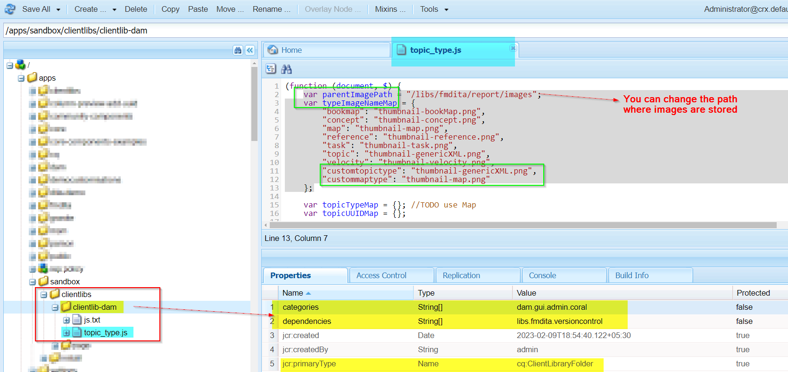

# Symbol für benutzerdefinierte/spezialisierte Datentypen (Thema oder Zuordnung) konfigurieren


## Problem-Anweisung

Wenn Sie in AEM Guides ein benutzerdefiniertes Schema verwenden, können Sie benutzerdefinierte Themen- oder Zuordnungstypen erstellen, sodass Sie feststellen können, dass die benutzerdefinierten Themen-/Zuordnungstypen im Web-Editor oder in der Assets-Benutzeroberfläche nicht als Symbol angezeigt werden. Siehe unten Screenshot als Referenz.


Um den benutzerdefinierten Themen-/Zuordnungstypen ein Symbol zuzuweisen, müssen Sie also Folgendes tun:
- Suchen Sie den benutzerdefinierten Themen-/Zuordnungstyp
- Stile schreiben, um das gewünschte Symbol für den benutzerdefinierten Typ hinzuzufügen


Wir können die oben genannten Schritte implementieren, um das Symbol im Web-Editor (Repository-Ansicht) sowie in der Assets-Benutzeroberfläche anzuzeigen. Im Folgenden finden Sie die Schritte für beide


## Symbol für benutzerdefiniertes Thema/Zuordnung in der Ansicht des Web-Editors anzeigen

_Schritt 1:_ Bestimmen Sie den Datentyp für das benutzerdefinierte Datenthema/die benutzerdefinierte Datenzuordnung
- Öffnen Sie die Repository-Ansicht im Web-Editor > Öffnen der Entwicklerkonsole im Browser.
- Inspect den Symbolraum neben dem aufgelisteten Thema/der aufgelisteten Zuordnung
- Überprüfen Sie die dem benutzerdefinierten Thema zugewiesene Klasse.
- Weitere Informationen finden Sie im Screenshot unten  .
- Wir werden diese Klasse verwenden, um Symbol zuzuweisen und CSS für diese Klasse zu schreiben.

_Schritt 2:_ Erstellen Sie CSS und weisen Sie diesem Datentyp ein Symbol zu.
- Erstellen Sie eine Client-Bibliothek unter /apps, beispielsweise Sie erstellen einen cq:ClientLibraryFolder unter dem gewünschten Pfad
   - Fügen Sie Kategorien &quot;apps.fmdita.xml_editor.page&quot;hinzu.
- Erstellen Sie unter diesem Verzeichnis den Ordner &quot;assets&quot;und fügen Sie alle Symbole hinzu, die Sie für benutzerdefinierte Datentypen verwenden möchten
- Fügen Sie eine CSS-Datei im Client-Bibliotheksordner hinzu, z. B. &quot;tree-icons.css&quot;.
   - Hinzufügen des folgenden Codes

```
            .tree-item-icon {
                &.custommaptype {
                    background-image: url('assets/custommap.svg')
                }
                &.customtopictype {
                    background-image: url('assets/customtopic.svg')
                }
            }
```

- Fügen Sie css.txt im Client-Bibliotheksordner hinzu und fügen Sie einen Verweis zu &quot;tree-icon.css&quot;hinzu, der gerade erstellt wurde.
- diese Änderungen speichern/bereitstellen

Weitere Informationen finden Sie im folgenden Screenshot.


Die endgültige Ausgabe wird im folgenden Screenshot gezeigt


## Symbol für benutzerdefiniertes Thema/Zuordnung in der Assets-Benutzeroberfläche anzeigen

_Schritt 1:_ zur Bestimmung des Datentyps des benutzerdefinierten Datenthemas/der benutzerdefinierten Datenzuordnung
- Dies wird in Schritt 1 der vorherigen Methoden erläutert.

_Schritt 2:_ Erstellen Sie ein JavaScript, um zu definieren, welche Symbole für den benutzerdefinierten Datentyp für benutzerdefinierte Themen-/Zuordnungstypen geladen werden sollen
- Erstellen Sie eine Client-Bibliothek unter /apps, beispielsweise Sie erstellen einen cq:ClientLibraryFolder unter dem gewünschten Pfad
   - Fügen Sie die folgenden Eigenschaften hinzu:
      - &quot;categories&quot;(multivalue string)-Wert als &quot;dam.gui.admin.coral&quot;
      - &quot;dependencies&quot;(multivalue string)-Wert als &quot;libs.fmdita.versioncontrol&quot;
- Erstellen Sie eine Kopie der Datei &quot;/libs/fmdita/clientlibs/clientlibs/xmleditor/clientlib-dam/topic_type.js&quot;in dieses Verzeichnis /apps .
   - Bearbeiten Sie den kopierten &quot;topic_type.js&quot;und ändern/fügen Sie customtopictype unter der Variablen &quot;typeImageNameMap&quot;hinzu.
   - Sie können auch den Pfad des Ordners &quot;images&quot;ändern, indem Sie den Wert der Variablen &quot;parentImagePath&quot;an die Stelle ändern, an der benutzerdefinierte Symbole gespeichert werden
- Erstellen Sie eine Datei mit dem Namen js.txt im Client-Bibliotheksordner und fügen Sie &quot;topic_type.js&quot;einen Verweis hinzu.
- diese Änderungen speichern/bereitstellen
Weitere Informationen finden Sie im folgenden Screenshot.
  

Und die endgültige Ausgabe wird wie im Screenshot  gezeigt angezeigt
