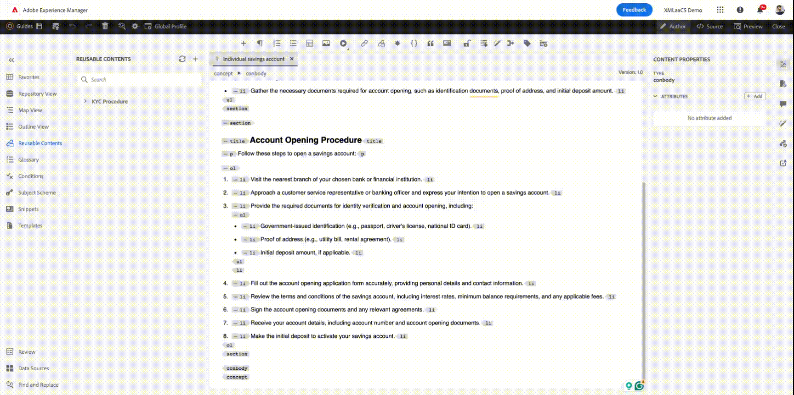

# Wiederverwendbarkeit von Inhalten in AEM Guides

Adobe AEM Guides nutzt die Stärken von DITA, um eine benutzerfreundliche Oberfläche für die Wiederverwendung von Inhalten bereitzustellen.

In diesem Artikel wird Folgendes behandelt:

1. [Wiederverwendbarkeit mit Themenreferenz (`topicrefs`)](#reusability-using-topic-referencestopicref)
2. [Wiederverwendbarkeit mithilfe von Inhaltsreferenzen (`conref` und `conkeyref`)](#reusability-using-content-reference-conref--conkeyref)
3. [Bonustipp zur Wiederverwendung von Inhalten durch Drag-and-Drop in AEM Guides](#reuse-content-with-a-single-click-in-aem-guides)

## Wiederverwendbarkeit mithilfe von Themenreferenzen (topicref)


Nehmen wir an, Sie sind ein Produktionsunternehmen und haben allgemeine Themen zu Sicherheitsvorkehrungen oder Fehlerbehebungstechniken.

Diese können in spezifischen Benutzerhandbüchern für jedes Maschinenmodell referenziert und angepasst werden, um Redundanz zu reduzieren und sicherzustellen, dass die grundlegenden Sicherheitsinformationen konsistent bleiben.

```
<map id="user_manual_model 100" title="ABC Model 100 User Manual ">


<topicref href="Safety_Information.dita" format="dita">
</topicref>
.
.
.
.
.
</map>
```


Ähnlich für Modell 200

```
<map id="user_manual_model 200" title="ABC Model 200 User Manual ">

<topicref href="Safety_Information.dita" format="dita">
</topicref>
.
.
.
.
.
  
</map>
```

## Wiederverwendbarkeit mit Inhaltsreferenz (conref und conkeyref)

Mit dem Inhaltsreferenz-Attribut (conref) können Sie Links zu anderen Teilen Ihres Inhalts erstellen. Dies fördert die Wiederverwendbarkeit und reduziert Redundanz.

Beispiel:

Nehmen wir an, Sie sind ein Finanzunternehmen und haben ein generisches Thema für KYC, das KYC-Verfahren für Einzelpersonen, Unternehmen usw. enthält.

Sie möchten einzelne KYC-Fragmente für die Themen „Sparkonto“ und „Dematkonto“ wiederverwenden.

```
<section id="kyc_requirements_saving_account">
  <title>Know Your Customer (KYC) Requirements</title>
  <p>To comply with regulations and ensure customer identification, all individual applicants for savings  accounts must fulfill the KYC requirements as outlined below</p>
  <p conref=kyc_procedures.dita#individual_kyc></p>
</section>
```

Hier ist `conref=kyc_procedures.dita#indvidual_kyc` kyc_procedure.dita die Dateikennung und #individual_kyc die Fragmentkennung.

KYC_Procedure.dita ist weiterhin die einzige Informationsquelle. Wenn Änderungen der Vorschriften Aktualisierungen des KYC-Prozesses erfordern, aktualisieren Sie den Themenpfad mit dem neuen. Die Änderungen werden automatisch in allen Themen übernommen, die darauf verweisen.

Die beiden Klicks von AEM Guides

Schritt 1: Klicken Sie auf Wiederverwendbaren Inhalt einfügen .


<br>

Schritt 2: Wählen Sie die Datei und das Fragment aus, die wiederverwendet werden sollen.


Ähnlich wie „conref“ können Sie auch „conkeyref“ verwenden, wenn Sie Inhalte über einen Schlüssel referenzieren, anstatt einen Inhaltspfad anzugeben

Code-Beispiel :

```
<section conkeyref="kyc_procedure/individual_kyc_procedure" id="individual_kyc_procedure"></section>
```

Die Schlüsseldefinition sieht wie folgt aus:

```
<map id="ABC_manual">
  <title>ABC_Manual</title>
  <topicref href="kyc_procedure_2020.dita" keys="kyc_procedure" processing-role="resource-only" type="concept">
  </topicref>
  <topicref href="savings_account.dita" type="concept">
  </topicref>
</map>
```

Schlüssel - &#39;KYC_PROCEDURE&#39; ist weiterhin die zentrale Informationsquelle. Wenn es Änderungen am KYC-Prozess gibt, die durch Vorschriften erforderlich sind, müssen Sie einfach einen Themenpfad mit einem neuen Themenpfad aktualisieren, und diese Änderungen werden automatisch in allen Themen übernommen, die darauf verweisen.

```
<map id="ABC_manual">
  <title>ABC_Manual</title>
  <topicref href="kyc_procedure_2024.dita" keys="kyc_procedure" processing-role="resource-only" type="concept">
  </topicref>
  <topicref href="savings_account.dita" type="concept">
  </topicref>
</map>
```

Hier wird der Themenpfad aufgrund kürzlich erfolgter Regeländerungen von „kyc_procedure_2020.dita“ zu „kyc_procedure_2024.dita“ geändert.

Die beiden Klicks von AEM Guides

Schritt 1: Klicken Sie auf Wiederverwendbaren Inhalt einfügen .


Schritt 2: Wählen Sie Ihre Stammzuordnung (optional), Ihren Schlüssel und Ihr Fragment aus, die wiederverwendet werden müssen.


Hier wurde die Stammzuordnung automatisch ausgewählt, da sie bereits in der Zuordnungsansicht geöffnet war.


## Wiederverwenden von Inhalten mit einem Klick in AEM Guides

AEM Guides bietet die Funktion „Wiederverwendbare Inhalte“, mit der Sie mit einem Klick Inhaltsreferenzen hinzufügen können.

Schritt 1: Hinzufügen eines allgemeinen Themas zu wiederverwendbaren Inhalten


Schritt 2: Ziehen Sie das Fragment, das Sie wiederverwenden möchten, nach dem Hinzufügen per Drag-and-Drop in eines Ihrer Zielthemen.




## Häufig gestellte Fragen

### Nach Auswahl der Datei/des Schlüssels im Dialogfeld „Inhalt wiederverwenden“ wird kein Inhalt angezeigt

Weisen Sie Fragmenten (Ditelementen) IDs zu, die Sie in anderen Themen wiederverwenden möchten

## Schlüssel werden nicht im Dialogfeld Inhalt wiederverwenden angezeigt

Vergewissern Sie sich, dass Sie die Stammzuordnung/übergeordnete Zuordnung in der Zuordnungsansicht geöffnet haben, die über eine Schlüsseldefinition verfügt, oder fügen Sie den Stammzuordnungspfad manuell im selben Dialogfeld hinzu.


<br>
<br>
<br>


Posten Sie bei der AEM Guides Community [Forum](https://experienceleaguecommunities.adobe.com/t5/experience-manager-guides/ct-p/aem-xml-documentation) für alle Fragen.
