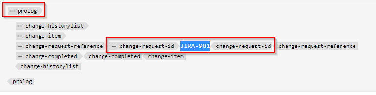

# Neue benutzerdefinierte ausführbare Schaltfläche in der Web-Editor-Symbolleiste hinzufügen

In diesem Artikel erfahren Sie, wie Sie eine neue benutzerdefinierte Schaltfläche in der Web-Editor-Symbolleiste hinzufügen und JavaScript aufrufen, um den gewünschten benutzerdefinierten Vorgang auszuführen.

Das Hinzufügen einer ausführbaren Schaltfläche zum Web-Editor umfasst die folgenden Schritte:
- Hinzufügen der Schaltfläche in der Datei *ui_config.json* an der Stelle, an der sie benötigt wird
- Registrieren des Klickereignisses für die Schaltfläche im Web-Editor, damit Benutzer beim Klicken eine Aktion ausführen können


## Beispielhafte Implementierung

Lassen Sie uns dies anhand eines Beispiels verstehen, bei dem ein Autor einen Jira-Verweis zu einem Thema-Prolog-Abschnitt hinzufügen möchte. Der Prologabschnitt mit der eingebetteten Jira-Referenz-ID kann wie folgt aussehen:



Das Element „change-request-id“, das die JIRA-ID enthält, sollte von der API abgerufen werden (beispielsweise auf der Grundlage einer bestimmten JIRA-Abfrage, die von der Anwendung dargestellt wird). Wenn der Benutzer den Abschnitt prolog erstellt, sollte er auf eine Schaltfläche klicken und eine Jira-Referenz-ID aus der Symbolleiste des Web-Editors einfügen können, z. B.:


Wenn der Benutzer auf die Schaltfläche klickt, sollte ein Dialogfeld angezeigt werden, in dem die möglichen Optionen abgerufen werden können und der Benutzer die gewünschte JIRA-ID auswählen kann, z. B.:


die dann die „change-request-id“ zum Prolog hinzufügen sollte:


## Implementieren von


### Fügen Sie die Schaltfläche im Web-Editor hinzu, indem Sie sie in &quot;*_config.json“*

Überprüfen Sie mithilfe der Ordnerprofile *ui_config.json* auf der Registerkarte „XML-Editor-Konfiguration“ und fügen Sie die JSON-Schaltflächenkonfiguration zum gewünschten Abschnitt der Gruppe „Symbolleiste“ hinzu

```
{
    "on-click":"insertJIRARef",
    "icon":"linkCheck",
    "variant":"quiet",
    "type":"button",
    "title":"Insert JIRA Reference"
}
```

[Verwenden Sie diesen Link, um mehr über das Ordnerprofil und die Konfiguration von ui_config.json zu erfahren](https://experienceleague.adobe.com/docs/experience-manager-guides-learn/videos/advanced-user-guide/editor-configuration.html?lang=en)


### Verarbeiten des Klickereignisses für die neue Schaltfläche

HINWEIS: Die unten genannten Schritte sind als angehängtes Paket in diesem Beitrag verfügbar


- Erstellen Sie nach dem Speichern des Profilordners ein „cq:ClientLibraryFolder&quot; in einem Projektverzeichnis (möglicherweise unter */apps*) und fügen Sie Eigenschaften hinzu, wie im folgenden Screenshot gezeigt:
  

```
This example uses "coralui3" library to show a dialog as it is used in the Javascript sample we presented.
You may use different library of your choice.
```

- Erstellen Sie unter diesem Client-Bibliotheksordner zwei Dateien wie unten erwähnt:
   - *overrides.js*: enthält den JavaScript-Code für das On-Click-Ereignis für „insertJIRARef“ (verwendet das angehängte Paket, um den Inhalt dieses JavaScripts abzurufen)
   - *js.txt*: enthält „overrides.js“, um dieses JavaScript zu aktivieren

- Speichern Sie die Änderungen, und Sie sollten bereit zum Testen sein.


### Testen

- Web-Editor öffnen
- Wählen Sie in den Benutzereinstellungen den Profilordner aus, dem Sie die benutzerdefinierte Datei *ui_config.json“ hinzugefügt*. Wenn Sie es zum globalen Profil hinzugefügt haben, verwenden Sie es wahrscheinlich bereits.
- Öffnen Sie ein Thema, Sie werden feststellen, dass die Symbolleiste eine neue Schaltfläche „Jira-Referenz einfügen“ hat
- Sie können dann einen Prologabschnitt wie unten angegeben zum Thema hinzufügen und versuchen, auf die Schaltfläche „Jira-Referenz einfügen“ innerhalb des Prologelements „change-request-reference“ zu klicken

```
<prolog>
    <change-historylist>
        <change-item>
            <change-request-reference>
            </change-request-reference>
            <change-completed></change-completed>
            <change-summary></change-summary>
        </change-item>
    </change-historylist>
</prolog>
```

Siehe Screenshot unten, um zu erfahren, wie es aussehen wird:


### Anhänge

- clientlibs-Beispielpaket, das die WebEditor-Client-Bibliothek mit JavaScript-Code für die Symbolleistenschaltflächen-Aktion installiert: [Laden Sie über diesen Link herunter](../../../assets/authoring/webeditor-addbuttonontoolbar-insertjira-clientlib.zip)
- Beispiel *ui_config.json*, das Sie in einen Profilordner hochladen können: [Beispieldatei ui_config.json herunterladen](../../../assets/authoring/sample_ui_config_Guides4.2-InsertJiraReference.json)

```
Please note this is compatible to AEM 6.5 and AEM Guides version 4.2.
If you are using a different version please add the toolbar button to the ui_config.json manually.
```
