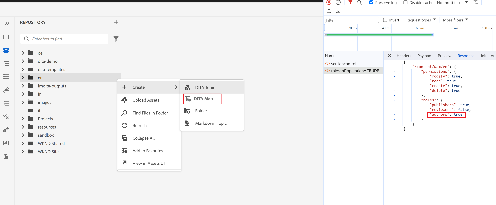

# &#39;Create DitaMAP&#39; aus dem Ordnerkontextmenü im Web-Editor anzeigen/ausblenden

In diesem Artikel erfahren Sie, wie Sie den Web-Editor für Handbücher so anpassen können, dass die Option „Ditmap erstellen“ im Kontextmenü des Ordners auf der Grundlage von Benutzer-/Gruppenberechtigungen ein- oder ausgeblendet wird.
In diesem Anwendungsfall blenden wir diese Option für alle Benutzer aus, die keine Autoren sind.

## Voraussetzungen

Wir verwenden das AEM Guides-Erweiterungspaket, mit dem Sie die Benutzeroberfläche Ihrer App entsprechend Ihren Anforderungen anpassen können.
Lesen Sie diese [Dokumentation](https://github.com/adobe/guides-extension/tree/main) um mehr darüber zu erfahren, wie das Guides-Erweiterungs-Framework funktioniert.

Beginnen wir nun mit der Anpassung des Ordnerkontextmenüs, um diese Option für alle Nicht-Autoren-Benutzer auszublenden.

Wie Sie im folgenden Ausschnitt sehen können, ist die Option „Create DitaMap“ für einen Autoren-Benutzer sichtbar.



Sehen wir uns nun an, wie wir diese Option mithilfe des Handbücher-Erweiterungs-Frameworks ausblenden können.

## Implementierungsschritte

Die Implementierung ist in die folgenden Teile unterteilt:

- **Änderungen im Ordner_Optionen-Controller**

  Jedem Kontextmenü ist eine Controller-ID zugeordnet. Dieser Controller übernimmt die On-Event-Funktionalität für die verschiedenen Kontextmenüoptionen.

  In diesem Beispiel passen wir das Kontextmenü des Ordners an, um die Option „Create DitaMap“ für Nicht-Autoren auszublenden. Dazu nehmen wir Änderungen an der Datei „folder_options.ts“ vor, die sich unter /src im Repository des Erweiterungs-Frameworks der Handbücher befindet.

  „viewState“ wird als „REPLACE“ verwendet, um diese Option aus dem Kontextmenü auszublenden.
Ein neues Widget in diesem Ordner_Optionen wird über den Schlüssel &#39;id&#39; aufgerufen.

```typescript
const folderOptions = {
  id: "folder_options",
  contextMenuWidget: "repository_panel",
  view: {
    items: [
      {
        component: "widget",
        id: "customditamap",
        target: {
          key: "displayName",
          value: "DITA Map",
          viewState: VIEW_STATE.REPLACE,
        },
      },
    ],
  },
};
```

- **Erstellen eines neuen Widgets zur Verarbeitung der Logik**

  Es ist eine neue Widget-Erstellung (customoptions.ts) erforderlich, um die Logik zum Ausblenden dieser Option nur für Nicht-Autoren-Benutzer zu schreiben. Um dies zu erreichen, haben wir die Taste „Anzeigen“ verwendet, die als Umschalter in unserer JSON-Struktur dient.

  Sie können Ihr eigenes externes Servlet schreiben, um die Gruppendetails zu überprüfen. Auf diese Weise können Sie die Menüoptionen des Ordners auch für Ihre benutzerdefinierte Gruppe anpassen.
In diesem Beispiel haben wir den vorkonfigurierten AEM-Aufruf „rollesapi“ genutzt, um die Benutzerdetails abzurufen und die Antwort in „isAuthor“ festzulegen, wie in den obigen Ausschnitten dargestellt.

```typescript
const folderOptions = {
  id: "customditamap",
  view: {
    component: "button",
    quiet: true,
    icon: "breakdownAdd",
    label: "DITA Map",
    "on-click": "createNewDitaMap",
    show: "@extraProps.isAuthor",
  },
};
```

Dadurch können wir die Schaltfläche mit der Bezeichnung als „Dita Map“ basierend auf dem Wert von „show“ ausblenden.

Wir haben einen Controller hinzugefügt, um das Attribut „isAuthor“ im Modell festzulegen. Dies kann mit der folgenden Syntax im Controller erfolgen.

```typescript
this.model.extraProps.set("key", value);
```

Hier lautet der Schlüssel „isAuthor“ und der Wert ist die Antwort des rollenapi-Aufrufs.
Wir haben auch das Ereignis „createNewDitaMap“ definiert, um die Option „Create DitaMap“ (für Autorenbenutzer) zu aktivieren.

```typescript
controller: {
    init: function () {
      this.model.extraProps.set("isAuthor", false);

      rolesApiResponse.then((result) => {
        console.log(result);
        this.model.extraProps.set(
          "isAuthor",
          result["/content/dam"].roles.authors
        );

        console.log("testresult" + result["/content/dam"].roles.authors);
      });
    },
    createNewDitaMap() {
      repositoryController && repositoryController.next("create_new.map");
    },
  },
```

- **Hinzufügen des benutzerdefinierten Codes**

  Importieren Sie „folder_options.ts“ und „customOptions.ts“ in die Datei „index.ts“ unter /src.

## Testen

- Melden Sie sich bei AEM mit einem Benutzer an, der nicht zur Autorengruppe gehört. Die Option Ditmap erstellen würde im Kontextmenü eines beliebigen Ordners ausgeblendet, wie unten dargestellt.
Dieser Anwendungsfall wurde zu GIT hinzugefügt. Weitere Informationen finden Sie unten in den entsprechenden Ressourcen.


### Verwandte Ressourcen

- **Basisrepository für Erweiterungs-Framework** - [GIT](https://github.com/adobe/guides-extension/tree/main)

- **Dokumentation** - [auf Experience League](../../../../../guides-ui-extensions/aem_guides_framework/basic-customisation.md)

- **Dokumentierte häufige Anwendungsfälle** - [auf Experience League](../../../../../guides-ui-extensions/aem_guides_framework/jui-framework.md)

- **Öffentliches Repository mit Beispielen** - [auf GIT](https://github.com/adobe/guides-extension/tree/sc-expert-session). Verzweigung sc-expert-session verweisen

```

```
