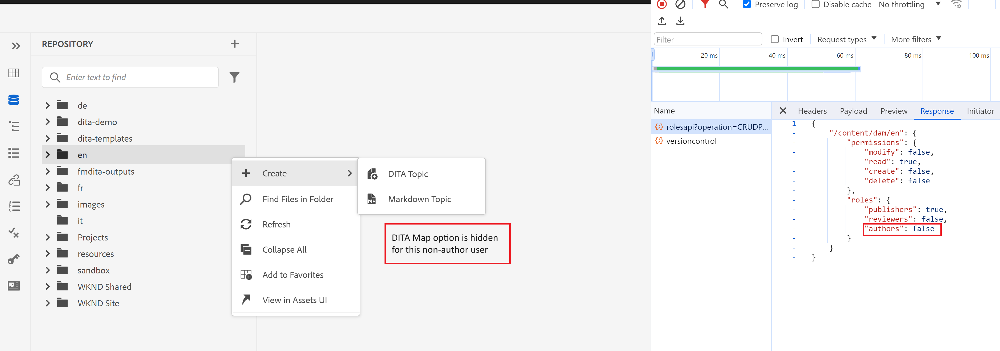

# Anzeigen/Ausblenden von &quot;DitaMAP erstellen&quot;im Ordnerkontextmenü im Webditor

In diesem Artikel erfahren Sie, wie Sie den Guides-Web-Editor anpassen können, um die Option &quot;DitaMap erstellen&quot;im Ordner-Kontextmenü auszublenden oder anzuzeigen, basierend auf Benutzer-/Gruppenberechtigungen.
In diesem Anwendungsfall wird diese Option für alle Benutzer ohne Autorenberechtigung ausgeblendet.

## Voraussetzungen

Wir nutzen das Erweiterungspaket AEM Guides , mit dem Sie die Benutzeroberfläche Ihrer App gemäß Ihren Anforderungen anpassen können.
Bitte gehen Sie durch [Dokumentation](https://github.com/adobe/guides-extension/tree/main) , um weitere Einblicke in die Funktionsweise des Guides Extension Framework zu erhalten.

Jetzt erfahren Sie, wie Sie das Kontextmenü des Ordners anpassen, um diese Option für alle Benutzer ohne Autorenberechtigung auszublenden.

Wie Sie im folgenden Snippet sehen können, ist die Option &quot;DitaMap erstellen&quot;für einen Autor-Benutzer sichtbar.


Lassen Sie uns nun sehen, wie wir diese Option mithilfe des Guides Extension Framework ausblenden können.

## Implementierungsschritte

Die Implementierung ist in folgende Teile unterteilt:

- **Änderungen am Controller &quot;Folder_options&quot;**

  Jedem Kontextmenü ist eine Controller-ID zugeordnet. Dieser Controller verarbeitet die On-Event-Funktionalität für die verschiedenen Kontextmenüoptionen.

  In diesem Beispiel passen wir das Ordner-Kontextmenü an, um die Option &quot;DitaMap erstellen&quot;für Nicht-Autoren auszublenden. Dazu nehmen wir Änderungen an der Datei folder_options.ts vor, die unter /src im Handbücher-Framework-Repository für Erweiterungen vorhanden ist.

  Wir verwenden &quot;viewState&quot;als &quot;ERSETZEN&quot;, um diese Option im Kontextmenü auszublenden.
Wir rufen ein neues Widget in diesem Ordner_options über den Schlüssel &#39;id&#39; auf.

```typescript
const folderOptions = {
  id: "folder_options",
  contextMenuWidget: "repository_panel",
  view: {
    items: [
      {
        component: "widget",
        id: "customditamap",
        target: {
          key: "displayName",
          value: "DITA Map",
          viewState: VIEW_STATE.REPLACE,
        },
      },
    ],
  },
};
```

- **Erstellen eines neuen Widgets zur Verarbeitung der Logik**

  Eine neue Widget-Erstellung (customoptions.ts) ist erforderlich, um die Logik zu schreiben, um diese Option nur für Benutzer ohne Autorenberechtigung auszublenden. Um dies zu erreichen, haben wir den &#39;show&#39;-Schlüssel verwendet, der als Umschalter in unserer JSON-Struktur fungiert.

  Sie können Ihr eigenes externes Servlet schreiben, um die Gruppendetails zu überprüfen. Auf diese Weise können Sie auch Ordnermenüoptionen für Ihre benutzerspezifische Gruppe anpassen.
In diesem Beispiel haben wir den OOTB-AEM &quot;rolesapi&quot;-Aufruf genutzt, um die Benutzerdetails abzurufen und die Antwort in &quot;isAuthor&quot;festzulegen, wie in den oben genannten Snippets gezeigt.

```typescript
const folderOptions = {
  id: "customditamap",
  view: {
    component: "button",
    quiet: true,
    icon: "breakdownAdd",
    label: "DITA Map",
    "on-click": "createNewDitaMap",
    show: "@extraProps.isAuthor",
  },
};
```

Dadurch können wir die Schaltfläche mit dem Titel &quot;Dita Map&quot;, basierend auf dem Wert von &#39;show&#39;, ausblenden.

Wir haben einen Controller hinzugefügt, um das Attribut &#39;isAuthor&#39; im Modell festzulegen. Dies kann mit der folgenden Syntax im Controller erfolgen.

```typescript
this.model.extraProps.set("key", value);
```

Hier ist der Schlüssel &quot;isAuthor&quot;und der Wert ist die Antwort vom rolesapi-Aufruf.
Wir haben auch das Ereignis &quot;createNewDitaMap&quot;definiert, um die Option &quot;DitaMap erstellen&quot;zu aktivieren (für Autor-Benutzer).

```typescript
controller: {
    init: function () {
      this.model.extraProps.set("isAuthor", false);

      rolesApiResponse.then((result) => {
        console.log(result);
        this.model.extraProps.set(
          "isAuthor",
          result["/content/dam"].roles.authors
        );

        console.log("testresult" + result["/content/dam"].roles.authors);
      });
    },
    createNewDitaMap() {
      repositoryController && repositoryController.next("create_new.map");
    },
  },
```

- **Hinzufügen des angepassten Codes**

  Importieren Sie die Dateien folder_options.ts und customoptions.ts in die Datei index.ts unter /src.

## Testen

- Melden Sie sich bei AEM mit einem Benutzer an, der nicht zur Gruppe der Autoren gehört. Die Option DitaMap erstellen würde im Kontextmenü eines jeden Ordners ausgeblendet, wie unten dargestellt.
Dieser Anwendungsfall wurde zu GIT hinzugefügt. Bitte finden Sie die entsprechenden Ressourcen unten.



### Verwandte Ressourcen

- **Basis-Repository für Erweiterungs-Framework** - [GIT](https://github.com/adobe/guides-extension/tree/main)

- **Dokumentation** - [auf Experience League](../../../../../guides-ui-extensions/aem_guides_framework/basic-customisation.md)

- **Häufige Anwendungsfälle dokumentiert** - [auf Experience League](../../../../../guides-ui-extensions/aem_guides_framework/jui-framework.md)

- **Öffentliches Repository mit Beispielen** - [auf GIT](https://github.com/adobe/guides-extension/tree/sc-expert-session). Siehe Verzweigung sc-experte-session

```

```
