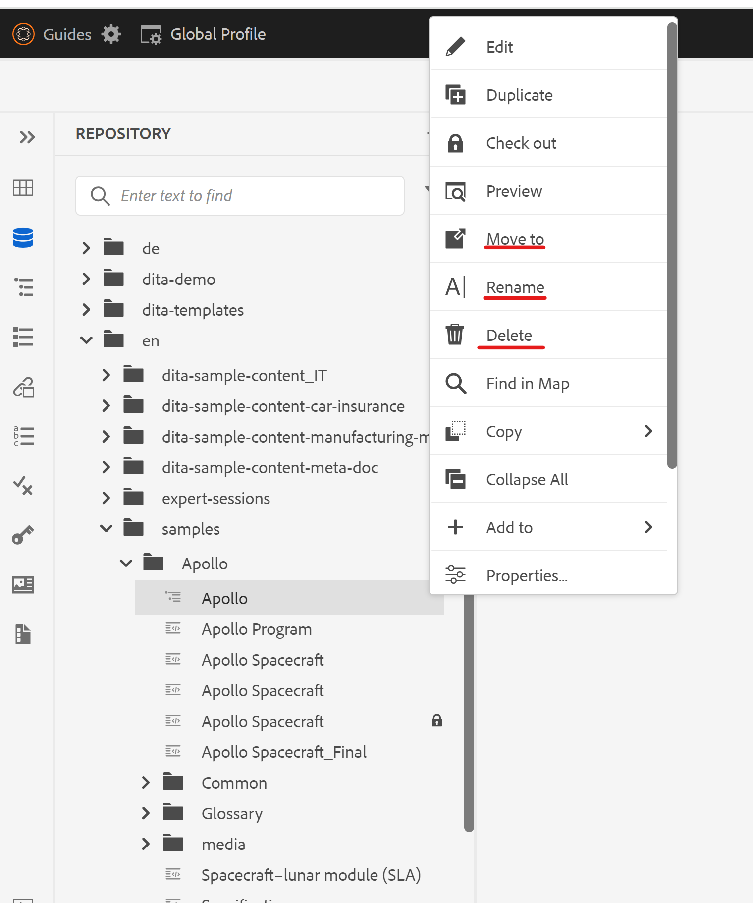

# Option „Löschen“ aus dem Datei-Kontextmenü im Web-Editor entfernen

In diesem Artikel erfahren Sie, wie Sie die Option „Löschen“ im Dateikontextmenü im AEM Guides-Web-Editor für bestimmte Benutzende oder Gruppen ausblenden. Für andere Anpassungen der Optionen im Datei-Kontextmenü überprüfen Sie bitte das Handbuch-Erweiterungs-Framework. Weitere Informationen finden Sie [hier](https://github.com/adobe/guides-extension/tree/main).

Wie Sie im folgenden Ausschnitt sehen können, ist im Dateikontextmenü für diesen Benutzer die Option „Löschen“ verfügbar.



Sehen wir uns nun an, wie wir die Option „Löschen“ für diesen Benutzer ausblenden können.

## Implementierungsschritte:

- Navigieren Sie von der AEM-Startseite aus zu Tools > Sicherheit > Berechtigungen .
- Wählen Sie die Gruppe oder den Benutzer aus dem Suchfeld aus.
- Klicken Sie oben rechts auf „ACE hinzufügen“.
- Wählen Sie den Ordnerpfad.
- Einschließen der Berechtigungen „jcr:removeChildNodes“ und „jcr:removeNode“.
- Wählen Sie „Berechtigungstyp“ als „Ablehnen“ aus und klicken Sie wie unten dargestellt auf „Hinzufügen“.


### Testen

- Melden Sie sich bei AEM als der Benutzer an, für den der ACE hinzugefügt wurde.
- Öffnen Sie den Web-Editor.
- Gehen Sie zur Repository-Ansicht und wählen Sie den Ordner aus, für den die ACEs hinzugefügt wurden.
- Öffnen Sie das Datei-Kontextmenü.
- Die Option „Löschen“ wird nicht im Kontextmenü angezeigt.

Das Datei-Kontextmenü sieht nun wie folgt aus:


```
Please note that these steps would also remove 'move' and 'rename' options from the Web Editor as they are also tied to delete process at the backend.
```
