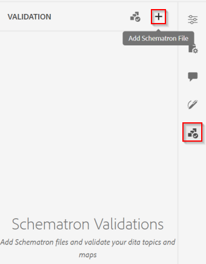

# Steuern der Inhaltsqualität im Web-Editor

Dieser Artikel bietet einen Überblick über die Validierungsmöglichkeiten innerhalb des AEM Guides-Web-Editors.
Der Web-Editor nutzt standardmäßig das im System eingerichtete DITA-Schema, um Benutzer dazu zu zwingen, DITA-konforme Inhalte zu erstellen. Damit sind alle im System gespeicherten Inhalte strukturierte, wiederverwendbare und gültige DITA-Inhalte.

Neben der Unterstützung für DITA-Regeln unterstützt der Web-Editor auch die Validierung von Inhalten, die auf &quot;*&quot;-* basieren.

&quot;*Schematron*&quot; bezieht sich auf eine regelbasierte Validierungssprache, die zum Definieren von Tests für eine XML-Datei verwendet wird. Sie können die Schematron-Dateien importieren und auch im Web-Editor bearbeiten. Mithilfe einer „Schematron“-Datei können Sie bestimmte Regeln definieren und diese dann für ein DITA-Thema oder eine Zuordnung validieren. Schematronregeln können die Konsistenz der XML-Struktur sicherstellen, indem sie als Regeln definierte Einschränkungen auferlegen. Diese Einschränkungen werden von KMUs gesteuert, die für die Qualität und Konsistenz der Inhalte verantwortlich sind.

HINWEIS: Der Web-Editor unterstützt ISO Schematron.


## Wissen, wie „Schematron“ im Web-Editor funktioniert

### Konfigurieren von Schematron-Regeln

Siehe Abschnitt „Unterstützung für Schematron-Dateien“ im [Benutzerhandbuch](https://helpx.adobe.com/content/dam/help/en/xml-documentation-solution/4-2/Adobe-Experience-Manager-Guides_UUID_User-Guide_EN.pdf#page=148)


### Durchsetzen von Validierungsregeln beim Speichern von Dateien

Mit den WebEditor-Einstellungen können Power-User Schematron-Regeln/-Dateien einrichten, die jedes Mal ausgeführt werden, wenn ein Benutzer den Inhalt aktualisiert. Weitere Informationen finden Sie im Abschnitt „Validierung“ im [Benutzerhandbuch](https://helpx.adobe.com/content/dam/help/en/xml-documentation-solution/4-2/Adobe-Experience-Manager-Guides_UUID_User-Guide_EN.pdf#page=58)


### Kann die Validierung manuell ausgeführt werden?

Ja, als Autor/Benutzer können Sie beim Erstellen von Inhalten das Bedienfeld „Schematron“ im Web-Editor verwenden, um eine Schematron-Datei hochzuladen und Validierungen für die im Editor geöffnete Datei durchzuführen.

Damit dies funktioniert, muss der Ordnerprofiladministrator allen Benutzern erlauben, Schemtron-Dateien im Validierungsbereich hinzuzufügen. Siehe Editor-Einstellungen (Screenshot oben)




### Unterstützte Regeln

Die aktuelle Version von AEM Guides unterstützt nur die Validierung mithilfe von auf „Assertion“ basierenden Regeln. (Siehe [Asset vs. Bericht](https://schematron.com/document/205.html))
Regeln, die auf „Berichten“ basieren, werden noch nicht unterstützt.


### Beispiele und weitere Hilfen zu Schematron-Regeln

#### Beispiele für Anwendungsfälle

- Prüfen, ob ein Link extern ist und ob er den Bereich „extern“ hat

  ```
  <sch:pattern>
      <sch:rule context="xref[contains(@href, 'http') or contains(@href, 'https')]">
          <sch:assert test="@scope = 'external' and @format = 'html'">
              All external xref links must be with scope='external' and format='html'
          </sch:assert>
      </sch:rule>
  </sch:pattern>
  ```

- Überprüfen, ob mindestens eine „topicref“ in einer Karte oder mindestens eine „li“ unter einer „ul“ vorhanden ist

  ```
  <sch:pattern>
      <sch:rule context="map">
          <sch:assert test="count(topicref) > 0">
              There should be atleast one topicref in map
          </sch:assert>
      </sch:rule>
  
      <sch:rule context="ul">
          <sch:assert test="count(li) > 1" >
              A list must have more than one item.
          </sch:assert>
      </sch:rule>
  </sch:pattern>
  ```

- Das Element „indexTerm“ sollte immer in einem „prolog“ vorhanden sein

  ```
  <sch:pattern>
      <sch:rule context="*[contains(@class, ' topic/indexterm ')]">
          <sch:assert test="ancestor::node()/local-name() = 'prolog'">
              The indexterm element should be in a prolog.
          </sch:assert>
      </sch:rule>
  </sch:pattern>
  ```

#### Ressourcen

- Grundlagen [ Schematron](https://da2022.xatapult.com/#what-is-schematron)
- Weitere Informationen [Assertionsregeln im Schematron](https://www.xml.com/pub/a/2003/11/12/schematron.html#Assertions)
- [Beispieldatei für Schematron](../../../assets/authoring/sample_schematron.sch)
