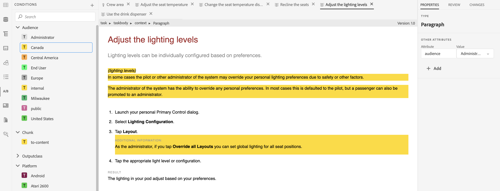

# Arbeiten mit bedingten Inhalten

**Anwendungsfall**

* Autoren können Bedingungen für einen Inhalt festlegen, damit sie steuern können, ob er in der Ausgabe angezeigt wird.

* Autoren können beim Veröffentlichen auswählen, ob sie unterschiedliche Bedingungen anzeigen/ausblenden möchten.

* Autoren können beispielsweise Attribute als Version 1.0 und Version 2.0 im Inhalt hinzufügen und Bedingungen verwenden, um Version 1.0 für Version 1.0 einzuschließen und Version 2.0 auszuschließen.

**Schritt 1**

Definieren Sie Bedingungen, die für die Dokumentation in [!UICONTROL Ordnerprofile] relevant sind:
Siehe Abschnitt **Konfigurieren von bedingten Attributen für globale Profile oder Profile auf Ordnerebene** in [Seite 69 des Installations- und Konfigurationshandbuchs](https://helpx.adobe.com/content/dam/help/en/xml-documentation-solution/4-2/Adobe-Experience-Manager-Guides_Installation-Configuration-Guide_EN.pdf)

**Schritt 2**

Wählen Sie das **[!UICONTROL Ordnerprofil]** aus, das in Schritt 1 unter **Benutzereinstellungen** im XML-Editor definiert ist:
Siehe Abschnitt **Benutzereinstellungen** in [Seite 41 des Benutzerhandbuchs](https://helpx.adobe.com/content/dam/help/en/xml-documentation-solution/4-2/Adobe-Experience-Manager-Guides_User-Guide_EN.pdf)

**Schritt 3**

Verwenden Sie die Bedingungen, um Inhaltsabschnitte an Bedingungen zu knüpfen:
Siehe Abschnitt **Bedingungen** in [Seite 90 des Benutzerhandbuchs](https://helpx.adobe.com/content/dam/help/en/xml-documentation-solution/4-2/Adobe-Experience-Manager-Guides_User-Guide_EN.pdf)

**Schritt 4**

Definieren Sie Bedingungsvorgaben auf Zuordnungsebene, um zu entscheiden, welche Bedingungen in der Ausgabe aktiviert werden sollen:
Siehe Abschnitt **Verwenden von** in [Seite 249 des Benutzerhandbuchs](https://helpx.adobe.com/content/dam/help/en/xml-documentation-solution/4-2/Adobe-Experience-Manager-Guides_User-Guide_EN.pdf)
