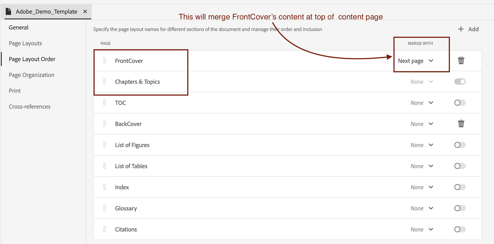

# Hinzufügen von Unternehmens-Branding zur ersten Seite einer DITA PDF

## Dieser Artikel behandelt Folgendes:

Erreichen des Unternehmens-Brandings durch die nahtlose Zusammenführung der FrontCover-Seite mit der Kapitelseite, um sicherzustellen, dass die Identität des Unternehmens oben im Inhalt gut sichtbar ist.

- [Einrichten von Inhalten](#set-up-your-content)
- [Nehmen Sie die erforderlichen Änderungen in der PDF-Vorlage vor](#create-necessary-changes-in-pdf-template)

**before:**


<br>
<br>

**after:**


## Einrichten von Inhalten

Um Inhalte im PDF-Format zu veröffentlichen, müssen Sie eine Ditamap oder eine Bookmap erstellen.

Bookmap-Beispielstruktur :

```
<bookmap>
  <title>My Bookmap Title </title>
  <frontmatter>
    <booklists>
      <toc/>
      <figurelist/>
      <tablelist/>
    </booklists>
  </frontmatter>

  <chapter href="chapter1.ditamap">
  <chapter href="chapter2.ditamap">
  </chapter>

  <backmatter>
    <booklists>
      <indexlist/>
    </booklists>
  </backmatter>
</bookmap>
```

Beispielstruktur für Ditamap:

```
<map title="My map Title">

  <topicref href="topic1.dita" >
  </topicref>
  <topicref href="topic2.dita">
  </topicref>
  
</map>
```

Das FrontCover von PDF wird automatisch generiert, wenn Bookmap `<frontmatter>` enthält.


## Nehmen Sie die erforderlichen Änderungen in der PDF-Vorlage vor

In diesem Abschnitt werden wir unsere Vorlage einrichten. (Sie können die High-Tech-Vorlage verwenden oder duplizieren, um zu beginnen.)

### Richten Sie Ihre Vorlage ein :

- Navigieren Sie zu Ihrer nativen PDF-Vorlage.
- Öffnen Sie das Layout der Titelseite und bearbeiten Sie es.
- Fügen Sie hier Ihr Branding-Bild in `data-region="content"` hinzu.
- Fügen Sie bei Bedarf weitere erforderliche Änderungen in Ihrer Kapitelvorlage hinzu.
- Führen Sie nun je nach Inhalt die folgenden Schritte aus.


#### Wenn Sie Ditamap für die PDF-Generierung verwenden:

Beim Veröffentlichen einer DITAMAP bietet Native PDF die Möglichkeit, automatisch eine FrontCover-Seite zu generieren. Die Option zum Aktivieren oder Deaktivieren der Frontend-Seitenerstellung kann in der nativen PDF-Vorlage konfiguriert werden.

Zusammenführen:
- Gehen Sie zu den Einstellungen Ihrer nativen PDF-Vorlage > Seitenlayout-Reihenfolge
- Fusioniert nun FrontCover mit der nächsten Seite, d.h. Kapitel &amp; Themen.
  
- Vorlage speichern, diese Vorlage für Voreinstellung auswählen und veröffentlichen!


#### Wenn Sie die Generierung von Bookmap für PDF verwenden

Bei einer Bookmap wird die Reihenfolge der Seitenlayoutreihenfolge durch die Struktur der Bookmap und nicht durch die Reihenfolge der Vorlage gesteuert.

Um dies für Bookmap zu erreichen, verwenden wir die JavaScript-Funktion von NativePDF.

- Fügen Sie im Ressourcenordner Ihrer Vorlage unter JavaScript Folgendes hinzu

```
window.addEventListener('DOMContentLoaded', function () {
    window.pdfLayout.onAfterPagination(function () {
        var frontMatterWrappers = document.querySelectorAll('.rh-front-matter-wrapper');

        frontMatterWrappers.forEach(function(wrapper) {
            var contentDiv = wrapper.querySelector('div[data-region="content"]');
            var chapterBody = document.querySelector('.chapter-body');

            if (contentDiv && chapterBody) {
                chapterBody.insertBefore(contentDiv, chapterBody.firstChild);
            }

            wrapper.remove();
        });
    });
});
```

- Fügen Sie diese JavaScript in Ihre Kapitelvorlage ein.
  

- Aktivieren von JavaScript über die Option „Voreinstellung“
  

- Veröffentlichen!

## Anlagen :

- [Laden Sie das PDF-Beispielvorlagenpaket herunter, um die angewendeten Änderungen anzuzeigen.](../assets/publishing/NativePDF_DemoTemplate.zip)
- [Laden Sie das Beispielpaket für PDF-Vorgaben herunter, um die angewendeten Änderungen anzuzeigen.](../assets/publishing/Preset_Package.zip)


## Weitere Ressourcen:

- [Einbinden des Inhaltsverzeichnisses von DITA Bookmap in PDF](./how-to-include-bookmap-toc-in-pdf-publishing.md)
- [Expertenvideo zu nativen PDF](../../expert-sessions/native-pdf-publishing-eamples-part1-june2023.md)
