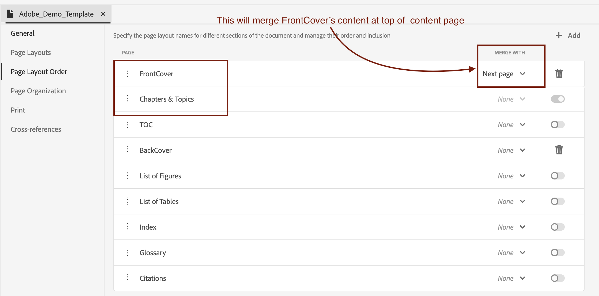

# Hinzufügen von Enterprise Branding zur ersten Seite einer DITA-PDF

## Dieser Artikel behandelt:

Erreichen des Enterprise-Brandings durch nahtloses Zusammenführen der FrontCover-Seite mit der Kapitelseite, wodurch sichergestellt wird, dass die Unternehmensidentität ganz oben im Inhalt angezeigt wird.

- [Inhalt einrichten](#set-up-your-content)
- [Nehmen Sie die erforderlichen Änderungen in der PDF-Vorlage vor.](#create-necessary-changes-in-pdf-template)

**Before:**


<br>
<br>

**Nach:**


## Inhalt einrichten

Um Inhalte im PDF-Format zu veröffentlichen, müssen Sie eine Ditamap oder eine Lesekarte erstellen.

Beispielstruktur einer Lesekarte :

```
<bookmap>
  <title>My Bookmap Title </title>
  <frontmatter>
    <booklists>
      <toc/>
      <figurelist/>
      <tablelist/>
    </booklists>
  </frontmatter>

  <chapter href="chapter1.ditamap">
  <chapter href="chapter2.ditamap">
  </chapter>

  <backmatter>
    <booklists>
      <indexlist/>
    </booklists>
  </backmatter>
</bookmap>
```

Ditamap-Beispielstruktur:

```
<map title="My map Title">

  <topicref href="topic1.dita" >
  </topicref>
  <topicref href="topic2.dita">
  </topicref>
  
</map>
```

Der FrontCover von PDF wird automatisch generiert, wenn Bookmap `<frontmatter>` enthält.


## Nehmen Sie die erforderlichen Änderungen in der PDF-Vorlage vor.

In diesem Abschnitt werden wir unsere Vorlage einrichten. (Sie können die Hi-Tech-Vorlage verwenden oder duplizieren, um zu beginnen.)

### Einrichten der Vorlage :

- Gehen Sie zu Ihrer nativen PDF-Vorlage.
- Gehen Sie zum Seitenlayout von FrontCover und bearbeiten Sie es.
- Fügen Sie hier Ihr Branding-Bild in `data-region="content"` hinzu.
- Fügen Sie bei Bedarf weitere erforderliche Änderungen in Ihrer Kapitelvorlage hinzu.
- Gehen Sie nun entsprechend Ihrem Inhalt wie folgt vor:


#### Wenn Sie Ditamap für die PDF-Generierung verwenden:

Beim Veröffentlichen eines DITAMAP bietet Native PDF die Möglichkeit, automatisch eine FrontCover-Seite zu erstellen. Die Option zur Aktivierung oder Deaktivierung der FrontCover-Seitenerstellung kann in der Vorlage Native PDF konfiguriert werden.

Zusammenführen:
- Navigieren Sie zu Ihren nativen PDF-Vorlageneinstellungen > Seitenlayoutreihenfolge .
- Führen Sie nun FrontCover mit der nächsten Seite, d. h. Kapitel und Themen, zusammen.
  
- Vorlage speichern, Wählen Sie diese Vorlage für Ihre Vorgabe aus und veröffentlichen Sie sie!


#### Wenn Sie Bookmap für die PDF-Generierung verwenden

Im Fall einer Lesekarte wird die Sequenz der Seitenlayoutreihenfolge durch die Struktur der Lesekarte und nicht durch die Reihenfolge der Vorlage gesteuert.

Um dies für Bookmap zu erreichen, nutzen wir die JavaScript-Funktion von NativePDF.

- Fügen Sie im Ressourcenordner Ihrer Vorlage unterhalb von JavaScript hinzu

```
window.addEventListener('DOMContentLoaded', function () {
    window.pdfLayout.onAfterPagination(function () {
        var frontMatterWrappers = document.querySelectorAll('.rh-front-matter-wrapper');

        frontMatterWrappers.forEach(function(wrapper) {
            var contentDiv = wrapper.querySelector('div[data-region="content"]');
            var chapterBody = document.querySelector('.chapter-body');

            if (contentDiv && chapterBody) {
                chapterBody.insertBefore(contentDiv, chapterBody.firstChild);
            }

            wrapper.remove();
        });
    });
});
```

- Schließen Sie diese JavaScript in Ihre Kapitelvorlage ein.
  

- JavaScript über die Vorgabenoption aktivieren
  

- Publish!

## Anhänge :

- [Laden Sie das Beispielpaket für PDF-Vorlagen herunter, um die angewendeten Änderungen anzuzeigen.](../assets/publishing/NativePDF_DemoTemplate.zip)
- [Laden Sie das PDF-Vorgabenpaket herunter, um die angewendeten Änderungen anzuzeigen.](../assets/publishing/Preset_Package.zip)


## Weitere Ressourcen:

- [Einbinden von DITA Bookmap-Token in PDF](./how-to-include-bookmap-toc-in-pdf-publishing.md)
- [Video einer Expertensitzung zum nativen PDF](../../expert-sessions/native-pdf-publishing-eamples-part1-june2023.md)

