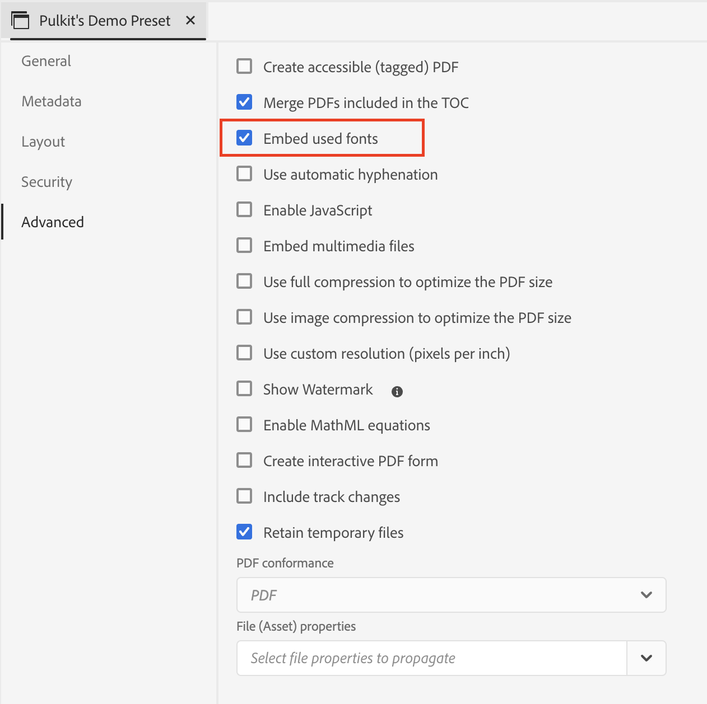

# Hinzufügen benutzerdefinierter Schriftarten zu Ihrem nativen DITA-PDF

## Dieser Artikel behandelt:

Hinzufügen der benutzerdefinierten Schriftart, um die Markenidentität und visuelle Konsistenz aller Inhalte zu verbessern.

Dieser Prozess umfasst drei Schritte:

- [Benutzerdefinierte Schriftart hochladen](#step-1--upload-the-custom-font-to-the-resource-folder-of-your-template)
- [Erforderliche Änderungen im Stylesheet der PDF-Vorlage vornehmen](#step-2--make-necessary-changes-in-pdf-templatess-stylesheet)

- [Einbetten verwendeter Schriftarten (optional)](#step-3-optional--embed-used-font-in-pdf)

## Schritt 1 : Laden Sie die benutzerdefinierte Schriftart in den Ressourcenordner Ihrer Vorlage hoch

 zum Hochladen und Importieren benutzerdefinierter Schriftarten

## Schritt 2 : Erforderliche Änderungen im Stylesheet der PDF-Vorlage vornehmen

 der PDF-Vorlage

## Schritt 3 (Optional) : Betten Sie die verwendete Schriftart in PDF ein

## Häufig gestellte Fragen

- ### Kann ich Adobe Fonts verwenden?

> Ja, gehen Sie zu fonts.adobe.com und klicken Sie auf „Zum Web-Projekt hinzufügen“.
> 
> Kopieren Sie Importcode wie `" @import url("https://use.typekit.net/xxxx.css")`.
>
> Fügen Sie Ihren CSS-Inhalt ein und nehmen Sie die gewünschten Änderungen in Ihrer CSS-Datei vor.

- ### Meine Schriftart wird nicht auf PDF angezeigt

> Überprüfen Sie die Schreibweise des Schriftnamens (häufigster Fehler).
>
> Stellen Sie sicher, dass Sie Schriftarten einbetten, wenn auf dem System, auf dem die PDF geöffnet wird, keine Schriftarten verfügbar sind.

- ## Für alle anderen Fragen wenden Sie sich bitte an Ihren jeweiligen CSM

## Weitere Ressourcen:

- [Einbinden des Inhaltsverzeichnisses von DITA Bookmap in PDF](./how-to-include-bookmap-toc-in-pdf-publishing.md)
- [Einbeziehen des Inhaltsverzeichnisses in PDF-Publishing](./how-to-include-bookmap-toc-in-pdf-publishing.md)
- [Expertenvideo auf nativem PDF](../../expert-sessions/native-pdf-publishing-eamples-part1-june2023.md)
