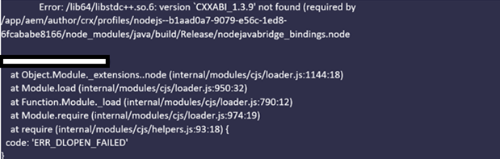
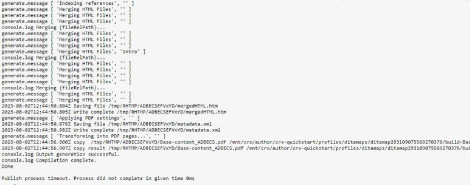

# Konfigurieren der AEM-Umgebung für die native PDF-Veröffentlichung

AEM Guides enthält eine native PDF-Publishing-Engine, mit der Benutzende den Inhalt im PDF-Format entwerfen, entwickeln und veröffentlichen können.

Es bietet die Möglichkeit, verschiedene Seiten-Layouts und CSS-Vorlagen zu erstellen und die PDF-Vorlagen in Verbindung mit den Seiten-Layouts und CSS zu entwerfen.

Die Schritte zum Konfigurieren dieser nativen PDF in AEM Guides unterscheiden sich je nach Betriebssystem. Führen Sie je nach Betriebssystem, auf dem AEM installiert ist, die folgenden Konfigurationsschritte aus.

## Voraussetzungen

Mindestanforderungen für die Einrichtung von nativem PDF:

- Installierte Java-Plattform, Standard Edition 8 oder 11 JDK (Java SE Development Kit) und JRE (Java SE Runtime Environment)
- AEM 6.5 SP13, SP12, SP11 oder SP10
- Handbücher 4.1 und höher (Nicht-UUID oder UUID)

Die native PDF-Publishing-Engine benötigt Oracle-JDK, um die Knotenmodule im AEM-Ordner „crx-quickstart“ zu generieren. Es unterstützt standardmäßig die folgenden Betriebssysteme:

- Windows 10, Windows 2019 Server und höher.
- Linux - (RHEL 8 und höher, CentOS 7 und höher, Ubuntu 18 und höher)
- Mac-Betriebssystem (Intel-basiert)

## Konfigurationsschritte für Windows Server (JAVA 11/8)

1. Stellen Sie sicher, dass der AEM-Server ausgefallen ist.
2. Klicken Sie in der Windows-Taskleiste mit der rechten Maustaste auf das Windows-Symbol, und wählen Sie System.
3. Klicken Sie im Fenster „Einstellungen“ unter „Verwandte Einstellungen“ auf Erweiterte Systemeinstellungen.
4. Klicken Sie auf der Registerkarte Erweitert auf Umgebungsvariablen.
5. Klicken Sie im Abschnitt „Systemvariablen“ auf _Neu_, um eine neue Umgebungsvariable zu erstellen.
6. Geben Sie den Variablennamen als JAVA_HOME ein.
7. Geben Sie im Feld Wert den Java-Installationspfad ein und klicken Sie auf OK.

   Zum Beispiel:

   JAVA 11

   C:\Program Files\JAVA\jdk-11.0.15.1

   JAVA 8

   C:\Program Files\JAVA\ jdk1.8.0_144

8. Fügen Sie einen aus Systemvariablen ausgewählten Pfad hinzu und klicken Sie auf Bearbeiten.

9. Geben Sie nun in den Pfadvariablen den Wert des Serverpfads ein und klicken Sie auf „OK“.

   Zum Beispiel:

   JAVA 11

   %JAVA_HOME%\bin\server\

   JAVA 8

   %JAVA_HOME%\jre\bin\server\

10. Klicken Sie im Dialogfeld „Umgebungsvariablen“ erneut auf „OK“.
11. Klicken Sie im Dialogfeld Systemeigenschaften erneut auf „OK“.
12. Starten Sie nun den AEM-Server.
13. Generieren von nativem PDF aus Vorgaben im Web-Editor

## Konfigurationsschritte für Linux Server (RHEL7/centOS 7)

1. Stellen Sie sicher, dass der AEM-Server ausgefallen ist
2. Überprüfen Sie die Variable JAVA_HOME anhand von echo $JAVA_HOME
3. Wenn die Variable JAVA_HOME nicht festgelegt ist, befolgen Sie Schritt 4. Gehen Sie andernfalls direkt zu Schritt 5.
4. Legen Sie die Variable JAVA_HOME basierend auf der installierten Java-Version mit den folgenden Befehlen fest

   Zum Beispiel:

   JAVA 11

   1. JAVA\_HOME=/usr/lib/jvm/java-11.0.15.1 exportieren
   2. export PATH=$PATH: $JAVA\_HOME/bin
   3. export LD\_LIBRARY\_PATH=/usr/lib/jvm/jdk-11.0.15.1/lib/server:/usr/java/jdk-11.0.15.1/lib/server

   JAVA 8

   1. JAVA\_HOME=/usr/lib/jvm/java-11.0.15.1 exportieren
   2. export PATH=$PATH: $JAVA\_HOME/bin

5. Starten Sie den AEM-Server neu und gehen Sie zu Schritt 12 über, wenn Sie Guides ab Version 4.2 verwenden.
6. Kopieren Sie &quot;_node_modules.zip_&quot;, das am Ende dieses Artikels angehängt ist, in das Verzeichnis crx-quickstart/profiles/nodejs—b1aad0a7-9079-e56c-1ed8-6fcababe8166/.
7. Öffnen Sie das Terminal in crx-quickstart/profiles/nodejs—b1aad0a7-9079-e56c-1ed8-6fcababe8166/ location.
8. Löschen Sie node_modules mit dem folgenden Befehl

   **rm -rf node_modules**

9. Entpacken Sie node_modules.zip mit dem folgenden Befehl

   **unzip node_modules.zip**

10. Wenn der Befehl unzip nicht installiert/erkannt wird, kann er mit dem folgenden Befehl installiert werden

    **yum install unzip**

11. Installieren Sie das fontconfig-Paket.
Befehl: yum install fontconfig
12. Generieren von nativem PDF aus Vorgaben im Web-Editor

**HINWEIS** : Das Paket node_modules.zip kann ([) ](https://acrobat.adobe.com/link/track?uri=urn:aaid:scds:US:295d8f03-41e1-429b-8465-2761ce3c2fb3) werden.

Der manuelle Import der heruntergeladenen Knotenmodule für das Linux-Betriebssystem ist eine Problemumgehung für Benutzende, die Guides 4.1 oder frühere Versionen verwenden (Schritte 6-12)

## Konfigurationsschritte für Mac-Computer (JAVA 11/8)

1. Installieren Sie Oracle JAVA 11 oder Oracle JAVA 8.
2. Setzen Sie die Umgebungsvariable JAVA_HOME auf das installierte JAVA-Verzeichnis.
3. Öffnen Sie eine Unix-Shell.
(Bash wird hier zum Einrichten der Konfiguration verwendet)

   Befehl: nano ~/.bashrc

4. Legen Sie die Variable JAVA_HOME basierend auf der installierten Java-Version mit den folgenden Befehlen fest

   Zum Beispiel:

   JAVA 11

   export JAVA\_HOME= /library/java/javVirtualMachines/jdk-11.0.15.1.jdk/contents/Home

5. Bashrc neu laden

   Befehl: source ~/.bashrc.

6. Überprüfen Sie, ob JAVA_HOME mit dem Befehl echo $JAVA_HOME festgelegt wurde

7. Führen Sie die folgenden drei Befehle über den AEM-Installationspfad aus

   C:/{aem-installation-folder}/crx-quickstart/profiles/nodejs—b1aad0a7-9079-e56c-1ed8-6fcababe8166

   i) Suchen . -type d -exec chmod 0755 {} \;
ii) Suchen . -type f -exec chmod 0755 {} \;
iii) ./node-darwin/bin/node node-darwin/lib/node_modules/npm/bin/npm-cli.js —prefix . install —unsafe-perm —scripts-predicate-node-path

8. Überprüfen Sie mit dem folgenden Befehl, ob Java installiert ist

   i) **ausführen./node-darwin/bin/node** Befehl aus dem Ordner /crx-quickstart/profiles/nodejs—b1aad0a7-9079-e56c-1ed8-6fcababe8166

   

   ii) a = Require(&#39;java&#39;)

9. Installieren Sie das fontconfig-Paket.
Befehl: apt install fontconfig

10. Generieren von nativem PDF aus Vorgaben im Web-Editor

## Fehlerbehebung

Nachfolgend sind die häufigen Fehler aufgeführt, die bei der PDF-Generierung auftreten können, wenn Umgebungsvariablen nicht ordnungsgemäß festgelegt sind.

### Nullzeiger-Ausnahme unter Windows/Mac OS

Wenn das Problem auch nach der Korrektur der Java-Umgebungseinstellungen weiterhin besteht, überprüfen Sie Folgendes:

1. Überprüfen, ob die Ausgabevorgabe korrekt definiert ist, oder eine neue Ausgabevorgabe ohne Leerzeichen erstellen.

2. Überprüfen Sie das Verzeichnis der Knotenressourcen unter /libs/fmdta/node_resources, um sicherzustellen, dass alle erforderlichen Bibliotheken während der Installation installiert sind.

### Fehlende Bibliotheken in RHEL 7 Linux OS

### Publish-Prozess-Timeout. Prozess wurde nicht innerhalb von 0ms abgeschlossen

Überprüfen Sie den Wert der Timeout-Eigenschaft für den NodeJS-Knoten in /var/dxml/profiles/b1aad0a7-9079-e56c-1ed8-6fcababe8166/nodejs im CRX-Repository. Der Standardwert ist 300.

Wenn Sie bei einem der oben genannten Schritte auf Probleme stoßen, stellen Sie Ihre Frage zur Unterstützung im AEM Guides Community [Forum](https://experienceleaguecommunities.adobe.com/t5/experience-manager-guides/ct-p/aem-xml-documentation).
