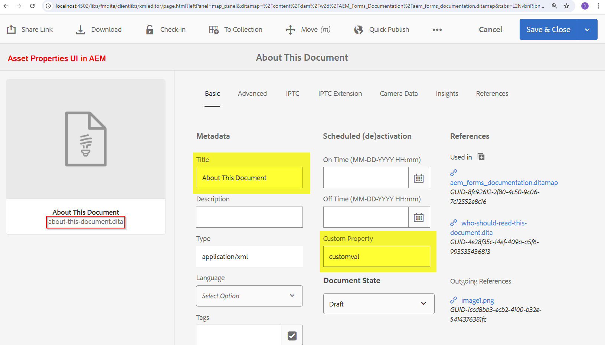

# Übertragen von AEM Assets-Metadaten in eine vom DITA-OT-Plug-in generierte Ausgabe

In diesem Artikel erfahren Sie, wie Sie Änderungen am DITA-OT-Plug-in implementieren, um die _„metadata.xml“ (verfügbar in temporären Dateien) zu lesen_ die vom AEM Guides-Veröffentlichungs-Workflow übergebenen Eigenschaften in DITA-OT-Plug-ins zu verwenden und in der generierten Ausgabe festzulegen.

Im Folgenden finden Sie allgemeine Schritte, die Sie in diesem Artikel lernen werden:
- Festlegen von Metadaten für die Ausgabevorgabe einer Diagrammvorlage in AEM Guides
- Greifen Sie bei der Ausgabegenerierung auf diese „metadata.xml“ im temporären DITA-OT-Verzeichnis zu.
- Implementierung im DITA-OT-Plug-in zum Lesen dieser _metadata.xml_ und unter Verwendung der verfügbaren Eigenschaften in der generierten Ausgabe
- Überprüfen der generierten Ausgabe, um die weitergegebenen Metadaten anzuzeigen

## Hintergrund

Mit AEM Guides können Sie DITA-OT-Plug-ins verwenden, um mithilfe der konfigurierten Plug-ins in Ausgabeformaten Ihrer Wahl zu veröffentlichen, und
Sie können auch Metadaten der im AEM-DAM verwalteten Assets an den DITA-OT-Prozess übergeben, um sie in der generierten Ausgabe zu verwenden. Weitere Informationen finden Sie in der Dokumentation unter [Einrichten von DITA-Zuordnungen/Themen zum Übergeben von Metadaten über eine Ausgabevorgabe](https://experienceleague.adobe.com/en/docs/experience-manager-guides/using/user-guide/output-gen/pass-metadata-dita-ot)


## Annahmen

Sie haben ein AEM-Setup mit AEM Guides Version 4.4.0/2024.6 oder höher
Sie verfügen über Vorkenntnisse zur Funktionsweise von DITA-OT und zur Verzeichnisstruktur


## Schritte erklärt

### Festlegen von Metadaten für das Asset

Mit dem AEM Assets-Metadatenschema können Sie benutzerdefinierte Eigenschaftsfelder für die Assets in AEM erstellen, wobei Benutzerinnen und Benutzer den Assets Metadaten zuweisen können. Nehmen Sie ein Beispiel für ein _Thema_-Asset, bei dem eine Metadaten mit dem Namen _customprop_ für ein Beispiel festgelegt werden kann. Siehe Screenshot unten:




### Konfigurieren der Metadaten in der DITA-Map-Ausgabevorgabe, die an DITA-OT übergeben werden sollen

Konfigurieren Sie eine Ausgabevorgabe Ihrer Wahl auf der Zuordnung, um Metadaten zu exportieren und an DITA-OT zu übergeben
Angenommen, wir generieren die HTML5-Ausgabe mit einem DITA-OT-Plug-in, z. B_„adobe.html_.
Im folgenden Screenshot erfahren Sie, wie Sie die Ausgabevorgabe für eine Zuordnung konfigurieren, um Metadaten an das DITA-OT-Plug-in zu übergeben.
1. Öffnen Sie eine Karte und navigieren Sie zur Registerkarte _Ausgabe_ für diese Karte und öffnen Sie die HTML5-Vorgabe, und klicken Sie auf _Erweitert_ Registerkarte, auf der Sie den Umwandlungsnamen als _adobe.html_ festlegen (dies ist das Plug-in, das wir konfigurieren und für unser Beispiel verwenden werden. Sie können auch Ihr benutzerdefiniertes Plug-in definieren)
2. Legen Sie _Temporäre Dateien beibehalten_ fest, um die temporären Dateien herunterladen und überprüfen zu können, wie metadata.xml gebildet wird. Sie können dies für die Entwicklung verwenden
3. Wählen Sie die Metadateneigenschaften aus, die Sie über „metadata.xml“ an DITA-OT übergeben möchten. In diesem Beispiel möchten wir „dc:title _und &quot;_&quot; __
4. Speichern Sie die Vorgabe und generieren Sie die Ausgabe
5. Herunterladen der temporären Datei über die in der Voreinstellung angezeigte Schaltfläche

Die oben beschriebenen Schritte werden im folgenden Screenshot erläutert:


### Implementieren des DITA-OT-Plug-ins

#### Zugriff auf „metadata.xml“ im temporären Verzeichnis

Im heruntergeladenen Paket mit temporären Dateien fällt eine Datei „metadata.xml“ auf, in der die Struktur der Eigenschaften und Werte sichtbar ist (siehe Screenshot unten)


##### Grundlegendes zu metadata.xml

- Diese Datei enthält eine Liste aller veröffentlichten Assets mit folgenden Eigenschaften:
   - Pfad der Datei im DITA-Verzeichnis ([ des Path-Elements]
   - und Liste der Metadateneigenschafts-Wert-Paare [unter dem _metadata_-Element]

```
        <Path id="topics\about-this-document.dita">
            <sourceProps>
                ...
            </sourceProps>
            <metadata>
                <meta isArray="false" key="dc:title">About This Document</meta>
                <meta isArray="false" key="customprop">customval</meta>
            </metadata>
        </Path>
```

#### Zugriff auf die Metadaten der einzelnen Assets im DITA-OT-Plug-in

Damit das DITA-OT-Plug-in die _metadata.xml) und_ darin verfügbaren Eigenschaften lesen kann, müssen wir folgende Schritte durchführen:
- Definieren Sie die benutzerdefinierten Plug-in-Einstellungen in _plugins.xml_, wo Sie die Parameter und den Integrator für die Plug-in-Initiierung definieren, unsere Beispiel-Plug-in-Datei sieht wie folgt aus:

```
<?xml version="1.0" encoding="UTF-8"?>
<plugin id="com.adobe.html">
    <require plugin="org.dita.html5"/>
    <feature extension="dita.conductor.transtype.check" value="adobe.html"/>
    <feature extension="ant.import" file="integrator.xml"/>
    <feature extension="dita.conductor.html5.param" file="params.xml"/>
    <feature extension="package.version" value="2024.1"/>
</plugin>
```

- Bei Plug-in-Initiierung:
   - Legen Sie eine Variable fest, die auf die Datei „metadata.xml“ verweist, d. h. in der Datei _integrator.xml_ unter dem Plug-in eine -Eigenschaft festlegen, um den Pfad der Metadatendatei zu definieren, und
   - Definieren Sie die Datei, die benutzerdefinierte XSL-Umwandlungsregeln ausführt, d. h. _args.xsl_, die in unserem Fall auf die Datei _xsl/adobe-html5.xsl_ verweisen.
Siehe Code unten:

```
    <property name="adobe.html.xsl.dir" value="${dita.plugin.com.adobe.html.dir}${file.separator}xsl${file.separator}"/>
    <property name="args.xsl" location="${adobe.html.xsl.dir}adobe-html5.xsl" />
    <dirname property="input.dirname" file="${args.input}"/>
    <makeurl file="${input.dirname}/metadata.xml" property="metadata.url"/>
```

- Übergeben Sie den Wert der Variablen _metadata.url_ an die benutzerdefinierte XSL, um sie bei Bedarf zu verwenden, d. h. in der vorhandenen/erstellten Datei _param.xml_ übergeben Sie den Parameter an das Plug-in, siehe unten eine Beispieldatei params.xml:

```
    <?xml version="1.0" encoding="UTF-8"?>
    <params xmlns:if="ant:if">
        <param name="metadata.url" expression="${metadata.url}" if:set="metadata.url"/>
    </params>
```

- In der benutzerdefinierten XSL-Umwandlungsdatei _xsl/adobe-html5.xsl_ können Sie die Metadatenwerte aus der Metadatendatei lesen und in der Ausgabe nach Belieben festlegen. In diesem Beispiel fügen wir die Metadatenwerte zu den HTML-Kopfzeilen > Meta-Tags hinzu. Siehe Code unten:

```
<xsl:import href="plugin:org.dita.html5:xsl/dita2html5.xsl"/>
    <xsl:param name="metadata.url"/>
    <xsl:template name="copyright">
        <xsl:if test="doc-available( $metadata.url )">
            <xsl:variable name="docName" select="tokenize( base-uri(), '/' )[ last() ]"/>
            <xsl:variable name="doc" select="doc( $metadata.url )"/>
            <xsl:for-each select="$doc//Path[ ends-with( @id, concat( '\', $docName ) ) ]/metadata/meta">
                <meta name="{ @key }" content="{ . }"/>
            </xsl:for-each>
        </xsl:if>
    </xsl:template>
```

Die obigen Schritte werden im Folgenden hervorgehoben


### Testen der Plug-in-Implementierung

Sie können das Plug-in testen, indem Sie den folgenden Befehl ausführen, um es mit den temporären Dateien zu testen, die von AEM heruntergeladen wurden (dort sind Map-Inhalte und die zugehörige metadata.xml vorhanden)

```
./dita --input=docsrc/samples/HTML5/aem_forms_documentation.ditamap --format=adobe.html
```

Angenommen, Sie haben die heruntergeladenen temporären Dateien in das Verzeichnis „DITA-OT/docsrc/samples/HTML5“ kopiert.
Sie können auch das Beispiel herunterladen, das im Abschnitt „Ressourcen“ unten angegeben ist.

Wenn der obige Befehl ausgeführt wird, können Sie die Ausgabe im Verzeichnis „DITA-OT/bin/out“ überprüfen, wo Sie die für das Thema „about-this-document.dita“ generierten HTML-Dateien überprüfen können. Diese enthalten die benutzerdefinierten Metadaten im _head_-Element

```
<head>
    <meta http-equiv="Content-Type" content="text/html; charset=UTF-8">
    <meta charset="UTF-8">
    <meta name="copyright" content="(C) Copyright 2024">
    <meta name="DC.format" content="HTML5">
    <meta name="DC.identifier" content="GUID-f193ea85-989d-4d80-99e2-2f5dea3d5310">
    <meta name="DC.language" content="en-US">
    <meta name="dc:title" content="About This Document">
    <meta name="customprop" content="customval">
    <title>About This Document</title>
</head>
```

### Bereitstellung

Sobald Sie das DITA-OT-Plug-in entwickelt haben, können Sie es mit dem Befehl _dita —install_ unter dem DITA-OT-Verzeichnis in das DITA-OT-Plug-in integrieren und auf dem AEM-Server bereitstellen [weitere Informationen finden Sie in diesem Artikel](https://experienceleaguecommunities.adobe.com/t5/experience-manager-guides/steps-to-setup-a-custom-dita-ot/td-p/407659)


## Ressourcen

1. Temporäre Beispieldateien aus der Beispiel-Ditamap heruntergeladen - [über diesen Link herunterladen](../../assets/publishing/sample-temp-html5-adobe.html-content.zip)
2. DITA-OT-Plug-in mit der oben erläuterten Implementierung [über diesen Link herunterladen](../../assets/publishing/sample-custom-plugin-com.adobe.html.zip)
