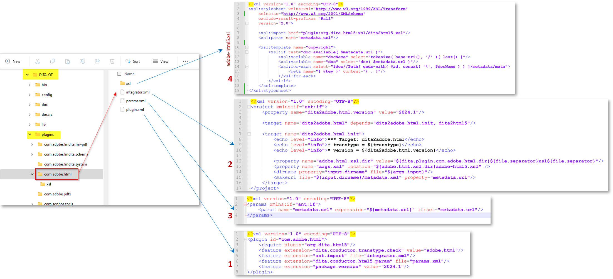

# Über diesen Artikel

In diesem Artikel erfahren Sie, wie Sie Änderungen am DITA-OT-Plug-in implementieren können, um die vom AEM Guides-Veröffentlichungs-Workflow übergebene Eigenschaft metadata.xml _(verfügbar in temporären Dateien)_ zu lesen und die Eigenschaften in DITA-OT-Plug-ins zu nutzen und in der generierten Ausgabe festzulegen.

Auf hoher Ebene sind im Folgenden die Schritte aufgeführt, die Sie in diesem Artikel lernen werden:
- Festlegen von Metadaten für die Ausgabevorgabe einer Ditamap-Datei in AEM Guides
- Greifen Sie bei der Ausgabegenerierung auf diese metadata.xml im temporären Ordner DITA-OT zu.
- Implementierung im DITA-OT-Plug-in zum Lesen dieser _metadata.xml_ und Verwendung der verfügbaren Eigenschaften in der generierten Ausgabe
- Überprüfen der generierten Ausgabe, um die propagierten Metadaten anzuzeigen

## Hintergrund

Mit AEM Guides können Sie mithilfe von DITA-OT-Plug-ins Veröffentlichungen in Ausgabeformaten Ihrer Wahl mithilfe der konfigurierten Plug-ins durchführen und
Sie können auch Metadaten der in AEM DAM verwalteten Assets an den DITA-OT-Prozess übergeben, um sie in der generierten Ausgabe zu verwenden. Weitere Informationen dazu finden Sie in der Dokumentation unter [Einrichten von ditamap/topics, um Metadaten über die Ausgabevorgabe weiterzugeben](https://experienceleague.adobe.com/en/docs/experience-manager-guides/using/user-guide/output-gen/pass-metadata-dita-ot)


## Annahmen

Sie verfügen über AEM Setup mit AEM Guides-Version 4.4.0/2024.6 oder höher.
Sie wissen bereits, wie DITA-OT funktioniert und welche Verzeichnisstruktur es gibt


## Erläuterung der Schritte

### Festlegen von Metadaten für das Asset

Mit dem AEM Assets-Metadatenschema können Sie benutzerdefinierte Eigenschaftsfelder für die Assets in AEM erstellen und Benutzer können den Assets Metadaten zuweisen. Beispiel eines _Thema_ -Assets, bei dem für ein Beispiel Metadaten mit dem Namen _customprop_ festgelegt werden können - siehe Screenshot unten:


### Konfigurieren der an DITA-OT zu übergebenden Metadaten für die DITA-Map-Ausgabevorgabe

Konfigurieren Sie die Ausgabevorgabe Ihrer Wahl auf der Karte, um Metadaten zu exportieren und an DITA-OT zu übergeben.
Angenommen, wir generieren eine HTML5-Ausgabe mithilfe eines DITA-OT-Plug-ins, z. B. _adobe.html_.
Im folgenden Screenshot erfahren Sie, wie Sie die Ausgabevorgabe für eine Zuordnung konfigurieren, um Metadaten an das DITA-OT-Plug-in zu übergeben.
1. Öffnen Sie eine Zuordnung, navigieren Sie zur Registerkarte _Ausgabe_ für diese Zuordnung, öffnen Sie die HTML5-Vorgabe und klicken Sie auf die Registerkarte _Erweitert_. Legen Sie in dieser Datei den Namen der Umwandlung auf _adobe.html_ fest (dies ist das Plugin, das wir konfigurieren und für unser Beispiel verwenden, Sie können auch Ihr benutzerdefiniertes Plugin definieren).
2. Legen Sie _temporäre Dateien beibehalten_ fest, um die temporären Dateien herunterladen und überprüfen zu können, wie metadata.xml gebildet wird. Sie können dies für die Entwicklung verwenden
3. Wählen Sie die Metadateneigenschaften aus, die Sie über metadata.xml an DITA-OT übergeben möchten. Nehmen wir in diesem Beispiel an, wir möchten _dc:title_ und _customprop_ übergeben
4. Speichern Sie die Vorgabe und erzeugen Sie die Ausgabe.
5. Laden Sie die temporäre Datei mithilfe der Schaltfläche herunter, die auf der Vorgabe angezeigt wird.

Im folgenden Screenshot erfahren Sie, wie Sie die oben beschriebenen Schritte durchführen:


### Implementieren des DITA-OT-Plug-ins

#### Zugreifen auf die Datei &quot;metadata.xml&quot;im temporären Ordner

Im heruntergeladenen Paket für temporäre Dateien wird eine Datei &quot;metadata.xml&quot;angezeigt, in der Sie die Struktur der Eigenschaften und Werte sehen können (siehe Screenshot unten).
Struktur und Konstrukte ](../../assets/publishing/publish-tempfiles-metadata-structure.png) von ![metadata.xml

##### Erläuterung von metadata.xml

- Diese Datei enthält eine Liste aller veröffentlichten Assets mit jeweils:
   - Pfad der Datei im DITA-Verzeichnis [id-Attribut des Pfadelements]
   - und Liste der Metadaten-Eigenschaftswertpaare [unter _Metadaten_ Element]

```
        <Path id="topics\about-this-document.dita">
            <sourceProps>
                ...
            </sourceProps>
            <metadata>
                <meta isArray="false" key="dc:title">About This Document</meta>
                <meta isArray="false" key="customprop">customval</meta>
            </metadata>
        </Path>
```

#### Zugreifen auf die Metadaten für jedes Asset im DITA-OT-Plug-in

Damit das DITA-OT-Plug-in die _metadata.xml_ und die darin verfügbaren Eigenschaften liest, müssen wir Folgendes tun:
- Definieren Sie die benutzerdefinierten Plug-in-Einstellungen in der Datei _plugins.xml_, in der Sie die Parameter und den Integrator für die Plug-in-Aktivierung definieren. Unsere Plug-in-Beispieldatei sieht wie folgt aus:

```
<?xml version="1.0" encoding="UTF-8"?>
<plugin id="com.adobe.html">
    <require plugin="org.dita.html5"/>
    <feature extension="dita.conductor.transtype.check" value="adobe.html"/>
    <feature extension="ant.import" file="integrator.xml"/>
    <feature extension="dita.conductor.html5.param" file="params.xml"/>
    <feature extension="package.version" value="2024.1"/>
</plugin>
```

- Bei der Plug-in-Initialisierung:
   - legen Sie eine Variable fest, die auf die Datei &quot;metadata.xml&quot;verweist, d. h. in der Datei _integrator.xml_ unter dem Plug-in, legen Sie eine Eigenschaft fest, um den Pfad der Metadatendatei zu definieren, und
   - definieren die Datei, in der benutzerdefinierte xsl-Transformationsregeln ausgeführt werden, d. h. _args.xsl_, die in unserem Fall auf die Datei _xsl/adobe-html5.xsl_ verweist.
Siehe folgenden Code:

```
    <property name="adobe.html.xsl.dir" value="${dita.plugin.com.adobe.html.dir}${file.separator}xsl${file.separator}"/>
    <property name="args.xsl" location="${adobe.html.xsl.dir}adobe-html5.xsl" />
    <dirname property="input.dirname" file="${args.input}"/>
    <makeurl file="${input.dirname}/metadata.xml" property="metadata.url"/>
```

- Übergeben Sie den Wert der Variablen _metadata.url_ an die benutzerdefinierte XSL, um ihn nach Bedarf zu verwenden, d. h. in der vorhandenen/erstellten _param.xml_ den Parameter an das Plug-in zu übergeben, siehe unten eine Beispieldatei params.xml :

```
    <?xml version="1.0" encoding="UTF-8"?>
    <params xmlns:if="ant:if">
        <param name="metadata.url" expression="${metadata.url}" if:set="metadata.url"/>
    </params>
```

- In der benutzerdefinierten XSL-Transformationsdatei _xsl/adobe-html5.xsl_ können Sie die Metadatenwerte aus der Metadatendatei lesen und in der Ausgabe wie gewünscht festlegen. In diesem Beispiel fügen wir die Metadatenwerte zum HTML-Kopf- > Meta-Tags hinzu. Siehe folgenden Code:

```
<xsl:import href="plugin:org.dita.html5:xsl/dita2html5.xsl"/>
    <xsl:param name="metadata.url"/>
    <xsl:template name="copyright">
        <xsl:if test="doc-available( $metadata.url )">
            <xsl:variable name="docName" select="tokenize( base-uri(), '/' )[ last() ]"/>
            <xsl:variable name="doc" select="doc( $metadata.url )"/>
            <xsl:for-each select="$doc//Path[ ends-with( @id, concat( '\', $docName ) ) ]/metadata/meta">
                <meta name="{ @key }" content="{ . }"/>
            </xsl:for-each>
        </xsl:if>
    </xsl:template>
```

Siehe Screenshot unten, in dem die obigen Schritte hervorgehoben werden



### Testen der Plug-in-Implementierung

Sie können das Plug-in testen, indem Sie den folgenden Befehl ausführen, um es mit den von AEM heruntergeladenen temporären Dateien zu testen (die Zuordnungsinhalt und die Metadaten-Datei &quot;xml&quot;enthält).

```
./dita --input=docsrc/samples/HTML5/aem_forms_documentation.ditamap --format=adobe.html
```

Angenommen, Sie haben die heruntergeladenen temporären Dateien im Verzeichnis &quot;DITA-OT/docsrc/samples/HTML5&quot;kopiert.
Sie können auch das Beispiel herunterladen, das im Abschnitt Ressourcen unten angegeben ist.

Wenn der obige Befehl ausgeführt wird, können Sie die Ausgabe im Verzeichnis &quot;DITA-OT/bin/out&quot;überprüfen, wo Sie die für das Thema &quot;about-this-document.dita&quot;generierten HTML-Dateien überprüfen können, die die benutzerdefinierten Metadaten im Element _head_ enthalten.

```
<head>
    <meta http-equiv="Content-Type" content="text/html; charset=UTF-8">
    <meta charset="UTF-8">
    <meta name="copyright" content="(C) Copyright 2024">
    <meta name="DC.format" content="HTML5">
    <meta name="DC.identifier" content="GUID-f193ea85-989d-4d80-99e2-2f5dea3d5310">
    <meta name="DC.language" content="en-US">
    <meta name="dc:title" content="About This Document">
    <meta name="customprop" content="customval">
    <title>About This Document</title>
</head>
```

### Bereitstellung

Nachdem Sie das DITA-OT-Plug-in entwickelt haben, können Sie es mit dem Befehl _dita —install_ im Ordner DITA-OT in das DITA-OT integrieren und es auf dem AEM-Server bereitstellen. [Weitere Informationen finden Sie in diesem Artikel](https://experienceleaguecommunities.adobe.com/t5/experience-manager-guides/steps-to-setup-a-custom-dita-ot/td-p/407659) .


## Ressourcen

1. Temporäre Beispieldateien, die von der Beispiel-DTM heruntergeladen wurden - [Download mit diesem Link](../../assets/publishing/sample-temp-html5-adobe.html-content.zip)
2. DITA-OT-Plug-in mit oben erläuterter Implementierung [Download mit diesem Link](../../assets/publishing/sample-custom-plugin-com.adobe.html.zip)