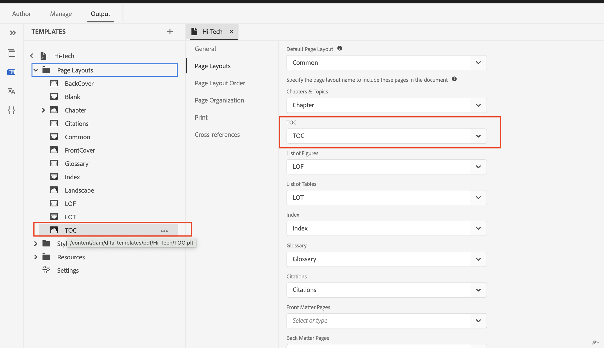
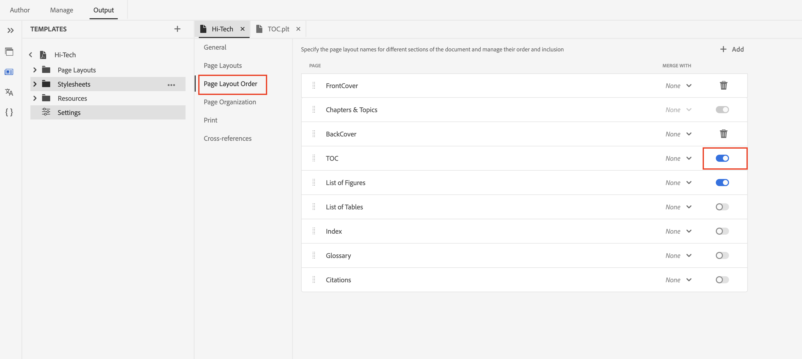

# Generieren des Inhaltsverzeichnisses von Bookmap in PDF Publishing

## Einrichten der Lesekarte

`<toc>` Element einschließen:
Suchen Sie in dem Element `<frontmatter>`der Lesekarte“ das Element `<booklists>` .  Verschachteln Sie ein `<toc>` Element in `<booklists>` wie folgt:

```
<frontmatter>
  <booklists>
    <toc/>  <figurelist/>
    <tablelist/>
  </booklists>
</frontmatter>
```

Mit der DITA-Spezifikation können Sie das Inhaltsverzeichnis und die Leselisten auch im `<backmatter>` Abschnitt platzieren.


```
<backmatter>
    <booklists>
      <toc/>
      <figurelist/>
      <indexlist/>
    </booklists>
  </backmatter>
```

Beispielstruktur von Bookmap mit Inhaltsverzeichnis , Figurenliste und Tabellenliste in Frontmatter und Indexliste in Backmatter.

```
<bookmap>
  <title>My Bookmap Title </title>
  <frontmatter>
    <booklists>
      <toc/>
      <figurelist/>
      <tablelist/>
    </booklists>
  </frontmatter>

  <chapter href="chapter1.ditamap">
  <chapter href="chapter2.ditamap">
  </chapter>

  <backmatter>
    <booklists>
      <indexlist/>
    </booklists>
  </backmatter>
</bookmap>
```

Das Inhaltsverzeichnis und die Leselisten werden automatisch basierend auf der in Ihrer Lesekarte definierten Struktur generiert.

Nachdem Sie Ihre Lesekarte eingerichtet haben, verwenden Sie native PDF , um die PDF-Ausgabe zu generieren. Es verarbeitet die Bookmap-Struktur und Referenzen, einschließlich Inhaltsverzeichnis und Leselisten.

## Inhaltsverzeichnisdesign und -bestellung in PDF

Die native PDF-Funktion bietet eine praktische Methode zur Anpassung des Layouts und Designs Ihres Inhaltsverzeichnisses.

Sie können den Entwurf über ein separates Seiten-Layout für Inhaltsverzeichnisse und Stile über layout.css steuern.

Das Inhaltsverzeichnis und die Reihenfolge anderer Booklists in PDF basieren nur auf der Bookmap-Struktur.




## Häufig gestellte Fragen

### Einbinden des Inhaltsverzeichnisses einer Ditamap in eine PDF

Ditamaps selbst haben kein direktes Inhaltsverzeichnis (Table of Contents, TOC) wie eine Bookmap. Allerdings spielen Diagramme eine entscheidende Rolle bei der Definition der Struktur für Ihre Inhalte und tragen indirekt zum Generierungsprozess des Inhaltsverzeichnisses bei.

Wenn Sie Ditamap veröffentlichen, bietet Native PDF Funktionen zum automatischen Generieren von Inhaltsverzeichnissen und Leselisten . Sie können die Generierung von Inhaltsverzeichnissen in Ditamap in den nativen Einstellungen von PDF aktivieren/deaktivieren.



## Zusätzliche Ressourcen :

- [Native Dokumentation zum Seitenlayout des PDF-Designs](https://experienceleague.adobe.com/en/docs/experience-manager-guides/using/install-guide/on-prem-ig/output-gen-config/config-native-pdf-publish/design-page-layout)
- [Native aufgezeichnete Expertensitzung von PDF Essentials](https://experienceleague.adobe.com/en/docs/experience-manager-guides/using/knowledge-base/expert-session/native-pdf-publishing-essentials-feb23)

<br>
<br>

Posten Sie bei der AEM Guides Community [Forum](https://experienceleaguecommunities.adobe.com/t5/experience-manager-guides/ct-p/aem-xml-documentation) für alle Fragen.


