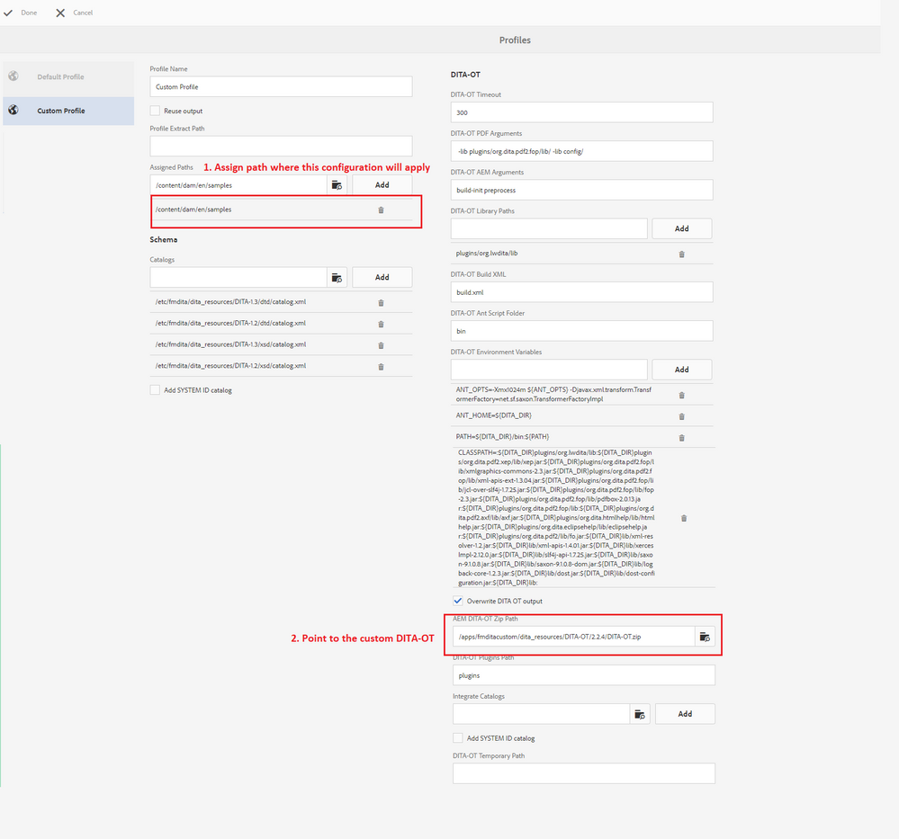

# Einrichten von benutzerdefiniertem DITA-OT in [!DNL AEM Guides] für AEM

Die Schritte zum Hinzufügen eines benutzerdefinierten DITA-OT werden im Abschnitt _Verwenden benutzerdefinierter DITA-OT_ des _Installations- und Konfigurationshandbuchs_ beschrieben.

Die allgemeinen Schritte sind:

+ Abrufen der grundlegenden DITA-OT-Daten
   + Wenn Sie eine Kopie des vordefinierten DITA-OT von [!DNL AEM Guides] erhalten möchten, laden Sie sie von Pfad `/etc/fmdita/dita_resources/DITA-OT.zip` herunter
   + Wenn Sie eine andere Version erhalten möchten, können Sie sie von [dita-ot repo](https://www.dita-ot.org/download)
+ Nehmen Sie Änderungen am DITA-OT vor, z[&#x200B; B. &#x200B;](https://www.dita-ot.org/dev/topics/plugins-installing.html) Hinzufügen eines neuen Plug-ins oder Anpassen vorhandener Plug-ins (siehe Beispiel im Abschnitt „Verknüpfte Links“ unten)
+ Upload `DITA-OT.zip` empfangen in `/apps/<project-folder>/dita_resources` (Erstellen eines benutzerdefinierten Projektordners wird empfohlen)
+ Fügen Sie DITA-Profile über **[!UICONTROL Tools]** > **[!UICONTROL Handbücher]** > **[!UICONTROL DITA-Profile]** hinzu (verwenden Sie den DITA-OT-Pfad, in den das benutzerdefinierte DITA-OT hochgeladen wird, siehe Screenshot unten)
  

>[!MORELIKETHIS]
>
>+ [Anpassen von DITA-OT-Plug-in-Beispielen](https://www.dita-ot.org/dev/topics/pdf-customization.html)
