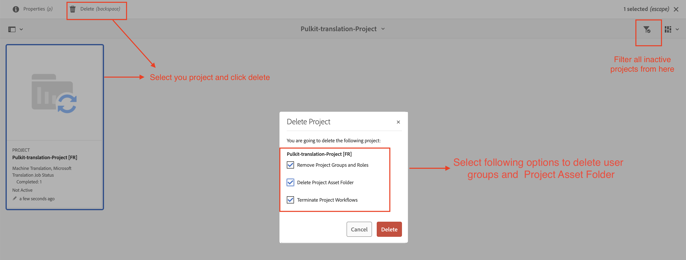

# Best Practices für die Übersetzung in AEM Guides

Die Leistung Ihres Übersetzungsprojekts kann mit zunehmender Übersetzungsaktivität im System abnehmen.

Bei jedem Übersetzungsprojekt werden mehrere Benutzergruppen für den Zugriff generiert, was zu einem Anstieg der Anzahl der Benutzergruppen innerhalb des Systems führt. Wenn die Anzahl der Benutzergruppen zunimmt, kann es CRUD-Vorgänge im Zusammenhang mit Benutzerberechtigungen schrittweise verlangsamen, was sich möglicherweise auf die Gesamtleistung der AEM auswirkt. Wenn Übersetzungsprojekte auch nach Abschluss des Vorgangs noch aktiv sind, kann sich dies negativ auf die Leistung der Synchronisierung von Übersetzungen zwischen AEM und dem Übersetzungsanbieter auswirken.

**Die Befolgung der unten beschriebenen Best Practices wird zur Aufrechterhaltung einer effizienten Umgebung beitragen.**

## Wenn Sie einen älteren Build als 4.6 (On-Premise) oder 2404 (Cloud) verwenden:

- Markieren Sie alle Projekte als „inaktiv“, sobald die Übersetzung abgeschlossen und genehmigt ist. Das Projekt bleibt zur Überprüfung verfügbar und wird einfach als inaktiv markiert.
   - Die folgenden Schritte helfen, die Gesamtleistung der Übersetzung bei gutem Zustand zu erhalten.

     

- Bei älteren Projekten sollte der Ordner, der als inaktiv markiert, genehmigt und überprüft ist, gelöscht werden
   - Die folgenden Schritte helfen Ihnen, die Gesamtübersetzungsleistung in einem guten Zustand zu halten, indem sie temporäre Übersetzungsdateien und Benutzergruppen bereinigen, die mit diesem Projektordner verknüpft sind.

     

## Wenn Sie eingeschaltet sind, erstellen Sie 4.6 oder 2404 oder höher:

Sie können weiterhin die oben genannten Schritte ausführen. Ab Version 4.6/2404 führt AEM Guides eine Editor-Einstellung für Admins ein, um das automatische Löschen von Übersetzungsprojekten zu deaktivieren.

Verweis : [Ein abgeschlossenes Übersetzungsprojekt automatisch löschen oder deaktivieren](https://experienceleague.adobe.com/en/docs/experience-manager-guides/using/user-guide/author-content/create-preview-topics/author-content-aem-guides/work-with-web-editor/translate-documents-web-editor#automatically-delete-or-disable-a-completed-translation-project)

