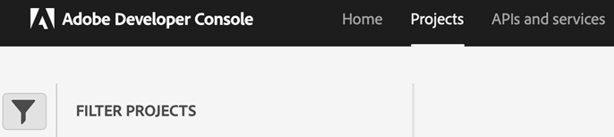
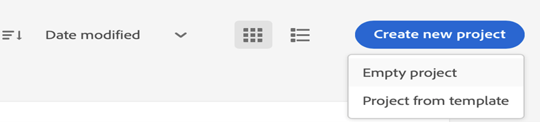
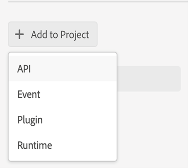

# Konfigurieren von auf Microservices basierender Veröffentlichung mit OAuth-Authentifizierung

Mit dem Publishing-Microservice können Sie große Publishing-Workloads gleichzeitig auf Experience Manager Guides as a Cloud Service ausführen und die branchenführende Adobe I/O Runtime-Serverloseplattform nutzen.

Für jede Veröffentlichungsanfrage führt Experience Manager Guides as a Cloud Service einen separaten Container aus, der entsprechend den Benutzeranfragen horizontal skaliert werden kann. Dies bietet die Möglichkeit, mehrere Veröffentlichungsanfragen auszuführen und eine bessere Leistung zu erzielen als ihre großen On-Premise-Adobe Experience Manager-Server.

>[!NOTE]
>
> Die auf Microservices basierende Veröffentlichung in Experience Manager Guides unterstützt PDF (sowohl native als auch DITA-OT-basierte), HTML5, JSON und benutzerdefinierte Typen von Ausgabevorgaben.

Da der Cloud-Publishing-Service durch Adobe IMS OAuth-basierte Authentifizierung gesichert ist, führen Sie die folgenden Schritte aus, um ihre Umgebungen in die sicheren Token-basierten Authentifizierungs-Workflows von Adobe zu integrieren und mit der Verwendung der Cloud-basierten skalierbaren Publishing-Lösung zu beginnen.


## Erstellen von IMS-Konfigurationen in Adobe Developer Console

**Zum Erstellen der Konfigurationen erforderliche Rolle**: Systemadministrator

Führen Sie die folgenden Schritte aus, um IMS-Konfigurationen in **Adobe Developer Console zu erstellen**:

>[!NOTE]
>
>Wenn Sie bereits ein OAuth-Projekt erstellt haben, um die KI-gestützten intelligenten Vorschläge für das Authoring zu konfigurieren, können Sie die folgenden Schritte überspringen, um das Projekt zu erstellen.

1. Öffnen Sie **Developer Console**: `https://developer.adobe.com/console`.

1. Wechseln Sie von oben zur **Projekte**-Registerkarte.

   

   *Wählen Sie die Registerkarte **Projekte**&#x200B;in der **Adobe Developer Console aus***

1. Um ein neues leeres Projekt zu erstellen, wählen Sie **Leeres Projekt** aus der Dropdown-Liste **Neues Projekt erstellen** aus.

   

   *Ein neues leeres Projekt erstellen.*

1. Wählen Sie **API** aus der Dropdown **Liste Zum Projekt hinzufügen**, um Ihrem Projekt die IO-Management-API hinzuzufügen.

   

   *Wählen Sie im Dropdown-Menü ein API-Projekt aus.*

   

   *Fügen Sie Ihrem Projekt die I/O-Management-API hinzu.*

1. Erstellen Sie neue OAuth-Anmeldeinformationen und speichern Sie sie.

   

   *Konfigurieren von OAuth-Anmeldeinformationen für Ihre API.*


1. Kehren Sie zur Registerkarte **Projekte** zurück und wählen Sie **Projektübersicht** auf der linken Seite aus.

   

   *Erste Schritte mit dem neuen Projekt.*

1. Klicken Sie oben auf **Schaltfläche** Herunterladen“, um die JSON-Datei des Services herunterzuladen.

   

   *JSON-Service-Details herunterladen.*

Sie haben die OAuth-Authentifizierungsdetails konfiguriert und die JSON-Service-Details heruntergeladen. Halten Sie diese Datei bereit, da sie im nächsten Abschnitt benötigt wird.


## Hinzufügen der IMS-Konfiguration zur Umgebung

>[!NOTE]
>
>Wenn Sie bereits ein OAuth-Projekt für intelligente Vorschläge erstellt haben, können Sie dasselbe Projekt für Microservices wiederverwenden und die folgenden Schritte überspringen, um die IMS-Konfiguration zur Umgebung hinzuzufügen.

### Aktualisieren der vorhandenen Konfiguration (JWT zu OAuth-Verschiebung )

Wenn Sie bereits einen Microservice für die Veröffentlichung mit JWT (veraltet) verwenden, führen Sie die folgenden Schritte aus, um die Konfigurationen zu aktualisieren:


1. Öffnen Sie **Experience Manager** und wählen Sie das Programm aus, das die zu konfigurierende Umgebung enthält.
1. Wechseln Sie zur Registerkarte **Umgebungen**.
1. Wählen Sie den Namen der Umgebung aus, die Sie konfigurieren möchten. Dadurch sollten Sie zur Seite **Umgebungsinformationen** gelangen.
1. Wechseln Sie zur Registerkarte **Konfiguration** .

1. Aktualisieren Sie das JSON-Feld SERVICE_ACCOUNT_DETAILS mit der neuen JSON-OAuth-Datei, die Sie heruntergeladen haben.
1. Löschen Sie das Feld PRIVATE_KEY .


   

   *Aktualisieren der vorhandenen JWT-Umgebungskonfigurationen.*

### Erstmalige Konfiguration

Um einen Veröffentlichungs-Microservice zum ersten Mal zu verwenden, aktualisieren Sie die Konfigurationen gemäß den folgenden Schritten:
1. Öffnen Sie **Experience Manager** und wählen Sie das Programm aus, das die zu konfigurierende Umgebung enthält.
1. Wechseln Sie zur Registerkarte **Umgebungen**.
1. Wählen Sie den Namen der Umgebung aus, die Sie konfigurieren möchten. Dadurch sollten Sie zur Seite **Umgebungsinformationen** gelangen.
1. Wechseln Sie zur Registerkarte **Konfiguration** .

1. Erstellen Sie eine neue Konfiguration mit dem Namen SERVICE_ACCOUNT_DETAILS. Fügen Sie im Wert den Inhalt der OAuth-JSON-Datei hinzu, den Sie von der Entwicklerkonsole heruntergeladen haben.


*Konfigurieren Sie die Umgebung zum ersten Mal.*


### Erstmalige Code-Änderungen für die Aktivierung der auf Microservices basierenden Veröffentlichung

>[!NOTE]
>
> Überspringen Sie die folgenden Schritte, wenn Sie bereits eine auf Microservices basierende Veröffentlichung verwenden:

Nachdem Sie die IMS-Konfiguration zur Umgebung hinzugefügt haben, führen Sie die folgenden Schritte aus, um diese Eigenschaften mithilfe von OSGi mit Experience Manager Guides zu verknüpfen:

1. Fügen Sie in Ihrem Cloud Manager-Git-Projekt-Code die folgenden beiden Dateien zu `/apps/fmditaCustom/config` hinzu (für Dateiinhalte [Anhang](#appendix)).

   * `com.adobe.aem.guides.eventing.ImsConfiguratorService.cfg.json`
   * `com.adobe.fmdita.publishworkflow.PublishWorkflowConfigurationService.xml`
1. Stellen Sie sicher, dass die neu hinzugefügten Dateien von Ihrem `filter.xml` abgedeckt werden.
1. Übertragen Sie Ihre Git-Änderungen und übertragen Sie sie.
1. Führen Sie die Pipeline aus, um die Änderungen auf die Umgebung anzuwenden.

Sobald dies geschehen ist, können Sie die auf Microservices basierende Cloud-Veröffentlichung verwenden.

## Häufig gestellte Fragen


1. Wenn die OSGi-Konfigurationen für die Verwendung des Microservices aktiviert sind, funktioniert der Veröffentlichungsprozess auf dem lokalen Experience Manager-Server mit derselben Codebasis?
   * Nein, wenn das Flag `dxml.use.publish.microservice` auf `true` gesetzt ist, wird immer nach Microservice-Konfigurationen gesucht. Legen Sie `dxml.use.publish.microservice` auf `false` fest, damit die Veröffentlichung auf Ihrem lokalen Server funktioniert.
1. Wie viel Speicher wird dem DITA-Prozess bei der Verwendung von Veröffentlichungen auf Microservice-Basis zugewiesen? Wird dies über das DITA-Profil und Parameter gesteuert?
   * Bei der auf Microservices basierenden Veröffentlichung wird die Speicherzuweisung nicht durch das DITA-Profil und die -Parameter gesteuert. Der gesamte verfügbare Speicher im Service-Container beträgt 8 GB, wovon 6 GB dem DITA-OT-Prozess zugeordnet sind.


## Anhang {#appendix}

**Datei**:
`com.adobe.aem.guides.eventing.ImsConfiguratorService.cfg.json`

**Inhalt**:

```
{
"service.account.details": "$[secret:SERVICE_ACCOUNT_DETAILS]",
}
```

**Datei**: `com.adobe.fmdita.publishworkflow.PublishWorkflowConfigurationService.xml`

**Inhalt**:
* `dxml.use.publish.microservice`: Wechseln Sie zur Aktivierung der Microservice-basierten Veröffentlichung mithilfe von DITA-OT
* `dxml.use.publish.microservice.native.pdf`: Umschalten zur Aktivierung der Microservice-basierten nativen PDF-Veröffentlichung

```
<?xml version="1.0" encoding="UTF-8"?>
<jcr:root xmlns:jcr="http://www.jcp.org/jcr/1.0" xmlns:sling="http://sling.apache.org/jcr/sling/1.0"
          jcr:primaryType="sling:OsgiConfig"
          dxml.publish.microservice.url="https://adobeioruntime.net/api/v1/web/543112-guidespublisher/default/publishercaller.json"
          dxml.use.publish.microservice="{Boolean}true"
          dxml.use.publish.microservice.native.pdf="{Boolean}true"
/>
```
