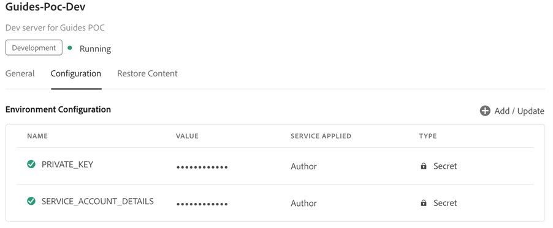

# Konfigurieren der Veröffentlichung auf Microservice-Basis mit JWT-Authentifizierung

[!BADGE Cloud Service]{type=Informative}

>[!NOTE]
>
> Die Anmeldedaten für Dienstkonten (JWT) wurden zugunsten der OAuth-Server-zu-Server-Anmeldeinformationen eingestellt. Ihre Anwendungen, die die Anmeldedaten für das Service-Konto (JWT) verwenden, funktionieren nach dem 1. Januar 2025 nicht mehr. Sie müssen bis zum 1. Januar 2025 zu den neuen Anmeldedaten migrieren, um sicherzustellen, dass Ihre Anwendung weiterhin funktioniert. Erfahren Sie mehr über die Migration von JWT-Anmeldedaten (Service Account) zu OAuth-Server-zu-Server-Anmeldedaten](https://developer.adobe.com/developer-console/docs/guides/authentication/ServerToServerAuthentication/migration/).[


Microservice-basierte Veröffentlichung in für Adobe Experience Manager Guides as a Cloud Service unterstützt die Typen von PDF (nativ und DITA-OT-basiert), HTML5, JSON und benutzerdefinierten Ausgabevorgaben.

Da die Anmeldedaten für das Dienstkonto (JWT) veraltet sind, wird empfohlen, die OAuth-basierte Authentifizierung von Adobe IMS zu verwenden. Erfahren Sie, wie Sie mit der OAuth-Authentifizierung ](configure-microservices-imt-config.md) die Veröffentlichung auf Microservice-Basis konfigurieren.[

Für den durch die JWT-basierte Authentifizierung von Adobe IMS gesicherten Publishing-Dienst sollten Kunden die folgenden Schritte ausführen, um ihre Umgebungen mit sicheren Token-basierten Authentifizierungsworkflows zu integrieren und mit der Verwendung der neuen Cloud-basierten skalierbaren Publishing-Lösung zu beginnen.


## Erstellen von IMS-Konfigurationen in Adobe Developer Console

**Rolle, die zum Erstellen der Konfigurationen erforderlich ist**: Systemadministrator

Führen Sie die folgenden Schritte aus, um IMS-Konfigurationen in Adobe Developer Console zu erstellen:

1. Öffnen Sie Developer Console: `https://developer.adobe.com/console`.

1. Wechseln Sie von oben auf die Registerkarte **Projekte** .

   

1. Um ein neues leeres Projekt zu erstellen, wählen Sie **Leeres Projekt** aus der Dropdown-Liste **Neues Projekt erstellen** aus.

   

1. Wählen Sie **API** aus der Dropdown-Liste **Zum Projekt hinzufügen** aus, um Ihrem Projekt die IO Management-API hinzuzufügen.

   

   

1. Erstellen Sie beim Hinzufügen der API ein neues Paar aus privatem/öffentlichem Schlüssel. Dadurch wird automatisch der private Schlüssel auf Ihr System heruntergeladen.

   

1. Speichern Sie die konfigurierte API.

   

1. Gehen Sie zurück zur Registerkarte **Projekte** und klicken Sie links auf **Projektübersicht** .

   

1. Klicken Sie oben auf die Schaltfläche **Herunterladen** , um die Service-JSON herunterzuladen.

   

Sie haben jetzt die Details zur JWT-Authentifizierung konfiguriert und auch den privaten Schlüssel und die JSON-Datei mit den Dienstdetails heruntergeladen. Halten Sie diese beiden Dateien bereit, da diese Dateien im nächsten Abschnitt benötigt werden.

### Hinzufügen der IMS-Konfiguration zur Umgebung

Führen Sie die folgenden Schritte aus, um der Umgebung die IMS-Konfiguration hinzuzufügen:

1. Öffnen Sie Experience Manager und wählen Sie dann Ihr Programm aus, das die Umgebung enthält, die Sie konfigurieren möchten.
1. Wechseln Sie zur Registerkarte **Umgebungen** .
1. Klicken Sie auf den Umgebungsnamen, den Sie konfigurieren möchten. Dies sollte Sie zur Seite &quot;Umgebungsinformationen&quot;führen.
1. Wechseln Sie zur Registerkarte **Konfiguration** .
1. Laden Sie den privaten Schlüssel und die Projekt-JSON hoch, wie im Screenshot unten dargestellt. Stellen Sie sicher, dass Sie dieselben Namen und Konfigurationen wie unten hervorgehoben verwenden.

   

>[!NOTE]
>
> Sie müssen den Inhalt der JSON-Datei mit Details zum privaten Schlüssel und Dienst in die Wertspalte des Konfigurationsbereichs öffnen, kopieren und einfügen, wie im obigen Screenshot gezeigt.

Nachdem Sie die IMS-Konfiguration zur Umgebung hinzugefügt haben, führen Sie die folgenden Schritte aus, um diese Eigenschaften mithilfe von OSGi mit Experience Manager Guides zu verknüpfen:

1. Fügen Sie im Git-Projektcode des Cloud Manager-Cloud-Managers die folgenden beiden Dateien hinzu (Dateiinhalte finden Sie unter [Anhang](#appendix)).

   * `com.adobe.aem.guides.eventing.ImsConfiguratorService.cfg.json`
   * `com.adobe.fmdita.publishworkflow.PublishWorkflowConfigurationService.xml`
1. Stellen Sie sicher, dass die neu hinzugefügten Dateien von Ihrem `filter.xml` abgedeckt werden.
1. Übernehmen Sie Ihre Git-Änderungen und übertragen Sie sie.
1. Führen Sie die Pipeline aus, um die Änderungen auf die Umgebung anzuwenden.

Danach sollten Sie in der Lage sein, das neue Microservice-basierte Cloud Publishing zu verwenden.

## Häufig gestellte Fragen

1. Kann ein einzelner Schlüssel in mehreren Cloud-Umgebungen verwendet werden?
   * Ja, Sie können einen privaten Schlüssel generieren und ihn für alle Umgebungen verwenden. Sie müssen jedoch Umgebungsvariablen für alle Umgebungen konfigurieren und denselben Schlüssel verwenden.
1. Wenn OSGi-Konfigurationen zur Verwendung von Microservice aktiviert sind, funktioniert der Veröffentlichungsprozess auf einem lokalen AEM-Server mit derselben Codebasis?
   * Nein, wenn das Flag `dxml.use.publish.microservice` auf `true` gesetzt ist, sucht es immer nach Microservice-Konfigurationen. Setzen Sie `dxml.use.publish.microservice` auf `false` , damit die Veröffentlichung auf Ihrer lokalen Seite funktioniert.
1. Wie viel Speicher wird dem DITA-Prozess bei der Verwendung von mikrodienstbasierter Veröffentlichung zugewiesen? Wird dies über DITA-Profil-Ameisenparameter gesteuert?
   * Bei mikrodienstbasierter Veröffentlichung wird die Speicherzuordnung nicht durch DITA-Profil-ant-Parameter gesteuert. Der im Dienstcontainer verfügbare Gesamtspeicher beträgt 8 GB, von denen 6 GB dem DITA-OT-Prozess zugeordnet sind.


## Anhang {#appendix}

**Datei**:
`com.adobe.aem.guides.eventing.ImsConfiguratorService.cfg.json`

**Inhalt**:

```
{
  "service.account.details": "$[secret:SERVICE_ACCOUNT_DETAILS]",
  "private.key": "$[secret:PRIVATE_KEY]"
}
```

**Datei**: `com.adobe.fmdita.publishworkflow.PublishWorkflowConfigurationService.xml`

**Inhalt**:
* `dxml.use.publish.microservice`: Wechsel zur Aktivierung der Veröffentlichung auf Microservice-Basis mithilfe von DITA-OT
* `dxml.use.publish.microservice.native.pdf`: Wechseln Sie zum Aktivieren der mikrodienstbasierten nativen PDF-Veröffentlichung.

```
<?xml version="1.0" encoding="UTF-8"?>
<jcr:root xmlns:jcr="http://www.jcp.org/jcr/1.0" xmlns:sling="http://sling.apache.org/jcr/sling/1.0"
          jcr:primaryType="sling:OsgiConfig"
          dxml.publish.microservice.url="https://adobeioruntime.net/api/v1/web/543112-guidespublisher/default/publishercaller.json"
          dxml.use.publish.microservice="{Boolean}true"
          dxml.use.publish.microservice.native.pdf="{Boolean}true"
/>
```
