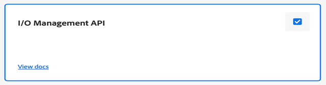

# Konfigurieren von auf Microservices basierender Veröffentlichung mit JWT-Authentifizierung

[!BADGE Cloud Service ]{type=Informative}

>[!NOTE]
>
> Die Anmeldedaten für Dienstkonten (JWT) wurden zugunsten der OAuth-Server-zu-Server-Anmeldeinformationen eingestellt. Ihre Anwendungen, die die Anmeldeinformationen für das Service-Konto (JWT) verwenden, funktionieren ab dem 1. Januar 2025 nicht mehr. Sie müssen bis zum 1. Januar 2025 auf die neuen Anmeldedaten migrieren, um sicherzustellen, dass Ihre Anwendung weiterhin funktioniert. Erfahren Sie mehr über [Migration von JWT-Anmeldedaten (Service Account) zu OAuth-Server-zu-Server-Anmeldedaten](https://developer.adobe.com/developer-console/docs/guides/authentication/ServerToServerAuthentication/migration/).


Microservice-basierte Veröffentlichung in für Adobe Experience Manager Guides as a Cloud Service unterstützt PDF (sowohl native als auch DITA-OT-basierte), HTML5, JSON und benutzerdefinierte Typen von Ausgabevorgaben.

Da die Anmeldeinformationen für das Service-Konto (JWT) veraltet sind, wird empfohlen, die OAuth-basierte Authentifizierung für Adobe IMS zu verwenden. Erfahren Sie, wie [Microservice-basierte Veröffentlichung mit OAuth-Authentifizierung konfigurieren](configure-microservices-imt-config.md).

Für den Cloud-Publishing-Service, der durch die JWT-basierte Authentifizierung von Adobe IMS gesichert ist, sollten Kunden die folgenden Schritte ausführen, um ihre Umgebungen mit sicheren Token-basierten Authentifizierungs-Workflows von Adobe zu integrieren, und mit der Verwendung der neuen Cloud-basierten skalierbaren Publishing-Lösung beginnen.


## Erstellen von IMS-Konfigurationen in Adobe Developer Console

**Rolle erforderlich, um die Konfigurationen zu erstellen**: Systemadministrator

Führen Sie die folgenden Schritte aus, um IMS-Konfigurationen in Adobe Developer Console zu erstellen:

1. Öffnen Sie Developer Console: `https://developer.adobe.com/console`.

1. Wechseln Sie **oben** Registerkarte „Projekte“.

   

1. Um ein neues leeres Projekt zu erstellen, wählen Sie **Leeres Projekt** aus der Dropdown-Liste **Neues Projekt erstellen** aus.

   

1. Wählen Sie **API** aus der Dropdown-Liste **Zum Projekt hinzufügen** aus, um Ihrem Projekt die I/O-Management-API hinzuzufügen.

   

   

1. Erstellen Sie beim Hinzufügen der API ein neues Schlüsselpaar aus privatem und öffentlichem Schlüssel. Dadurch wird der private Schlüssel automatisch auf Ihr System heruntergeladen.

   

1. Speichern Sie die konfigurierte API.

   

1. Gehen Sie zurück zur Registerkarte **Projekte** und klicken Sie auf **Projektübersicht** links.

   

1. Klicken Sie **oben auf** Schaltfläche „Herunterladen“, um die JSON-Datei des Services herunterzuladen.

   

Sie haben jetzt die JWT-Authentifizierungsdetails konfiguriert und außerdem den privaten Schlüssel und die JSON-Dienstdetails heruntergeladen. Halten Sie diese beiden Dateien bereit, da diese Dateien im nächsten Abschnitt benötigt werden.

### Hinzufügen der IMS-Konfiguration zur Umgebung

Führen Sie die folgenden Schritte aus, um die IMS-Konfiguration zur Umgebung hinzuzufügen:

1. Öffnen Sie Experience Manager und wählen Sie dann Ihr Programm aus, das die Umgebung enthält, die Sie konfigurieren möchten.
1. Wechseln Sie **Registerkarte** Umgebungen“.
1. Klicken Sie auf den Namen der Umgebung, die Sie konfigurieren möchten. Dadurch sollten Sie zur Seite „Umgebungsinformationen“ navigieren.
1. Wechseln Sie **Registerkarte** Konfiguration“.
1. Laden Sie den privaten Schlüssel und die Projekt-JSON hoch, wie im folgenden Screenshot gezeigt. Stellen Sie sicher, dass Sie dieselben Namen und Konfigurationen verwenden, die unten hervorgehoben sind.

   

>[!NOTE]
>
> Sie müssen den Inhalt der JSON-Datei für private Schlüssel und Service-Details öffnen, kopieren und in die Spalte Wert des Bedienfelds „Konfiguration“ einfügen, wie im obigen Screenshot gezeigt.

Nachdem Sie die IMS-Konfiguration zur Umgebung hinzugefügt haben, führen Sie die folgenden Schritte aus, um diese Eigenschaften mithilfe von OSGi mit Experience Manager Guides zu verknüpfen:

1. Fügen Sie in Ihrem Cloud Manager-Git-Projekt-Code die folgenden beiden Dateien hinzu (Dateiinhalte finden Sie [Anhang](#appendix)).

   * `com.adobe.aem.guides.eventing.ImsConfiguratorService.cfg.json`
   * `com.adobe.fmdita.publishworkflow.PublishWorkflowConfigurationService.xml`
1. Stellen Sie sicher, dass die neu hinzugefügten Dateien von Ihrem `filter.xml` abgedeckt werden.
1. Übertragen Sie Ihre Git-Änderungen und übertragen Sie sie.
1. Führen Sie die Pipeline aus, um die Änderungen auf die Umgebung anzuwenden.

Sobald dies geschehen ist, sollten Sie in der Lage sein, die neue, auf Microservices basierende Cloud-Veröffentlichung zu verwenden.

## Häufig gestellte Fragen

1. Kann ein einzelner Schlüssel in mehreren Cloud-Umgebungen verwendet werden?
   * Ja, Sie können einen privaten Schlüssel generieren und ihn für alle Umgebungen verwenden. Sie müssen jedoch Umgebungsvariablen für alle Umgebungen konfigurieren und denselben Schlüssel verwenden.
1. Wenn die OSGi-Konfigurationen für die Verwendung des Microservices aktiviert sind , funktioniert der Veröffentlichungsprozess auf einem lokalen AEM-Server mit derselben Codebasis?
   * Nein, wenn das Flag `dxml.use.publish.microservice` auf `true` gesetzt ist, wird immer nach Microservice-Konfigurationen gesucht. Legen Sie `dxml.use.publish.microservice` auf `false` fest, damit die Veröffentlichung in Ihrem lokalen Projekt funktioniert.
1. Wie viel Speicher wird dem DITA-Prozess bei der Verwendung von Veröffentlichungen auf Microservice-Basis zugewiesen? Wird dies über DITA-Profil-Ant-Parameter gesteuert?
   * Bei der auf Microservices basierenden Veröffentlichung wird die Speicherzuweisung nicht durch DITA-Profilantparameter gesteuert. Der gesamte verfügbare Speicher im Service-Container beträgt 8 GB, wovon 6 GB dem DITA-OT-Prozess zugeordnet sind.


## Anhang {#appendix}

**Datei**:
`com.adobe.aem.guides.eventing.ImsConfiguratorService.cfg.json`

**Inhalt**:

```
{
  "service.account.details": "$[secret:SERVICE_ACCOUNT_DETAILS]",
  "private.key": "$[secret:PRIVATE_KEY]"
}
```

**Datei**: `com.adobe.fmdita.publishworkflow.PublishWorkflowConfigurationService.xml`

**Inhalt**:
* `dxml.use.publish.microservice`: Wechseln Sie zur Aktivierung der Microservice-basierten Veröffentlichung mithilfe von DITA-OT
* `dxml.use.publish.microservice.native.pdf`: Umschalten zur Aktivierung der Microservice-basierten nativen PDF-Veröffentlichung

```
<?xml version="1.0" encoding="UTF-8"?>
<jcr:root xmlns:jcr="http://www.jcp.org/jcr/1.0" xmlns:sling="http://sling.apache.org/jcr/sling/1.0"
          jcr:primaryType="sling:OsgiConfig"
          dxml.publish.microservice.url="https://adobeioruntime.net/api/v1/web/543112-guidespublisher/default/publishercaller.json"
          dxml.use.publish.microservice="{Boolean}true"
          dxml.use.publish.microservice.native.pdf="{Boolean}true"
/>
```
