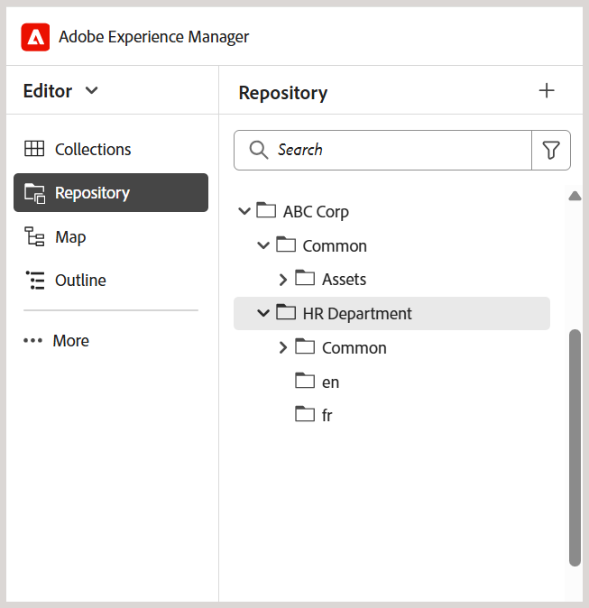

# Best Practices zum Einrichten der Ordnerstruktur

Dieser Artikel enthält wichtige Schritte und Best Practices für Admins zum Einrichten von Ordnerstrukturen in Adobe Experience Manager Guides. Eine gut organisierte Ordnerhierarchie gewährleistet reibungslose Autoren-, Veröffentlichungs- und Übersetzungs-Workflows für Lern- und Schulungsinhalte.

## Einrichten der Ordnerstruktur

Um den Zugriff auf verschiedene Funktionen zum Erstellen, Veröffentlichen und Übersetzen von Experience Manager Guides zu ermöglichen, stellen Sie sicher, dass Sie Ordner in der richtigen Hierarchie einrichten, wie unten beschrieben.

**Erstellen eines Ordners auf Stammebene**

Erstellen Sie zunächst einen Stammordner für Ihre Organisation. Dies dient als Basis für alle Ordner auf Abteilungsebene und gemeinsam genutzte Assets.

Beispiel: `/content/dam/ABC-Corp/`

Erstellen Sie in diesem Stammordner einen dedizierten Ordner zum Verwalten von Assets, die in mehreren Abteilungen verwendet werden. Erstellen Sie beispielsweise einen Ordner **Allgemein** um freigegebene Ressourcen wie Bilder, Videos und mehr einzuschließen.

**Erstellen von Ordnern auf Abteilungsebene**

Erstellen Sie für jede Abteilung separate Ordner, z. B. für Personal, Finanzen und Recht, damit sie ihre eigenen Inhalte verwalten können.

*Beschriftung: Separate Ordnerstruktur, die für die Personalabteilung im Stammordner erstellt wurde*

**Best Practices für das Festlegen von Ordnern auf Abteilungsebene**

- Erstellen Sie für gemeinsame Assets auf Abteilungsebene **dedizierten Ordner** Allgemein **> Assets** unter jeder Abteilung (falls erforderlich).
- Wenn Sie Ihre Inhalte für die Übersetzung freigeben möchten, erstellen Sie sprachspezifische Ordner (z. B. en, de, fr). Autoren sollten Inhalte nur im Ordner der Ausgangssprache (wie en) erstellen oder aktualisieren, da Inhalte außerhalb des Ordners der Ausgangssprache nicht im Übersetzungs-Workflow enthalten sind. Die anderen Sprachordner können als Platzhalter leer bleiben. Weitere Informationen zur [Inhaltsübersetzung](../user-guide/translation.md).
- Berechtigungen können genutzt werden, um den Zugriff bestimmter Abteilungen oder Benutzer auf die neu erstellte Ordnerstruktur zu beschränken. Weisen Sie beispielsweise Berechtigungen zu, um sicherzustellen, dass nur Benutzer der Personalabteilung Inhalte im vorgesehenen Ordner erstellen oder ändern können.

Wiederholen Sie dieselbe Struktur für andere Abteilungen wie Finanzen, Recht usw.

## Einrichten der Struktur des Ausgabeordners

Der Ordner `fm-ditaoutputs` dient als standardmäßiger Speicherort für generierte Ausgaben aus Lern- und Schulungsinhalten. Diese Ausgaben enthalten in der Regel SCORM-Pakete (ZIP-Dateien) im **alm**-Ordner und PDFs im **pdf**-Ordner. Sie können diesen Standardausgabepfad auf Voreinstellungsebene bei Bedarf über die **Map-** ändern.

Wenn Sie mit mehreren Abteilungen arbeiten, sollten Sie abteilungsspezifische Ordner innerhalb der `fm-ditaoutputs` Ordnerstruktur erstellen, um sicherzustellen, dass die Benutzer innerhalb einer bestimmten Abteilung Zugriff auf die relevanten Ausgabeordner haben.

## Benutzer erstellen und sie entsprechenden Gruppen zuweisen

Sobald die Ordnerhierarchie eingerichtet ist, können Sie mit der Erstellung von Benutzenden beginnen und sie zu Gruppen hinzufügen, damit sie Zugriff auf die relevanten Funktionen in der Experience Manager Guides haben. Experience Manager Guides bietet drei vordefinierte Gruppen: Autoren, Prüfer und Herausgeber. Je nach Gruppe, der eine Benutzerin oder ein Benutzer zugeordnet ist, können sie bzw. er bestimmte Aufgaben ausführen. Beispielsweise kann eine Veröffentlichungsaufgabe nur von einem Herausgeber, nicht aber von einem Autor ausgeführt werden.

Um neue Benutzer zu erstellen und sie Gruppen hinzuzufügen, navigieren Sie zu **Tools** > **Sicherheit** > **Benutzer**.

Wählen Sie auf der Seite „User Management“ die Option **Erstellen** aus, um einen neuen Benutzer zu erstellen. Fügen Sie Benutzerdetails hinzu und weisen Sie sie einer Gruppe zu.

Weitere Informationen finden Sie unter [Benutzerverwaltung und Sicherheit](../cs-install-guide/user-admin-sec.md)

## Weisen Sie jeder Benutzergruppe Berechtigungen zu

Nachdem Benutzer den entsprechenden Gruppen hinzugefügt wurden, konfigurieren Sie Berechtigungen auf Gruppenebene, um sicherzustellen, dass sie Zugriff auf die richtigen Authoring- und Ausgabeordner im Repository haben.

Um Berechtigungen zuzuweisen, navigieren Sie zu **Tools** > **Sicherheit** > **Berechtigungen**.

Diese Berechtigungen stellen sicher, dass Benutzer Inhalte nur in ihren festgelegten Ordnern erstellen oder ändern können.

Weitere Informationen finden Sie unter [Berechtigungen in AEM](https://experienceleague.adobe.com/de/docs/experience-manager-65/content/security/security#permissions-in-aem).

