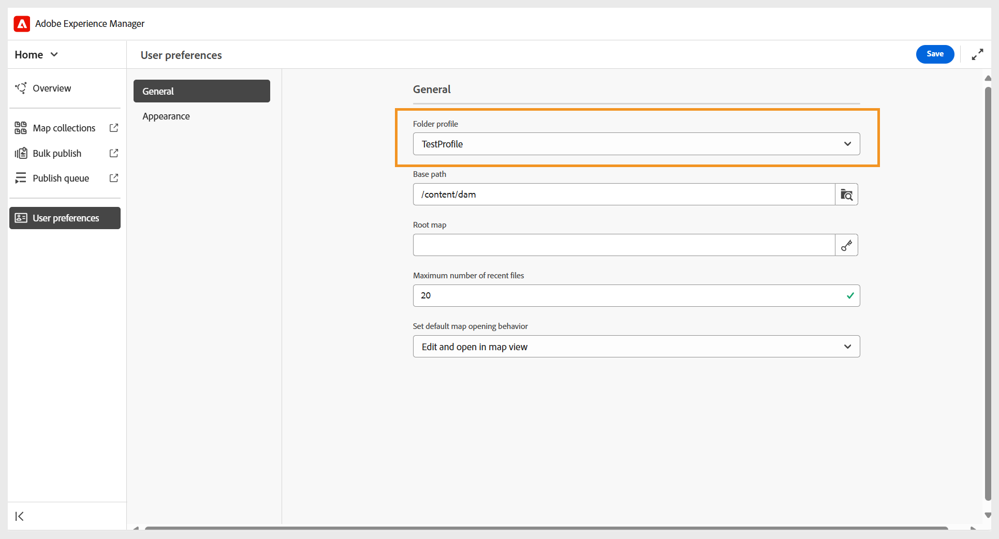
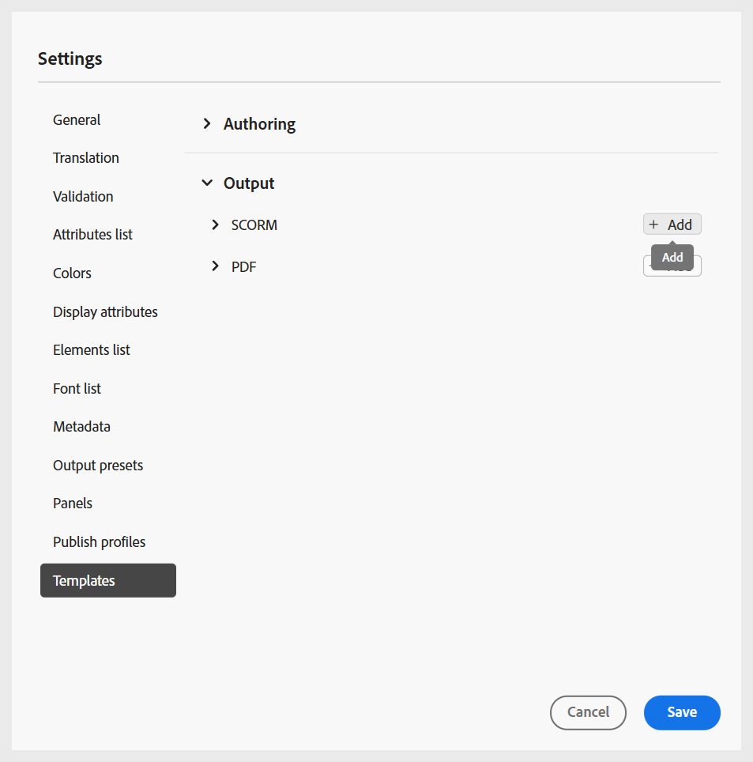
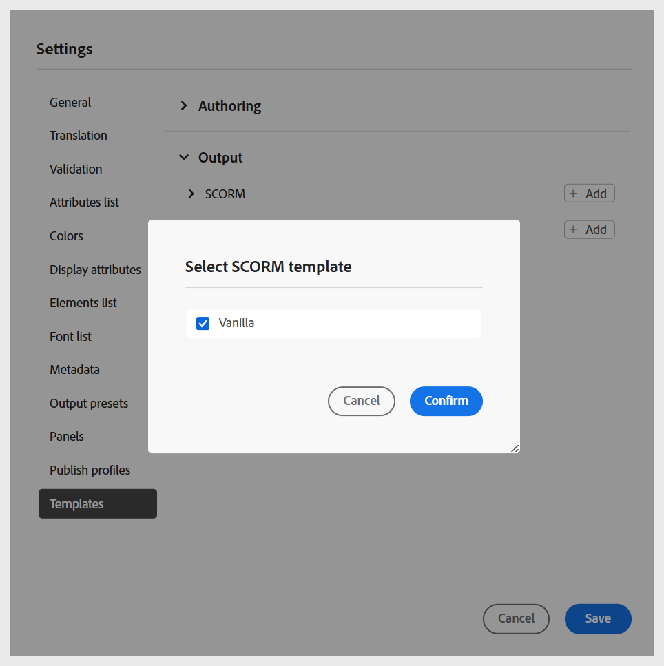

# Ordnerprofile konfigurieren

Ein Ordnerprofil ist erforderlich, um die Konfigurationen für verschiedene Abteilungen oder Produkte in Ihrem Unternehmen zu trennen. Für Lern- und Schulungsinhalte können Sie ein Profil auf Ordnerebene erstellen und konfigurieren, um Autorenvorlagen, Ausgabevorlagen, Ausgabevorgaben und andere Einstellungen auf Ordnerebene zu verwalten.

Um mit der Ordnerprofilkonfiguration für Lern- und Schulungsinhalte zu beginnen, müssen Sie Folgendes tun:

1. **Erstellen verschiedener Ordner zum Verwalten von Authoring- und Ausgabevorlagen**: Sie können Ordner für Autoren und Herausgeber erstellen, die in verschiedenen Abteilungen oder Produkten in Ihrem Unternehmen arbeiten. Diese Ordner können bestimmten Ordnerprofilen zugeordnet werden, die jeweils mit unterschiedlichen Authoring- und Ausgabevorlagen konfiguriert sind, um abteilungsspezifische Lernkurserstellung und dezentrale Verwaltung zu unterstützen.

   Sie können einen neuen Ordner über das Repository-Bedienfeld erstellen.

   {width="350" align="left"}
2. **Erstellen von Sprachordnern zur Verwaltung von Übersetzungen**: Wenn Sie Inhalte in verschiedene Sprachen übersetzen, müssen Sie Ordner erstellen, die den einzelnen Sprachen entsprechen. Jeder dieser Sprachordner enthält den Inhalt, der dieser Sprache entspricht.

   Weitere Informationen finden Sie unter [Best Practices für die Übersetzung von Inhalten](../user-guide/translation-first-time.md).
3. **Erstellen eines Ordners zur Verwaltung von Assets**: Ähnlich wie Ordner können Sie auch verschiedene Assets-Ordner erstellen, um die Anforderungen verschiedener Abteilungen zu erfüllen. Auf diese Weise stellen Sie auch sicher, dass Autoren und Herausgeber Zugriff auf das richtige CSS haben, das in ihren Vorlagen, Bildern und anderen Assets konfiguriert ist.

   {width="350" align="left"}
4. [Erstellen eines Ordnerprofils](../cs-install-guide/conf-folder-level.md#create-and-configure-a-folder-level-profile) um verschiedene Ordner zuzuordnen.
5. **Wählen Sie das zu konfigurierende Ordnerprofil aus**: Nachdem das Ordnerprofil erstellt wurde, müssen Sie das Ordnerprofil auf der Seite [Benutzereinstellungen](../user-guide/intro-home-page.md#user-preferences) auswählen, um sicherzustellen, dass Autoren und Herausgeber Zugriff auf die richtigen Vorlagen haben.

   {width="650" align="left"}

6. **Konfigurieren von Ordnerprofileinstellungen**: Für Lern- und Schulungsinhalte können die folgenden Einstellungen auf Ordnerebene konfiguriert werden:
   - [Panels](#configure-panels)
   - [Vorlagen](#configure-templates)
   - [Ausgabevoreinstellungen](#configure-output-presets)
   - [HTML-Editor](#html-editor-settings)
   - [Profile veröffentlichen](#manage-publish-profiles)

Um auf diese Einstellungen zuzugreifen, wechseln Sie zur Editor-Ansicht und wählen **Einstellungen** aus dem Menü **Optionen** wie unten dargestellt:

## Bedienfelder konfigurieren

Mit dieser Einstellung werden die Bedienfelder gesteuert, die im linken und rechten Bedienfeld des **Editors** und der **Zuordnungskonsole** in Experience Manager Guides angezeigt werden. Sie können die Schaltfläche umschalten, um das gewünschte Bedienfeld ein- oder auszublenden.

Stellen Sie bei Lern- und Schulungsinhalten sicher, dass für den Editor und die Zuordnungskonsole nur die folgenden Funktionen aktiviert sind.

{width="350" align="left"}

### Editor

**Linkes Bedienfeld**

- **Sammlungen**: Ermöglicht das Organisieren und Speichern häufig verwendeter Dateien oder den schnellen Zugriff auf freigegebene Dateien.
- **Repository**: Ermöglicht Ihnen die Anzeige und den Zugriff auf alle Karten, Themen, Bilder und andere im Content-Repository gespeicherte Assets.
- **Course Manager**: Bietet einen speziellen Arbeitsbereich zum Erstellen und Verwalten von Kursen.
- **Snippets**: ermöglichen es Ihnen, kleine Inhaltsfragmente in verschiedenen Themen in Ihren Lernkursen zu erstellen und wiederzuverwenden.
- **Bedingungen**: Ermöglicht die Konfiguration bedingter Attribute auf globaler Ebene und Ordnerebene.
- **Variablen**: Ermöglicht das Erstellen und Verwalten von Variablen, die in Ihren Lerninhalten verwendet werden können.
- **Sprachvariablen**: Ermöglicht die Definition lokalisierter Zeichenfolgen für veröffentlichte Ausgaben oder statischen Text in Vorlagen.
- **Vorlagen**: Ermöglicht das Erstellen und Verwalten von Vorlagen zur Verwendung durch Autorinnen und Autoren.
- **Ausgabevorlagen**: Ermöglicht das Erstellen und Verwalten von Ausgabevorlagen, um Ausgaben in verschiedenen Formaten zu generieren.
- **Suchen und Ersetzen**: Bietet Optionen zum Suchen und Ersetzen von Text in Dateien in einer Zuordnung oder einem Ordner innerhalb Ihres Repositorys. 

**Rechtes Bedienfeld**

- **Inhaltseigenschaften**: Enthält Informationen zum Typ und zu den Attributen des aktuell im Editor ausgewählten Elements.
- **Dateieigenschaften**: Ermöglicht das Anzeigen und Verwalten der Eigenschaften der ausgewählten Datei.
- **Stile**: Zeigt die globalen klassenbasierten Stiloptionen zur Verwendung in Ihren Lerninhalten an.
- **Filter**: Hiermit können Sie Inhalte basierend auf angewendeten Bedingungen im Vorschaumodus eines Themas filtern.

### Kartenkonsole

**Linkes Bedienfeld**

- **Voreinstellungen**: Ermöglicht die Konfiguration von Ausgabevorgaben für die Veröffentlichung des Lernkurses.
- **Übersetzung**: Bietet Optionen, um Ihre Inhalte in mehrere Sprachen zu übersetzen.
- **Berichte**: Ermöglicht das Generieren und Verwalten von Berichten, um einen nützlichen insight zum Gesamtzustand der Kursinhalte zu erhalten.
- **Bedingungsvorgaben**: Bietet Optionen zum Konfigurieren bedingungsbasierter Ausgabevorgaben für verschiedene Zielgruppen, Abteilungen und mehr.

**Rechtes Bedienfeld**

- **Filter**: Ermöglicht die Verwendung von Filtern bei der Arbeit mit Berichten und Übersetzungen.

## Konfigurieren von Vorlagen

Mit dieser Einstellung können Sie die Authoring- und Publishing-Vorlagen verwalten, [ im linken Bereich des Editors ](../user-guide/web-editor-left-panel.md). Sie können Authoring- und Ausgabevorlagen hinzufügen, entfernen oder neu anordnen, auf die dann Autoren und Herausgeber zugreifen können.

{width="350" align="left"}

Die Authoring-Vorlagen sind in vier Kategorien verfügbar: Lernkurse, Lerninhalte, Quiz und Fragenbanken. Wenn in Ihrer Instanz vordefinierte Vorlagen konfiguriert sind, werden diese standardmäßig angezeigt.

{width="350" align="left"}

### Vorlagen hinzufügen

Führen Sie die folgenden Schritte aus, um eine neue Vorlage hinzuzufügen:

1. Navigieren Sie zur Vorlagenkategorie, der Sie eine Vorlage hinzufügen möchten, und wählen Sie **Hinzufügen** aus.
2. Wählen Sie im Dialogfeld Pfad auswählen die gewünschte Vorlage aus.
3. Wählen Sie **Auswählen** aus.

   {width="350" align="left"}

Die Vorlage wird in der entsprechenden Kategorie im Bedienfeld Einstellungen hinzugefügt.

Auf ähnliche Weise können Sie die anderen Authoring- und Ausgabevorlagen hinzufügen. Nach dem Hinzufügen werden diese Vorlagen den Autoren und Herausgebern in ihren jeweiligen Kursdialogen zur Verfügung gestellt. Beispielsweise steht die vom Administrator hinzugefügte Lernkursvorlage Autoren zur Verfügung, wenn sie einen neuen Kurs erstellen.

{width="350" align="left"}

### Arbeiten mit neuen Authoring- und Ausgabevorlagen

Um eine andere Vorlage als die im Dialogfeld **Pfad auswählen** zu verwenden, erstellen Sie eine benutzerdefinierte Authoring- oder Ausgabevorlage.

**Erstellen neuer Authoring-Vorlagen**

Um eine andere Zuordnung oder Themenvorlage zu verwenden, erstellen Sie eine neue Bearbeitungsvorlage im Bereich Vorlagen des Editors. Verwenden Sie Zuordnungsvorlagen, um Lernkurse und Themenvorlagen für Lerninhalte, Quiz oder Lernzusammenfassung zu erstellen.

Weitere Informationen finden Sie unter [Erstellen benutzerdefinierter Vorlagen im Editor](../user-guide/create-maps-customized-templates.md).

{width="350" align="left"}

**Erstellen neuer Ausgabevorlagen**

Führen Sie die folgenden Schritte aus, um eine neue Ausgabevorlage für die Lern- und Schulungsinhalte zu erstellen:

1. Wählen Sie im linken Bereich des Editors **Mehr** > **Ausgabevorlagen** aus.

   Das Bedienfeld Ausgabevorlagen wird angezeigt.

   {width="350" height="" align="left"}
2. Wählen Sie im Bedienfeld Ausgabevorlagen die Option (+) aus, um eine neue Ausgabevorlage zu erstellen.

   {width="350" align="left"}
3. Wählen Sie im Dropdown-Menü eine Ausgabevorlage aus.

   {width="650" align="left"}
4. Basierend auf dem ausgewählten Ausgabevorlagentyp wird ein Dialogfeld angezeigt, in dem Sie eine neue Vorlage basierend auf den verfügbaren Vorlagen erstellen können.

   {width="350" align="left"}

5. Wählen Sie **Erstellen** aus.

   Eine neue Ausgabevorlage wird erstellt.

6. Um auf die Ausgabevorlage für Herausgeber zuzugreifen und sie hinzuzufügen, navigieren Sie zu **Einstellungen** > **Vorlagen** > **Ausgabevorlagen** und wählen Sie **Hinzufügen**.

   {width="350" align="left"}

   Die Ausgabevorlage wird im Dialogfeld Pfad auswählen angezeigt.
7. Wählen Sie die Vorlage und dann **Bestätigen** aus.

   {width="350" align="left"}

   Die ausgewählte Ausgabevorlage wird jetzt dem Bedienfeld Einstellungen hinzugefügt.

   {width="350" align="left"}

### Vorlagen entfernen oder neu anordnen

Nach dem Hinzufügen können Sie die Vorlagen aus dem Bedienfeld Einstellungen entfernen oder neu anordnen.

Um eine Vorlage zu entfernen, klicken Sie auf **Symbol &quot;**&quot; daneben.

{width="350" align="left"}

Sie können auch die Reihenfolge festlegen, in der die in einer Kategorie vorhandenen Vorlagen angezeigt werden. Um die Anzeigereihenfolge der Vorlagen zu ändern, wählen Sie die gepunkteten Balken aus und ziehen Sie eine Vorlage an die gewünschte Position.

{width="350" align="left"}

## Konfigurieren von Ausgabevorgaben

Auf der Registerkarte „Ausgabevorgaben“ können Sie festlegen, welche Ausgabeformate für die Veröffentlichung eines Kurses verfügbar sind. Es enthält zwei Abschnitte: **Zulässige** und **Allgemeine Ausgabevorgaben**.

{width="350" align="left"}

- **Zulässige Ausgabevorgabentypen**: In diesem Abschnitt werden alle in der Experience Manager Guides-Instanz unterstützten Ausgabevorgaben aufgelistet. Für die Kursveröffentlichung sind nur **SCORM** und **PDF** Formate anwendbar. Sie können eine oder beide Optionen auswählen. Die ausgewählten Vorgaben stehen Publishern beim Generieren der Kursausgabe zur Verfügung.

  {width="350" align="left"}

- **Allgemeine Ausgabevorgaben**: In diesem Abschnitt werden die Ausgabevorgaben angezeigt, die normalerweise von Publishern erstellt und einem bestimmten Ordnerprofil hinzugefügt werden. Sie können auch alle nicht mehr benötigten Voreinstellungen entfernen.

  {width="350" align="left"}

## HTML Editor-Einstellungen

Mit dieser Einstellung können Sie den Editor für das HTML-basierte Authoring konfigurieren. Die wichtigsten Konfigurationsoptionen in dieser Einstellung sind:

{width="350" align="left"}

- **Inline-Stil ausblenden**: Aktivieren Sie diese Option, um zu verhindern, dass Autoren bzw. Autorinnen eine Inline-Formatierung auf den Kursinhalt anwenden. Wenn diese Option aktiviert ist, bleiben alle Inline-Formatierungsoptionen wie Schriftarten, Rahmen, Layout, Hintergrund und Spalten im rechten Bereich des Editors für Autoren ausgeblendet. Autoren können jedoch weiterhin die globalen klassenbasierten Stiloptionen verwenden, die im Bedienfeld **Stile** verfügbar sind. Dies hilft, die Konsistenz mit den Stilrichtlinien Ihrer Organisation zu wahren.
- **Source-Ansicht für Autoren ausblenden**: Aktivieren Sie diese Option, um den Zugriff auf den HTML-Quell-Code zu beschränken. Dies ist nützlich, wenn Sie die Bearbeitung vereinfachen oder versehentliche Änderungen am zugrunde liegenden Code vermeiden möchten.

## Profile der Veröffentlichung verwalten

In diesem Abschnitt können Sie Veröffentlichungsprofile anzeigen, erstellen und verwalten, die für die Veröffentlichung von Kursen in SCORM Cloud verwendet werden. Jedes Profil definiert die Verbindungseinstellungen und Konfigurationsdetails, die zum Veröffentlichen eines Lernkurses in einer bestimmten SCORM-Cloud-Umgebung erforderlich sind.

Sie können mehrere Profile erstellen, wenn Sie in verschiedenen SCORM-Cloud-Konten veröffentlichen müssen, um Flexibilität und Kontrolle über Ihren Veröffentlichungsprozess sicherzustellen.

Geben Sie die Server-Details zusammen mit der Client-ID und dem Client-Geheimnis der zugehörigen SCORM-Cloud-Anwendung an, um das Veröffentlichungsprofil für SCORM-Cloud zu konfigurieren.

{width="350" align="left"}
