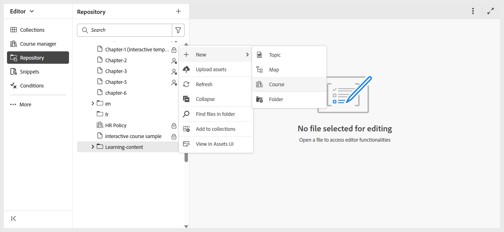

# Zugriff auf die Benutzeroberfläche für Lern- und Schulungsinhalte

Führen Sie die folgenden Schritte aus, um auf die Benutzeroberfläche für Lern- und Schulungsinhalte zuzugreifen:

1. Melden Sie sich bei Ihrer AEM-Instanz an. 
2. Wählen Sie auf der AEM-Navigationsseite die Option **Handbücher** aus.
3. Sie befinden sich jetzt auf der Startseite von **Experience Manager Guides**. Verwenden Sie den Navigationsumschalter, um zur Editor-Ansicht zu wechseln.

   {width="300" align="left"}

4. Öffnen Sie das Bedienfeld **Repository** und navigieren Sie zu dem Ordner, in dem Sie einen Kurs erstellen möchten, und wählen Sie **Neu > Kurs** aus dem Menü **Optionen** aus.

   

