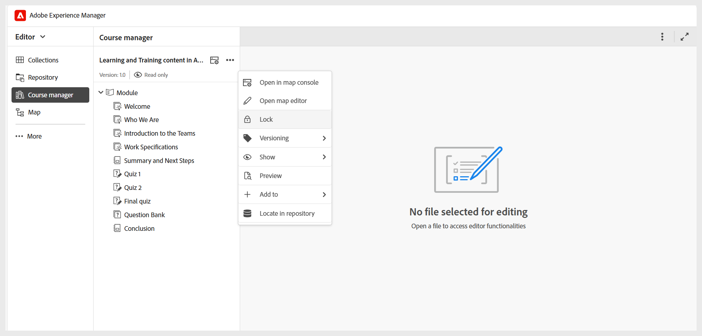

# Die Grundlagen des Kursmanagers verstehen

Der **Kursmanager** ist Ihr zentraler Arbeitsbereich zum Erstellen und Verwalten von Kursen. Wenn Sie einen neuen Kurs erstellen, wird er automatisch im Kursmanager-Bedienfeld geöffnet, von wo aus Sie mit der Erstellung Ihres Kurses beginnen können.

Beachten Sie beim Arbeiten mit dem Kurs-Manager Folgendes:

- Der Kurs wird im schreibgeschützten Modus geöffnet und Version 1.0 wird automatisch zugewiesen, was die Anfangsversion des Kurses angibt.
- Um einen Kurs bearbeiten zu können, müssen Sie eine Sperre über das Menü **Optionen** erhalten. Sobald der Kurs gesperrt ist, können Sie damit beginnen, Themen hinzuzufügen oder vorhandene im Kurs vorhandene Themen zu bearbeiten.

  
- Über **Symbol &quot;**&quot; im Bedienfeld gelangen Sie zur Zuordnungskonsole, in der die von Ihrem Administrator konfigurierten Ausgabevorgaben angezeigt werden. Sie können auch über das Menü **Optionen** auf **Map-Konsole**.
