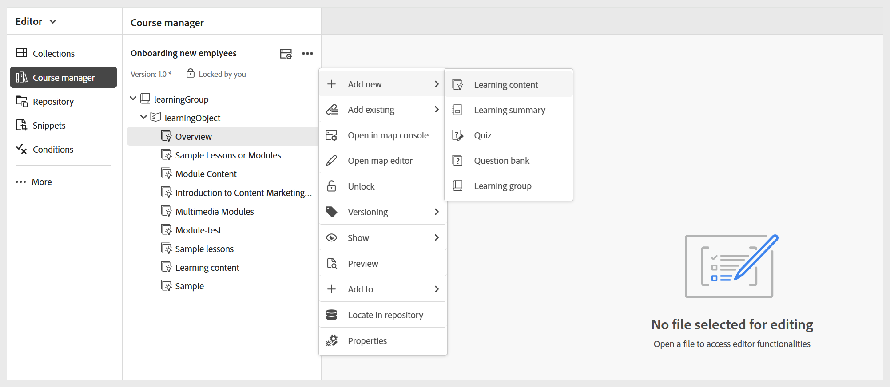
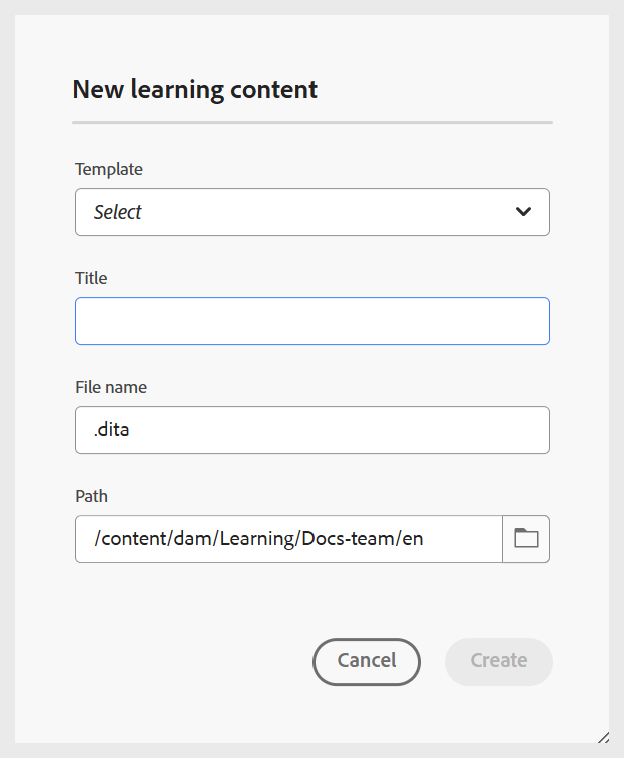

# Lerninhalte erstellen

Führen Sie die folgenden Schritte aus, um Lerninhalte zu einem Kurs hinzuzufügen:

1. Öffnen Sie einen Kurs im **Kursmanager** und wählen Sie **Neu hinzufügen** aus dem Menü **Optionen**.

   {width="650" align="left"}

1. Wählen Sie **Lerninhalte** aus.
Das Dialogfeld „Neue Lerninhalte“ wird angezeigt.

   {width="350" align="left"}

1. Wählen Sie im Dropdown-Menü die gewünschte Vorlage aus.

   {width="350" align="left"}

1. Geben Sie einen geeigneten Titel für die Lerninhalte an.
1. Wählen Sie **Erstellen** aus.

Lerninhalte werden innerhalb des Kurses erstellt und im Kursleiterbereich angezeigt.

>[!NOTE]
>
> Sobald Sie neue Lerninhalte erstellt haben, wird ihnen automatisch Version 1.0 zugewiesen.

