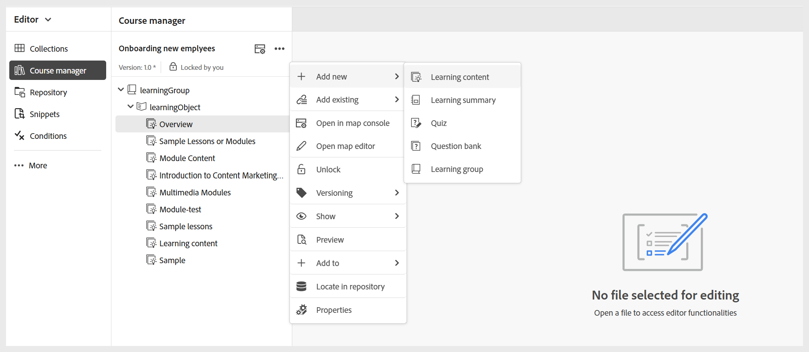

# Thema erstellen

Bevor wir in den Schritt-für-Schritt-Prozess eintauchen, finden Sie hier eine kurze Videoübersicht, die Ihnen dabei hilft, das Erstellen eines Lernthemas zu visualisieren.

>[!VIDEO](https://video.tv.adobe.com/v/3475211/learning-content-aem-guides)

**Schritte zum Hinzufügen eines Themas zu einem Kurs**

Führen Sie die folgenden Schritte aus, um einem Kurs ein Thema hinzuzufügen:

1. Öffnen Sie einen Kurs im **Kursmanager** und wählen Sie **Neu hinzufügen** aus dem Menü **Optionen**.

   {width="650"}

1. Wählen Sie **Thema** aus.

   Das **Neues Lernthema** wird angezeigt.

   {width="350"}

1. Wählen Sie im Dropdown-Menü die gewünschte Vorlage aus.

   {width="350"}

1. Geben Sie einen geeigneten Titel für das Thema an.
1. Wählen Sie **Erstellen** aus.

Ein neues Lernthema wird innerhalb des Kurses erstellt und im Kursmanager-Bedienfeld angezeigt.

>[!NOTE]
>
> Nachdem Sie ein neues Lernthema erstellt haben, wird ihm automatisch Version 1.0 zugewiesen.
