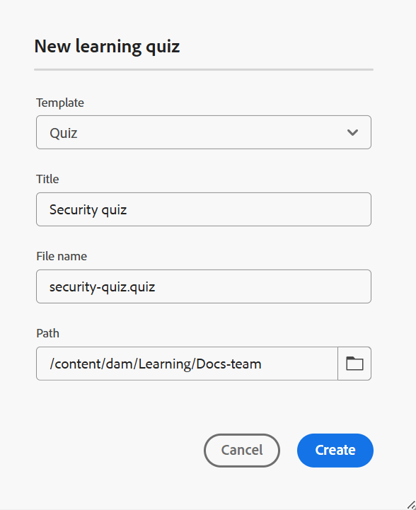

# Quiz erstellen

Führen Sie die folgenden Schritte aus, um einem Kurs ein Quiz hinzuzufügen:

1. Öffnen Sie einen Kurs im **Kursmanager** und wählen Sie **Neu hinzufügen** aus dem Menü **Optionen**.

   {width="650"}

1. Wählen Sie **Quiz** aus.\
   Ein **Neues Lernquiz** wird geöffnet, in dem Sie die relevanten Details des Quiz angeben können. Sie können die Vorlage aus dem Dropdown-Menü auswählen und einen geeigneten Titel für dieselbe Vorlage angeben.

   {width="350"}

1. Wählen Sie **Erstellen** aus.

Ein Quiz wird als Teil des Kurses hinzugefügt und im Kursmanager-Bedienfeld angezeigt.

>[!NOTE]
>
>  Nachdem Sie ein Quiz erstellt haben, wird ihm automatisch Version 1.0 zugewiesen.
