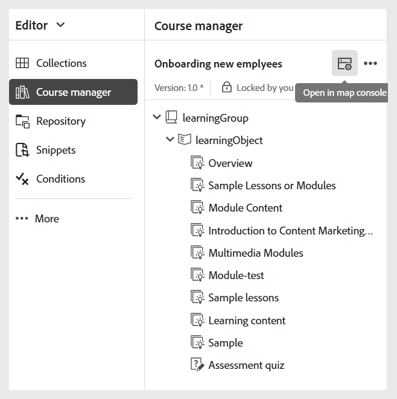

# Erstellen einer SCORM-Ausgabevorgabe

Führen Sie die folgenden Schritte aus, um eine SCORM-Ausgabevorgabe zu erstellen:

1. Öffnen Sie den Kurs in **Map-Konsole**.

   {width="350" align="left"}

1. Wählen Sie **Bedienfeld &quot;**&quot; das Symbol + , um eine Ausgabevorgabe zu erstellen.
1. Wählen Sie **SCORM** aus der **Typ** im Dialogfeld **Neue**) aus.

   {width="350" align="left"}

1. Geben **im Feld** einen Namen für diese Voreinstellung ein.
1. Wählen Sie die **Zum aktuellen Ordnerprofil hinzufügen**, um eine Ausgabevorgabe innerhalb des aktuellen Ordnerprofils zu erstellen.
1. Wählen Sie **Hinzufügen** aus.

Die SCORM-Vorgabe wird erstellt. Eine SCORM-Voreinstellungsseite wird geöffnet, auf der Sie die erforderlichen Konfigurationen vornehmen können.

{width="800" align="left"}