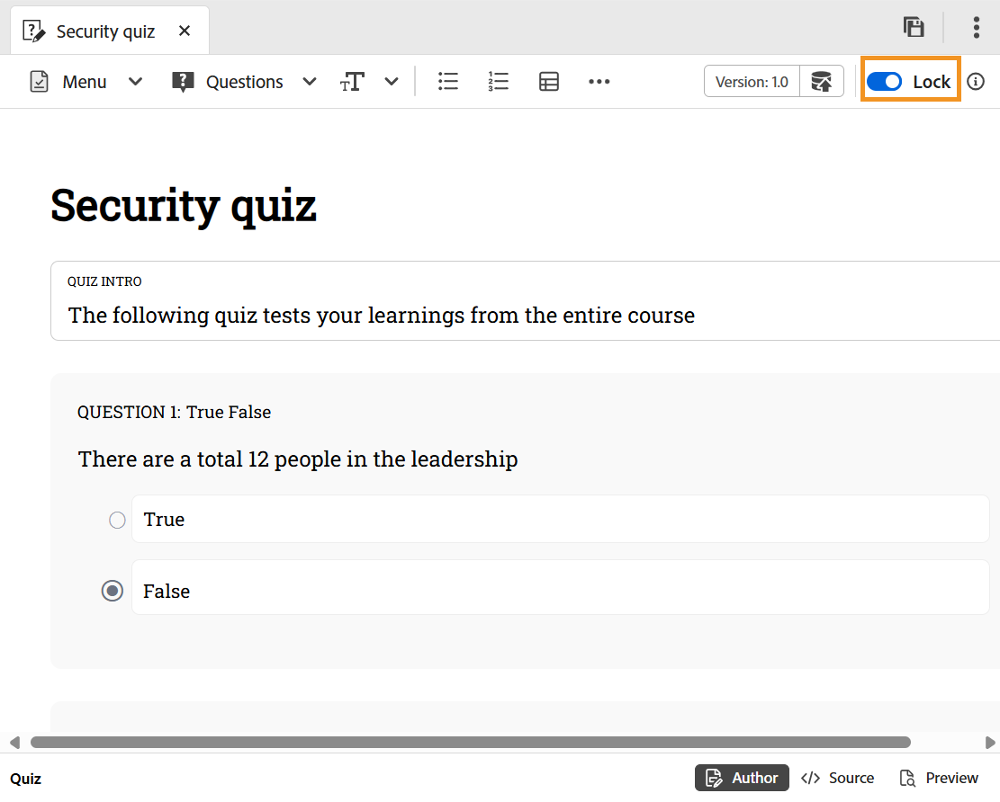

# Quiz bearbeiten

Bevor wir uns mit dem Schritt-für-Schritt-Prozess befassen, hier ein kurzes Video, das zeigt, wie ein Quiz im Quiz-Editor bearbeitet wird.

>[!VIDEO](https://video.tv.adobe.com/v/3475209/aem-guides-learning-content)

**Schritte zum Bearbeiten eines Quiz**

Führen Sie die folgenden Schritte aus, um das Quiz zu bearbeiten:

1. Doppelklicken Sie auf das Quiz, um es im Kursmanager-Bedienfeld zu öffnen.
1. Sie müssen **Quiz** Umschalter sperren. Auf diese Weise können Sie das Quiz bearbeiten, und niemand anders kann Änderungen an diesem Quiz vornehmen.

   {width="650"}

1. Sie können [Fragen zum Quiz hinzufügen](./quiz-insert-questions.md) sowie [Fragen aus der Fragenbank einfügen](./insert-questions.md).
1. Verwenden Sie zum Speichern Ihrer Arbeit **Als neue Version speichern**, um eine neue Version zu erstellen, oder drücken Sie `Ctrl+S`, um die vorhandene Datei zu überschreiben.
1. Nach dem Speichern des Quiz können Sie **Thema**, damit andere es bearbeiten können.
