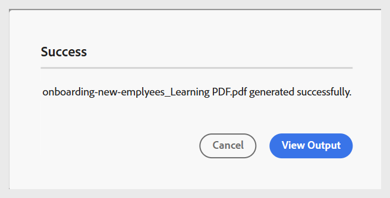

# Generieren einer PDF

Führen Sie die folgenden Schritte aus, um eine PDF zu generieren:

1. Nachdem Sie alle erforderlichen Einstellungen für die PDF-Ausgabe entsprechend Ihren Voreinstellungen konfiguriert haben, navigieren Sie zur Symbolleiste auf der Seite &quot;PDF-Voreinstellung“.
1. Wählen Sie **Ausgabe generieren** aus.

   {width="650" align="left"}

1. Sobald der Generierungsprozess abgeschlossen ist, wird eine Erfolgsmeldung angezeigt, die bestätigt, dass die PDF erstellt wurde.

   {width="350" align="left"}

1. Sie können die PDF herunterladen, indem Sie **Ausgabe anzeigen** sowohl in der Erfolgsmeldung als auch in der Symbolleiste auswählen.

   {width="650" align="left"}
