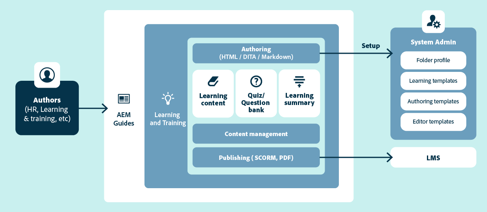

# Übersicht über die Lern- und Schulungsinhalte

Die Unterstützung für Lern- und Schulungsinhalte erleichtert die Erstellung und Verwaltung interaktiver E-Learning-Inhalte in Unternehmensumgebungen. Sie können Kurse mithilfe von Vorlagen erstellen, interaktive Elemente (wie Akkordeons, Karussells, Multimedia usw.) hinzufügen, Quiz mithilfe verschiedener Fragetypen oder über eine Fragenbank hinzufügen und den Kurs in unterstützten Ausgabeformaten veröffentlichen.

## Kernfunktionen auf einen Blick

Die wichtigsten Funktionen sind wie folgt:

- Zentralisiertes Content Management
- Vorlagengesteuerte Bearbeitung
- Unterstützung für strukturiertes Authoring und die Wiederverwendung von Inhalten
- Quiz-Erstellung und -Verwaltung
- Branchenführendes Übersetzungsmanagement
- Multi-Channel-Publishing mit nativen SCORM- und PDF-Ausgabeformaten
