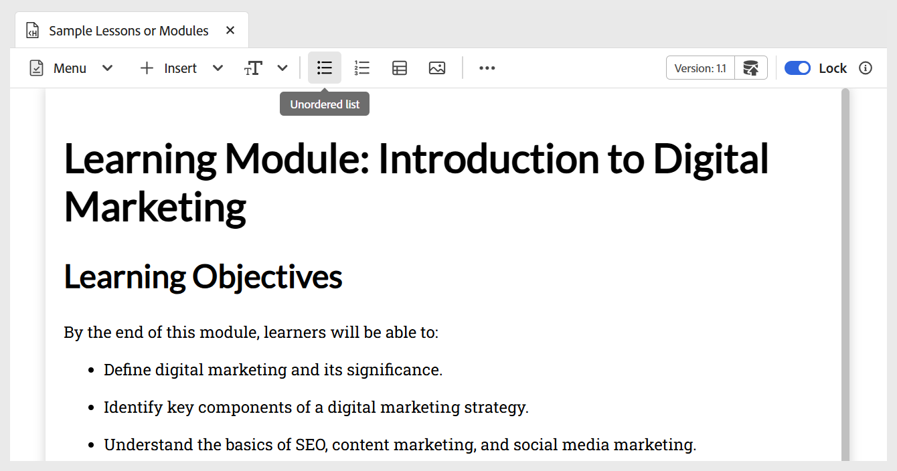
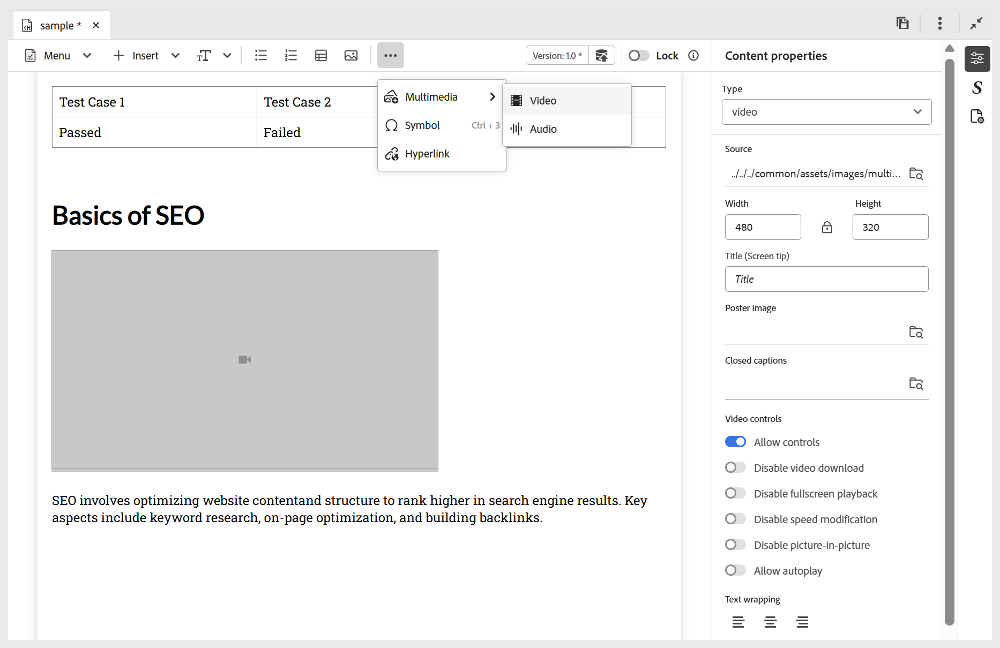

# Hinzufügen von Grundbausteinen zu Ihren Lerninhalten

Sie können die grundlegenden Bearbeitungsfunktionen, die in der Symbolleiste für Lerninhalte verfügbar sind, wie unten beschrieben verwenden:

- **Widgets**: Fügen Sie Widgets wie Akkordeon, Karussell, Hotspots und mehr mithilfe des Menüs **Einfügen** wie unten dargestellt zu Ihren Lerninhalten hinzu. Weitere Informationen zu interaktiven Widgets finden Sie unter [Verwenden interaktiver Widgets](./lc-widgets.md).

  {width="650" align="left"}

- **Textkomponenten**: Fügt Überschriften/Titel, Absätze, Inline-Anführungszeichen, Hochgestellt, Tiefgestellt und Zitate zu Ihrem Inhalt hinzu.

  {width="650" align="left"}

- **Ungeordnete Liste**: Fügt eine ungeordnete Liste innerhalb Ihres Inhalts hinzu.

  {width="650" align="left"}

- **Sortierte Liste**: Hiermit wird eine nummerierte Liste in Ihren Inhalt eingefügt.

  {width="650" align="left"}

- **Tabelle**: Fügt eine Tabelle mit den erforderlichen Abmessungen in den Inhalt ein. Sie können auch verschiedene Tabelleneigenschaften mithilfe des Bedienfelds **Inhaltseigenschaften** verwalten, wie unten dargestellt.

  {width="650" align="left"}

- **Bild**: Fügen Sie Bilder zusammen mit Alternativtext und einer QuickInfo in den Inhalt ein. Bilder können aus dem Repository oder über eine externe URL hinzugefügt werden. Darüber hinaus können Bildeigenschaften mithilfe des Bedienfelds **Inhaltseigenschaften** geändert werden.

  {width="650" align="left"}

- **Multimedia**: Fügt Video und Audio zum Inhalt über das Menü **Mehr** in der Symbolleiste hinzu. Sie können ihre Eigenschaften mithilfe des Bedienfelds **Inhaltseigenschaften** anpassen.

  {width="650" align="left"}

- **Symbole**: Fügt Symbole Ihrer Wahl zum Inhalt aus einer Liste hinzu, wie unten dargestellt. Sie können ihn über das Menü **Mehr** in der Symbolleiste verwenden.

  {width="350" align="left"}

- **Hyperlinks**: Fügt Hyperlinks an der erforderlichen Position in Ihrem Inhalt hinzu. Sie können ihn über das Menü **Mehr** in der Symbolleiste verwenden. Dabei kann es sich um eine Dateireferenz, eine Web-URL oder einen E-Mail-Link handeln, wie unten dargestellt.

  {width="650" align="left"}

