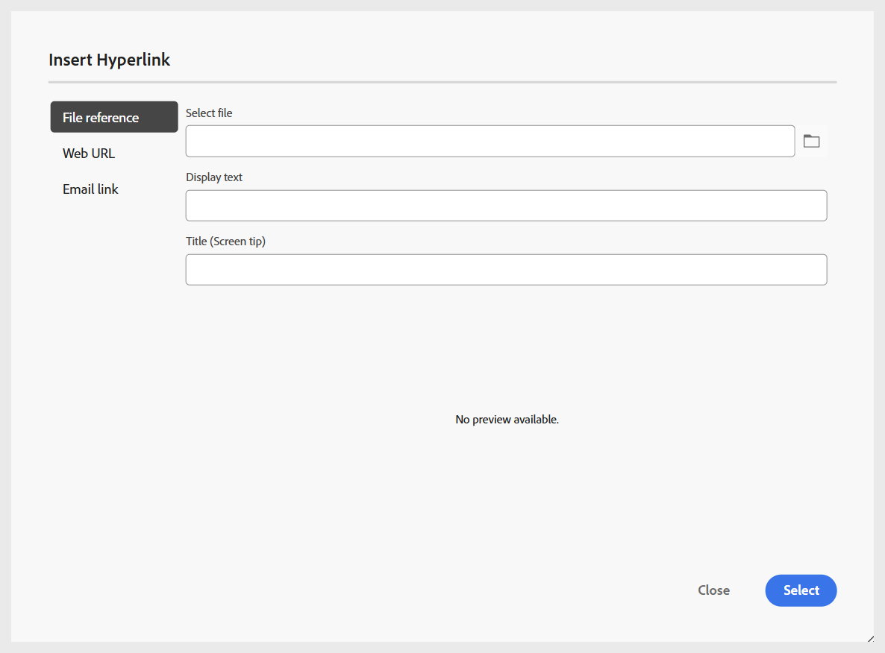

# Hinzufügen grundlegender Bausteine zu einem Thema

Um ein klareres Verständnis dafür zu vermitteln, wie Sie ein Lernthema erstellen und ihm grundlegende Bausteine hinzufügen, bietet das folgende Video einen kurzen Überblick über die verfügbaren Funktionen.

>[!VIDEO](https://video.tv.adobe.com/v/3469535/learning-content-aem-guides)

Sie können die in der Editor-Symbolleiste verfügbaren grundlegenden Bearbeitungsfunktionen wie unten beschrieben verwenden:

- **Einfügeoptionen**: Bietet Optionen zum Hinzufügen [Hinzufügen interaktiver Widgets](./lc-widgets.md) wie Akkordeon, Karussell, Hotspot, Registerkarten, Karteikarten und Klicken zum Anzeigen sowie [strukturelle Elemente](./lc-other-insert-options.md) wie Iframe, Blockanführungszeichen, Code-Block und mehr. Verwenden Sie dieses Menü, um Ihren Lerninhalten Funktionalität und Vielfalt hinzuzufügen, sodass sie ansprechend und gut strukturiert sind.

  {width="650"}

- **Textkomponenten**: Fügt Überschrift, Absatz, Inline-Zitat, Hochgestellt, Tiefgestellt und Zitat zu Ihrem Inhalt hinzu.

  >[!NOTE]
  >
  > Sie können Ihren Lerninhalten auch einen Titel und Untertitel hinzufügen. Weitere Informationen zum Hinzufügen im Inhalt finden Sie unter [Hinzufügen von Titeln und Untertiteln zu Lerninhalten](#add-title-and-subtitle-to-learning-content).

  {width="650"}

- **Ungeordnete Liste**: Fügt eine ungeordnete Liste innerhalb Ihres Inhalts hinzu.

  {width="650"}

- **Sortierte Liste**: Hiermit wird eine nummerierte Liste in Ihren Inhalt eingefügt.

  {width="650"}

- **Tabelle**: Fügt eine Tabelle mit den erforderlichen Abmessungen in den Inhalt ein. Sie können auch verschiedene Tabelleneigenschaften mithilfe des Bedienfelds **Inhaltseigenschaften** verwalten, wie unten dargestellt.

  {width="650"}

- **Bild**: Fügen Sie Bilder zusammen mit Alternativtext und einer QuickInfo in den Inhalt ein. Bilder können aus dem Repository oder über eine externe URL hinzugefügt werden. Darüber hinaus können Bildeigenschaften mithilfe des Bedienfelds **Inhaltseigenschaften** geändert werden.

  {width="650"}

- **Multimedia**: Fügt Video und Audio zum Inhalt hinzu. Sie können ihre Eigenschaften mithilfe des Bedienfelds **Inhaltseigenschaften** anpassen.

  {width="650"}

- **Wiederverwendbarer Inhalt**: Ermöglicht die Integration vorhandener Inhalte aus Ihren Assets oder dem Repository zur Wiederverwendbarkeit. Führen Sie die folgenden Schritte aus, um einen wiederverwendbaren Inhalt einzufügen:

   1. Wählen Sie **Wiederverwendbarer Inhalt** in der Symbolleiste aus.
Das **Wiederverwenden von Inhalten** wird geöffnet.
   2. Navigieren Sie zum gewünschten Thema und wählen Sie es aus, um seinen Inhalt in den aktuellen Kurs aufzunehmen.
   3. Wählen Sie die ID des Inhalts aus, den Sie hinzufügen möchten. Daraufhin wird eine Vorschau angezeigt.

      {width="650"}

   4. Wählen Sie **Auswählen** aus.

  Der Inhalt wird eingefügt. Beispielsweise ist der Abschnitt Fahrzeugstruktur ein Inhaltselement, das wiederverwendet und zum Thema des Kurses hinzugefügt wird. Der Typ wird als **Referenz** angezeigt und seine **ID** wird im Bedienfeld **Inhaltseigenschaften** angezeigt.

  {width="650"}

- **Symbole**: Fügt Symbole Ihrer Wahl zum Inhalt aus einer Liste hinzu, wie unten dargestellt.

  {width="350"}

- **Hyperlinks**: Fügt Hyperlinks an der erforderlichen Position in Ihrem Inhalt hinzu. Dabei kann es sich um eine Dateireferenz, eine Web-URL oder einen E-Mail-Link handeln, wie unten dargestellt.

  {width="650"}

Darüber hinaus bietet **Dropdown-** „Menü“ Zugriff auf die Bearbeitungsaktionen (Ausschneiden, Kopieren, Löschen), Suchen und Ersetzen sowie die Versionsbezeichnung.

## Titel und Untertitel zu Lerninhalten hinzufügen

Führen Sie die folgenden Schritte aus, um Titel und Untertitel in Ihre Lerninhalte aufzunehmen:

1. Öffnen Sie den Lernkurs in der Kartenkonsole.
1. Öffnen Sie das Thema, das Quiz oder eine andere Kurskomponente, zu der Sie einen Titel oder Untertitel hinzufügen möchten.
1. Navigieren Sie zum Bedienfeld Dateieigenschaften und wählen Sie **Titel hinzufügen** aus.

   
1. Wenn Sie dazu aufgefordert werden, wählen Sie aus, ob die vorhandene Überschrift als Titel verwendet werden soll.

   >[!NOTE]
   >
   > Wenn Sie die vorhandene Überschrift nicht als Titel verwenden möchten, fügen Sie zunächst mithilfe der Textkomponente in der Editor-Symbolleiste eine Überschrift ein und wählen Sie dann **Titel hinzufügen** aus. Dadurch wird ein Beispiel **Titel** zum Inhalt hinzugefügt, den Sie nach Bedarf bearbeiten können.

1. Wählen Sie in den Dateieigenschaften **Untertitel hinzufügen** aus.
Ein Beispiel **Untertitel** wird zum Inhalt hinzugefügt.

   

Um einen Titel zu entfernen, deaktivieren Sie **Option „Titel hinzufügen** in den Dateieigenschaften. Durch Entfernen des Titels wird automatisch der zugehörige Untertitel entfernt.

