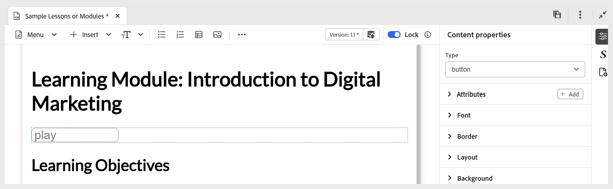

# Andere Optionen im Menü Einfügen

Zu den weiteren Optionen, die im Menü Einfügen in der Editor-Symbolleiste verfügbar sind, gehören:

- **Blockzitate:** Fügt Blockzitate zusammen mit Zitaten zu Ihrem Inhalt hinzu.

  {width="650" align="left"}

- **Codeblöcke:** Fügt einen Codeblock zu Ihrem Inhalt hinzu.

  {width="650" align="left"}

- **iframes:** Fügt einen iframe in den Inhalt ein, um externe Web-Seiten oder interaktive Ressourcen einzubetten. Sie können die iframe-Eigenschaften mithilfe des Bedienfelds **Inhaltseigenschaften** konfigurieren, einschließlich der Quell-URL, Breite, Höhe, Ausrichtung und Titel. Sie können die im iFrame hinzugefügten Inhalte anzeigen, indem Sie wie unten gezeigt in den **Vorschau**-Modus wechseln.

  **Autor** Ansicht:

  {width="650" align="left"}

  **Vorschau**-Modus:

  {width="650" align="left"}

- **H5P:** Fügt ein interaktives H5P-Paket zu Ihren Lerninhalten hinzu. Um H5P-Inhalte hinzuzufügen, platzieren Sie den Cursor an der gewünschten Position und wählen Sie **H5P** aus dem Menü Einfügen aus. Geben Sie im Dialogfeld H5P einfügen einen Verweis auf die H5P-Datei an, die Sie zum Lerninhalt hinzufügen möchten.

  

  Wenn Sie lieber den H5P-Inhalt aus Ihrem System verwenden möchten, [ Sie zuerst die Datei in DAM ](../user-guide/authoring-upload-existing-files.md), indem Sie die Option **Assets hochladen** verwenden, und lassen Sie sie dann Teil der Repository-Ansicht/Assets.

  

  Überprüfen Sie abschließend den H5P-Inhalt im Vorschaumodus und die veröffentlichte Ausgabe.

  >[!NOTE]
  >
  > Das Bearbeiten oder Erstellen von H5P-Inhalten wird in Adobe Experience Manager Guides nicht unterstützt. Bereiten Sie das H5P-Paket extern vor dem Hochladen vor.

- **MathML-Gleichung:** Fügt MathML-Gleichungen in Ihren Inhalt ein. Sie können eine MathML-Gleichung erstellen und auf **Einfügen** klicken, um sie zu Ihrem Dokument hinzuzufügen.

  {width="350" align="left"}

  Die Gleichung wird mit hellgrauem Hintergrund eingefügt. Sie können eine Gleichung jederzeit aktualisieren, indem Sie mit der rechten Maustaste auf eine vorhandene Gleichung klicken und **Mathematische Gleichung bearbeiten** aus dem Kontextmenü auswählen. Details zum Validieren von MathML-Gleichungen in Experience Manager Guides finden Sie unter [Validierung von Gleichungen im MathML-Editor](../user-guide/web-editor-other-features.md#validation-of-equations-in-the-mathml-editor).

- **Wissenstest:** Ermöglicht das Hinzufügen von Fragen in verfügbaren Formaten (einzeln richtig, mehrfach korrekt, wahr/falsch, mit der folgenden übereinstimmen oder aus der Fragenbank einfügen) zu Ihrem Thema zur Überprüfung und zur Bestätigung des Verständnisses ohne Bewertung. Diese Fragen spiegeln Standardformate wider und schließen die Bewertung aus. Dadurch eignen sie sich ideal für die Selbstbewertung und eignen sich als Teil des Kursinhalts oder eines Themas vor einem Quiz oder einer Bewertung später, falls verfügbar.

  {width="650" align="left"}

  Sie können die richtigen Antworten und andere erforderliche Felder im Bedienfeld **Inhaltseigenschaften** konfigurieren. Weitere Informationen finden Sie unter [Fragetypen](./quiz-insert-questions.md). Sie können verschiedene Fragetypen mithilfe der Optionen zur Wissensüberprüfung hinzufügen, wie unten dargestellt.

  {width="650" align="left"}

- **Eingabefeld** Fügt ein Textfeld zusammen mit einer Schaltfläche zu Ihrem Inhalt hinzu. Diese Kombination ermöglicht die Erfassung von Benutzereingaben und Trigger-spezifischen Aktionen. Dem Inhalt wird eine Wiedergabeschaltfläche hinzugefügt, wie unten dargestellt.

  {width="650" align="left"}

- **Weitere Optionen:** Sie haben zusätzliche Optionen, um Ihren Lerninhalt zu verbessern, einschließlich des Einfügens einer horizontalen Linie, eines Zeilenumbruchs, eines Textfelds, eines positionierten Textfelds und einer eingebetteten HTML.

  {width="650" align="left"}
